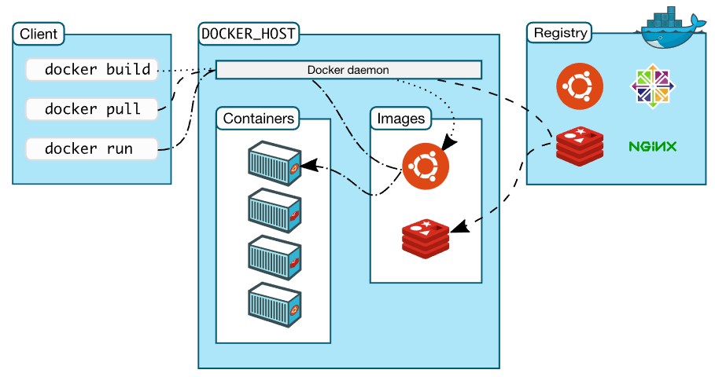

# docker

Docker 是一个用于开发、发布和运行应用程序的开放平台。Docker 使您能够将应用程序与基础架构分离，以便您可以快速交付软件。使用 Docker，您可以像管理应用程序一样管理基础设施。通过利用 Docker 快速交付、测试和部署代码的方法，您可以显着减少编写代码和在生产环境中运行之间的延迟。

## 如何修改密码,然后通过密码连接

```java
vagrant ssh
sudo -i
vi /etc/ssh/sshd config
修改账户密码开关为yes
passwd
输入新密码
systemctl restart
```

# 环境准备

vagrant + virtualBox + Docker

## 如何安装centos

1. 创建centos7文件夹，并进入其中[目录全路径不要有中文字符]
2. 在此目录下打开cmd，运行vagrant init centos/7,此时会在当前目录下生成Vagrantfile，同时指定使用的镜像为centos/7，关键是这个镜像在哪里，我已经提前准备好了，名称是virtualbox.box文件
3. 将virtualbox.box文件添加到vagrant管理的镜像中
   (1)下载网盘中的virtualbox.box文件
   (2)保存到磁盘的某个目录，比如D:\virtualbox.box
   (3)添加镜像并起名叫centos/7：vagrant box add centos/7 D:\virtualbox.box
   (4)vagrant box list  查看本地的box[这时候可以看到centos/7]
4. centos/7镜像有了，根据Vagrantfile文件启动创建虚拟机
   来到centos7文件夹，在此目录打开cmd窗口，执行vagrant up[打开virtual box观察，可以发现centos7创建成功]
5. 以后大家操作虚拟机，还是要在centos文件夹打开cmd窗口操作
   vagrant halt   优雅关闭
   vagrant up     正常启动
6. vagrant常用命令
   (1)vagrant ssh 进入刚才创建的centos7中
   (2)vagrant status 查看centos7的状态 (3)vagrant halt
   停止/关闭centos7
   (4)vagrant destroy
   删除centos7
   (5)vagrant status
   查看当前vagrant创建的虚拟机
   (6)Vagrantfile中也可以写脚本命令，使得centos7更加丰富
   但是要注意，修改了Vagrantfile，要想使正常运行的centos7生效，必须使用vagrant reload

## 如何安装Docker

1.进入centos7
vagrant ssh

2.卸载之前的docker
sudo yum remove docker
docker-client
docker-client-latest
docker-common
docker-latest
docker-latest-logrotate
docker-logrotate
docker-engine

3.安装必要的依赖
sudo yum install -y yum-utils
device-mapper-persistent-data
lvm2

4.设置docker仓库  [设置阿里云镜像仓库可以先自行百度，后面课程也会有自己的docker hub讲解]
sudo yum-config-manager
--add-repo
https://download.docker.com/linux/centos/docker-ce.repo

5.安装docker
sudo yum install -y docker-ce docker-ce-cli containerd.io

6.启动docker
sudo systemctl start docker测试docker安装是否成功
sudo docker run hello-world

7.设置开机启动

```
sudo systemctl enable docker.service
```

# Docker 架构图



## Docker相关命令

- 查看docker镜像
  docker images
- 基本命令
  
  - docker hello world
  - docker pull        拉取镜像到本地
    docker run         根据某个镜像创建容器
    -d                 让容器在后台运行，其实就是一个进程
    --name             给容器指定一个名字
    -p                 将容器的端口映射到宿主机的端口
  - docker exec -it    进入到某个容器中并交互式运行
- 测试docker安装是否成功
  sudo docker run hello-world
- 查看docker的进程
  docker ps
- 删除镜像
  docker rmi -f hello-world
- 删除container
  docker rm
  
  ## Docker部署Tomcat

1.拉取镜像

docker pull tomcat
或者 docker pull tomcat:指定版本

2.创建一个container
docker run -d --name my-tomcat -p 9090:8080  tomcat
比如，创建一个名字为my-tomcat 端口映射在9090上

3.进入到container目录下
docker exec -it  my-tomcat /bin/bash

4.删掉所有container
docker rm -f $(docker ps -aq)

