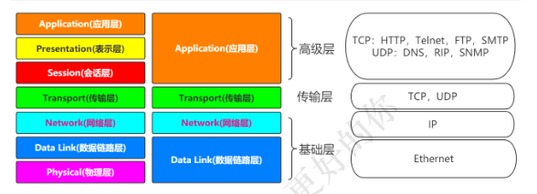
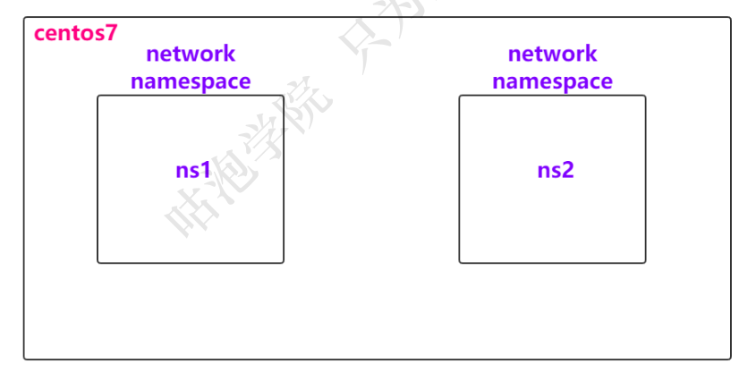
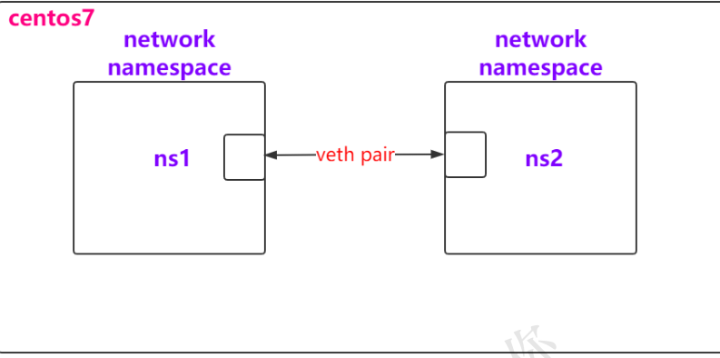
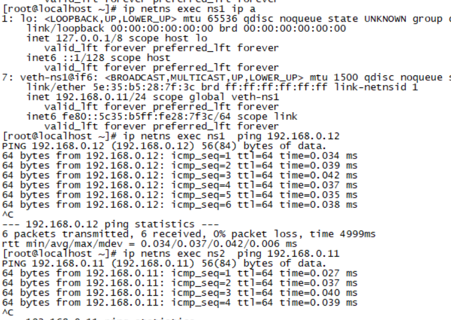
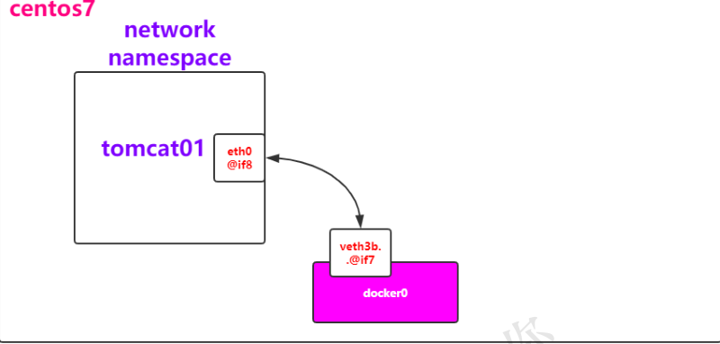
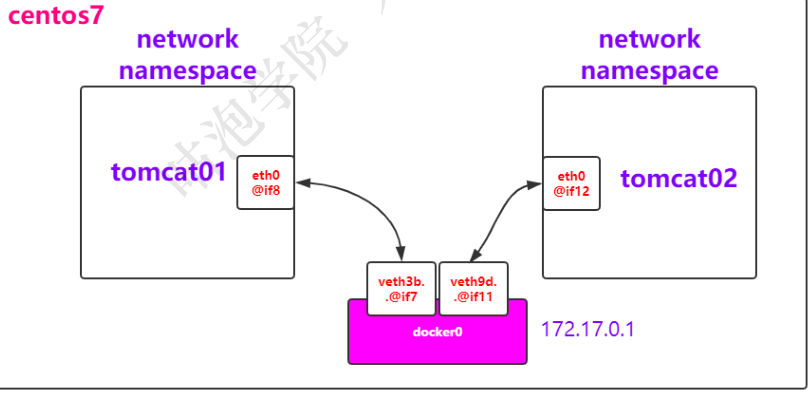
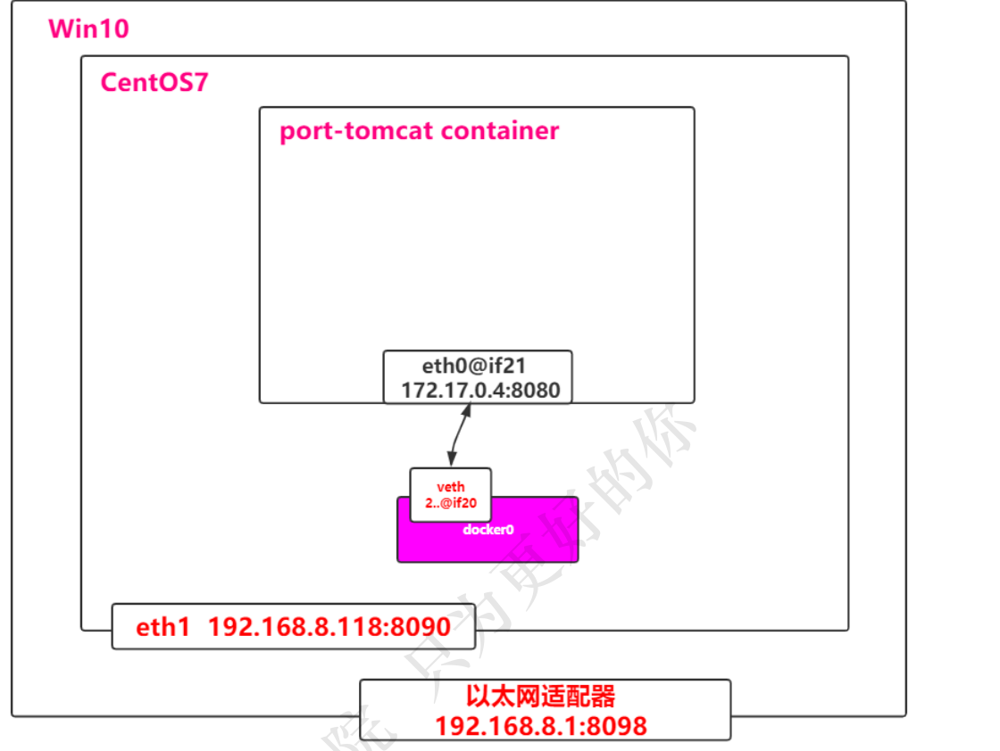
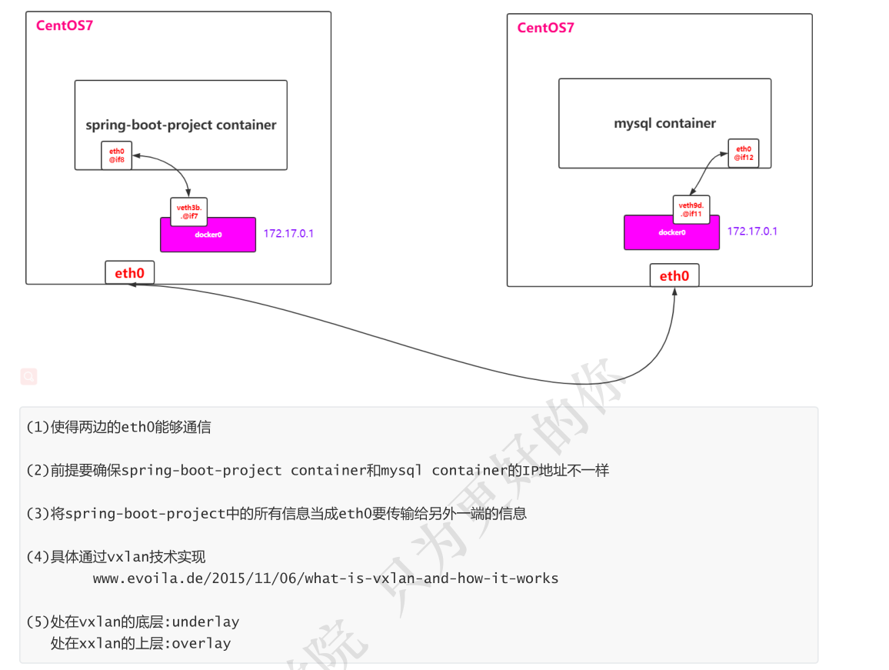

# 计算机网络模型



# 网卡

## 查看网卡

01-ip link show
02-ls /sys/class/net
03-ip a

# 修改网卡的配置文件

cd /etc/sysconfig/network-scripts/

## ip a解读

状态：UP/DOWN/UNKOWN等
link/ether：MAC地址
inet：绑定的IP地址

### 配置文件

在Linux中网卡对应的其实就是文件，所以找到对应的网卡文件即可
比如：cat /etc/sysconfig/network-scripts/ifcfg-eth0

### 给网卡添加IP地址

当然，这块可以直接修改ifcfg-*文件，但是我们通过命令添加试试

(1)ip addr add 192.168.0.100/24 dev eth0
(2)删除IP地址
ip addr delete 192.168.0.100/24 dev eth0

### 网卡启动与关闭

重启网卡 ：service network restart / systemctl restart network
启动/关闭某个网卡 ：ifup/ifdown eth0 or ip link set eth0 up/down

# Network Namespace

在linux上，网络的隔离是通过network namespace来管理的，不同的network namespace是互相隔离的
ip netns list：查看当前机器上的network namespace
network namespace的管理

ip netns list    #查看
ip netns add ns1   #添加
ip netns delete ns1 #删除

## namespace实战

(1)创建一个network namespace
ip netns add ns1

（2)查看该namespace下网卡的情况
ip netns exec ns1 ip a

(3)启动ns1上的lo网卡

ip netns exec ns1 ifup lo
or
ip netns exec ns1 ip link set lo up

(4)再次查看

可以发现state变成了UNKOWN
ip netns exec ns1 ip a

(5)再次创建一个network namespace
ip netns add ns2


(6)此时想让两个namespace网络连通起来
veth pair ：Virtual Ethernet Pair，是一个成对的端口，可以实现上述功能


(7)创建一对link，也就是接下来要通过veth pair连接的link
ip link add veth-ns1 type veth peer name veth-ns2

(8)查看link情况
ip link show

(9)将veth-ns1加入ns1中，将veth-ns2加入ns2中
ip link set veth-ns1 netns ns1
ip link set veth-ns2 netns ns2

(10)查看宿主机和ns1，ns2的link情况
ip link
ip netns exec ns1 ip link
ip netns exec ns2 ip link

(11)此时veth-ns1和veth-ns2还没有ip地址，显然通信还缺少点条件
ip netns exec ns1 ip addr add 192.168.0.11/24 dev veth-ns1
ip netns exec ns2 ip addr add 192.168.0.12/24 dev veth-ns2

(12)再次查看，发现state是DOWN，并且还是没有IP地址
ip netns exec ns1 ip link
ip netns exec ns2 ip link

(13)启动veth-ns1和veth-ns2
ip netns exec ns1 ip link set veth-ns1 up
ip netns exec ns2 ip link set veth-ns2 up

(14)再次查看，发现state是UP，同时有IP
ip netns exec ns1 ip a
ip netns exec ns2 ip a

(15)此时两个network namespace互相ping一下，发现是可以ping通的
ip netns exec ns1 ping 192.168.0.12
ip netns exec ns2 ping 192.168.0.11

大功告成


## Container的NS

按照上面的描述，实际上每个container，都会有自己的network namespace，并且是独立的，我们可以进入
到容器中进行验证
(1)不妨创建两个container看看？
docker run -d --name tomcat01 -p 8081:8080 tomcat
docker run -d --name tomcat02 -p 8082:8080 tomcat
(2)进入到两个容器中，并且查看ip
docker exec -it tomcat01 ip a
docker exec -it tomcat02 ip a

(3)他们还是可以ping 通的

# 深入分析container网络-Bridge

## docker0默认bridge

(1)查看centos的网络:ip a，可以发现

```
4: docker0: <BROADCAST,MULTICAST,UP,LOWER_UP> mtu 1500 qdisc noqueue state UP group default
link/ether 02:42:43:7b:1b:bd brd ff:ff:ff:ff:ff:ff
inet 172.17.0.1/16 brd 172.17.255.255 scope global docker0
valid_lft forever preferred_lft forever
inet6 fe80::42:43ff:fe7b:1bbd/64 scope link
valid_lft forever preferred_lft forever

8: veth3b72761@if7: <BROADCAST,MULTICAST,UP,LOWER_UP> mtu 1500 qdisc noqueue master docker0
state UP group default
link/ether 22:a3:13:4d:7f:29 brd ff:ff:ff:ff:ff:ff link-netnsid 2
inet6 fe80::20a3:13ff:fe4d:7f29/64 scope link
valid_lft forever preferred_lft forever
```

(2)查看容器tomcat01的网络：docker exec -it tomcat01 ip a，可以发现

```
[root@bogon ~]# docker exec -it tomcat01 ip a
1: lo: <LOOPBACK,UP,LOWER_UP> mtu 65536 qdisc noqueue state UNKNOWN group default qlen 1000
link/loopback 00:00:00:00:00:00 brd 00:00:00:00:00:00
inet 127.0.0.1/8 scope host lo
valid_lft forever preferred_lft forever
7: eth0@if8: <BROADCAST,MULTICAST,UP,LOWER_UP> mtu 1500 qdisc noqueue state UP group default
link/ether 02:42:ac:11:00:02 brd ff:ff:ff:ff:ff:ff link-netnsid 0
inet 172.17.0.2/16 brd 172.17.255.255 scope global eth0
valid_lft forever preferred_lft forever
```
(3)在centos中ping一下tomcat01的网络，发现可以ping通
ping 172.17.0.2
[root@bogon ~]# ping 172.17.0.2
PING 172.17.0.2 (172.17.0.2) 56(84) bytes of data.
64 bytes from 172.17.0.2: icmp_seq=1 ttl=64 time=0.120 ms
64 bytes from 172.17.0.2: icmp_seq=2 ttl=64 time=0.060 ms
64 bytes from 172.17.0.2: icmp_seq=3 ttl=64 time=0.056 ms

(3)既然可以ping通，而且centos和tomcat1又属于不同的network namespace，是怎么连接的？
很显然，跟之前的实战是一样的，画个图


（4)也就是说，在tomcat01中有一个eth0和centos的docker0中有一个veth3是成对的，类似于之前实战中的
veth-ns1和veth-ns2，不妨再通过一个命令确认下：
brctl
安装一下：yum install bridge-utils
brctl show
(5)那为什么tomcat01和tomcat02能ping通


(5)这种网络连接方法我们称之为Bridge，其实也可以通过命令查看docker中的网络模式：docker network ls
bridge也是docker中默认的网络模式

(6)不妨检查一下bridge：

```
docker network inspect bridge
"Containers": {
"6ad312b32f62b48935f3c95c58ae061df710bfebbd3d721b467507b9516eeb81": {
"Name": "tomcat02",
"EndpointID":
"aa9c612c79f867e874d0cae1aab45374373b61e9cdbe79925d07ae2e89a1cca0",
"MacAddress": "02:42:ac:11:00:03",
"IPv4Address": "172.17.0.3/16",
"IPv6Address": ""
},
"f49fc396d8e04f2b330163d91bb5d1482715202b4e2fd0c7f42833722787742a": {
"Name": "tomcat01",
"EndpointID":
"c5440b063e8fc0c9c44f3f61bf68f577283417eb23cfa9a361d37973d01a8ba5",
"MacAddress": "02:42:ac:11:00:02",
"IPv4Address": "172.17.0.2/16",
"IPv6Address": ""
}
}
```

(6)在tomcat01容器中是可以访问互联网的，顺便把这张图画一下咯，NAT是通过iptables实现的-


## 创建自己的network

(1)创建一个network，类型为bridge
docker network create tomcat-net
or
docker network create --subnet=172.18.0.0/24 tomcat-net

(2)查看已有的network：docker network ls

```
NETWORK ID NAME DRIVER SCOPE
a1aa0d802154 bridge bridge local
058b2ea4bf85 host host local
0604ff19e224 none null local
3012e3afd264 tomcat-net bridge local
```

(3)查看tomcat-net详情信息：docker network inspect tomcat-net

4)创建tomcat的容器，并且指定使用tomcat-net
docker run -d --name custom-net-tomcat --network tomcat-net tomcat

(5)查看custom-net-tomcat的网络信息
docker exec -it custom-net-tomcat ip a

(6)查看网卡信息
ip a

(7)查看网卡接口
brctl show

```
bridge name  bridge id  STP enabled  interfaces
br-3012e3afd264 8000.02429780e75d  no  vethf223a4b
docker0 8000.0242437b1bbd  no  veth3b72761
veth9d8c470
```

(8)此时在custom-net-tomcat容器中ping一下tomcat01的ip会如何？发现无法ping通

(9)此时如果tomcat01容器能够连接到tomcat-net上应该就可以咯
docker network connect tomcat-net tomcat01

(10)查看tomcat-net网络，可以发现tomcat01这个容器也在其中

(11)此时进入到tomcat01或者custom-net-tomcat中，不仅可以通过ip地址ping通，而且可以通过名字ping到，这时候因为都连接到了用户自定义的tomcat-net bridge上
docker exec -it tomcat01 bash

# 深入分析Container网络-Host & None

## Host

(1)创建一个tomcat容器，并且指定网络为none
docker run -d --name my-tomcat-host --network host tomcat

(2)查看ip地址
docker exec -it my-tomcat-host ip a
可以发现和centos是一样的

(3)检查host网络

```
"Containers": {
"e1f00d47db344b6688e99c0f5b393e232309fbe1a4d9c3fc3e1ce7c107f3312d": {
"Name": "my-tomcat-host",
"EndpointID":
"f08456d9dca024cf6f911f8d32329ba2587ea89554c96b77c32698ace6998525",
"MacAddress": "",
"IPv4Address": "",
"IPv6Address": ""
}
}
```

## None

(1)创建一个tomcat容器，并且指定网络为none
docker run -d --name my-tomcat-none --network none tomcat

(2)查看ip地址
docker exec -it my-tomcat-none ip a

```
1: lo: <LOOPBACK,UP,LOWER_UP> mtu 65536 qdisc noqueue state UNKNOWN group default qlen 1000
link/loopback 00:00:00:00:00:00 brd 00:00:00:00:00:00
inet 127.0.0.1/8 scope host lo
valid_lft forever preferred_lft forever
```

(3)检查none网络

```
"Containers": {
"bb3f0db4fa76a25b5377da9c3bbf087ac7ef0de0a3f9c37a4ae959983d33105c": {
"Name": "my-tomcat-none",
"EndpointID":
"26055c08c968f9d6d03d10b3b66dfea004c35f5d2bd4067a2306566973e92f9e",
"MacAddress": "",
"IPv4Address": "",
"IPv6Address": ""
}
}
```

# 端口映射及折腾

(1)创建一个tomcat容器，名称为port-tomcat
docker run -d --name port-tomcat tomcat

(2)思考一下要访问该tomcat怎么做？肯定是通过ip:port方式
docker exec -it port-tomcat bash
curl localhost:8080

(3)那如果要在centos7上访问呢？
docker exec -it port-tomcat ip a ---->得到其ip地址，比如172.17.0.4
curl 172.17.0.4:8080

小结 ：之所以能够访问成功，是因为centos上的docker0连接了port-tomcat的network namespace

(4)那如果要在centos7通过curl localhost方式访问呢？显然就要将port-tomcat的8080端口映射到centos上

docker rm -f port-tomcat
docker run -d --name port-tomcat -p 8090:8080 tomcat
curl localhost:8090

## 折腾

(1)centos7是运行在win10上的虚拟机，如果想要在win10上通过ip:port方式访问呢？

#此时需要centos和win网络在同一个网段，所以在Vagrantfile文件中
#这种方式等同于桥接网络。也可以给该网络指定使用物理机哪一块网卡，比如
#config.vm.network"public_network",:bridge=>'en1: Wi-Fi (AirPort)'
config.vm.network"public_network"
centos7: ip a --->192.168.8.118
win10:浏览器访问 192.168.8.118:9080

(2)如果也想把centos7上的8090映射到win10的某个端口呢？然后浏览器访问localhost:port

#此时需要将centos7上的端口和win10上的端口做映射
config.vm.network"forwarded_port",guest:8098,host:8090
#记得vagrant reload生效一下
win10：浏览器访问 localhost：8098



## 多机




