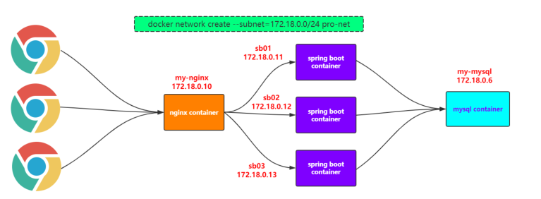

# Docker的持久化方案

## Volume

(1)创建mysql数据库的container
docker run -d --name mysql01 -e MYSQL_ROOT_PASSWORD=jack123 mysql

(2)查看volume
docker volume ls

(3)具体查看该volume
docker volume inspect
48507d0e7936f94eb984adf8177ec50fc6a7ecd8745ea0bc165ef485371589e8

(4)名字不好看，name太长，修改一下
"-v mysql01_volume:/var/lib/mysql"表示给上述的volume起一个能识别的名字

docker run -d --name mysql01 -v mysql01_volume:/var/lib/mysql -e
MYSQL_ROOT_PASSWORD=jack123 mysql

(5)查看volume
docker volume ls
docker volume inspect mysql01_volume
docker volume rm 【volume的】

(6)真的能够持久化保存数据吗？不妨来做个实验

```java
#进入容器中
docker exec -it mysql01 bash

#登录mysql服务
mysql -uroot -pjack123

#创建测试库
create database db_test

#退出mysql服务，退出mysql container

#删除mysql容器
docker rm -f mysql01

#查看volume
docker volume ls

#发现volume还在
| information_schema |
| db_test    |
| mysql       |
| performance_schema |
| sys
```

## Bind Mounting

（1）创建一个tomcat容器
docker run -d --name tomcat01 -p 9090:8080 -v
/tmp/test:/usr/local/tomcat/webapps/test tomcat

（2）查看两个目录
centos：cd /tmp/test
tomcat容器：cd /usr/local/tomcat/webapps/test

（3）在centos的/tmp/test中新建1.html，并写一些内容

<p style="color:blue; font-size:20pt;">This is p!</p>

(4)进入tomcat01的对应目录查看，发现也有一个1.html，并且也有内容

(5)在centos7上访问该路径：curl localhost:9090/test/1.html

（6）在win浏览器中通过ip访问

# Docker实战

## MySQL高可用集群搭建

(1)拉取haproxy镜像
docker pull percona/percona-xtradb-cluster:5.7.21

02 复制pxc镜像(实则重命名)
docker tag percona/percona-xtradb-cluster:5.7.21 pxc

03 删除pxc原来的镜像
docker rmi percona/percona-xtradb-cluster:5.7.21

04 创建一个单独的网段，给mysql数据库集群使用
(1)docker network create --subnet=172.18.0.0/24 pxc-net
(2)docket network inspect pxc-net  [查看详情]
(3)docker network rm pxc-net    [删除]

05 创建和删除volume
创建：docker volume create --name v1
删除：docker volume rm v1
查看详情：docker volume inspect v1

06 创建单个PXC容器demo
[CLUSTER_NAME PXC集群名字]
 [XTRABACKUP_PASSWORD数据库同步需要用到的密码]
 
docker run -d -p 3301:3306
-v v1:/var/lib/mysql
-e MYSQL_ROOT_PASSWORD=jack123
-e CLUSTER_NAME=PXC
-e XTRABACKUP_PASSWORD=jack123
--privileged --name=node1 --net=pxc-net --ip 172.18.0.2
pxc

07 搭建PXC[MySQL]集群
(1)准备3个数据卷
docker volume create --name v1
docker volume create --name v2
docker volume create --name v3

(2)运行三个PXC容器
docker run -d -p 3301:3306 -v v1:/var/lib/mysql -e
MYSQL_ROOT_PASSWORD=jack123 -e CLUSTER_NAME=PXC -e XTRABACKUP_PASSWORD=jack123 -
-privileged --name=node1 --net=pxc-net --ip 172.18.0.2 pxc

[CLUSTER_JOIN将该数据库加入到某个节点上组成集群]

docker run -d -p 3302:3306 -v v2:/var/lib/mysql -e
MYSQL_ROOT_PASSWORD=jack123 -e CLUSTER_NAME=PXC -e XTRABACKUP_PASSWORD=jack123 -
e CLUSTER_JOIN=node1 --privileged --name=node2 --net=pxc-net --ip 172.18.0.3 pxc

docker run -d -p 3303:3306 -v v3:/var/lib/mysql -e
MYSQL_ROOT_PASSWORD=jack123 -e CLUSTER_NAME=PXC -e XTRABACKUP_PASSWORD=jack123 -
e CLUSTER_JOIN=node1 --privileged --name=node3 --net=pxc-net --ip 172.18.0.4 pxc

(3)MySQL工具连接测试
Jetbrains Datagrip

## 数据库负载均衡

(1)拉取haproxy镜像

docker pull haproxy

(2)创建haproxy配置文件，这里使用bind mounting的方式
touch /tmp/haproxy/haproxy.cfg

haproxy.cfg的文件内容如下：

```
global
#工作目录，这边要和创建容器指定的目录对应
chroot /usr/local/etc/haproxy
#日志文件
log 127.0.0.1 local5 info
#守护进程运行
daemon
defaults
log global
mode http
#日志格式
option httplog
#日志中不记录负载均衡的心跳检测记录
option dontlognull
#连接超时（毫秒）
timeout connect 5000
#客户端超时（毫秒）
timeout client 50000
#服务器超时（毫秒）
timeout server 50000
 #监控界面
 listen admin_stats
#监控界面的访问的IP和端口
bind 0.0.0.0:8888
#访问协议
mode    http
#URI相对地址
stats uri  /dbs_monitor
#统计报告格式
stats realm   Global\ statistics
#登陆帐户信息
stats auth admin:admin
#数据库负载均衡
listen proxy-mysql
#访问的IP和端口，haproxy开发的端口为3306
#假如有人访问haproxy的3306端口，则将请求转发给下面的数据库实例
bind 0.0.0.0:3306 
#网络协议
mode tcp
#负载均衡算法（轮询算法）
#轮询算法：roundrobin
#权重算法：static-rr
#最少连接算法：leastconn
#请求源IP算法：source
balance roundrobin
#日志格式
option tcplog
#在MySQL中创建一个没有权限的haproxy用户，密码为空。

#Haproxy使用这个账户对MySQL数据库心跳检测
option mysql-check user haproxy
server MySQL_1 172.19.0.2:3306 check weight 1 maxconn 2000 
server MySQL_2 172.19.0.3:3306 check weight 1 maxconn 2000 
server MySQL_3 172.19.0.4:3306 check weight 1 maxconn 2000
#使用keepalive检测死链
option tcpka
```

（3）创建haproxy容器
docker run -it -d -p 8888:8888 -p 3306:3306 -v
/tmp/haproxy:/usr/local/etc/haproxy --name haproxy01 --privileged --net=pxc-net
haproxy

(4)根据haproxy.cfg文件启动haproxy
docker exec -it haproxy01 bash
haproxy -f /usr/local/etc/haproxy/haproxy.cfg

(5)在MySQL数据库上创建用户，用于心跳检测
CREATE USER 'haproxy'@'%' IDENTIFIED BY '';
[小技巧[如果创建失败，可以先输入一下命令]:
  drop user 'haproxy'@'%';
 flush privileges;
  CREATE USER 'haproxy'@'%' IDENTIFIED BY '';
]

（6）win浏览器访问
http://centos_ip:8888/dbs_monitor
用户名密码都是:admin

（7）win上的datagrip连接haproxy01

ip:centos_ip
port:3306
user:root
password:jack123

(8)在haproxy连接上进行数据操作，然后查看数据库集群各个节点

# 部署Springboot+nginx项目



## 网络

（1）网络

docker network create --subnet=172.19.0.0/24 pxc-net

（2）网络划分
mysql--172.19.0.6
spring boot--172.19.0.11/12/13
nginx--172.19.0.10

## MYSQL

(1)创建volume
docker volume create v1

(2)创建mysql容器
docker run -d --name my-mysql -v v1:/var/lib/mysql -p 3301:3306 -e
MYSQL_ROOT_PASSWORD=jack123 --net=pro-net --ip 172.18.0.6 mysql

(3)datagrip连接，执行.mysql文件
name:my-mysql
ip:centos-ip
端口:3301
user:root
password:123

## Spring  Boot项目

1)在本地测试该项目的功能
主要是修改application.yml文件中数据库的相关配置

(2)在项目根目录下执行mvn clean package打成一个jar包

记得修改一下application.yml文件数据库配置]
mvn clean package -Dmaven.test.skip=true
在target下找到"springboot-mybatis-0.0.1-SNAPSHOT.jar.jar"
 
(3)在docker环境中新建一个目录"springboot-mybatis"

(4)上传"springboot-mybatis-0.0.1-SNAPSHOT.jar"到该目录下，并且在此目录创建Dockerfile

(5)编写Dockerfile内容

FROM openjdk:8-jre-alpine
  MAINTAINER itcrazy2016
 LABEL name="springboot-mybatis" version="1.0" author="ada"
  COPY springboot-mybatis-0.0.1-SNAPSHOT.jar springboot-mybatis.jar
  CMD ["java","-jar","springboot-mybatis.jar"]
 
(6)基于Dockerfile构建镜像
docker build -t sbm-image .

(7)基于image创建container
docker run -d --name sb01 -p 8081:8080 --net=pro-net --ip 172.18.0.11 sbm-
image

(8)查看启动日志
docker logs sb01

(9)在win浏览器访问http://192.168.8.118:8081/user/listall

### 网络问题
因为sb01和my-mysql在同一个bridge的网段上，所以是可以互相ping通，比如

docker exec -it sb01 ping 172.18.0.6
or
docker exec -it sb01 ping my-mysql

so? application.yml文件不妨这样修改一下？也就是把ip地址直接换成容器的名字

url: jdbc:mysql://my-mysql/db_gupao_springboot?

### 创建多个项目容器

docker run -d --name sb01 -p 8081:8080 --net=pro-net --ip 172.18.0.11 sbm-image

docker run -d --name sb02 -p 8082:8080 --net=pro-net --ip 172.18.0.12 sbm-image

docker run -d --name sb03 -p 8083:8080 --net=pro-net --ip 172.18.0.13 sbm-image

### nginx;

(1)在centos的/tmp/nginx下新建nginx.conf文件，并进行相应的配置

```
user nginx;
worker_processes 1;
events {
 worker_connections 1024;
}
http {
 include    /etc/nginx/mime.types;
default_type application/octet-stream;
 sendfile    on;
 keepalive_timeout 65;
 
 server {
   listen 80;
   location / {
    proxy_pass http://balance;
   }
 }
 
 upstream balance{ 
   server 172.19.0.11:8080;
   server 172.19.0.12:8080;
   server 172.19.0.13:8080;
 }
 include /etc/nginx/conf.d/*.conf;
}
```

(2)创建nginx容器
注意 ：先在centos7上创建/tmp/nginx目录，并且创建nginx.conf文件，写上内容
docker run -d --name my-nginx -p 80:80 -v
/tmp/nginx/nginx.conf:/etc/nginx/nginx.conf --network=pro-net --ip 172.18.0.10
nginx

(3)win浏览器访问:
ip[centos]/user/listall
思考 ：若将172.18.0.11/12/13改成sb01/02/03是否可以？


