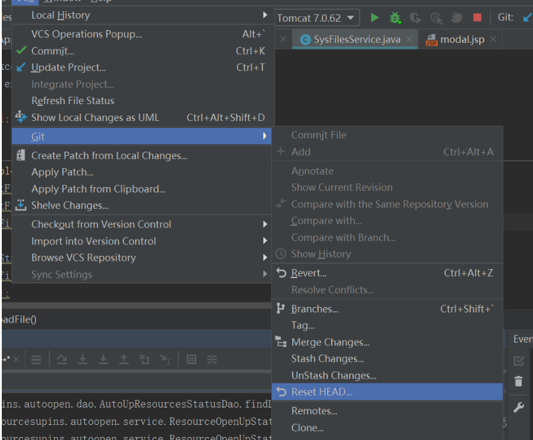
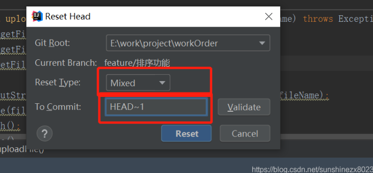

# git commit后，如何撤销commit

## 问题

- 修改了本地的代码，然后使用：

```
git add file
git commit -m '修改原因'
执行commit后，还没执行push时，想要撤销这次的commit，该怎么办？
```

# IDEA操作




## 解决方案：

- 使用命令：

```
git reset --soft HEAD^
```

这样就成功撤销了commit，如果想要连着add也撤销的话，--soft改为--hard（删除工作空间的改动代码）

### To Commot：参数详解

HEAD^的意思是上一个版本，也可以写成HEAD~1

如果你进行了2次commit，想都撤回，可以使用HEAD~2或者HEAD^^，以此类推......

- 命令详解：

```
工作区 － 暂存区 － 本地仓库

代码编写及修改是在工作区  - git add 将本地修改添加到暂存区 - git commit  将暂存区中的内容提交到本地仓库


--mixed （git reset的默认参数，即不添加参数的默认值）
意思是：不删除工作空间改动代码，撤销commit 和 撤销git add . 操作，回退到工作区

这个为默认参数,git reset --mixed HEAD^ 和 git reset HEAD^ 效果是一样的

HEAD^  表示上一个版本，即上一次的commit，也可以写成HEAD~1
如果进行两次的commit，想要都撤回，可以使用HEAD~2


--soft
不删除工作空间的改动代码 ，撤销commit，不撤销git add file
回退到git commit之前，此时处在 **暂存区** 。（即执行git add 命令后）


--hard
删除工作空间的改动代码，撤销commit且撤销add
（三者的改变全都丢失，即代码的**修改内容丢失**，直接回退到某个版本；因此我们修改过的代码就没了，需要 **谨慎使用** ）

另外一点，如果commit注释写错了，先要改一下注释，有其他方法也能实现，如：
git commit --amend
这时候会进入vim编辑器，修改完成你要的注释后保存即可。
```
