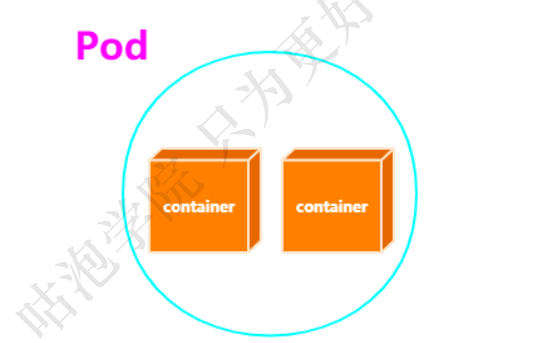
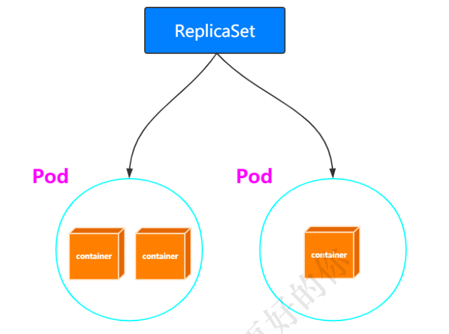
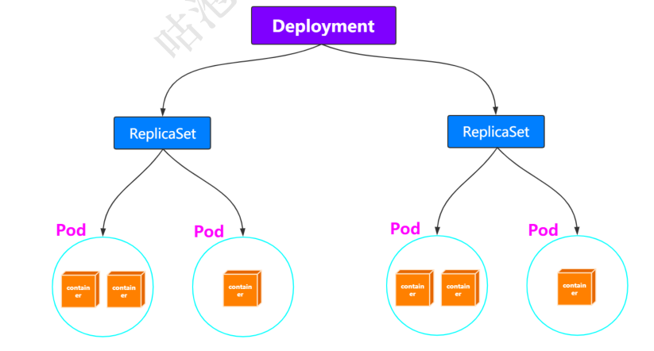
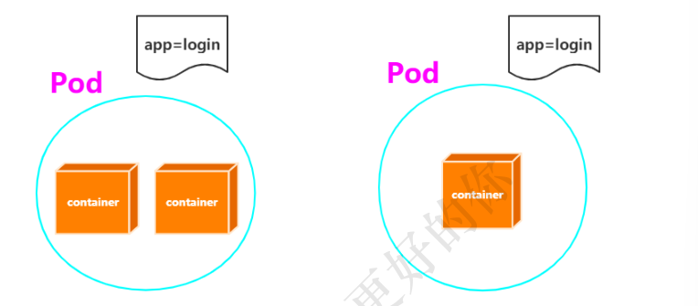
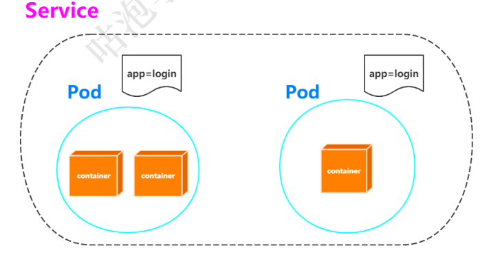
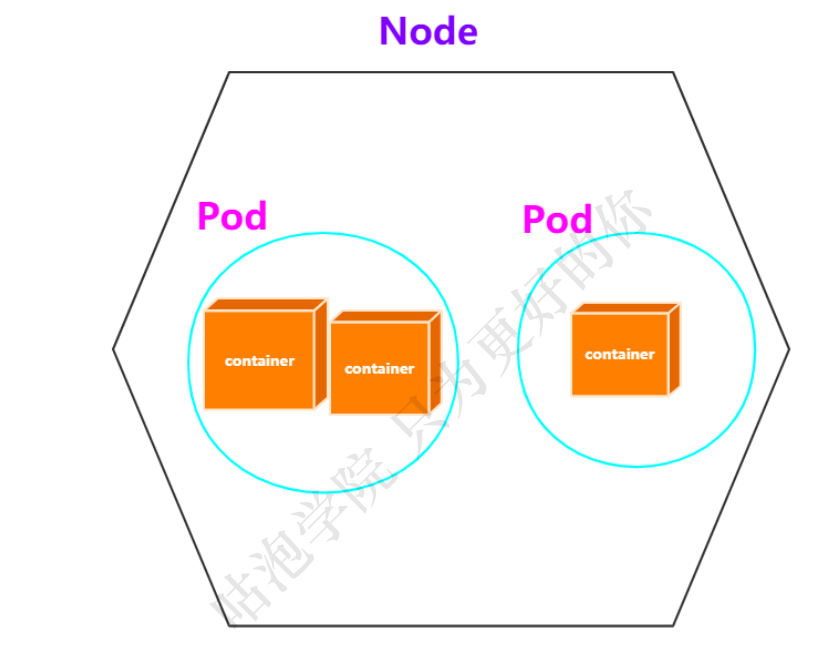
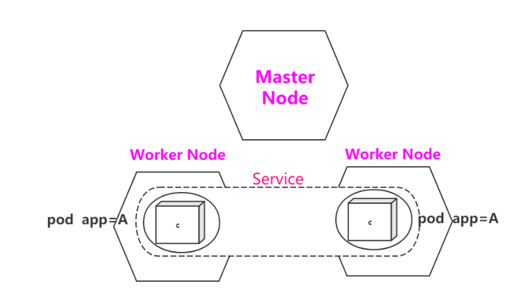
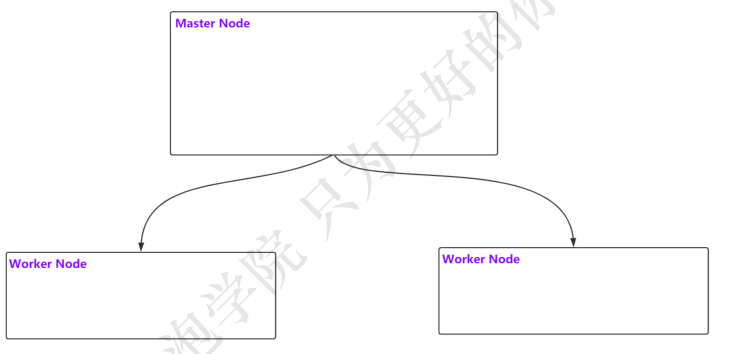
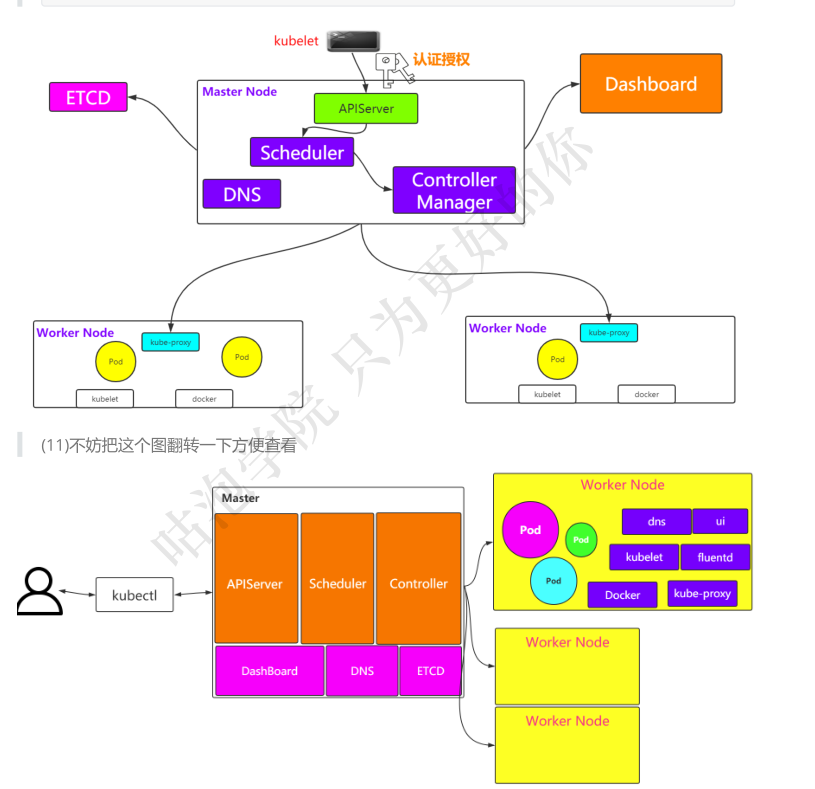

# K8S 核心组件和架构图

(1)先以container为起点，k8s既然是容器编排工具，那么一定会有container


（2）那k8s如何操作这些container呢？从感性的角度来讲，得要有点逼格，k8s不想直接操作
container，因为操作container的事情是docker来做的，k8s中要有自己的最小操作单位，称之为Pod
说白了，Pod就是一个或多个Container的组合



（3）那Pod的维护谁来做？那就是ReplicaSet，通过selector来进行管理


（4）Pod和ReplicaSet的状态如何维护和检测呢，通过Deployment


（5）不妨把相同或者有关联的Pod分门别类一下，那怎么分门别类呢？Label


(6)具有相同label的service要是能够有个名称就好了，Service


(7)上述说了这么多，Pod运行在哪里呢？当然是机器咯，比如一台centos机器，我们把这个机器
称作为Node


8)难道只有一个Node吗？显然不太合适，多台Node共同组成集群才行嘛
画个图表示一下咯，最好能把之前的Label，Service也一起画上去，整体感受一下


(9)此时，我们把目光转移到由3个Node节点组成的Master-Node集群



(10)这个集群要配合完成一些工作，总要有一些组件的支持吧？接下来我们来想想有哪些组件，然后画一个相对完整的架构图、

```
01-总得要有一个操作集群的客户端，也就是和集群打交道
kubectl

02-请求肯定是到达Master Node，然后再分配给Worker Node创建Pod之类的
关键是命令通过kubectl过来之后，是不是要认证授权一下？

03-请求过来之后，Master Node中谁来接收？
APIServer

04-API收到请求之后，接下来调用哪个Worker Node创建Pod，Container之类的，得要有调度策略
Scheduler
[https://kubernetes.io/docs/concepts/scheduling/kube-scheduler/]

05-Scheduler通过不同的策略，真正要分发请求到不同的Worker Node上创建内容，具体谁负责？
Controller Manager

06-Worker Node接收到创建请求之后，具体谁来负责
Kubelet服务，最终Kubelet会调用Docker Engine，创建对应的容器[这边是不是也反应出一
点，在Node上需要有Docker Engine，不然怎么创建维护容器？]

07-会不会涉及到域名解析的问题？
DNS

08-是否需要有监控面板能够监测整个集群的状态？
Dashboard

09-集群中这些数据如何保存？分布式存储
ETCD

10-至于像容器的持久化存储，网络等可以联系一下Docker中的内容
```



# 如何安装

## The hard way

Kelsey Hightower ：https://github.com/kelseyhightower
在线play-with-k8s
网址 ：https://labs.play-with-k8s.com/

## 使用Minikube搭建单节点K8s

### Windows

kubect1官网: https://kubernetes.io/docs/tasks/tools/install-kubectl/#install-kubect-on-lin
uX

minikube官网: https://kubernetes.io/docs/tasks/tools/install-minikubel

选择任意一种虚拟化的方式

```Hyper-V
virtua]Box[课上选择的]
安装kubectl

(1)根据官网步骤 [或] 直接下载:
https://storage.googleapis.com/kubernetes-
release/release/v1.16.2/bin/windows/amd64/kubect].exe

(2)配置kubectl.exe所在路径的环境变量，使得cmd窗口可以直接使用kubectl命令
(4)kubect] version检查是否配置成功

安装minikube
(1)根据官网步骤 [或] 直接下载:https://github.com/kubernetes/minikube/releases/download/v1.5.2/minikube-windows-amd64.exe
(2)修改minikube-windows-amd64.exe名称为minikube.exe
3)配置minikube所在路径的环境变量，使得cmd窗口可以直接使用minikube命令

(4)minikube version检查是否配置成功

。使用minikube创建单节点的k8s
minikube start --vm-driver=virtualbox --image-repository=gcrazk8s.cn/google-containers

。小结
其实就是通过minikube创建一个虚拟机
这个虚拟机中安装好了单节点的K8S环境然后通过kubectl进行交互
```

```
# 创建K8S
minikube start
# 删除K8S
minikube delete
# 进入到K8S的机器中
minikube ssh
# 查看状态
minikube status
#进入dashboard
minikube dashboard
```

### CentOS

kubect1官网: https://kubernetes.io/docs/tasks/tools/install-kubectl/#install-kubect-on-lin
uX

minikube官网: https://kubernetes.io/docs/tasks/tools/install-minikube/

安装docker
安装kubectl

```
# 01 下载[这边我给大家下载好了，在网盘kubect1&minikube中，大家上传到自己的centos7机器中。]
# 02 授权
chmod +x ./kubect7
# 03 添加到环境变量
sudo mv ./kubect7 /usr/Tocal/bin/kubect7
# 04 检查
kubect] version
```

安装minikube

```
# 01 下载[这边我给大家下载好了，在网盘kubectl&minikube中，大家上传到自己的centos7机器中。]wget https://github.com/kubernetes/minikube/releases/download/v1.5.2/minikube-Tinux-amd64
# 02 配置环境变量
sudo mv minikube-linux-amd64 minikube && chmod +x minikube && mv minikube/usr/1ocal/bin/
# 03 检查
minikube version
```

使用minikube创建单节点的k8s

minikube start --vm-driver=none --image-repository=gcr.azk8s.cn/google-
containers

