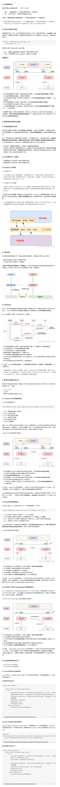

**PS：本文出自https://zhuanlan.zhihu.com/p/447890038**

部分代码如下：
1.mmap的小demo如下

```
public class MmapTest {

    public static void main(String[] args) {
        try {
            FileChannel readChannel = FileChannel.open(Paths.get("./jay.txt"), StandardOpenOption.READ);
            MappedByteBuffer data = readChannel.map(FileChannel.MapMode.READ_ONLY, 0, 1024 * 1024 * 40);
            FileChannel writeChannel = FileChannel.open(Paths.get("./siting.txt"), StandardOpenOption.WRITE, StandardOpenOption.CREATE);
            //数据传输
            writeChannel.write(data);
            readChannel.close();
            writeChannel.close();
        }catch (Exception e){
            System.out.println(e.getMessage());
        }
    }
}
```

2. Java NIO对sendfile的支持

```
@Override
public long transferFrom(FileChannel fileChannel, long position, long count) throws IOException {
   return fileChannel.transferTo(position, count, socketChannel);
}
```

**sendfile的小demo**如下：

```
public class SendFileTest {
    public static void main(String[] args) {
        try {
            FileChannel readChannel = FileChannel.open(Paths.get("./jay.txt"), StandardOpenOption.READ);
            long len = readChannel.size();
            long position = readChannel.position();
            
            FileChannel writeChannel = FileChannel.open(Paths.get("./siting.txt"), StandardOpenOption.WRITE, StandardOpenOption.CREATE);
            //数据传输
            readChannel.transferTo(position, len, writeChannel);
            readChannel.close();
            writeChannel.close();
        } catch (Exception e) {
            System.out.println(e.getMessage());
        }
    }
}
```


