# 通信协议

## 通信协议

（1）通信类型：同步和异步（一般来说，客户端连接数据库都是同步连接）

（2）连接方式：长连接和短连接

MySQL是支持长连接和短连接，可以用下面的命令看当前的MySQL有多少连接

```
show GLOBAL STATUS like 'Thread%';

解释：
Threads_cached      缓存中的线程连接数
Threads_connected   当前打开的连接数
Threads_created     为处理连接创建的线程数
Threads_running     非睡眠状态的连接数，通常是指并发连接数
```

```
-- 非交互式超时时间、如JDBC程序
SHOW GLOBAL VARIABLES LIKE 'wait_timeout';

-- 交互式超时时间，如数据库工具
SHOW  GLOBAL VARIABLES LIKE 'interactive_timeout';

-- mysql服务允许的最大连接数默认是151个，最大可以设置成100000
show VARIABLES like 'max_connections';

-- 查看是否已经提交
SHOW VARIABLES like 'autocommit';
set autocommit= on;
```

（3）通信协议
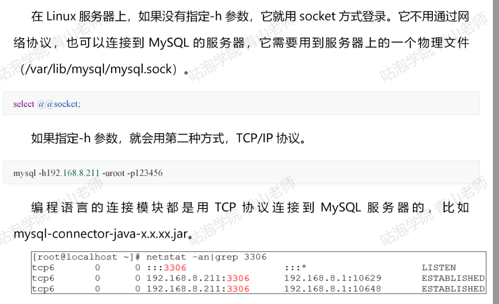

（4）通信方式
单工：两台计算机通信的时候，数据的传输是单向的：如，遥控器
办双工：数据的传输是双向的，但是同一时间只能有一台服务器在发送数据，如，对讲机
全双工：数据的传输是双向的：可以同时传输，如：打电话

**MySQL用的是半双工的通信方式**

# 一条查询的SQL是如何执行的

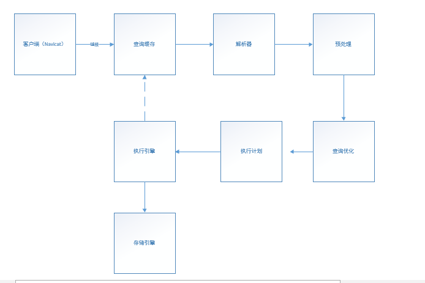

## 查询缓存

```
SELECT * from `user` where user_name = 'ada';

show VARIABLES like 'query_cache%';
```

由于缓存这一块的使用非常严格，比如多一个空格都不行，所以使用场景比较少，MySQL8.0已经去掉

## 解析器

比如随便输入一个字符：ada
会报下面的错误：
1064 - You have an error in your SQL syntax; check the manual that corresponds to your MySQL server version for the right syntax to use near 'ada' at line 1

主要是MySQL的Parser解析器和PreProcessor预处理模块

### 词法解析

把一个完整的SQL语句打碎成一个个的单词

### 语法解析

第二步就是语法分析，语法分析会对SQL做一些语法检查，比如单引号有没有闭合，然后根据MySQL定义的语法规则，根据SQL语句生成一个数据结构
这个数据结构我们把他叫做解析树
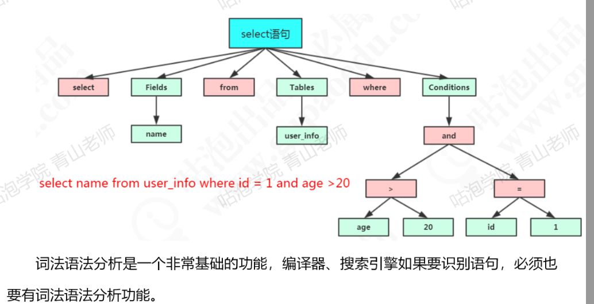

## 预处理器

如果写了一个词法和语法都正确的SQL，但是表名或者字段都不存在，会在哪里报错？
实际上还是在解析的时候报错，解析SQL的环节里面有个预处理器

它会检查生成的解析树，解决解析器无法解析的语义，比如，他会检查表和列名是否存在，检查名字和别名，保证没有歧义

预处理之后，会得到一个新的解析树

## 优化器

解析树是一个可以被执行器认识的数据结构

一条SQL语句是不是就只有一种执行方式？

答案是否定的，一条SQL语句是可以有很多种执行方式的，但是最终会返回相同的结果，但是这么多种执行方式，这些执行方式怎么得到？最终选择哪一种去执行？

这个就是MySQL的查询优化器的模块

目的：
查询优化器的目的就是根据解析树生成不同的执行计划，然后选择一种最优的执行计划，MySQL里面使用的是基于开销的优化器，哪种执行计划开销最小，就用哪种

可以用下面的命令查询开销：

```
-- 查询开销
show STATUS like 'Last_query_cost';
```

优化器的作用：
优化器优化什么类型：
比如
（1）多表关联查询的时候，要以哪个表进行数据的查询
（2）有多个索引的时候，选择哪个索引
。。。。

## 执行计划

优化器得到的结果：
优化器最终会得到一个**执行计划**，执行计划也是一个数据结构
当然，这个执行计划也不一定是最优的，因为MySQL中也有可能乜有覆盖到所有的执行计划

如何查看：
在执行的语句之前加上EXPLAIN

比如：

```
EXPLAIN SELECT * from user where user_name = 'ada';
```


## 存储引擎

表在存储数据的同时，还要组织数据的存储结构，这个存储结构就是由我们的存储引擎决定的，所以我们也可以吧存储引擎叫做表类型

（1）查看数据库里面已经存在的表的存储引擎
show table status from `test`;

（2）存储引擎的比较

```
-- 查看数据库支持的引擎
show ENGINES;
```

myISAM：
MySQL自带的存储引擎，由ISAM升级而来
应用范围比较小，表级锁定，通常用于只读或者以读为主的工作
特点：
支持表级别的锁(插入和更新会锁表)，不支持事务
拥有较高的插入和查询速度
存储了表的行数

InnoDB:
mysqlz 5.7中的默认存储引擎，具有提交，回滚和奔溃恢复功能来保护用户数据，InnoDB行级锁，支持外键引用完整性约束

特点：
支持事务，支持外键，因此数据的完整性，一致性高
支持行级别和表级别的锁
支持读写并发，写不阻塞读
特殊的索引存放凡是，可以减少IO，提高查询效率

适合：经常更新的表

Memory:
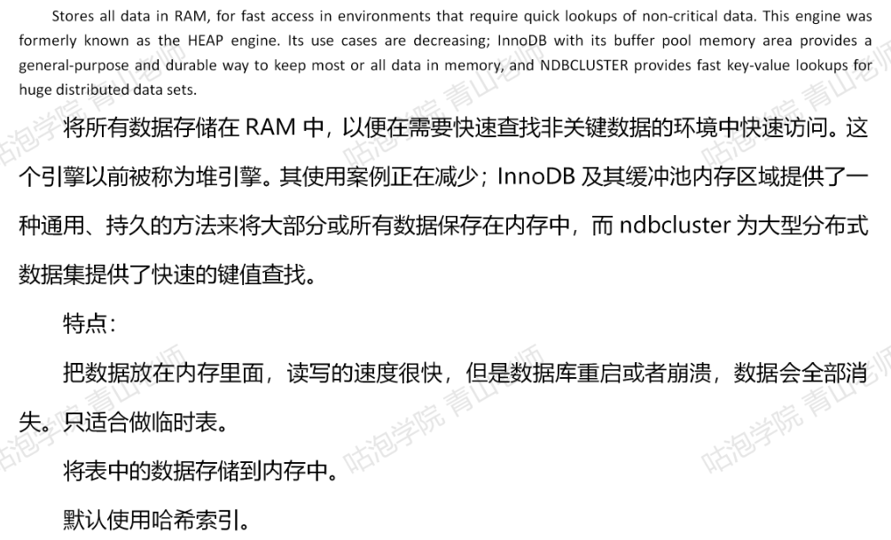

CSV:
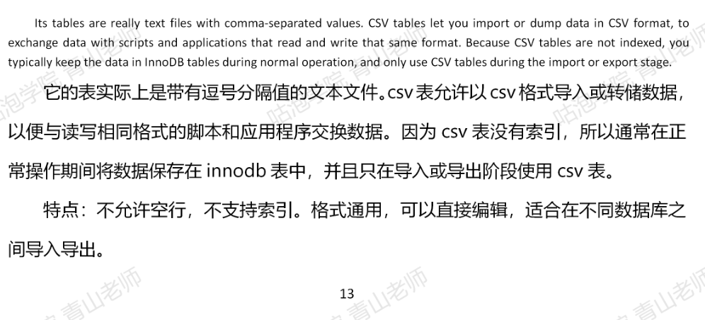

Archive:
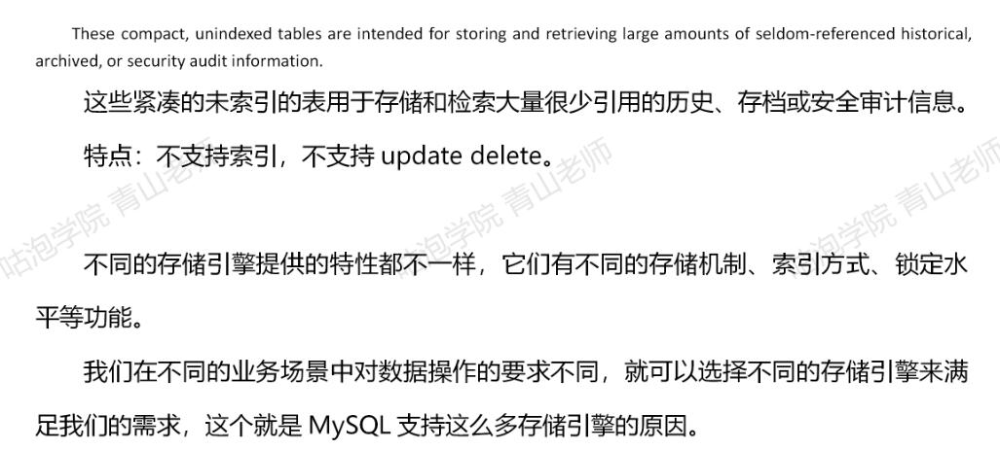

（3）如何选择
如果对数据的一致性要求比较高的话，需要事务支持，选InnoDB
如果数据查询多，更新少，对查询性能要求高的话，选MyISAM
如果需要一个用于查询的临时表，可以选择Memory

## 执行引擎

执行引擎，返回结果，执行器，也叫执行引擎，他利用存储引擎提供的相应的API来完成操作，最后把数据返回给客户端，即使没有结果也要返回

# MYSQL体系结构总结

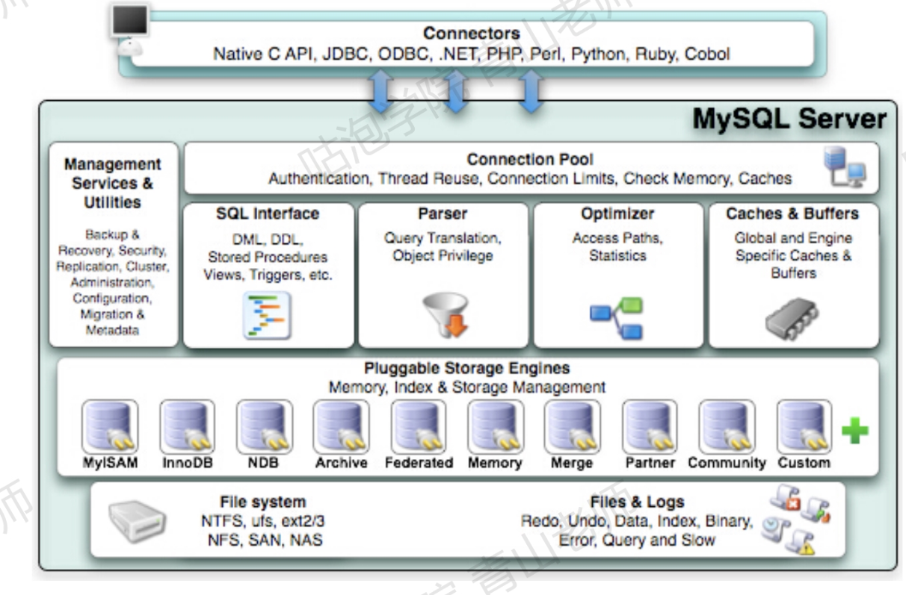
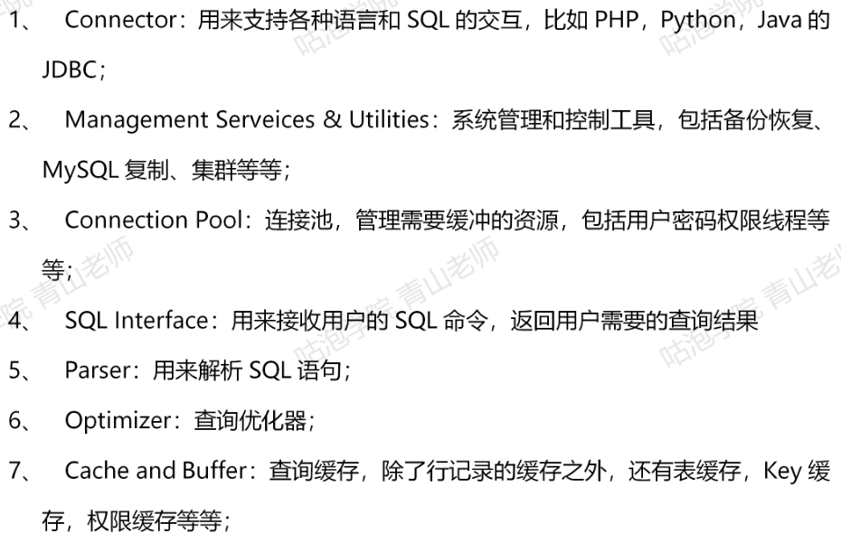


## 架构分层

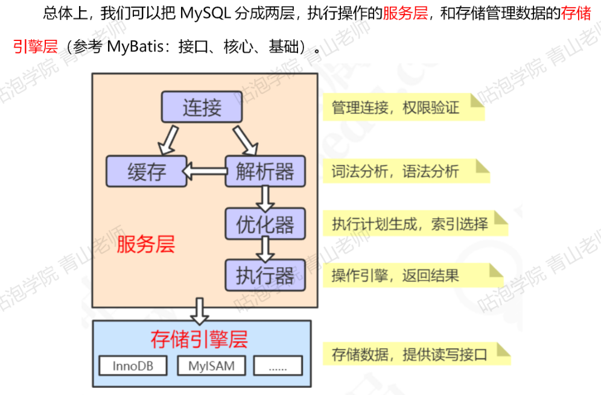

# 一条更新SQL是如何执行的

更新跟查询也基本一致，也就是说，他也要经过解析器，优化器的处理，最后交给执行器

区别就在于拿到符合条件的数据之后的操作

## 缓冲池

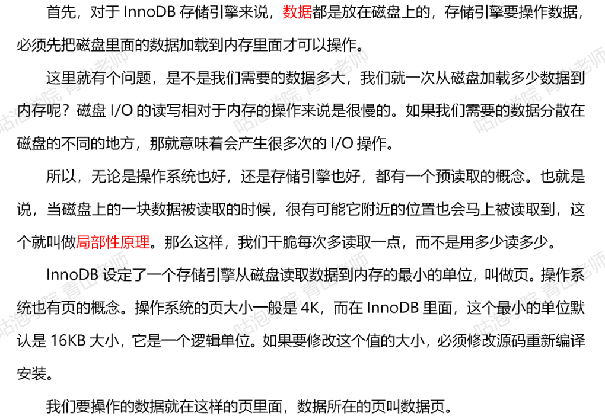


## 内存结构和磁盘结构

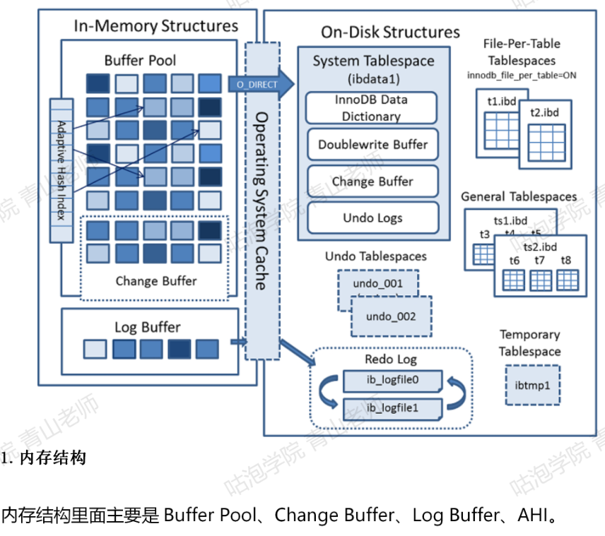

（1）Buffer Pool
查看 服务器状态，里面有很多跟buffer Pool相关的信息；
show status like '%innodb_buffer_pool%';

（2）（redo）log Buffer
因为刷脏不是实时的，如果buffer pool里面的脏页还没有刷入磁盘，数据库宕机或者重启，那这些数据就会丢失

为了避免这个问题，InnoDB把所有对页面的修改操作专门写入了一个日志文件

如果有未同步到磁盘的数据，数据库在启动的时候，会从这个日志文件进行恢复操作（实现crash-safe）,我们说的事务的ACID里面的D（持久性），就是用他来实现
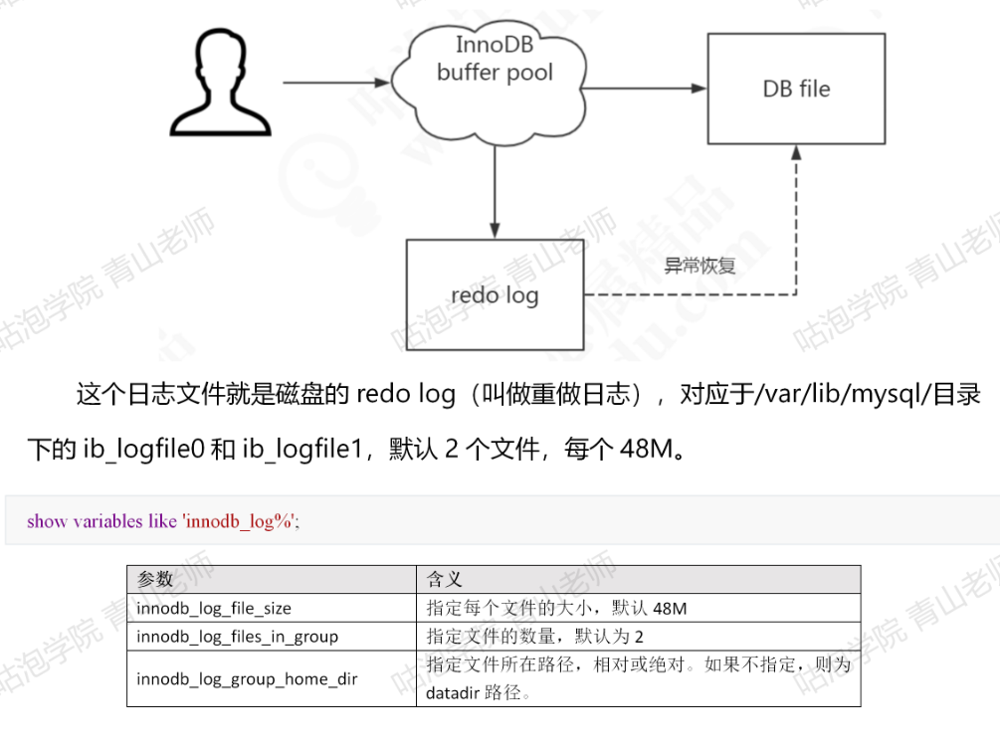

问题：
同样是写磁盘，为啥不直接写到db file里面去，要写日志再写磁盘？

如果我们所需要的数据是随机分散在磁盘上不同页的不同扇区，那找到相应的数据需要等磁臂旋转到指定的也，然后盘片寻找到对应的扇区，才能找到我们所需要的一块数据，一次进行此过程直到找完所有数据，这个就是随机IO，读取速度比较慢

如果我们找到第一块数据，并且其他所需要的数据就在这一块数据后边，那就不需要重新寻址，可以依次拿我们所需的数据，这个就是顺序IO

刷盘是随机IO，记录日志是顺序IO，效率高，在保证内存数据的安全性下，可以延迟刷盘时机，提高系统的吞吐

redo log的特点：

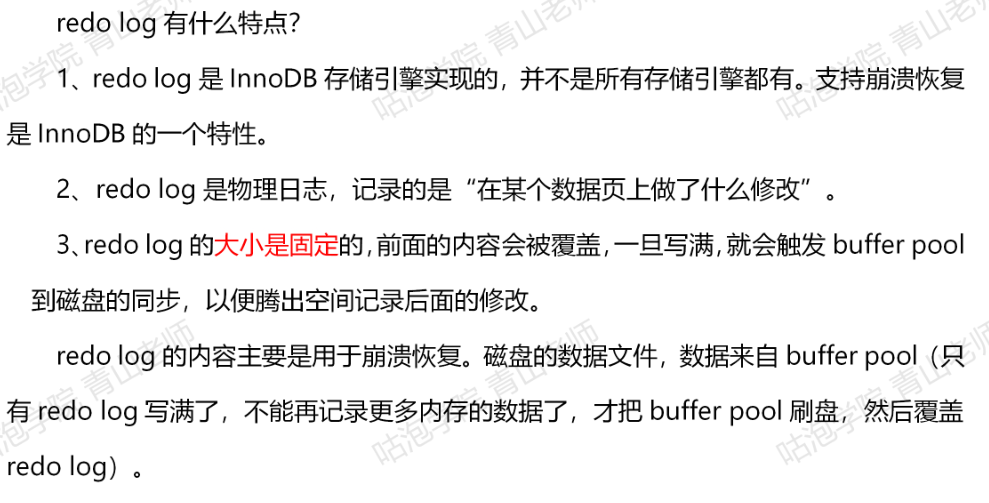

（3）undo log
undo log（撤销日志或者回滚日志）记录了事务发生之前的数据状态（不包括select）,如果修改数时出现异常，可以用undo log来实现回滚操作（保持原子性）

在执行undo的时候，仅仅是将数据从逻辑上恢复之事务之前的状态，而不是从物理页面上操作实现，属于逻辑格式的日志

undo log的数据默认在系统表空间ibdata1文件中，因为共享空间不会自动收缩，也可以单独创建一个Undo表空间
-- 查看undo空间
show GLOBAL VARIABLES like '%undo%';
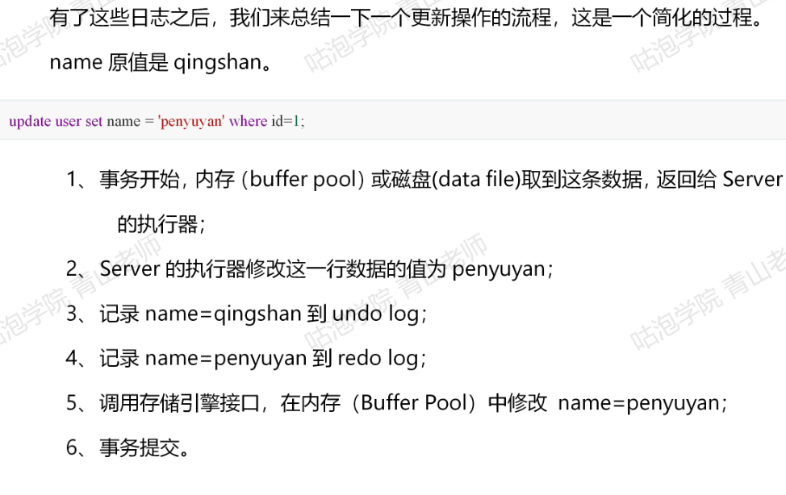

（4）binlog
binlog以事件的形式记录了所有的DDL和DML语句，因为它记录的操作而不是数据值，属于逻辑日志，binlog可以用来做主从复制和数据恢复

跟redo log不一样，他的文件内容是可以追加的，没有固定的大小限制
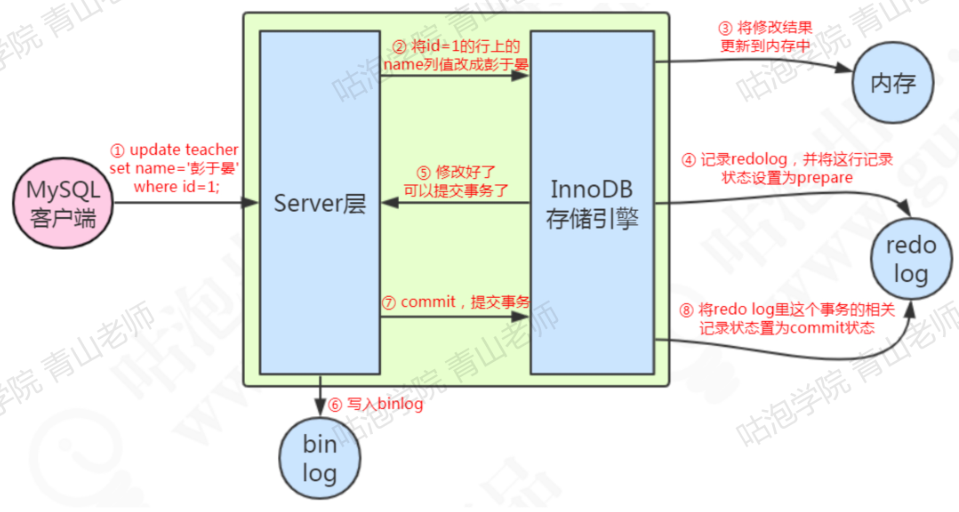

PS:本文来自于鼓泡学院的青山老师的笔记


