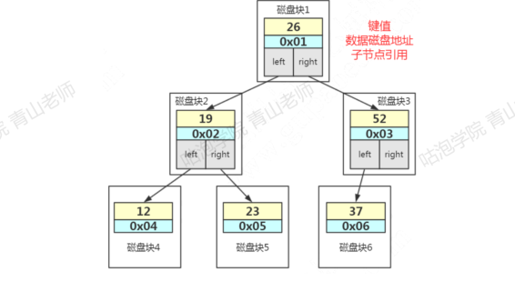
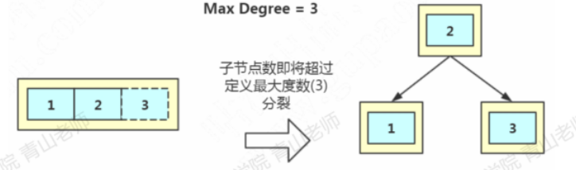
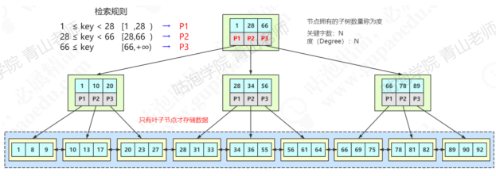
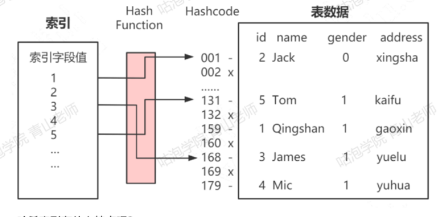
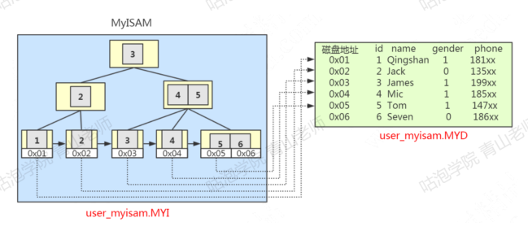
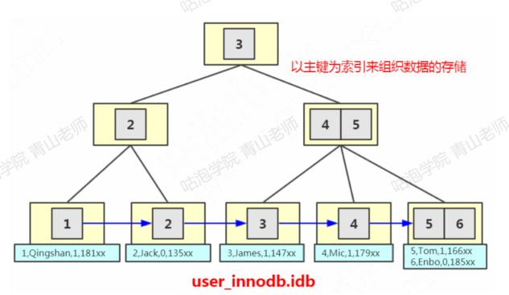
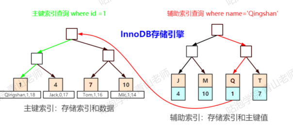
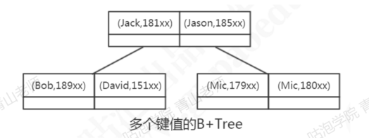

# 索引是什么

数据库索引，是数据库管理系统中的一个排序的数据结构，以协助快速查询、更新数据表的数据


数据是以文件的形式存放在磁盘上面的，每一行数据都是有它的磁盘地址，如果没有索引的话，只能通过遍历这张表的全部数据（循环调用存储引擎的读取下一行数据的接口），直到找到这条数据。

但是，如果有索引之后，只需要再索引里面去检索这条数据就行，因为他是一种特殊的专门来快速检索的数据结构，我们找到数据存放的磁盘地址之后，就可以拿到数据了

## 索引的类型

普通：也叫非唯一索引，是最普通的索引，没有任何的限制

唯一索引：唯一索引要求键值不能重复，主键索引是一种特殊的唯一索引（多了一个限制条件，要求键值不能为空，主键索引引用primary key创建）

全文索引：针对比较大的数据，比如我们存放的是消息内容，有几KB的数据的这种情况，如果要解决like查询效率低的问题，可以创建全文索引，只有文本类型的字段才可以创建全文索引，比如char/varchar/text

MyISAM和InnoDB支持全文索引

# 索引的故事

## 二叉查找树

左子树所有的节点都小于父节点、右子树所有节点都大于父节点、投影到平面之后，就是一个有序的线性表


二叉查找树既能够快速查找，又能够实现快速插入

但是，二叉查找树有一个问题：
他的查找耗时是跟这个数的深度相关的，在最坏的情况下时间复杂度会退化成O(n),如


那我们要思考，是不是要让他尽量保持平衡，就可以了，所以平衡二叉树应运而生

## 平衡二叉树

加上了这个定义（平衡二叉树的定义）：左右子树深度差绝对值不能超过1


如何做到？--->左旋和右旋

左旋
因为它是右节点下面接一个右节点，右右型，所以这个时候我们要把2提上去，这个操作就叫做左旋


同样的，如果我们插入765，这个时候就会变成左左左型，就会发生右旋操作，把6提上去


所以为了保持平衡、AVL树在插入和更新数据的时候就会进行一系列的计算和调整的操作

---

平衡的问题我们解决了，那平衡二叉树作为索引怎么查询数据？

在平衡二叉树中，一个节点，它的大小是一个固定的单位，作为索引应该存储什么内容？

三块内容：
第一：是索引的键值
比如我们在ID上面创建一个索引，我在用where id = 1的条件查询的时候就会找到索引里面的Id的这个键值

第二：是数据的磁盘地址
因为索引的作用就是去查找数据的存放地址

第三：因为是二叉树，它必须还有左子节点和右子节点的引用，这样我们才能找到下一个节点
比如大于26的时候，走右边，到下一个树的节点，继续判断


如果是这样存储数据的话，会有什么问题？
首先，索引的数据，是放在硬盘上的，查看数据和索引的大小：
当我们用树的结构来存储索引的时候，因为那倒一块数据就要在Server层比较是不是需要的数据，如果不是的话就要再读一次磁盘，访问一个节点就要跟磁盘之间发生一次IO，InnoDB操作磁盘的最小单位是一页（或者叫一个磁盘块），大小是16K（16384字节）

那么，一个树的节点就是16KB的大小
如果我们一个节点只存一个键值+数据+引用，例如整形的字段，可能只用10几个字节或者几十个字节，远远达不到16K的容量，所以访问一个树节点，进行一次IO操作，浪费了大量的空间

所以如果每个节点存储的数据太少，从索引中找到我们需要的数据，就要访问更多的节点，意味着跟磁盘交互的次数会过多

每次从磁盘读取数据需要寻址时间，交互次数越多，消耗的时间就越多



比如上面这张图，我们一张表里面有6条数据，当我们查询id=66 的时候，要查询两个子节点，就需要跟磁盘交互3次，如果我们有几百万的数据呢?这个时间更加难以估计。

所以，我们的解决方案是什么呢？

第一个就是让每个节点存储更多的数据
第二个，节点上的关键字的数量越多，我们的指针数也越多，也就是意味着可以有更多的分叉(我们把它叫做“路数”)

因为分叉数越多，树的深度就会减少(根节点是0)

这样，我们的树是不是从原来的高瘦高瘦的样子，变成了矮胖矮胖的样子?这个时候，我们的树就不再是二叉了，而是多叉，或者叫做多路

所以多路平衡查找树应运而生

## 多路平衡查找树

这个就是我们的多路平衡查找树，也就B Tree
跟AVL树一样，B树在枝节点和叶子节点存储键值、数据地址、节点引用

它有一个特点:分叉数(路数)永远比关键字数多1,比如我们画的这棵树，每个节点存储两个关键字，那么就会有三个指针指向三个子节点。


B Tree的查找规则是什么样的呢?比如我们要在这张表里面查找15
因为 15小于 17，走左边。
因为 15大于12，走右边
在磁盘块 7里面就找到了 15，只用了 3 次1O

那B Tree又是怎么实现一个节点存储多个关键字，还保持平衡的呢?跟AVL树有什么区别?

比如 Max Degree (路数)是3的时候，我们插入数据 1、2、3，在插入3 的时候本来应该在第一个磁盘块，但是如果一个节点有三个关键字的时候，意味着有4个指针子节点会变成4路，所以这个时候必须进行分裂(其实就是 BTree)。把中间的数据2提上去，把1和3变成2的子节点
如果删除节点，会有相反的合并的操作。
注意这里是分裂和合并，跟AVL树的左旋和右旋是不一样的。
我们继续插入4和5，B Tree 又会出现分裂和合并的操作。



节点的分裂和合并，其实就是InnoDB 页 (page)的分裂和合并

## B +树

比B Tree更全面



MYSQL的B+Tree有几个特点：
1、它的关键字的数量是跟路数相等的;
2、B+Tree的根节点和枝节点中都不会存储数据，只有叶子节点才存储数据。
目前的认知:我们这要存放的数据是什么?是不是真实数据的地址?
搜索到关键字不会直接返回，会到最后一层的叶子节点。比如我们搜索id=28，虽然在第一层直接命中了，但是数据地址在叶子节点上面，所以我还要继续往下搜索，一直到叶子节点。

3、B+Tree的每个叶子节点增加了一个指向相邻叶子节点的指针，它的最后一个数据会指向下一个叶子节点的第一个数据，形成了一个有序链表的结构

InnoDB中的 B+Tree 这种特点带来的优势:
1)它是B Tree 的变种，B Tree 能解决的问题，它都能解决。B Tree 解决的两大问题是什么?(每个节点存储更多关键字;路数更多)

2)扫库、扫表能力更强(对表进行全表扫描，只需要遍历叶子节点就可以了，不需要遍历整棵B+Tree拿到所有的数据)

3)B+Tree的磁盘读写能力相对于B Tree来说更强(根节点和枝节点不保存数据区所以一个节点可以保存更多的关键字，一次磁盘加载的关键字更多)

4)排序能力更强(因为叶子节点上有下一个数据区的指针，数据形成了链表

5)效率更加稳定(B+Tree 永远是在叶子节点拿到数据，所以IO次数是稳定的)

## 索引方式：真的是用B+Tree吗

在Navicat的工具中，创建索引，索引方式有两种

HASH:以KV的形式检索数据，也就是说，它会根据索引字段生成哈希码和指针指针指向数据。


哈希索引有什么特点呢?

第一个，它的时间复杂度是 O(1)，查询速度比较快。但是哈希索引里面的数据不是按顺序存储的，所以不能用于排序

第二个，我们在查询数据的时候要根据键值计算哈希码，所以它只能支持等值查询(=IN) ，不支持范围查询 (>< >= <= between and)

第三:如果字段重复值很多的时候，会出现大量的哈希冲突(采用拉链法解决)效率会降低

需要注意的是，InnoDB，不能显示地创建一个哈希索引(所谓的支持哈希索引指的是AHI)。
memory 存储引擎可以使用 Hash 索引。

因为B Tree和B+Tree的特性,它们广泛地用在文件系统和数据库中,例如 Windows的 HPFS 文件系统，Oracel、MySQL、SQLServer 数据库

# B+Tree的落地方式

## MYSQL的数据存储文件

InnoDB === .frm+.ibd
MyISAM === .frm+.MYD+.MYI

- MYISAM
   在MyISAM 里面，另外有两个文件:
   一个是MYD 文件，D代表 Data，是 MyISAM 的数据文件，存放数据记录，比如我们的user_myisam 表的所有的表数据。
   一个是MYI 文件，I代表Index，是MyISAM 的索引文件，存放索引，比如我们在id 字段上面创建了一个主键索引，那么主键索引就是在这个索引文件里面。也就是说，在MylSAM 里面，索引和数据是两个独立的文件

那我们怎么根据索引找到数据呢?
MyISAM的B+Tree 里面，叶子节点存储的是数据文件对应的磁盘地址。所以从索引文件.MYI 中找到键值后，会到数据文件.MYD 中获取相应的数据记录



如果是辅助索引，有什么不一样呢？

在MyISAM里面，辅助索引也在这个MYI文件里面
辅助索引跟主键索引存储和检索数据的方式是没有任何区别的，一样是在索引文件里面找到磁盘地址，然后到数据文件里面获取数据。


- InnoDB
  在InnoDB里面，它是以主键为索引来组织数据的存储的，所以索引文件和数据文件是同一个文件，都在.ibd 文件里面。
  在InnoDB的主键索引的叶子节点上，它直接存储了我们的数据



聚簇索引：就是索引键值的逻辑顺序跟表数据行的物理存储顺序是一致的，(比如字典的目录是按拼音排序的，内容也是按拼音排序的，按拼音排序的这种目录就叫聚集索引)。

在InnoDB里面，它组织数据的方式叫做叫做(聚集)索引组织表(clustered indexorganize table)，所以主键索引是聚集索引，非主键都是非聚集索引。

主键之外的索引，比如在name字段上面建的普通索引，又是怎么存储和检索数据的呢?


InnoDB中，主键索引和辅助索引是有一个主次之分的。

辅助索引存储的是辅助索引和主键值。如果使用辅助索引查询，会根据主键值在主键索引中查询，最终取得数据。

比如我们用name 索引查询 name=青山，它会在叶子节点找到主键值，也就是id=1，然后再到主键索引的叶子节点拿到数据

如果一张表没有主键怎么办？

1、如果我们定义了主键(PRIMARY KEY)，那么InnoDB 会选择主键作为聚集索引
2、如果没有显式定义主键，则lnnoDB 会选择第一个不包含有 NULL值的唯一索引作为主键索引。
3如果也没有这样的唯一索引，则innoDB 会选择内置6字节长的ROWID作为隐藏的聚集索引，它会随着行记录的写入而主键递增

# 索引的使用原则

## 列的离散度

第一个叫做列的离散度，我们先来看一下列的离散度的公式:
count(distinct(column _name)): count(*)，列的全部不同值和所有数据行的比例。
数据行数相同的情况下，分子越大，列的离散度就越高

如果列的重复值越多，离散度就越低，重复值越少，离散度就越高。

当我们用在gender上建立的索引去检索数据的时候，由于重复值太多，需要扫描的行数就更多。例如，我们现在在gender 列上面创建一个索引，然后看一下执行计划

## 联合索引最左匹配

前面我们说的都是针对单列创建的索引，但有的时候我们的多条件查询的时候，也会建立联合索引，举例: 查询成绩的时候必须同时输入身份证和考号。

单列索引可以看成是特殊的联合索引。
比如 user表给 name和 phone 建立了一个联合索引。



联合索引在B+Tree中是复合的数据结构，它是按照从左到右的顺序来建立搜索树的(name 在左边，phone 在右边)。
从这张图可以看出来，name 是有序的，phone 是无序的。当name相等的时候，phone才是有序的

这个时候我们使用 where name=青山and phone = 136xx去查询数据的时候B+Tree 会优先比较 name 来确定下一步应该搜索的方向，往左还是往右。如果 name相同的时候再比较 phone。但是如果查询条件没有 name，就不知道第一步应该查哪个节点，因为建立搜索树的时候 name 是第一个比较因子，所以用不到索引。

## 什么时候用到联合索引

1)使用两个字段，用到联合索引:

2)使用左边的name字段，用到联合索引:

3)使用右边的 phone字段，无法使用索引，全表扫描:

## 如何创建联合索引

```
CREATE INDEX idx name on user innodb(name):
CREATEINDEX idx name phone on user innodb(name.phone):
```

当我们创建一个联合索引的时候，按照最左匹配原则，用左边的字段 name 去查询的时候，也能用到索引，所以第一个索引完全没必要
相当于建立了两个联合索引(name),(namephone)。
如果我们创建三个字段的索引index(a,b,c)，相当于创建三个索引:
index(a)
index(a,b)
index(a,b,c)
用 where b=?和 where b=?and c=? 是不能使用到索的

## 覆盖索引

回表：

非主键索引，我们先通过索引找到主键索引的键值，再通过主键值查出索引里面没有的数据，它比基于主键索引的查询多扫描了一棵索引树，这个过程就叫回表

比如：
select* from user innodb where name =ada;

在辅助索引里面，不管是单列索引还是联合索引，如果 select 的数据列只用从索引中就能够取得，不必从数据区中读取，这时候使用的索引就叫做覆盖索引，这样就避免了回表。

我们来创建一个联合索引：

```
-- 创建联合索引
ALTER TABLE user innodb DROPINDEX comixd name phone:
ALTER TABLE user innodb add INDEX comixd name phone' (name . phone'):
```

这三个查询语句都用到了覆盖索引

```
EXPLAIN SELECT name.phone FROM user innodb WHERE name='a' AND phone ='13666666666'
EXPLAIN  SELECT nameFROM user innodb WHERE name= '青山' AND phone =' 13666666666'
EXPLAIN SELECT phone FROM uscr innodb WHERE name= '青山' AND phone =' 13666666666
```

select *
此处用不到覆盖索引.

假如一个主键索引，其他3个字段建立辅助索引，select*也属于覆盖索引

Extra里面值为“Usingindex”代表使用了覆盖索引。

# 索引的创建和使用

因为索引对于改善查询性能的作用是巨大的，所以我们的目标是尽量使用索引

## 索引的创建

1、在用于 where 判断 order 排序和join 的(on)字段上创建索引
2、索引的个数不要过多，浪费空间，更新变慢。
3、过长的字段，建立前缀索引。
4、区分度低的字段，例如性别，不要建索引。离散度太低，导致扫描行数过多。
5、频繁更新的值，不要作为主键或者索引。-页分裂
6、随机无序的值，不建议作为主键索引，例如身份证、UUID。无序，分裂
7、组合索引把散列性高(区分度高)的值放在前面
8、创建复合索引，而不是修改单列索引

## 索引失效的场景

1、索引列上使用函数 (replace\SUBSTR\CONCAsum count avg)、表达式计算(+ - * /)
2、字符串不加引号，出现隐式转换
3、like条件中前面带%where 条件中 like abc%，like %2673%，like %888 都用不到索引吗? 为什么?
过滤的开销太大。这个时候可以用全文索引
4.负向查询
NOT LIKE 不能:
!= (<>)和 NOTIN 在某些情况下可以:

其实，用不用索引，最终都是优化器说了算。

优化器是基于什么的优化器?
基于 cost开销(Cost Base Optimizer),它不是基于规则(Rule-Based Optimizer),也不是基于语义。怎么样开销小就怎么来
使用索引有基本原则，但是没有具体细则，没有什么情况一定用索引，什么情况一定不用索引的规则。


