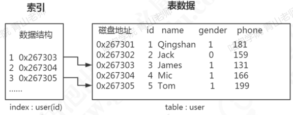
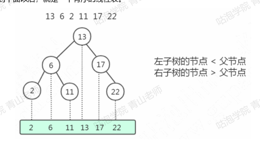
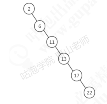
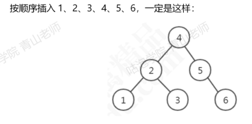
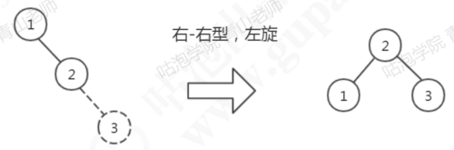
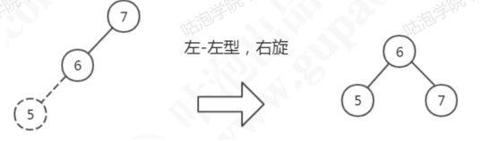
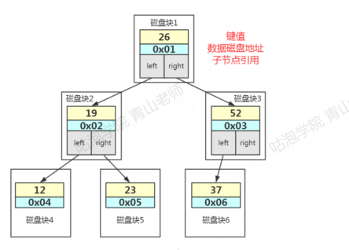

# 索引是什么

数据库索引，是数据库管理系统中的一个排序的数据结构，以协助快速查询、更新数据表的数据

数据是以文件的形式存放在磁盘上面的，每一行数据都是有它的磁盘地址，如果没有索引的话，只能通过遍历这张表的全部数据（循环调用存储引擎的读取下一行数据的接口），直到找到这条数据。

但是，如果有索引之后，只需要再索引里面去检索这条数据就行，因为他是一种特殊的专门来快速检索的数据结构，我们找到数据存放的磁盘地址之后，就可以拿到数据了

## 索引的类型

普通：也叫非唯一索引，是最普通的索引，没有任何的限制

唯一索引：唯一索引要求键值不能重复，主键索引是一种特殊的唯一索引（多了一个限制条件，要求键值不能为空，主键索引引用primary key创建）

全文索引：针对比较大的数据，比如我们存放的是消息内容，有几KB的数据的这种情况，如果要解决like查询效率低的问题，可以创建全文索引，只有文本类型的字段才可以创建全文索引，比如char/varchar/text

MyISAM和InnoDB支持全文索引

# 索引的故事

## 二叉查找树

左子树所有的节点都小于父节点、右子树所有节点都大于父节点、投影到平面之后，就是一个有序的线性表

二叉查找树既能够快速查找，又能够实现快速插入

但是，二叉查找树有一个问题：
他的查找耗时是跟这个数的深度相关的，在最坏的情况下时间复杂度会退化成O(n),如

那我们要思考，是不是要让他尽量保持平衡，就可以了，所以平衡二叉树应运而生

## 平衡二叉树

加上了这个定义（平衡二叉树的定义）：左右子树深度差绝对值不能超过1

如何做到？--->左旋和右旋

左旋
因为它是右节点下面接一个右节点，右右型，所以这个时候我们要把2提上去，这个操作就叫做左旋

同样的，如果我们插入765，这个时候就会变成左左左型，就会发生右旋操作，把6提上去

所以为了保持平衡、AVL树在插入和更新数据的时候就会进行一系列的计算和调整的操作

---

平衡的问题我们解决了，那平衡二叉树作为索引怎么查询数据？

在平衡二叉树中，一个节点，它的大小是一个固定的单位，作为索引应该存储什么内容？

三块内容：
第一：是索引的键值
比如我们在ID上面创建一个索引，我在用where id = 1的条件查询的时候就会找到索引里面的Id的这个键值

第二：是数据的磁盘地址
因为索引的作用就是去查找数据的存放地址

第三：因为是二叉树，它必须还有左子节点和右子节点的引用，这样我们才能找到下一个节点
比如大于26的时候，走右边，到下一个树的节点，继续判断

