# 数据库的事务

## 事务的经典场景

比如下单，会操作订单表，资金表，物流表等等，这个时候我们需要让这些操作都在一个事务里面完成。在金融的系统里面事务配置是很常见的，比如行内转账的这种操作，如果我们把它简单地理解为一个账户的余额增加，另一个账户的余额减少的情况(当然实际上要比这复杂)，那么这两个动作一定是同时成功或者同时失败的，否则就会造成银行的会计科目不平衡。

## 事务的定义

维基百科的定义:事务是数据库管理系统(DBMS)执行过程中的一个逻辑单位，由个有限的数据库操作序列构成

## 哪些存储引擎支持事务

InnoDB支持事务

## 事务的四大特性

原子性：
，要么都是成功，要么都是失败，不可能出现部分成功或者部分失败的情况
在InnoDB中里面是通过undo log来实现的，,它记录了数据修改之前的值(逻辑日志)，一旦发生异常，就可以用 undo log 来实现回滚操作

一致性：
指的是数据库的完整性约束没有被破坏，事务执行的前后都是合法的数据状态。比如主键必须是唯一的，字段长度符合要求

持久性：
我们对数据库的任意的操作，增删改，只要事务提交成功，那么结果就是永久性的，不可能因为我们系统宕机或者重启了数据库的服务器，它又恢复到原来的状态了。这个就是事务的持久性

过 redo log 来实现的，（物理日志）

隔离性：
我们有了事务的定义以后，在数据库里面会有很多的事务同时去操作我们的同一张表或者同一行数据，必然会产生一些并发或者干扰的操作那么我们对隔离性的定义，就是这些很多个的事务，对表或者行的并发操作，应该是透明的，互相不干扰的。通过这种方式，我们最终也是保证业务数据的一致性

因为存储引擎的页和操作系统的页大小不一致。一个存储引擎 page 的数据要写4次，如果中间发生异常，或造成页数据的不可用。所以，必须把页的数据备份起来，这个就是双写缓冲 (double write buffer)

## 数据库什么时候会出现事务

下面这个更新语句有问题？

```
update student set sname ="猫老公 1l1' where id=l:
```

它自动开启了一个事务，并且提交了

这个是开启事务的第一种方式，自动开启和自动提交
InnoDB 里面有一个autocommit 的参数(分成两个级别， session 级别和 global级别）

show variables like "autocommit'.

它的默认值是 ON。autocommit 这个参数是什么意思呢? 是否自动提交。如果它的值是 true/on 的话，我们在操作数据的时候，会自动开启一个事务，和自动提交事务

手动开启事务也有几种方式，一种是用 begin;一种是用 start transaction
结束的话，有两种，第一种就是提交一个事务commit;还有一种就是 rollback，回滚的时候，事务也会结束

## 事务并发会带来什么问题？

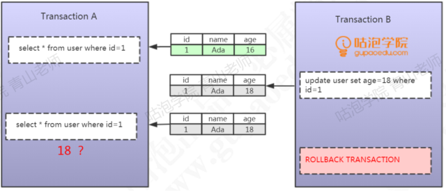

第一个事务里，它首先去查询，返回name = Ada,age= 16这条数据，第二个事务，它同样地是去操作 id=1的这行数据，它通过一个 update 的语句，把这行id=1的数据的age 改成了18，没有提交
这个时候，在第一个事务里面，它再次去执行相同的查询操作，发现数据发生了变化，获取到的数据age 变成了18。这种在一个事务里面，由于其他的时候修改了数据并且没有提交，而导致了前后两次读取数据不一致的情况，叫做脏读

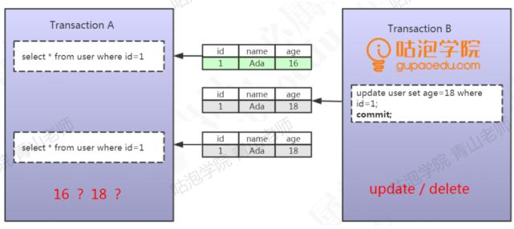
同样是两个事务，第一个事务通过id=1 查询到了一条数据。然后在第二个事务里面执行了一个update 操作，通过一个 commit 提交了修改。然后第一个事务读取到了其他事务已提交的数据导致前后两次读取数据不一致的情况。那么这种事务并发带来的问题，叫做不可重复读。

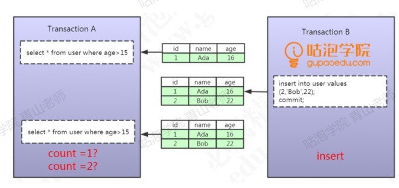
在第一个事务里面我们执行了一个范围查询，这个时候满足条件的数据只有一条。在第二个事务里面，它插入了一行数据，并且提交了。重点: 插入了一行数据。在第一个事务里面再去查询的时候，它发现多了一行数据。
一个事务前后两次读取数据数据不一致，是由于其他事务插入数据造成的，这种情况我们把它叫做幻读

## SQL92标准

第一个隔离级别叫做: Read Uncommitted (未提交读)，一个事务可以读取到其他事务未提交的数据，会出现脏读，所以叫做 RU，它没有解决任何的问题

第二个隔离级别叫做: Read Committed (已提交读)，也就是一个事务只能读取到其他事务已提交的数据，不能读取到其他事务未提交的数据，它解决了脏读的问题但是会出现不可重复读的问题

第三个隔离级别叫做: Repeatable Read(可重复读)，它解决了不可重复读的问题也就是在同一个事务里面多次读取同样的数据结果是一样的，但是在这个级别下，没有定义解决幻读的问题

最后一个就是: Serializable (串行化)，在这个隔离级别里面，所有的事务都是串行执行的，也就是对数据的操作需要排队，已经不存在事务的并发操作了，所以它解决了所有的问题

## MySQL InnoDB对隔离级别的支持

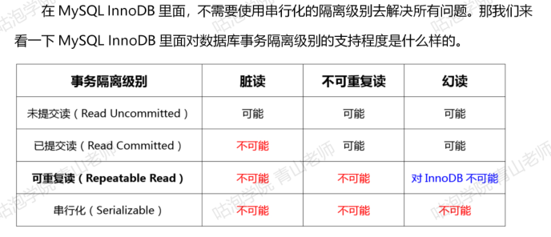

## 两大实现方案

### LBCC

第一种，读取数据的时候，锁定我要操作的数据，不允许其他的事务修改就行了这种方案我们叫做基于锁的并发控制 Lock Based Concurrency Control (LBCC)

### MVCC

在修改数据的时候给他建立一个备份或者快照，后面再来读取这个快照就行了
这种方案我们叫做多版本的并发控制 Multi Version Concurrency Control(MVCC)

MVCC的核心思想是：
我可以查到在我这个事务开始之前已经存在的已提交的数据，即使他在后面被修改或者删除了，在我这个事务之后新增的数据，我是查不到的

InnoDB为每行记录都实现了两个隐藏字段 (还加上一个 ROWID)

DB_TRX_ID，6字节:插入或更新行的最后一个事务的事务ID，事务编号是自动递增的(我们把它理解为创建版本号，在数据新增或者修改为新数据的时候，记录当前事务ID)

DB_ROLL_PTR，7字节:回滚指针(我们把它理解为删除版本号，数据被删除或记录为旧数据的时候，记录当前事务ID)

我们把这两个事务ID理解为版本号

下面我们用一种简化的模型来理解一下MVCC

第一个事务，初始化数据
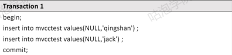

此时的数据，创建版本是当前事务ID，删除版本为空：
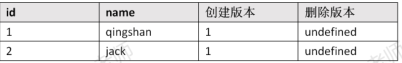

第二个事务，执行第一次查询，读到两条原始数据，这是时候事务ID是2：
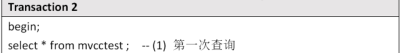

第三个事务，插入数据：
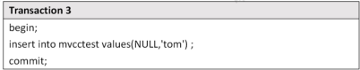

此时的数据，多了一条tom,他的创建版本号是当前事务编号，3：
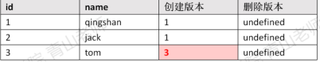

第二个事务，执行第二次查询：

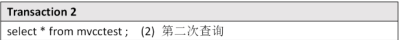

MVCC的查找规则，只能查到本事务的修改，和在第一次查询之前已经提交的事务修改

所以还是查到两条数据

第四个事务：，删除数据，删除了id=2 jack这条记录

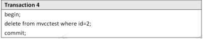

此时的数据，jack的删除版本被记录为当前事务ID，4，其他的不变

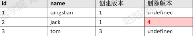

在第二个事务中，执行第三次查询：

MVCC的查找规则，只能查到本事务的修改，和在第一次查询之前已经提交的事务修改

第五个事务，执行更新操作，这个事务ID为5：
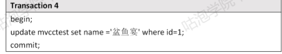

此时的数据，更新数据的时候，旧数据的删除版本被记录为当前事务ID 5
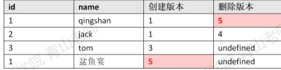

第二个事务，执行第四次查询：

查找规则，只能查到本事务的修改，和在第一次查询之前已经提交的事务和修改

因为更新后的数据penyuyan 创建版本大于2，代表是在事务之后增加的，查不出

而旧数据qingshan 的删除版本大于2，代表是在事务之后删除的，可以查出来

通过以上演示我们能看到，通过版本号的控制，无论其他事务是插入、修改、删除第一个事务查询到的数据都没有变化。

# MySQL InnoDB锁的基本类型

## 共享锁

Shared Locks (共享锁)，我们获取了一行数据的读锁以后，可以用来读取数据所以它也叫做读锁。
用 select ...... lock in share mode; 的方式手工加上一把读锁。释放锁有两种方式，只要事务结束，锁就会自动事务，包括提交事务和结束事务

## 排它锁

Exclusive Locks (排它锁)，它是用来操作数据的，所以又叫做写锁。只要一个事务获取了一行数据的排它锁，其他的事务就不能再获取这一行数据的共享锁和排它锁

增删改，都会默认加上一个排它锁
手工加锁，用FORUPDATE给一行数据加上一个排它锁，这个无论是在我们的代码里面还是操作数据的工具里面，都比较常用。

释放锁的方式跟前面是一样的

## 意向锁

当我们给一行数据加上共享锁之前，数据库会自动在这张表上面加一个意向共享锁当我们给一行数据加上排他锁之前，数据库会自动在这张表上面加一个意向排他锁反过来说:
如果一张表上面至少有一个意向共享锁，说明有其他的事务给其中的某些数据行加上了共享锁。
如果一张表上面至少有一个意向排他锁，说明有其他的事务给其中的某些数据行加上了排他锁。

第一个，我们有了表级别的锁，在InnoDB 里面就可以支持更多粒度的锁

第二个作用，当我们准备给一张表加上表锁的时候，必须先要去判断有没其他的事务锁定了其中了某些行。如果有的话，肯定不能加上表锁。那么这个时候我们就要去扫描整张表才能确定能不能成功加上一个表锁，如果数据量特别大，比如有上千万的数据的时候，加表锁的效率是不是很低?但是我们引入了意向锁之后就不一样了。我只要判断这张表上面有没有意向锁，如果有，就直接返回失败。如果没有，就可以加锁成功。所以InnoDB 里面的表锁，我们可以把它理解成一个标志。就像火车上厕所有没有人使用的灯，是用来提高加锁的效率的。

# 行锁的原理

## 没有索引的表


## 有主键索引的表

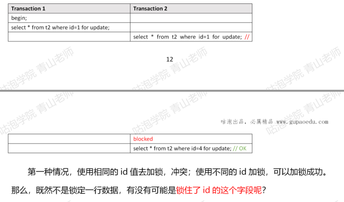

## 唯一索引（假设锁住字段）

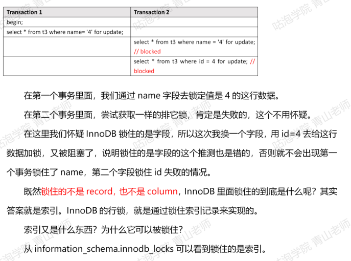

还有两个问题没有解决：
1.为什么表里面没有索引的时候，锁住一行数据会导致锁表？
或者说，如果锁住的是索引，一张表没有索引怎么办？

所以，一张表有没有可能没有索引?
1)如果我们定义了主键(PRIMARY KEY)，那么InnoDB 会选择主键作为聚集索引。2)如果没有显式定义主键，则 InnoDB 会选择第一个不包含有 NULL 值的唯一索引作为主键索引。
3)如果也没有这样的唯一索引，则InnoDB 会选择内置 6字节长的 ROWID作为隐藏的聚集索引，它会随着行记录的写入而主键递增
所以，为什么锁表，是因为查询没有使用索引，会进行全表扫描，然后把每一个隐藏的聚集索引都锁住了

2、为什么通过唯一索引给数据行加锁，主键索引也会被锁住?在InnoDB里面，当我们使用辅助索引的时候，它是怎么检索数据的? 辅助索引的叶子节点存储的是什么内容?
在辅助索引里面，索引存储的是二级索引和主键的值比如name=4,存储的是name的索引和主键id的值4。
而主键索引里面除了索引之外，还存储了完整的数据。所以我们通过辅助索引锁定一行数据的时候，它跟我们检索数据的步骤是一样的，会通过主键值找到主键索引，然后也锁定。

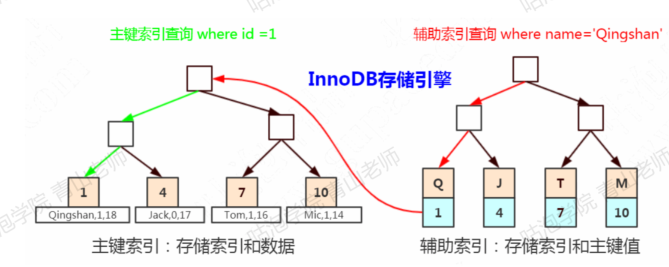

# 锁的算法

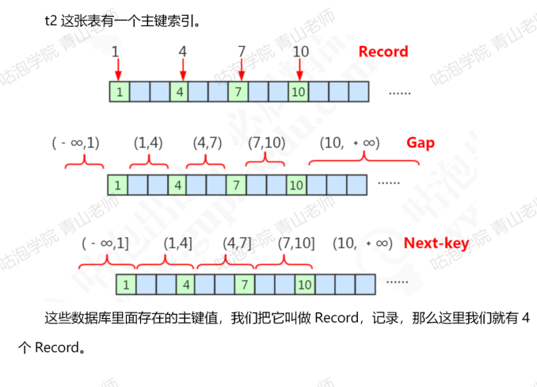

根据主键，这些存在的Record隔开的数据不存在的区间，我们把它叫做Gap ,间隙，同事一个左开右开的区间

间隙联通它左边的记录，我们把它叫做临建的区间，他是一个左开右闭的区间

## 记录锁

当我们对于唯一性的索引(包括唯一索引和主键索引)使用等值查询，精准匹配到条记录的时候，这个时候使用的就是记录锁。
比如 where id =1 47 10

## 间隙锁

当我们查询的记录不存在，没有命中任何一个 record，无论是用等值查询还是范围查询的时候，它使用的都是间隙锁。
举个例子，whereid >4and id <7，where id = 6

Gap Lock 只在 RR中存在，如果要关闭间隙锁，就是把事务隔离级别设置成RC并且把innodb locks unsafe for binlog 设置为 ON。
这种情况下除了外键约束和唯一性检查会加间隙锁，其他情况都不会用间隙锁

## 临键锁

当我们使用了范围查询，不仅仅命中了 Record 记录，还包含了 Gap 间隙，在这种情况下我们使用的就是临键锁，它是 MySQL里面默认的行锁算法，相当于记录锁加上间隙锁。
比如我们使用>5<9，它包含了记录不存在的区间，也包含了一个 Record 7。


