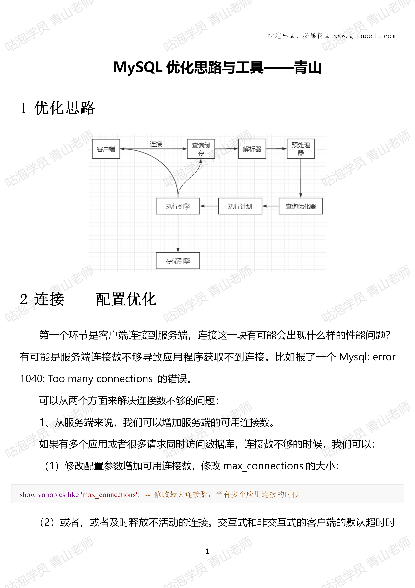
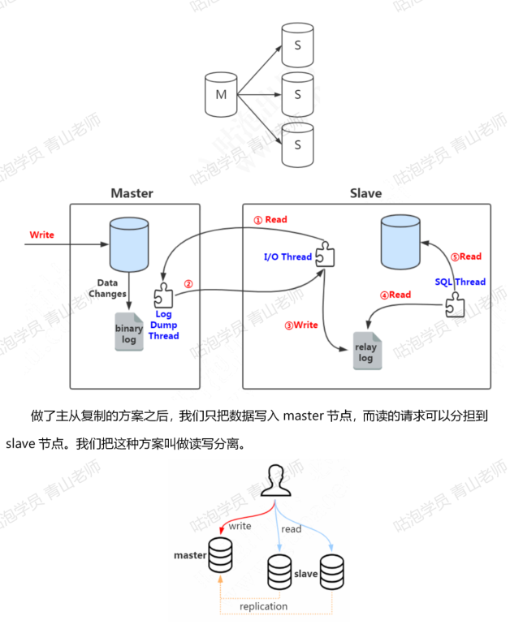
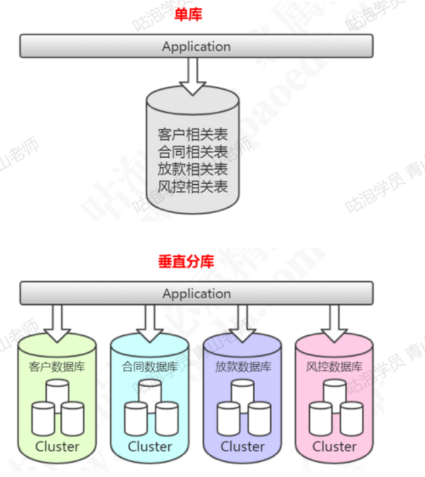
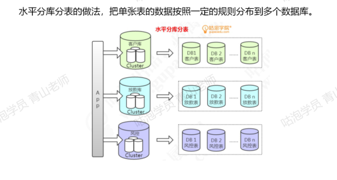
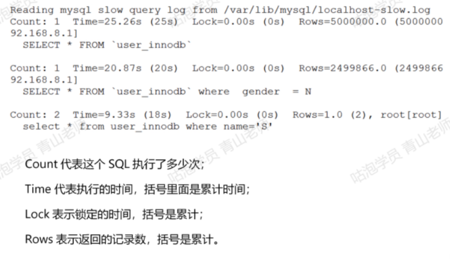
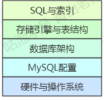

# 优化思路



# 连接-配置优化

第一个环节是客户端连接到服务端，连接这一块有可能会出现什么样的性能问题？
有可能是服务端连接数不够导致应用程序获取不到连接，比如报了一个Mysql:error1040:Too many connections 的错误
可以从两个方面来解决连接数不够的问题:
第一：从服务端来说，我们可以增加服务端的可用连接数。

如果有多个应用或者很多请求同时访问数据库，连接数不够的时候，我们可以:
(1)修改配置参数增加可用连接数，修改 max connections 的大小:

```
show variables like'max_connections: -- 修改最大连接数，当有多个应用连接的时候
```

(2)或者，或者及时释放不活动的连接。交互式和非交互式的客户端的默认超时时间都是 28800 秒，8 小时，我们可以把这个值调小

```
show global variablcs like wvait timeout: --及时释放不活动的连接，注意不要释放连接池还在使用的连接
```

2、从客户端来说，可以减少从服务端获取的连接数，如果我们想要不是每一次执行SQL都创建一个新的连接，可以引入连接池，实现连接的重用

# 缓存-架构优化

## 缓存

在应用系统的并发数非常大的情况下，如果没有缓存，会造成两个问题:一方面是会给数据库带来很大的压力。另一方面，从应用的层面来说，操作数据的速度也会受到影响。
我们可以用第三方的缓存服务来解决这个问题，例如 Redis。

## 集群，主从复制

如果单台数据库服务满足不了访问需求，那我们可以做数据库的集群方案

读写分离可以一定程度低减轻数据库服务器的访问压力，但是需要特别注意主从数据一致性的问题

## 分库分表

垂直分库，减少并发压力。水平分表，解决存储瓶颈垂直分库的做法，把一个数据库按照业务拆分成不同的数据库





# 优化器

第一步，我们要把SQL的执行情况记录下来：

## 慢查询日志

## 打开慢日志开关

因为开启慢查询日志是有代价的(跟 bin logoptimizer-trace 一样)，所以它默认是关闭的:

```
show variables like 'slow query%.
```

除了这个开关，还有一个参数，控制执行超过多长时间的 SQL才记录到慢日志，默认是10秒，如果改成0秒的话就是记录所有的SQL

可以直接动态修改参数（重启后失效）

```
set a aglobal.slow query_log=l:-- 1 开启，0 关闭，重启后失效-- mysql 默认的慢查询时间是 10 秒，另开一个窗口后才会查到最新值set a a globallong_query_time-3:
show variables like "long query%'.
show variables like "slow query%'
```

或者修改配置文件my.cnf
以下配置定义了慢查询日志的开关、慢查询的时间、日志文件的存放路径

```
slow_query_log = ON
long_query time 2
slow_query log file =/ar/lib/mysql/localhost-slow.log
```

### 慢日志分析

1、日志内容
show global status like 'slow queries .-- 查看有多少慢查询
show variables like "%slow_query%: - 获取慢日志目录

2.mysqldumpslow
MySQL提供了mysqldumpslow的工具，在MySQL的bin目录下

例如:查询用时最多的 10 条慢 SQL：

```
mysqldumpslow -s t -t 10 -g 'select' /var/lib/mysqllocalhost-slow.log
```



## show profile

SHOW PROFILE是谷歌高级架构师Jeremy Cole 贡献给MySQL社区的,可以查看SQL语句执行的时候使用的资源，比如 CPU、IO 的消耗情况。
在SQL中输入help profile 可以得到详细的帮助信息。

```
select a a profiling.
set a a proliling l
```

### 查看profile统计

```
show profiles
```

查看最后一个 SQL的执行详细信息，从中找出耗时较多的环节(没有 s)

`show profile.`

也可以根据ID查看执行详细信息，在后面带上for query +ID

` show profile for query l:`

### 其他系统命令

分析Server 层的运行信息，可以用 show status。

SHOW STATUS用于查看MySQL 服务器运行状态(重启后会清空)。
SHOW GLOBAL STATUS

可以用like带通配符过滤，例如查看select 语的执行次数。

SHOW GLOBAL STATUS LIKE com select:-- 看 select 次数

show processlist 运行线程
如果要分析服务层的连接信息，可以用 show processlist:

这是一个很重要的命令，用于显示用户运行线程
如果说其中的某一个线程有问题，可以根据ID号kill线程
可以查表，效果是一样的
`select * from information schema.processlist;`

show engine 存储引警运行信息

show engine用来显示存储引擎的当前运行信息，包括事务持有的表锁、行锁信息;事务的锁等待情况;线程信号量等待;文件I 请求;buffer pool 统计信息

例如查看InnoDB:

show engine innodb status;

现在我们已经知道哪些 SQL 慢了，为什么慢呢? 慢在哪里?
MySQL提供了一个执行计划的工具(在架构中我们有讲到，优化器最终生成的就是一个执行计划)，其他数据库，例如 Oracle 也有类似的功能。
通过EXPLAIN 我们可以模拟优化器执行SQL查询语句的过程，来知道MySQL是怎么处理一条SQL语的。通过这种方式我们可以分析语句或者表的性能瓶颈。

## EXPLAIN 执行计划

在连接查询中，先查询的叫做驱动表、后查询的叫做被驱动表，我们肯定要把小表放在前面查询，因为他的中间结果最少

### select type 查询类型

这里并没有列举全部 (其它: DEPENDENT UNION、DEPENDENT SUBQUERY.MATERIALIZED、UNCACHEABLE SUBQUERY、UNCACHEABLE UNION)
下面列举了一些常见的查询类型:
SIMPLE
简单查询，不包含子查询和关联查询 union。

### type访问方法

所有的连接类型中，上面的最好，越往下越差

在常用的链接类型中:
system > const > eq_ref > ref > range > index > all
这里并没有列举全部 (其他: fulltext 、 ref or_null、index _mergerunique subquery、index subquery)
以上访问类型除了 all，都能用到索引

const
主键索引或者唯一索引与常数进行等值匹配，只能查到一条数据的 SQL

system
system 是const的一种特例，只有一行满足条件，对于MyISAM、Memory 的表只查询到一条记录，也是 system。

eq_ref
通常出现在多表的 join 查询，被驱动表通过唯一性索引 (UNIQUE 或 PRIMARYKEY)进行访问，此时被驱动表的访问方式就是eq_ref。
eq_ref 是除const之外最好的访问类型

小结：
以上三种 system，const，eq_ref，都是可遇而不可求的，基本上很难优化到这个状态

---

ref
查询用到了非唯一性索引
例如：使用tcid上的普通索引查询

range
对索引进行范围扫描
如果 where后面是 between and 或<或>或>=或<=或in 这些,type类型就为range。
不走索引一定是全表扫描(ALL)，所以先加上普通索引

index
FullIndex Scan，查询全部索引中的数据(比不走索引要快)

ALL
Full Table Scan，如果没有索引或者没有用到索引，type 就是 ALL。代表全表扫描.小结:
一般来说，需要保证查询至少达到range级别，最好能达到 ref.ALL (全表扫描)和index (查询全部索引)都是需要优化的

### possible_key、 key

可能用到的索引和实际用到的索引。如果是 NULL 就代表没有用到索引。
possible key 可以有一个或者多个，比如查询多个字段上都有索引，或者一个字段同时有单列索引和联合索引。
能用到的索引并不是越多越好。可能用到索引不代表一定用到索引。
如果通过分析发现没有用到索引，就要检查SQL或者创建索引

### key_len

索引的长度(使用的字节数)。跟索引字段的类型、长度有关
表上有联合索引: KEY comidx name phone(name，phone)

### rows

MySQL认为扫描多少行(数据或者索引)才能返回请求的数据，是一个预估值。
般来说行数越少越好

### filtered

这个字段表示存储引擎返回的数据在server 层过滤后，剩下多少满足查询的记录数量的比例，它是一个百分比
如果比例很低，说明存储引擎层返回的数据需要经过大量过滤，这个是会消耗性能的，需要关注

### Extra

执行计划给出的额外的信息说明

总结一下:
模拟优化器执行SQL查询语句的过程,来知道MySQL是怎么处理一条SQL语句的通过这种方式我们可以分析语句或者表的性能瓶颈。
如果需要具体的 cost 信息，可以用:
EXPLAIN FORMAT=JSON.
如果觉得EXPLAIN 还不够详细，可以用开启optimizer trace

# 存储引擎

## 整数类型

INT有8种类型，不同的类型的最大存储范围是不一样的。
性别?用TINYINT，因为 ENUM 也是整数存储

## 字符类型

变长情况下，varchar 更节省空间，但是对于varchar 字段，需要一个字节来记录长
度
固定长度的用 char，不要用 varchar。

## 不要用外键、触发器、视图

降低了可读性;
影响数据库性能，应该把把计算的事情交给程序，数据库专心做存储;
数据的完整性应该在程序中检查

## 大文件存储

不要用数据库存储图片(比如 base64编码)或者大文件
把文件放在NAS上，数据库只需要存储 URI(相对路径)，在应用中配置 NAS 服务器地址

## 表拆分或者字段冗余

将不常用的字段拆分出去，避免列数过多和数据量过大
比如在业务系统中，要记录所有接收和发送的消息，这个消息是XML格式的，用blob 或者 text 存储，用来追踪和判断重复，可以建立一张表专门用来存储报文

# 总结:优化体系


第一：分析查询基本情况
涉及到表结构，字段的索引情况、每张表的数据量、查询的业务含义。这个非常重要，因为有的时候你会发现 SQL根本没必要这么写，或者表设计是有问题的。

d第二：找出慢的原因
1、查看执行计划，分析 SQL的执行情况，了解表访问顺序、访问类型、索引、扫描行数等信息。
2、如果总体的时间很长，不确定哪一个因素影响最大，通过条件的增减，顺序的调整找出引起查询慢的主要原因，不断地尝试验证
找到原因:比如是没有走索引引起的，还是关联查询引起的，还是order by 引起的找到原因之后:
-对症下药
1、创建索引或者联合索引
2、改写SQL，这里需要平时积累经验，例如:
1)使用小表驱动大表
2)用join来代替子查询
3) not exist 转换为left join IS NULL
4) or改成union
4)使用 UNION ALL 代替 UNION，如果结果集允许重复的话
5)大偏移的 limit，先过滤再排序
如果SQL本身解决不了了，就要上升到表结构和架构了
3、表结构 (余、拆分、not null 等)、架构优化。
业务层的优化，必须条件是否必要。

4如果没有思路，调优就是抓瞎，肯定没有任何头绪


