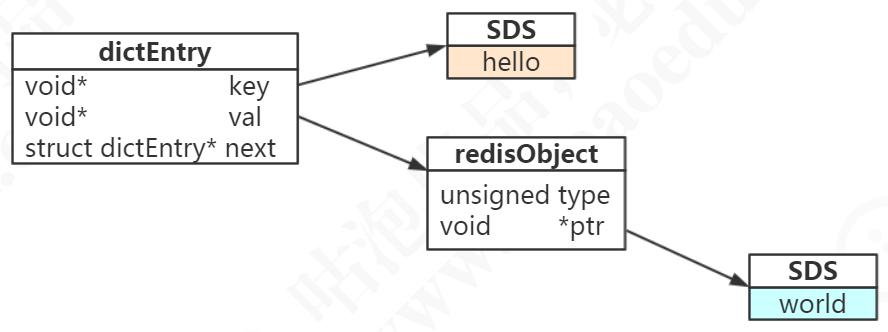
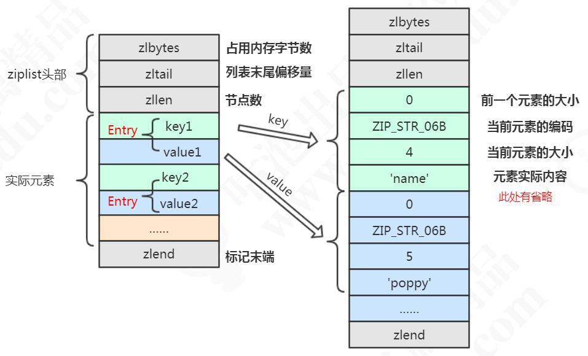

# Redis定位与特性

## SQL 与 与  NoSQL

在绝大部分时候，我们都会首先考虑用关系型数据库来存储我们的数据，比如SQLServer，Oracle，MySQL 等等。

关系型数据库的特点：
1、它以表格的形式，基于行存储数据，是一个二维的模式。
2、它存储的是结构化的数据，数据存储有固定的模式（schema），数据需要适应
表结构。
3、表与表之间存在关联（Relationship）。
4、大部分关系型数据库都支持 SQL（结构化查询语言）的操作，支持复杂的关联查
询。
5、通过支持事务（ACID 酸）来提供严格或者实时的数据一致性。
但是使用关系型数据库也存在一些限制，比如：

1、要实现扩容的话，只能向上（垂直）扩展，比如磁盘限制了数据的存储，就要扩
大磁盘容量，通过堆硬件的方式，不支持动态的扩缩容。水平扩容需要复杂的技术来实
现，比如分库分表。
2、表结构修改困难，因此存储的数据格式也受到限制。
3、在高并发和高数据量的情况下，我们的关系型数据库通常会把数据持久化到磁盘，
基于磁盘的读写压力比较大。
为了规避关系型数据库的一系列问题，我们就有了非关系型的数据库，我们一般把
它叫做“non-relational”或者“Not Only SQL”。NoSQL 最开始是不提供 SQL 的数
据库的意思，但是后来意思慢慢地发生了变化。

非关系型数据库的特点：
1、存储非结构化的数据，比如文本、图片、音频、视频。
2、表与表之间没有关联，可扩展性强。
3、保证数据的最终一致性。遵循 BASE（碱）理论。 Basically Available（基本
可用）； Soft-state（软状态）； Eventually Consistent（最终一致性）。
4、支持海量数据的存储和高并发的高效读写。
5、支持分布式，能够对数据进行分片存储，扩缩容简单。
对于不同的存储类型，我们又有各种各样的非关系型数据库，比如有几种常见的类
型：
1、KV 存储，用 Key Value 的形式来存储数据。比较常见的有 Redis 和
MemcacheDB。
2、文档存储，MongoDB。
3、列存储，HBase。
4、图存储，这个图（Graph）是数据结构，不是文件格式。Neo4j。
5、对象存储。
6、XML 存储等等等等。
这个网页列举了各种各样的 NoSQL 数据库 http://nosql-database.org/ 。
NewSQL 结合了 SQL 和 NoSQL 的特性（例如 PingCAP 的 TiDB）

## Redis的特性

（1）更丰富的数据类型
（2）进程内跨进程；单机与分布式
（3）功能丰富；持久化机制，过期策略
（4）支持多种编程语言
（5）高可用，集群

# Redis基本数据类型

# String

可以用来存储字符串、整数、浮点数

## 操作命令

设置多个值（批量操作，原子性）
mset qingshan 2673 jack 666

设置值，如果 key 存在，则不成功
setnx qingshan

基于此可实现分布式锁。用 del key 释放锁。
但如果释放锁的操作失败了，导致其他节点永远获取不到锁，怎么办？
加过期时间。单独用 expire 加过期，也失败了，无法保证原子性，怎么办？多参数
set key value [expiration EX seconds|PX milliseconds][NX|XX]

使用参数的方式
set lock1 1 EX 10 NX

（整数）值递增
incr qingshan
incrby qingshan 100

（整数）值递减
decr qingshan
decrby qingshan 100

浮点数增量
set f 2.6
incrbyfloat f 7.

获取多个值
mget qingshan jack

获取值长度
strlen qingshan

字符串追加内容
append qingshan good

获取指定范围的字符
getrange qingshan 0 8

## 存储实现

set hello word 为例，因为 Redis 是 KV 的数据库，它是通过 hashtable 实现的（我
们把这个叫做外层的哈希）。所以每个键值对都会有一个 dictEntry（源码位置：dict.h），
里面指向了 key 和 value 的指针。next 指向下一个 dictEntry

```
typedef struct dictEntry {
void *key; /* key 关键字定义 */
union {
void *val; uint64_t u64; /* value 定义 */
int64_t s64; double d;
} v;
struct dictEntry *next; /* 指向下一个键值对节点 */
} dictEntry;
```



key 是字符串，但是 Redis 没有直接使用 C 的字符数组，而是存储在自定义的 SDS中。

value 既不是直接作为字符串存储，也不是直接存储在 SDS 中，而是存储在redisObject 中。实际上五种常用的数据类型的任何一种，都是通过redisObject 来存储的

redisObject 定义在 src/server.h 文件中。

```
typedef struct redisObject {
unsigned type:4; /* 对象的类型，包括：OBJ_STRING、OBJ_LIST、OBJ_HASH、OBJ_SET、OBJ_ZSET */
unsigned encoding:4; /* 具体的数据结构 */
unsigned lru:LRU_BITS; /* 24 位，对象最后一次被命令程序访问的时间，与内存回收有关 */
int refcount; /* 引用计数。当 refcount 为 0 的时候，表示该对象已经不被任何对象引用，则可以进行垃圾回收了
*/
void *ptr; /* 指向对象实际的数据结构 */
} robj;
```

## 内部编码

a、int，存储 8 个字节的长整型（long，2^63-1）。
b、embstr, 代表 embstr 格式的 SDS（Simple Dynamic String 简单动态字符串），
存储小于 44 个字节的字符串。
c、raw，存储大于 44 个字节的字符串（3.2 版本之前是 39 字节）。为什么是 39？

问题 1、什么是 SDS？
Redis 中字符串的实现。
在 3.2 以后的版本中，SDS 又有多种结构（sds.h）：sdshdr5、sdshdr8、sdshdr16、sdshdr32、sdshdr64，用于存储不同的长度的字符串，分别代表 2^5=32byte，
2^8=256byte，2^16=65536byte=64KB，2^32byte=4G

```
/* sds.h */
struct __attribute__ ((__packed__)) sdshdr8 {
uint8_t len; /* 当前字符数组的长度 */
uint8_t alloc; /*当前字符数组总共分配的内存大小 */
unsigned char flags; /* 当前字符数组的属性、用来标识到底是 sdshdr8 还是 sdshdr16 等 */
char buf[]; /* 字符串真正的值 */
};
```

问题 2、为什么 Redis 要用 SDS 实现字符串？
我们知道，C 语言本身没有字符串类型（只能用字符数组 char[]实现）。
1、使用字符数组必须先给目标变量分配足够的空间，否则可能会溢出。
2、如果要获取字符长度，必须遍历字符数组，时间复杂度是 O(n)。
3、C 字符串长度的变更会对字符数组做内存重分配。
4、通过从字符串开始到结尾碰到的第一个'\0'来标记字符串的结束，因此不能保
存图片、音频、视频、压缩文件等二进制(bytes)保存的内容，二进制不安全

SDS 的特点：
a、不用担心内存溢出问题，如果需要会对 SDS 进行扩容。
b、获取字符串长度时间复杂度为 O(1)，因为定义了 len 属性。
c、通过“空间预分配”（ sdsMakeRoomFor）和“惰性空间释放”，防止多
次重分配内存。
d、判断是否结束的标志是 len 属性（它同样以'\0'结尾是因为这样就可以使用 C
语言中函数库操作字符串的函数了），可以包含'\0

问题 3、embstr 和 raw 的区别？
embstr 的使用只分配一次内存空间（因为 RedisObject 和 SDS 是连续的），而 raw
需要分配两次内存空间（分别为 RedisObject 和 SDS 分配空间）。
因此与 raw 相比，embstr 的好处在于创建时少分配一次空间，删除时少释放一次
空间，以及对象的所有数据连在一起，寻找方便。
而 embstr 的坏处也很明显，如果字符串的长度增加需要重新分配内存时，整个
RedisObject 和 SDS 都需要重新分配空间，因此 Redis 中的 embstr 实现为只读

问题 4：int 和 embstr 什么时候转化为 raw？
当 int 数 据 不 再 是 整 数 ， 或 大 小 超 过 了 long 的 范 围
（2^63-1=9223372036854775807）时，自动转化为 embstr。
127.0.0.1:6379> set k1 1
OK
127.0.0.1:6379> append k1 a
(integer) 2
127.0.0.1:6379> object encoding k1
"raw"

问题 5：明明没有超过阈值，为什么变成 raw 了？
127.0.0.1:6379> set k2 a
OK
127.0.0.1:6379> object encoding k2
"embstr"
127.0.0.1:6379> append k2 b
(integer) 2
127.0.0.1:6379> object encoding k2
"raw"
对于 embstr，由于其实现是只读的，因此在对 embstr 对象进行修改时，都会先转化为 raw 再进行修改。
因此，只要是修改 embstr 对象，修改后的对象一定是 raw 的，无论是否达到了 44个字节。

问题 6：当长度小于阈值时，会还原吗？
关于 Redis 内部编码的转换，都符合以下规律：编码转换在 Redis 写入数据时完成，且转换过程不可逆，只能从小内存编码向大内存编码转换（但是不包括重新 set）。

问题 7：为什么要对底层的数据结构进行一层包装呢？
通过封装，可以根据对象的类型动态地选择存储结构和可以使用的命令，实现节省空间和优化查询速度

## 应用场景

缓存
数据共享分布式
分布式锁
全局ID
计时器
限流
位统计

# Hash

## 存储类型

包含键值对的无序散列表。value 只能是字符串，不能嵌套其他类型

同样是存储字符串，Hash 与 String 的主要区别？
1、把所有相关的值聚集到一个 key 中，节省内存空间
2、只使用一个 key，减少 key 冲突
3、当需要批量获取值的时候，只需要使用一个命令，减少内存/IO/CPU 的消耗

Hash 不适合的场景：
1、Field 不能单独设置过期时间
2、没有 bit 操作
3、需要考虑数据量分布的问题（value 值非常大的时候，无法分布到多个节点）

## 操作命令

```
hset h1 f 6
hset h1 e 5
hmset h1 a 1 b 2 c 3 d 4


hget h1 a
hmget h1 a b c d
hkeys h1
hvals h1
hgetall h1

key 操作
hget exists h1
hdel h1
hlen h1
```

## 存储原理

Redis 的 Hash 本身也是一个 KV 的结构，类似于 Java 中的 HashMap。外层的哈希（Redis KV 的实现）只用到了 hashtable。

当存储 hash 数据类型时，我们把它叫做内层的哈希。内层的哈希底层可以使用两种数据结构实现：
ziplist：OBJ_ENCODING_ZIPLIST（压缩列表）
hashtable：OBJ_ENCODING_HT（哈希表）

```
127.0.0.1:6379> hset h2 f aaaaaaaaaaaaaaaaaaaaaaaaaaaaaaaaaaaaaaaaaaaaaaaaaaaaaaaaaaaaaaaa
(integer) 1
127.0.0.1:6379> hset h3 f aaaaaaaaaaaaaaaaaaaaaaaaaaaaaaaaaaaaaaaaaaaaaaaaaaaaaaaaaaaaaaaaa
(integer) 1
127.0.0.1:6379> object encoding h2
"ziplist"
127.0.0.1:6379> object encoding h3
"hashtable"
```

### ziplist压缩列表

ziplist 是一个经过特殊编码的双向链表，它不存储指向上一个链表节点和指向下一个链表节点的指针，而是存储上一个节点长度和当前节点长度，通过牺牲部分读写性能，来换取高效的内存空间利用率，是一种时间换空间的思想。只用在字段个数少，字段值小的场景里面

ziplist的内部结构

```
typedef struct zlentry {
unsigned int prevrawlensize; /* 上一个链表节点占用的长度 */
unsigned int prevrawlen; /* 存储上一个链表节点的长度数值所需要的字节数 */
unsigned int lensize; /* 存储当前链表节点长度数值所需要的字节数 */
unsigned int len; /* 当前链表节点占用的长度 */
unsigned int headersize; /* 当前链表节点的头部大小（prevrawlensize + lensize），即非数据域的大小 */
unsigned char encoding; /* 编码方式 */
unsigned char *p; /* 压缩链表以字符串的形式保存，该指针指向当前节点起始位置 */
} zlentry;
```



问题：什么时候使用ziplist存储？
当 hash 对象同时满足以下两个条件的时候，使用 ziplist 编码：
1）所有的键值对的健和值的字符串长度都小于等于 64byte（一个英文字母一个字节）；
2）哈希对象保存的键值对数量小于 512 个

```
hash-max-ziplist-value 64 // ziplist 中最大能存放的值长度
hash-max-ziplist-entries 512 // ziplist 中最多能存放的 entry 节点数量
```

一个哈希对象超过配置的阈值（键和值的长度有>64byte，键值对个数>512 个）时，会转换成哈希表（hashtable）


## 应用场景

# List列表

## 存储类型

## 操作命令

## 存储原理

## 应用场景

# Set集合

## 存储类型

## 操作命令

## 存储原理

## 应用场景

# ZSet有序集合

## 存储类型

## 操作命令

## 存储原理

## 应用场景

