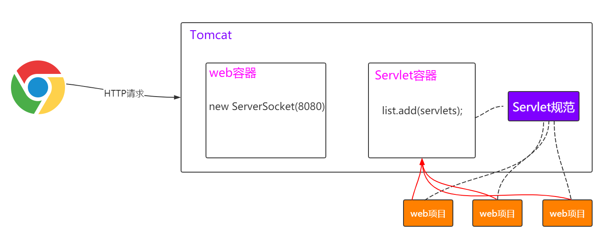
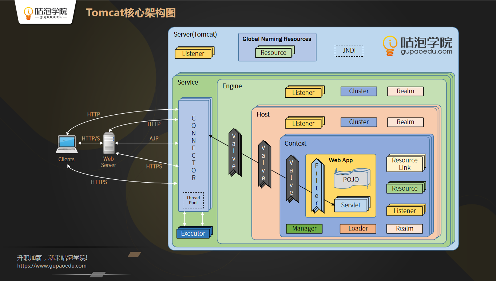
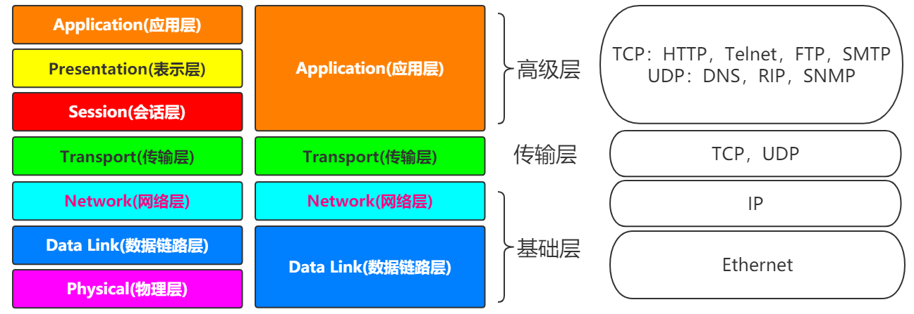
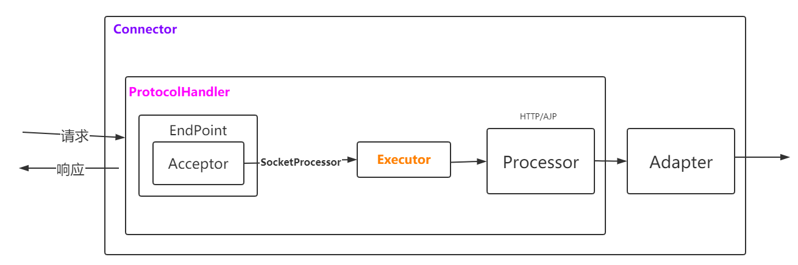

# 设计一个手写的tomcat思路

## 先创建一个Tomcat类

```
class MyTomcat{    

//第一步：用java写的，网络传输就是用socket来弄的
 ServerSocket server=new ServerSocket(8080);
// 等待客户端的连接请求
  Socket socket=server.accept();

// 把请求和响应都封装在业务代码中的servlet
  // 只要把业务代码中一个个servlets添加到tomcat中即可
  list.add(servlets);

}
```

## Servlet容器

如何让Tomcat有serlvet的容器功能，那就是得能够装一个个Servlet

拓展：Servlet是啥？

```
servlet提供的一些接口：
public interface Servlet {
  void init(ServletConfig config) throws ServletException;
  ServletConfig getServletConfig();
  void service(ServletRequest req, ServletResponse res）throws ServletException,
IOException;
  String getServletInfo(); 
  void destroy();
}
```

没有spring mvc的时候，如何开发一个servlet

```
class LoginServlet extends HttpServlet{
  doGet(request,response){}
  doPost(request,response){}
}

<servlet>
   <servlet-name>LoginServlet</servlet-name>
   <servlet-class>com.gupao.web.servlet.LoginServlet</servlet-class>
</servlet>
<servlet-mapping> 
   <servlet-name>LoginServlet</servlet-name>
   <url-pattern>/login</url-pattern>
</servlet-mapping>
```

## 如图：



# 源码

## 产品目录文件含义

（1）bin：主要用来存放命令，.bat是windows下，.sh是Linux下
（2）conf：主要用来存放tomcat的一些配置文件
（3）lib：存放tomcat依赖的一些jar包
（4）logs：存放tomcat在运行时产生的日志文件
（5）temp：存放运行时产生的临时文件
（6）webapps：存放应用程序
（7）work：存放tomcat运行时编译后的文件，比如JSP编译后的文件

## 验证Tomcat是个Servlet容器

```
web项目--->Context标签--->Context.class--->StandardContext--->loadOnStartup()
证明Wrapper就是Servlet ：

加载：ContextConfig.webConfig()—>getContextWebXmlSource()—>Constants.ApplicationWebXml

解析：ContextConfig.webConfig()—>configureContext(webXml)—>context.createWrapper()
```

## Tomcat系统架构图



## 两个核心组件

Connector：主要负责处理Socket连接，以及Request与Response的转化

Container：包括Engine、Host、Context和Wrapper，主要负责内部的处理以及Servlet的管理

### Connector

设计思想 ：高内聚、低耦合

- EndPoint：提供字节流给Processor
  主要负责下面传输层协议的抽象的代码：
  

监听通信端口，是对传输层的抽象，用来实现 TCP/IP 协议的。
对应的抽象类为AbstractEndPoint，有很多实现类，比如NioEndPoint，JIoEndPoint等。在其中有两个组件，一个是Acceptor，另外一个是SocketProcessor。
Acceptor用于监听Socket连接请求，SocketProcessor用于处理接收到的Socket请求。

---


- Processor：提供Tomcat Request对象给Adapter
  
  Processor是用于实现HTTP协议的，也就是说Processor是针对应用层协议的抽象。
  Processor接受来自EndPoint的Socket，然后解析成Tomcat Request和Tomcat Response对象，最后通过Adapter
  提交给容器。
  对应的抽象类为AbstractProcessor，有很多实现类，比如AjpProcessor、Http11Processor等。

---


- Adapter：提供ServletRequest给容器
  ProtocolHandler接口负责解析请求并生成 Tomcat Request 类。
  需要把这个 Request 对象转换成 ServletRequest。
  Tomcat 引入CoyoteAdapter，这是适配器模式的经典运用，连接器调用 CoyoteAdapter 的 sevice 方法，传入的是
  Tomcat Request 对象，CoyoteAdapter 负责将 Tomcat Request 转成 ServletRequest，再调用容器的 service 方
  法

---


# 自定义类加载器

WebAppClassLoader，打破了双亲委派模型：先自己尝试去加载这个类，找不到再委托给父类加载器。
通过复写findClass和loadClass实现


