# UML

统一建模语言（Unified Modeling Language，UML）是一种为面向对象系统的产
品进行说明、可视化和编制文档的一种标准语言，是非专利的第三代建模和规约语言。
UML 使用面向对象设计的的建模工具，但独立于任何具体程序设计语言

# 应用场景

UML 是在开发阶段，说明、可视化、构建和书写一个面向对象软件密集系统的制品的开放方法。最佳的应用是工程实践，对大规模，复杂系统进行建模方面，特别是在软件架构层次，已经被验证有效。统一建模语言（UML）是一种模型化语言。模型大多以图表的方式表现出来。一份典型的建模图表通常包含几个块或框，连接线和作为模型附加信息之用的文本。这些虽简单却非常重要，在 UML 规则中相互联系和扩展。

UML 的目标是以面向对象图的方式来描述任何类型的系统，具有很宽的应用领域。其中最常用的是建立软件系统的模型，但它同样可以用于描述非软件领域的系统，如机械系统、企业机构或业务过程，以及处理复杂数据的信息系统、具有实时要求的工业系统或工业过程等。总之，UML 是一个通用的标准建模语言，可以对任何具有静态结构和动态行为的系统进行建模，而且适用于系统开发的不同阶段，从需求规格描述直至系统完成后的测试和维护

## UML的种类

用例图（Usecase Diagrams）：用来描述用户的需求，从用户的角度描述系统的功能，
并指出各功能的执行者，强调谁在使用系统，系统为执行者完成哪些功能。

类图（Class Diagrams）：用于定义系统中的类。

对象图（Object Diagrams）：是类图的一个实例，描述了系统在具体时间点上所包含的对象以及各个对象之间的关系。

构件图（Component Diagrams）：一种特殊的 UML 图来描述系统的静态实现视图。

部署图（Deployment Diagrams）：定义系统中软硬件的物理体系结构。

状态图（State Chart Diagrams）：用来描述类的对象所有可能的状态以及时间发生时状态的转移条件。

协作图（Collaboration Diagrams）：描述对象之间的合作关系，更侧重和用户对象说明哪些对象有消息的传递。

活动图（Activity Diagrams）：用来描述满足用例要求索要进行的活动以及活动间的约束关系。

时序图（Sequence Diagrams）：描述对象之间的交互顺序，着重体现对象间消息传递的时间顺序，强调对象之间消息的发送顺序，同时显示对象之间的交互过程。

包图（Package Diagrams）：对构成系统的模型元素进行分组整理的图。

组合结构图（Composite Structure Diagrams）：表示类或者构建内部结构的图。

时间图（Timing Diagrams）：用来显示随时间变化，一个或多个元素的值或状态的更改，也显示时控事件之间的交互和管理它们的时间和期限约束。

交互概览图（Interaction Overview Diagrams）：用活动图来表示多个交互之间的控制

# 绘图规范

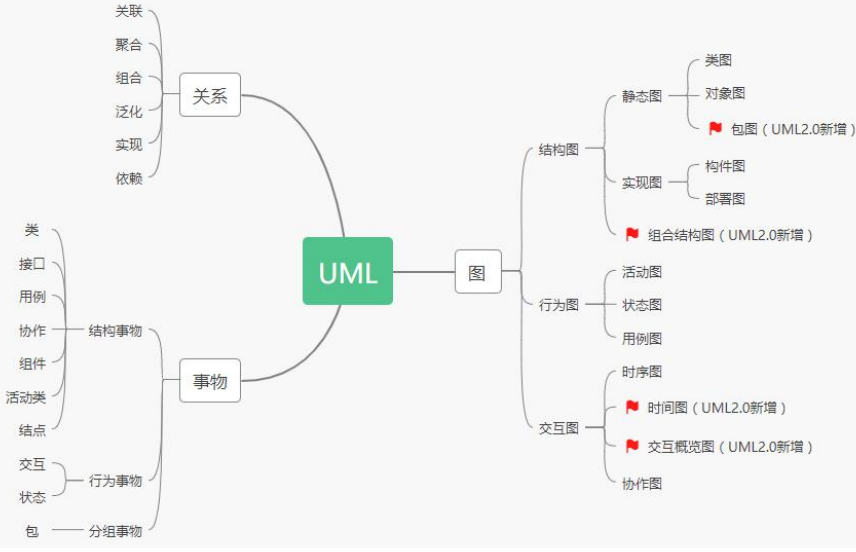

## 事物描述

类（Class）：对一组具有相同属性，方法，关系和语义的对象的描述。

接口（Interface）：描述了一个类或构件的一个服务的操作集。它仅仅是定义了一组操
作的规范，并没有给出这组操作的具体实现（代码）。

用例（Usecase）：是对一组动作序列的描述，系统执行这些动作将产生一个对特定的参与者（Actor）有价值且可观察的结果。

包（Package）：是分组事物中最主要的，是 UML 中唯一的组织机制。

## 事物关系描述

关联（Association）：是一种拥有的关系，具有方向性，如果一个类单方向的访问另一个类，则称为单向关联（用一个箭头的实线表示）；如果两个类对象可以互相访问，则称为双向关联（用两个箭头或不用箭头的实线表示）；一个对象能访问关联对象的数目叫做“多重性”。用带普通箭头的实线表示 ，箭头指向被拥有者，或不用箭头的实线表示
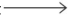

聚合（Aggregate）：是整体与部分的关系。当某个实体聚合成另一个实体时，该实体还可以是另一个实体的部分。
用带空心菱形的实线表示 ，菱形指向整体，箭头指向个体。
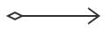

组合（Combination）：整体与部分的关系，组合比聚合更加严格，当某个实体组合成另一个实体时，二者具有相同的生命周期，例如手臂和人之间存在的是组合关系。用带实心菱形的实线表示 ，菱形指向整体，箭头指向个体。
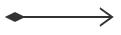

泛化（Generalization）：表示一个更泛化的元素和一个更具体的元素之间的关系，与继
承是同一个概念。用带三角箭头的实线表示 ，箭头指向父类。
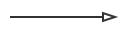

实现（Realization）：类与接口的关系，类实现接口。用带三角箭头的虚线表示 ，箭头指向父接口。
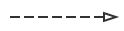

依赖（Dependency）：如果一个类的改动会影响到另一个类，则两个类之间存在依赖关系，一般而言，依赖是单向的。用带普通箭头的虚线表示 ，箭头指向被依赖者
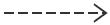

# 类图（Class Diagrams）

在 UML 2.0 的 13 种图形中，类图是使用频率最高的 UML 图之一。类图是描述系统
中的类，以及各个类之间的关系的静态视图。能够让我们在正确编写代码以前对系统有
一个全面的认识。类图是一种模型类型，确切的说，是一种静态模型类型。类图表示类、
接口和它们之间的协作关系，用于系统设计阶段。
类图用三个矩形表示，最上面的部分标识类的名称；中间的部分标识类的属性；最下
面的部分标识类的方法，如下图所示：

+ 表示 public

- 表示 private

#表示 protected

~ 表示 default，可省略不写。
字段和方法返回值的数据类型非必须。
抽象类或抽象方法用斜体表示。
静态类或静态方法加下划线。
如果是接口在类名上方加<`<Interface>`>。
类与类之间的关系主要有六种：关联、聚合、组合、继承、实现和依赖，这六种关系
的箭头表示如下：

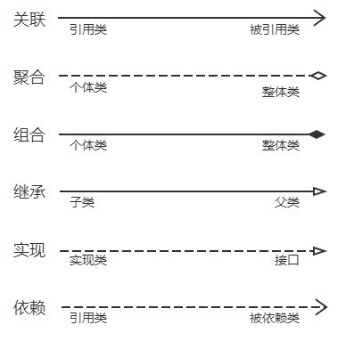

# 时序图（Sequence Diagrams）

时序图描述对象之间消息的发送顺序，强调时间顺序。时序图是一个二维图，横轴表示对象，纵轴表示时间，消息在各对象之间横向传递，依照时间顺序纵向排列。用箭头表示消息、用竖虚线表示对象生命线。

## 时序图的作用

1、展示对象之间交互的顺序。将交互行为建模为消息传递，通过描述消息是如何在
对象间发送和接收的来动态展示对象之间的交互；
2、相对于其他 UML 图，时序图更强调交互的时间顺序；
3、可以直观的描述并发进程

## 时序图组成元素

### 角色（Actor）

系统角色，可以是人、机器、其他系统、子系统；在时序图中用表示。

### 对象（Object）

1、对象的三种命名方式
第一种方式包括对象名和类名，例如：直播课时:课时，在时序图中，用“对象：类”
表示

第二种方式只显示类名，即表示它是一个匿名对象，例如： :课程；在时序图中，用
“：类”表示

第三种方式只显示对象名不显示类名，例如：讲师；在时序图中，用“对象”表示。

2、命名方式的选择
三种命名方式均可，哪种最容易让阅读该时序图的人理解，就选择哪种。

3、对象的排列顺序
对象的左右顺序并不重要，但是为了作图清晰整洁，通常应遵循以下两个原则：把交
互频繁的对象尽可能的靠拢；把初始化整个交互活动的对象放置在最左端。

### 生命线（Lifeline）

在时序图中表示为从对象图标向下延伸的一条虚线，表示对象存在的时间。

### 控制焦点（Focus of Control）

又称为激活期，表示时间段的符号，在这个时间段内对象将执行相应的操作。可以理解为 Java 语言中一对大括号{ }中的内容；用小矩形表示。

### 消息（Message）

消息一般分为同步消息（Synchronous Message），异步消息（AsynchronousMessage）和返回消息（Return Message）。

1、消息的发送者把控制传递给消息的接收者，然后停止活动，等待消息的接收者放
弃或者返回控制。用来表示同步的意义；
2、消息发送者通过消息把信号传递给消息的接收者，然后继续自己的活动，不等待接
受者返回消息或者控制。异步消息的接收者和发送者是并发工作的。
3、返回消息表示从过程调用返回。

### 自关联消息

表示方法的自身调用或者一个对象内的一个方法调用另外一个方法。

### 组合片段

组合片段用来解决交互执行的条件和方式，它允许在序列图中直接表示逻辑组件，用
于通过指定条件或子进程的应用区域，为任何生命线的任何部分定义特殊条件和子进程。
组合片段共有 13 种，名称及含义如下

片段类型 名称 说明
Opt 选项 包含一个可能发生 或可能不发生的序列。可以在临界中指定序列发生的条件。

Alt 抉择 包含-个片段列表,这些片段包含备选消息序列。在任何场合 下只发生一个序
列。
可以在每个片段中设置一个临界来指示该片段可以运行的条件。 else 的临界
指示其他任何临界都不为 True 时应运行的片段。如果所有临界都为 False 并
且没有 else ,则不执行任何片段。

Loop 循环 片段重复一定次数。可以在临界中指示片段重 复的条件。

Loop 组合片段具有“Min”和"Max"属性,它们指示片段可以重复的最小和最
大次数。默认值是无限制。

Break 中断 如果执行此片段,则放弃序列的其余部分。可以使用临界来指示发 生中断的条
件。
Par 并行 并行处理。片段中的事件可以交错。

Critical 关键 用在 Par 或 Seq 片段中。指示此片段中的消息不得与其他消息交错。

Seq 弱顺序 有两个或更多操作数片段。涉及同一生命线的消息必须以片段的顺序发生。如
果消息涉及的生命线不同 ,来自不同片段的消息可能会并行交错。

Strict 强顺序 有两个或更多操作数片段。这些片段必须按给定顺序发生。

Consider 考虑 指定此片段描述的消息列表。其他消息 可发生在运行的系统中,但对此描述来
说意义不大。
在"Messages"属性中键入该列表。

Ignore 忽略 此片段未描述的消息列表。这些消息可发生在运行的系统中 ，但对此描述来说
意义不大。
在"Messages"属性中键入该列表。

Assert 断言 操作数片段指定唯一有效的序列。 通常用在 Consider 或 Ignore 片段中。
Neg 否定 此片段中显示的序列不得发生。通常用在 Consider 或 Ignore 片段中

### 常用组合片段举例：

用来指明在两个或更多的消息序列之间的互斥的选择，相当于经典的 if..else..
1、抉择（Alt）
抉择在任何场合下只发生一个序列。 可以在每个片段中设置一个临界来指示该片段
可以运行的条件。else 的临界指示其他任何临界都不为 True 时应运行的片段。如果所
有临界都为 False 并且没有 else，则不执行任何片段。

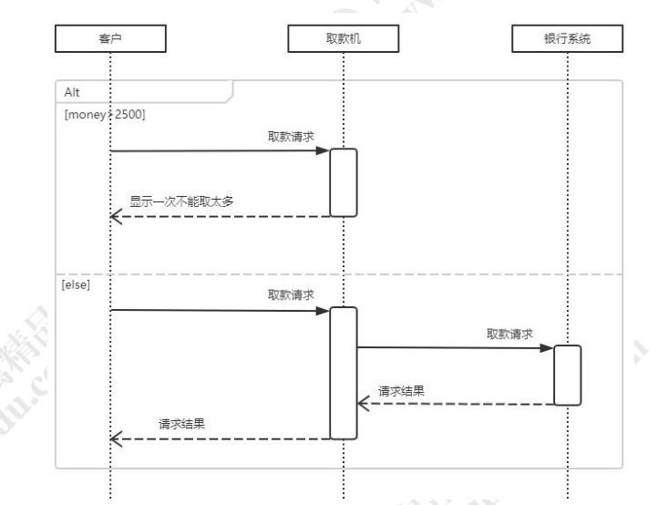

2、选项（Opt）
包含一个可能发生或不发生的序列；
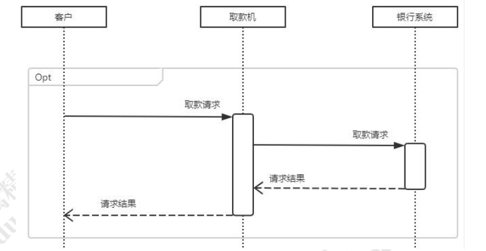

3、循环（Loop）
片段重复一定次数，可以在临界中指示片段重复的条件
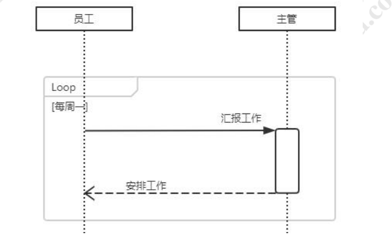

4、并行（Par）
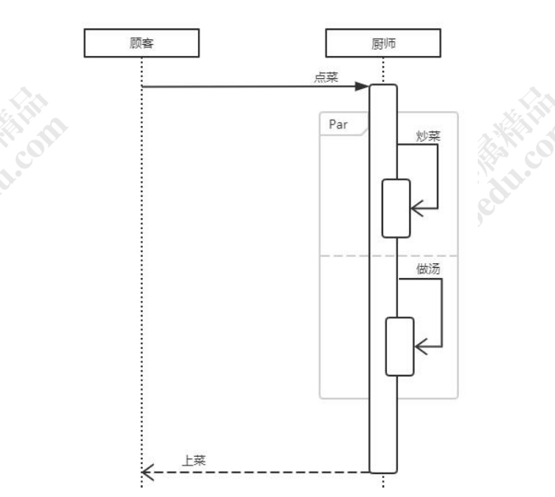
