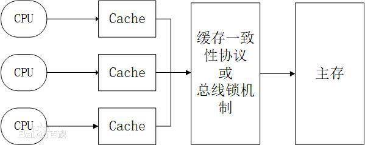
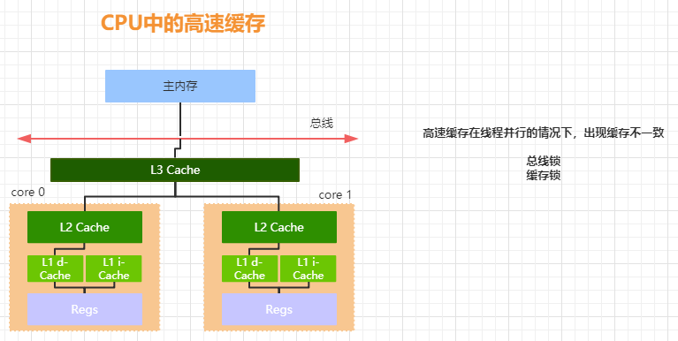
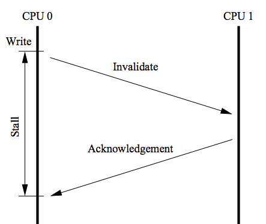
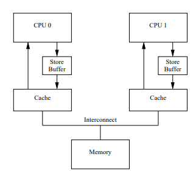
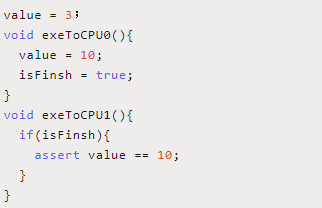
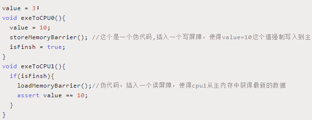

# 初步认识volatile

- 保证可见性

# 如何保证

- 硬件层面
- JMM层面

# 从硬件层面了解可见性本质

CPU和主存之间的模型

## CPU高速缓存

## 缓存一致性的问题

增加CPU高速缓存会带来缓存一致性的问题

比如，CPU要从主存中读取i=0，然后更新i=1，此时如果一个CPU已经更新i=1，但是还没有更新到主存中，而另一个CPU则读取i的值，这个时候就会读到i=0，从而引发缓存一致性的问题

## CPU层面解决缓存一致性问题

- 总线锁 锁住总线
- 缓存锁 缓存一致性协议（MESI）

## 缓存一致性协议（MESI）

- M(Modify) 表示共享数据只缓存在当前 CPU 缓存中，
  并且是被修改状态，也就是缓存的数据和主内存中的数
  据不一致
- E(Exclusive) 表示缓存的独占状态，数据只缓存在当前
  CPU 缓存中，并且没有被修改
- S(Shared) 表示数据可能被多个 CPU 缓存，并且各个缓
  存中的数据和主内存数据一致
- I(Invalid) 表示缓存已经失效

## MESI带来的问题

CPU还是有阻塞，也就是CPU资源利用存在不完整，CPU通知其他的CPU需要时间和应答，这个时间段是阻塞的

如Stall这段时间就是阻塞的

## 如何解决上面的问题

- 引入store bufferes

  

  - CPU0 只需要在写入共享数据时，直接把数据写入到 store bufferes 中，同时发送 invalidate 消息，然后继续去处理其
    他指令。当收到其他所有CPU发送了invalidate acknowledge消息时，再将 store bufferes 中的数据数据存储至 cache line
    中。最后再从缓存行同步到主内存

## 又可能带来CPU的乱序问题

如下图

CPU1执行完有可能是isFinish =true，而assert value==10 为false ,在isFinish =true更新到主存之后还没有更新到主存

## 如何解决

- 内存屏障（解决可见性问题）

  
- CPU提供三种屏障：读屏障，写屏障，全屏障

# 什么是JMM

可见性问题根本原因：高速缓存、重排序

JMM最核心的价值是解决有序性和可见性

## 如何解决有序性和可见性

可能重排序的情况

不管你怎么排序，对于单个线程的执行结果不能变

如果存在重排序的情况，JMM提供了下面两种内存屏障（编译器级别、CPU层面）

# Happens-Before的原则

A Happens-Before B A的操作对于B是可见

## 哪些操作会建立Happens-Before规则

- 程序的顺序规则
- volatile规则
- 传递性规则
- start原则
- join原则
- synchronized监视器规则
