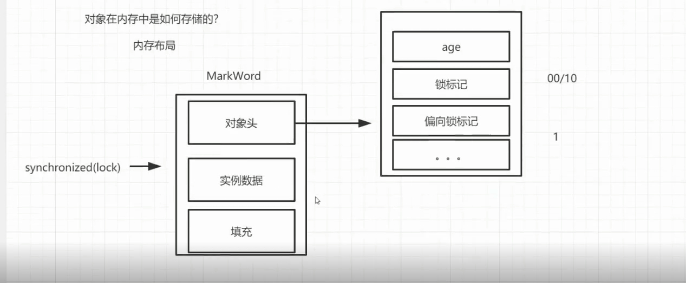
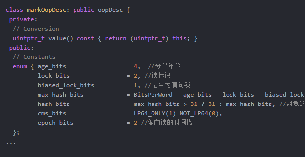
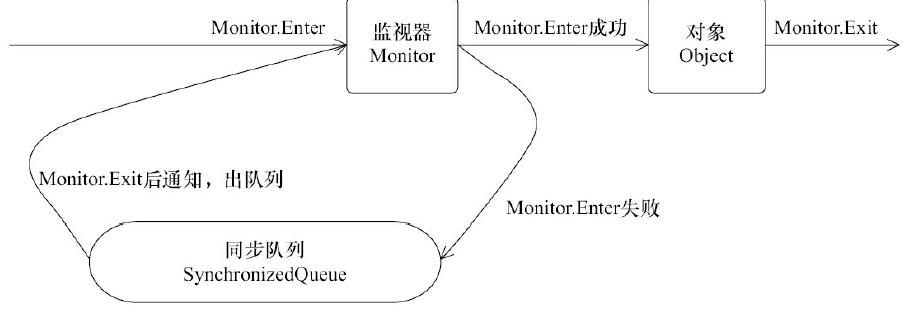
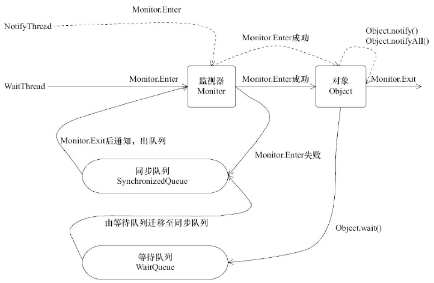

# 线程安全性

本质是指，管理对于数据状态的访问

# Synchronized的基本语法

- 修饰实例方法
- 修改静态方法
- 修饰代码块

# Mark Word



（锁对象存在一个对象头，存放对象锁的标记这些信息）



在 Hotspot 中，markOop 的定义在 markOop.hpp 文件

# 锁的升级状态

- 假如两个线程ThreadA和ThreadB
- 只有ThreadA去访问（大部分情况是这样）-> 引入偏向锁（无锁）
- ThreadA和ThreadB交替访问 -> 轻量级锁 自旋（无锁）
- 多个线程同时访问 -> 阻塞

PS：为什么会有锁的升级状态

- 因为JVM不知道他们是怎么样的，所以逐步来升级加锁，因为加锁会导致串行化，导致性能降低，所以把应用场景进行分析，从而才衍生出锁的升级状态

# 偏向锁的获取和撤销


# 轻量级锁的获取和撤销

、

- 自旋

  ```
  for(;;){
  }
  ```

  - 主要用于绝大部分线程在获得锁之后，非常短的时间内会释放锁
  - 自旋会占用CPU资源，所以在指定的自旋次数之后，如果还咩有获得轻量级锁，锁膨胀成重量级锁-> 阻塞+

# 重量级锁

自旋指定次数或者指定时间之后，还获取不到锁，就要阻塞成BLOCKED状态



# wait/notify

- wait的两个作用
  （1）实现线程的阻塞
  （2）释放当前的同步锁
- 
- wait：表示持有对象锁的线程 A 准备释放对象锁权限，释放 cpu 资源并进入等待状态。(第一个是实现线程的阻塞，会释放当前的锁)
- notify：表示持有对象锁的线程 A 准备释放对象锁权限，通知 jvm 唤醒某个竞争该对象锁的线程 X。线程 A synchronized 代码执行结束并且释放了锁之后，线程 X 直接获得对象锁权限，其他竞争线程继续等待(即使线程 X 同步完毕，释放对象锁，其他竞争线程仍然等待，直至有新的 notify ,notifyAll 被调用)。
- notifyAll：notifyall 和 notify 的区别在于，notifyAll 会唤醒所有竞争同一个对象锁的所有线程，当已经获得锁的线程A 释放锁之后，所有被唤醒的线程都有可能获得对象锁权限需要注意的是：三个方法都必须在 synchronized 同步关键字 所 限 定 的 作 用 域 中 调 用 ， 否 则 会 报 错
  java.lang.IllegalMonitorStateException ，意思是因为没有同步，所以线程对对象锁的状态是不确定的，不能调用这些方法。另外，通过同步机制来确保线程从 wait 方法返回时能够感知到感知到 notify 线程对变量做出的修改
