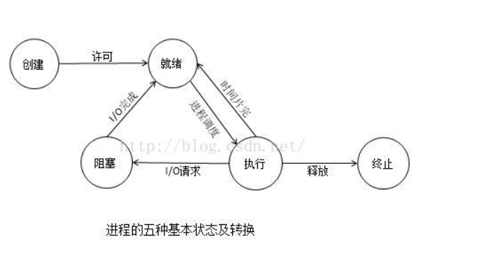
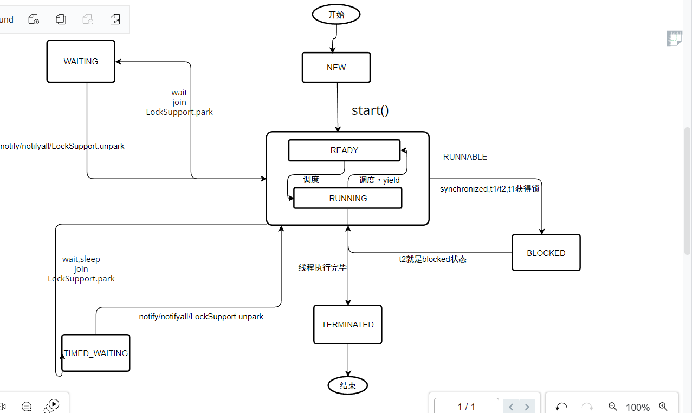

# 进程

为啥会出现进程，核心就是为了充分利用CPU的资源，简单来说就是不能让CPU偷懒

本质：是一个正在执行的程序，是一种概念

# 进程的生命周期

# 线程

何为线程：简单点来说，就是轻量级的进程，这里的轻量级，指的是，切换线程等系统开销会比进程更小

# JAVA中如何使用线程（线程创建（4种）

- 继承Thread类

Thread 类本质上是实现了 Runnable 接口的一个实例

- 实现Runnable接口
- 实现Callable接口
- 通过线程池来创建

# 实际应用

- 清算系统对账文件跑批

# 线程生命周期（6个）

- NEW
- RUNNABLE
- TERMINATED
- BLOCKED
- WAITING
- TIMED_WAITING
- ## 关系图

  
