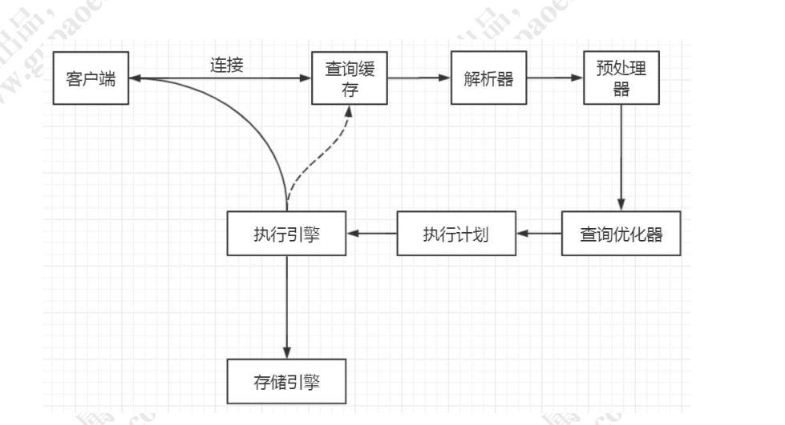
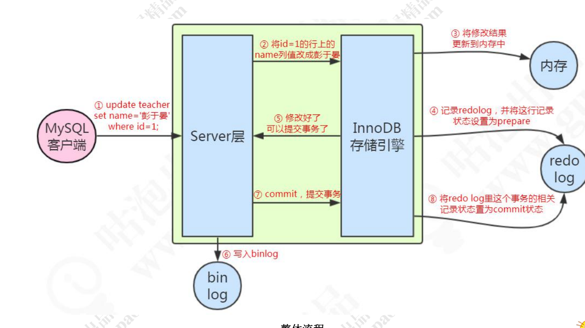
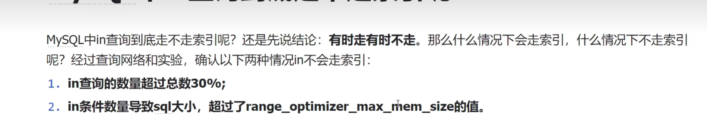
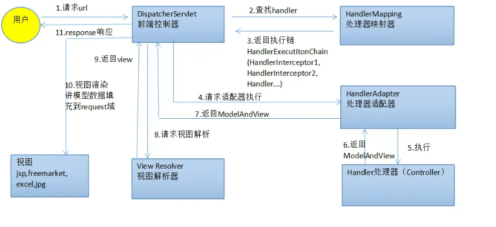

# 自我介绍
毕业于xxx,至今为止已经有4年多的Java开发经历，第一段工作经历在大学毕业后在一家通信公司做维护一些网络设备系统的Java开发，目前是在xxx做Java开发，在这公司的前两年主要是负责xx的开发，去年开始主要负责xxxx以及xxx的相关工作
（亮点）0.

# 项目中你有遇到什么困难吗

## 1. 技术上

* 接口的处理事统一的办法，流程上是一样的，但是返回的信息是不同的，不同公司对接返回的数据格式是不一样的，要怎么做统一的脱敏，而且还有标准格式，如本地风险名单导入的表固定字段的脱敏

用到了一个策略的模式，以及一个Spring AOP的来实现
注意，**这里提到了Spring 的AOP**，则下面可能会那Spring AOP是什么，引导他说SpringAOP的知识

* 计价系统的查询语句，查询应收台账的语句，设计到了商户表，结算表，应收台账表是大表，数据量大概在100W左右，项目中原先是直接用left join大表，导致查询是真的慢，后面经过优化，就快很多了，开启了慢SQL查询，然后发现in在某种状态下失效了，没走索引，SQL怎么优化，索引失效的场景，**SQL优化**

具体是怎么优化的

补充具体是怎么优化的

这里就要开始衔接**SQL优化知识**了，顺便可以提一嘴MySQL的知识

* 安巽一个开卡值分数查询，返回的结果是会主动通知我们，通过一个银杏盾的黑名单接口、持卡数，安巽开卡风险值，来计算出总分
多线程的一个去同时请求，用一个FutureTask函数去等待所有的值返回，异步通知的话，用到了一个获取spring 容器的办法  

这里就要引出**多线程、线程池,FutureTask知识**的知识了

获取spring的一些容器的办法

*  比如说，有两个相同的流程是吧，都要同步成功，这涉及到了一个Spring事务的控制和配置
这里就要衔接上**Spring事务**上的一些东西了

* 用了自钳的缓存，但是存在一定的不一致，体现就是一些权限的东西会提示找不到，排查原来是分布式系统的session不一致
**redis中来解决分布式session不一致**的问题，最终用redis来解决这个问题

* 自建数据库用了redis缓存，然后有缓存不一致的问题，更新的试试，出现过一些，然后现在采用的是先更新数据库，然后删除缓存的方式来解决这样的问题，**缓存的一致性问题**

* 巡检的时候，用了一些jvm的调优办法

## 2. 业务上
1. 排查线上问题，要多沟通
1. 多个任务并行，如何解决  
主要体现一个沟通能力上
1. vue的学习，成本，如何沟通，这也是一个问=

# Java基础
## 1. 算法模块
* Map

[HashMap的扩容流程](https://www.bilibili.com/video/BV14r4y1R7e6/?spm_id_from=333.337.search-card.all.click&vd_source=cd79a2b02db95ba02d1b97fa5ab2fceb)

从map->concurrentHashmap,会处在什么问题，就是说为啥需要用到concurrenthashmap

[ConcurrenthashMap为啥不能插入null](https://www.bilibili.com/video/BV1SG411P7E9/?spm_id_from=333.337.search-card.all.click&vd_source=cd79a2b02db95ba02d1b97fa5ab2fceb)

[ConcurrentHashMap](https://www.bilibili.com/video/BV1q541127Bk/?spm_id_from=333.337.search-card.all.click&vd_source=cd79a2b02db95ba02d1b97fa5ab2fceb)

                              1. 7                     1.8 
         HashMap             数组+链表            数组+链表+红黑树
    ConcurrentHashMap        Segment（ReentrantLock）    Synchronized+CAS

这里可以衔接什么事**ReentrantLock和synchronized和CAS**是什么

多线程下，jdk1.7的环状原因是因为
[1.7hashmap多线程下的扩容的环状](https://www.bilibili.com/video/BV1n541177Ea/?spm_id_from=333.337.search-card.all.click)

## 红黑树
**自平衡的二叉查找树**
- 特点：
1.顶部是黑色
2.不是红就是黑，节点非黑即红
3.任意节点到他的叶子节点或者空子节点的，拥有相同的黑色节点数量

## 2. 输入输出流
### 2.1. Java常见IO流
[Java IO流详解（六）----转换流（字节流和字符流之间的转换）](https://www.cnblogs.com/tanghaorong/p/12363660.html)

[输入输出流(I/O流)的全面总结+图解](https://blog.csdn.net/m0_46202073/article/details/107336988)

### 2.2. BIO、NIO 、AIO

## 3. 线程方面

### 3.1. 线程池队列

### 3.2. AQS
### 3.3. AQS是什么
例如： FutureTask的底层AQS来实现的
reentranctLocK的底层也是AQS来实现的
AQS是什么东西
是一个同步工具，里面维护一个FIFO的双向链表
### 3.4. CLH算法是什么东西

### 3.5. CAS是什么东西
* [ ] CAS的底层是什么
硬件实现,就是传统意义上的乐观锁
比较并更新 
* 带来什么问题：
[ABA问题]([CAS和ABA问题](https://juejin.cn/post/7084713323802918926))
### 3.6. Synchronized和reentranlock有什么区别
[Synchronize和ReentrantLock区别](https://juejin.cn/post/6844903695298068487)
### 3.7. 同步块和同步方法，哪个比较好，为啥

## 4. 基础数据值
### 4.1. 字符常量操作
【字符量操作】
[字符常量操作](https://juejin.cn/post/6921203263056379912#heading-2)

### 4.2. 如何拆箱

## 5. 问题排查
### 5.1. CPU飙高怎么排查
[CPU飙高](https://zhuanlan.zhihu.com/p/304998240)

### 5.2. http状态码
[http状态码](https://cloud.tencent.com/developer/article/1688459)

# JVM
## 1. Java文件 到 class文件
一组以8位字节为单位的二进制流（无符号数+表 无符号数或者其他表作为数据项的数据结构）

## 2. 分区
堆区
方法区
程序计数器
虚拟机栈
本地方法区栈

## 3. 类加载机制
1. 装载
1. 链接
验证
准备  （静态变量初始化默认值）
解析 （符号引用变成直接引用）
1. 初始化
1. 使用
1. 卸载
- 双亲委派模式
- 如何破坏
重新loadClass方法

- S区或者S0 、S1的为了什么
解决一个空间碎片不连续的问题

## 5.垃圾回收 
- 垃圾回收器有哪些，分别说一下
CMS
Parallel Scavenge
Parallel Old
G1

-  垃圾判断
可达性分析（GCroot  常量，静态变量）
计数引用法

## 6. JVM调优

# MySQL
## 一条SQL如何查询

## 一条SQL如何更新

## 1. 索引
### 1.1. 你说到了MySQL数据库的索引，说一下，什么是索引
索引是一种数据结构，就是一个类似B+树的数据结构，那有什么用呢，当然是加快查询

### 1.2. 那有什么分类吗

主键索引，聚簇索引（主键的逻辑顺序和物理顺序一致），覆盖索引（查自己的字段）

### 1.3. 能列举几种索引失效的情景吗

（1）Like

（2）比如建立在性别这些重复值高的字段上

（3）最左匹配原则导致失效

（4）函数导致的索引失效，where之前还是之后，那必须是之后

（5）IS NULL不走索引，IS NOT NULL走索引
[IS NULL、IS NOT NULL](https://juejin.cn/post/6844903921450745863)

（6）使用了使用!= 或 <>来查询条件
（7）**in 走不走索引，什么情况下走索引**
                                                                                                                                                                                                                                                                                                                                                                                                                                                                                                                                                                                                                                                                                                                                                                                                                                                                                                                                                                                                                                                                                                                                                                                                                                                                                                                                                                                                                                                                                                                                                                                                                                                                                                                                                                                                                                                                                                                                                                                                                                                                                                                                                                                                                                                                                                                                                                                                                                                                                                                                                                                                                                                                                                                                                                                                                                                                                                                                                                                                                                                                                                                                                                                                                                                                                                                                                                                                                                                                                                                                                                                                                                                                                                                                                                                                                                                                                                                                                                                                                                                                                                                                                                                                                                                                                                                                                                                                                                                                                                                                                                                                                                                                                                                                                                                                                                                                                                                                                                                                                                                                                                                                                                                                                                                                                                                                                                                                                                                                                                                                                                                                                                                                                                                                                                                                                                                                                                                                                                                                                                                                                                                                                                                                                                                                                                                                                                                                                         W
### 1.4. 那最左匹配原则是什么呢，举个例子

比如（a b c作为联合索引，那a b 作为值（顺序如果有的颠倒，优化器会优化，依旧走索引）是能走索引的，但是如果A c作为条件来查，则得全表扫描，查找不到类似的索引

### 1.5. 索引下推
[索引下推](https://www.bilibili.com/video/BV1f14y1Q7Zz/?spm_id_from=333.337.search-card.all.click&vd_source=cd79a2b02db95ba02d1b97fa5ab2fceb)

[索引下推](https://www.cnblogs.com/three-fighter/p/15246577.html)
### 记录锁、间隙锁与临键锁
[记录锁、间隙锁与临键锁](https://juejin.cn/post/6844903666420285454)
## 日志
redo log   （持久性）物理日志 48M  覆盖
undo log （原子性）逻辑日志
binlog   主从复制 逻辑日志
## 锁
## 如何优化

## 7. MySQL的事务
### 7.1. 什么是脏读、不可重复读、幻读7.1. 脏读：A事务读，B事务更新后回滚
不可重复读：

## 8. mysql的in走不走索引

### 8.1. MySQL的事务是什么，哪个引擎支持
# Redis

## 1. redis常见的数据结构及底层实现
字符串： int SDS raw
hash：ziplist(压缩列表，特殊编码的双向链表，上一个节点的长度和当前节点的长度)  hashtable
list: ziplist quicklist（每个节点都是一个ziplist）
set: intset  hashtable
zset: ziplist skiplist

## 2. 缓存击穿、缓存雪崩、缓存穿透
[缓存雪崩和缓存击穿](https://xiaolincoding.com/redis/cluster/cache_problem.html#redis-故障宕机)

## 3. 水平分库分表，垂直分库分表
[分库分表](https://zhuanlan.zhihu.com/p/98392844)
[MySQL垂直分库，水平分库，垂直分表，水平分表
](https://cn.pingcap.com/article/post/4517.html)

## 缓存一致性方案

## Redis的线程模型
[Redis的线程模型](https://juejin.cn/post/6844903970511519758)

## 5. MySQL在什么情况下需要加索引

# Spring
## 1. 基础定义
### 1.1. 什么是Spring

从字面上来理解，spring 是春天的意思，为啥叫春天，我觉得可以理解为软件开发者的春天或者是Java的春天，因为Spring 给 开发者提供了IOC。AOP等功能来创建和管理你所需要的对象，能帮助你简化开发，也是现在企业级的开发的根基

### 1.2. Spring AOP 和IOC是什么
aop 面向切面编程

ioc 控制反转

#### 1.2.1. 切点、切面、连接点、通知，织入是什么

切点：（pointCut）具体要拦截的方法的集合，由多个连接点组成

切面，具体就是一个类，比如说一个日志功能，就是一个切面，文字好听点就是说是一组相同规则的方法

通知：前置通知、环绕通知等，具体的方法

## 2. Spring 事务

### 2.1. Spring事务
[Spring 事务](https://www.cnblogs.com/chanshuyi/p/head-first-of-spring-transaction.html)

[Spring 事务](https://juejin.cn/post/6844903608224333838#heading-1)

这里可以跟**MySQL的事务**进行关联

### 2.2. Spring事务的传播性

### 2.3. 既然说到Spring事务了，可能接下来就是问分布式事务
待补充

## 3. Spring Bean的周期怎么样的
[Springbean的生命周期](https://juejin.cn/post/7075168883744718856)

### 3.1. Spring 的作用域是怎么样的
## 4. Spring MVC
### 4.1. Spring MVC的大致流程

## 5. 常见的注解有哪些

## 6. 三级缓存
[Spring中的三级缓存](https://www.bilibili.com/video/BV17Z4y117MP/?spm_id_from=333.337.search-card.all.click&vd_source=cd79a2b02db95ba02d1b97fa5ab2fceb)

[Spring的三级缓存](https://juejin.cn/post/6882266649509298189)
我们可以知道 Spring 在实例化对象的之后，就会为其创建一个 Bean 工厂，并将此工厂加入到三级缓存中。
因此，Spring 一开始提前暴露的并不是实例化的 Bean，而是将 Bean 包装起来的 ObjectFactory。为什么要这么做呢？
这实际上涉及到 AOP，如果创建的 Bean 是有代理的，那么注入的就应该是代理 Bean，而不是原始的 Bean。但是 Spring 一开始并不知道 Bean 是否会有循环依赖，通常情况下（没有循环依赖的情况下），Spring 都会在完成填充属性，并且执行完初始化方法之后再为其创建代理。但是，如果出现了循环依赖的话，Spring 就不得不为其提前创建代理对象，否则注入的就是一个原始对象，而不是代理对象

[Spring的三级依赖-知乎](https://www.bilibili.com/video/BV1Fa411j7kc/?spm_id_from=333.337.search-card.all.click&vd_source=cd79a2b02db95ba02d1b97fa5ab2fceb)

## BeanFactoryPostProcessor和BeanPostProcessor
[BeanFactoryPostProcessor 和 BeanPostProcessor 有什么区别](https://cloud.tencent.com/developer/article/2327172)

## BeanFactory和ApplicationContext的区别
 [BeanFactory和ApplicationContext的区别](https://juejin.cn/post/6844903877574131726)
# 1. Spring Boot
## Spring Boot是如何自动装载的
[Spring boot是如何自动装载的](https://www.cnblogs.com/uncleyong/p/17067567.html)
## 1.1. Spring Boot的启动流程
[Spring Boot的启动流程](https://cloud.tencent.com/developer/article/1874814)
总结：
两个阶段
第一个阶段：初始化Spring Application，配置一些基本的环境变量、资源、构造器、监听器
第二个阶段：运行SpringApplication的阶段，启动流程监督模块，配置环境加载模块、容器上下文加载模块、freshContext可以刷新上下文应用并进行自动化配置模块加载，也就是上文提到的SpringFactoriesLoader根据指定classpath加载META-INF/spring.factories

这里可以关联起来**Spring 扩展、Spring Boot的扩展，dubbo的SPI**

# MyBatis
[Mybatis是如何进行分页的](https://www.bilibili.com/video/BV1Do4y1M7eo/?spm_id_from=333.337.search-card.all.click&vd_source=cd79a2b02db95ba02d1b97fa5ab2fceb)

# 消息中间件
## 1. RabbitMQ
### 1.1. 什么是RabbitMQ
### 1.2. 优缺点
- 优点
解耦、异步、削峰
- 缺点
系统可用性降低
系统复杂度提高
一致性问题

### 高可用
集群 ->  镜像集群模式
### 一致性（或者幂等性）
多发怎么保证不会重复 -> 数据库最终效果来看，解决方法
全局ID，redis，结合具体的模式 
### 可靠性
生产者（开启事务、confirm模式） -> MQ（持久化） -> 消费（关闭ACK）
### 顺序性
一个队列消费一个最好

## 2. Kafka
### 2.1. 什么是kafka
### 2.2. 优缺点
- 优点
实时计算、日志采集
### 高可用
由多个 broker 组成，每个 broker 是一个节点；你创建一个
topic，这个 topic 可以划分为多个 partition，每个 partition 可以存在于不同的 broker 上，每个
partition 就放一部分数据。
这就是天然的分布式消息队列，就是说一个 topic 的数据，是分散放在多个机器上的，每个
机器就放一部分数据

# 微服务

## 2. Dubbo

## 3. Spring Cloud 

# 容器化
## 1. Docker
## 2. K8s

# 定时任务调度
## 1.1. xxl-job

# Zookeeper

# 你还有什么要问的
技术栈是怎么样的
平时的开发流程是怎么样的
技术难点是什么
对应聘者的期待是什么，这个岗位的具体开发是怎么样的

这个岗位的一个晋升路线是怎么样的
对于5年后的Java人的建议
贵司这个岗位最看重什么呢，需要什么能力

