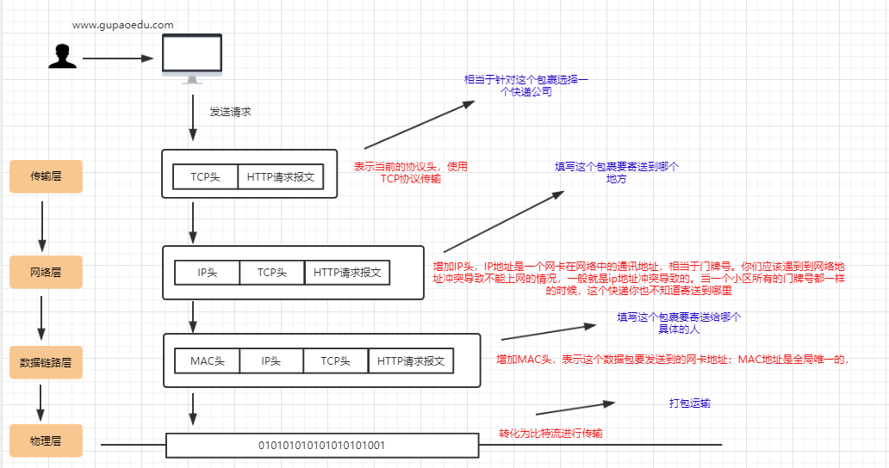
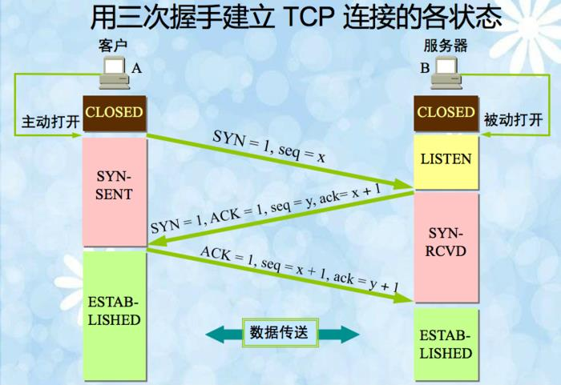
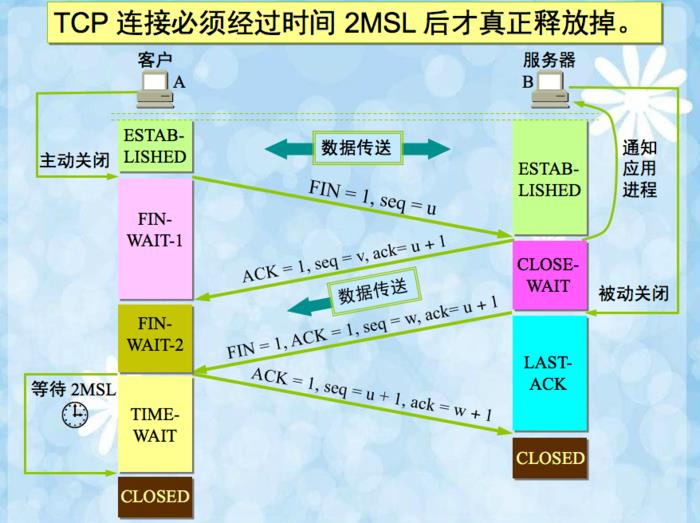
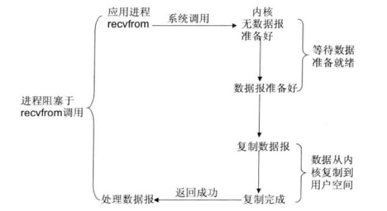
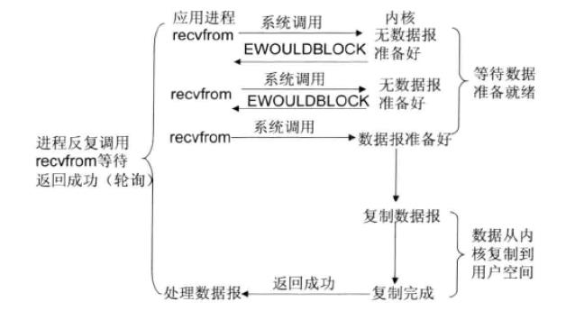

# 一个http请求的完整流程

1.负责域名解析的 DNS  服务
2.加速静态内容访问速度的 CDN
CDN（Content Delivery Network），表示的是内容分发网络。CDN 其实就是一种网络缓存技术，能够把一些相对稳定的资源放到距离最终用户较近的地方，一方面可以节省整个广域网的带宽消耗，另外一方面可以提升用户的访问速度，改进 用户体验。我们一般会把静态的文件（图片、脚本、静态页面）放到 CDN 中

# http通信原理

## 七层

应用层
会话层
表示层
传输层
网络层
数据链路层
物理层

## 四层

应用层
传输层
网络层
数据链路层

## 请求过程

# TCP/IP协议的基本原理

TCP/IP 可靠 （性能比较低）
TCP是通过什么方式来保证可靠性的，就引出下面的三次握手和四次挥手

## 三次握手，四次挥手

三次握手

四次挥手

## 为什么要三次握手和四次挥手

三次握手是因为因为当 Server 端收到 Client 端的 SYN 连接请求报文后，可以直接发送SYN+ACK 报文。其中 ACK 报文是用来应答的，SYN 报文是用来同步的。
但是关闭连接时，当 Server 端收到 FIN 报文时，很可能并不会立即关闭 SOCKET（因为可能还有消息没处理完），所以只能先回复一个 ACK 报文，告诉 Client 端，"你发的 FIN 报文我收到了"。只有等到我 Server 端所有的报文都发送完了，我才能发送 FIN 报文，因此不能一起发送。故需要四步

# IO阻塞

## 什么是滑动窗口协议？它的实现原理是什么？

这个过程中涉及到了 TCP 的滑动窗口协议，滑动窗口（Sliding window）是一种流量控制技
术。早期的网络通信中，通信双方不会考虑网络的拥挤情况直接发送数据。由于大家不知道
网络拥塞状况，同时发送数据，导致中间节点阻塞掉包，谁也发不了数据，所以就有了滑动
窗口机制来解决此问题；发送和接受方都会维护一个数据帧的序列，这个序列被称作窗口

### 发送窗口

就是发送端允许连续发送的幀的序号表。
发送端可以不等待应答而连续发送的最大幀数称为发送窗口的尺寸。

### 接收窗口

接收方允许接收的幀的序号表，凡落在 接收窗口内的幀，接收方都必须处理，落在接收窗口
外的幀被丢弃。
接收方每次允许接收的幀数称为接收窗口的尺寸。

### 在线滑动窗口演示功能

https://media.pearsoncmg.com/aw/ecs_kurose_compnetwork_7/cw/content/interactiveanima
tions/selective-repeat-protocol/index.htm

# IO 

## BIO

前面其实已经简单讲过了阻塞 IO 的原理，我想在这里重申一下什么是阻塞 IO 呢？ 就是当客户端的数据从网卡缓冲区复制到内核缓冲区之前，服务端会一直阻塞。以socket接口为例，进程空间中调用 recvfrom，进程从调用 recvfrom 开始到它返回的整段时间内都是被阻塞的，
因此被成为阻塞 IO 模型

## 非阻塞 IO

