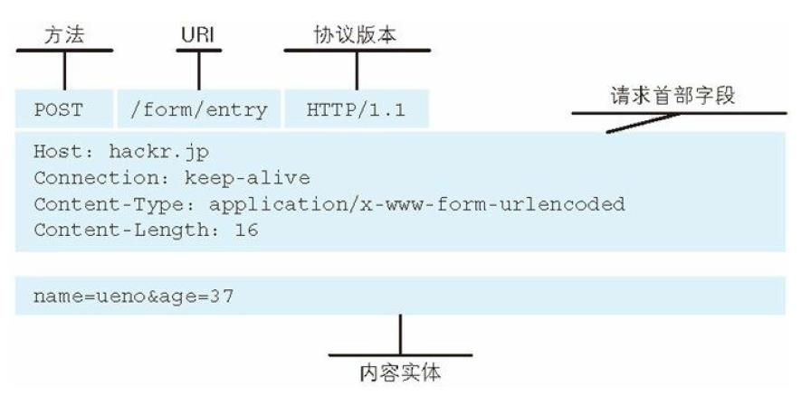
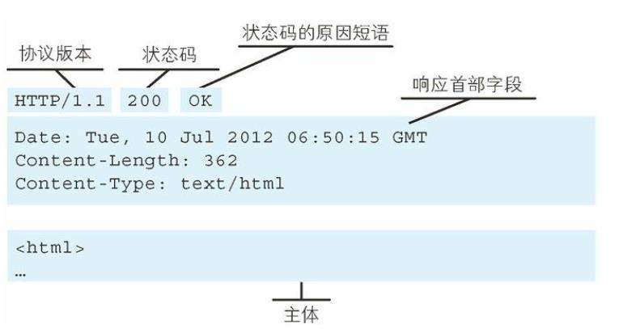
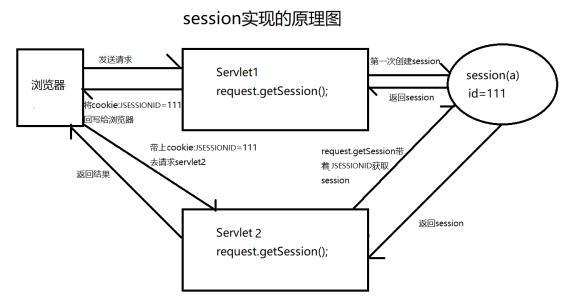

# http通信协议的基本原理分析

## 一次http请求的通信过程

备注：DNS是指将域名解析成IP的服务

# http协议的组成

➢URL (Uniform Resource Locator)，统一资源定位符 ，用于描述一个网络上的资源，具体格式是

```java
http://www.ada.com:80/java/index.html?name=xwn#head
schema://host[:port#]/path/.../?[url-params]#[ query-string]


scheme 指定应用层使用的协议(例如：http, https, ftp)
host HTTP 服务器的 IP 地址或者域名
port# HTTP 服务器的默认端口是 80，这种情况下端口号可以省略。如果使
用了别的端口，必须指明，例如 http://www.cnblogs.com:8080/
path 访问资源的路径
query-string 查询字符串
```

➢ URI 用字符串标识某一互联网资源，而 URL 表示资源的地点（互联网上所处的位置）。可
见 URL 是 URI 的子集。

## MIME Type

服务器根据用户请求的资源找到对应的文件以后，会返回一个资源给到客户端浏览器，浏览
器会对这个资源解析并且渲染。但是服务器上的资源类型有很多，比如图片类型、视频类型、
Js、Css、文本等。浏览器如何识别当前类型做不同的渲染呢？

MIME Type：是描述消息内容类型的因特网标准，常见的几种类型
➢ 文本文件：text/html,text/plain,text/css,application/xhtml+xml,application/xml
➢ 图片文件：image/jpeg,image/gif,image/png.
➢ 视频文件：video/mpeg,video/quicktime
我们可以通过两种方式来设置文件的渲染类型，第一种是 Accept，第二种是 Content-Type

➢ Accept: 表示客户端希望接受的数据类型，即告诉服务器我需要什么媒体类型的数据，此时
服务器应该根据 Accept 请求头生产指定媒体类型的数据

➢ Content-Type: 表 示 发 送 端 发 送 的 实 体 数 据 类 型 ， 比 如 我 们 应 该 写 过 类 似 的 ：
resposne.setContentType(“application/json;charset=utf-8”)的代码，表示服务端返回的数据
格式是 json。如果 Accept 和 Content-Type 不一致，假如说 Accept 要接收的类型是 image/gif，但是服务
端返回的数据是 text/html，那么浏览器将会无法解析。

## 出错

➢  使用状态码进行标记
200：一切正常
301：永久重定向
404：请求资源不存在
500：服务端内部错误

## 告诉服务器端当前请求的意图

➢GET：一般是用于客户端发送一个 URI 地址去获取服务端的资源（一般用于查询操作），Get
不支持的传输数据有限制，具体限制由浏览器决定
➢POST：一般用户客户端传输一个实体给到服务端，让服务端去保存（一般用于创建操作）
➢PUT：向服务器发送数据，一般用于更新数据的操作
➢DELETE：客户端发起一个 Delete 请求要求服务端把某个数据删除（一般用于删除操作）
HEAD:获得报文首部、OPTIONS：询问支持的方法、TRACE：追踪路径、CONNECT：用隧
道协议连接代理

# http的完整组成

➢请求报文格式包含三个部分，（起始行、首部字段、主体）

➢响应的报文格式也是一样，分为三部分


# Http 协议的特点

➢Http  无状态协议

引入cookie和session技术


# https协议原理分析

有可能会被抓包
所以就想起来用了https

https 是一种加密的超文本传输协议，它与 HTTP 在协议差异在于对数据传输的过程中，https对数据做了完全加密。由于 http 协议或者 https 协议都是处于 TCP 传输层之上，同时网络协议又是一个分层的结构，所以在 tcp 协议层之上增加了一层 SSL（Secure Socket Layer，安全层）或者 TLS（Transport Layer Security） 安全层传输协议组合使用用于构造加密通道；

Ssl 是 netscape 公司设计的（Secure sockets layer)，后来互联网标准化组织 ISOC 接替了
NETScape 公司，发布了 SSL 的升级版 TLS。接着 TLS 的版本又进行了多次升级； 实际上我
们现在的 HTTPS 都是用的 TLS 协议，但是由于 SSL 出现的时间比较早，并且依旧被现在浏
览器所支持，因此 SSL 依然是 HTTPS 的代名词。

## HTTPS 申请证书的过程

1. 服务器上生成 CSR 文件（证书申请文件，内容包括证书公钥、使用的 Hash 签名算法、申
   请的域名、公司名称、职位等信息）
2. 把 CSR 文件和其他可能的证件上传到 CA 认证机构，CA 机构收到证书申请之后，使用申请
   中的 Hash 算法，对部分内容进行摘要，然后使用 CA 机构自己的私钥对这段摘要信息进行
   签名（相当于证书的唯一编号）
3. 然后 CA 机构把签名过的证书通过邮件形式发送到申请者手中。
4. 申请者收到证书之后部署到自己的 web 服务器中


