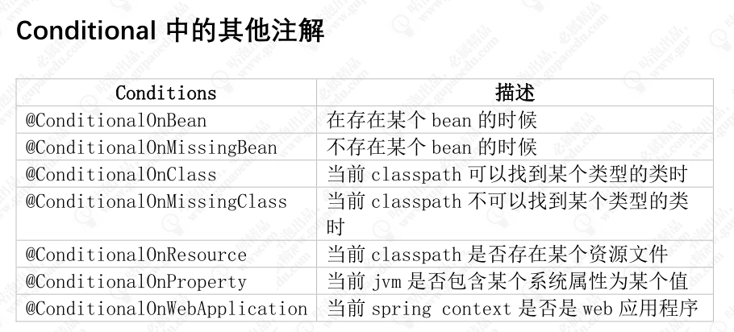

# Spring Boot的基本认识

Spring Boot 框架是为了能够帮助使用 spring 框架的开发者快速高效的构建一个基于 spirng 框架以及 spring 生态体系的应用解决方案。它是对“约定优于配置”这个理念下的一个最佳实践。因此它是一个服务于框架的框架，服务的范围是简化配置文件

## 约定优于配置的体现

（1）maven的目录结构，默认以jar打包，默认有resource目录
（2）spring-boot-starter-web 中默认包含 spring mvc 相关
依赖以及内置的 tomcat 容器，使得构建一个 web 应用
更加简单
（3）默认提供 application.properties/yml 文件
（4）默认通过 spring.profiles.active 属性来决定运行环境时
读取的配置文件
（5）EnableAutoConfiguration 默认对于依赖的 starter 进行
自动装载

# 从注解入手

## @ComponentScan

扫描注解的时候会用到这个

## @Configuration

本质上还是一种IOC的实现（javaConfig）

## @EnableAutoConfiguration

```
@AutoConfigurationPackage
@Import({AutoConfigurationImportSelector.class})
```




