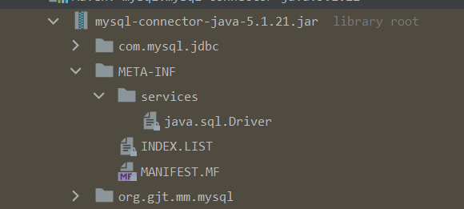

# Java的SPI

了解 Dubbo 里面的 SPI 机制之前，我们先了解下 Java 提供的 SPI（service provider interface）机制，SPI 是 JDK 内置的一种服务提供发现机制。目前市面上有很多框架都是用它来做服务的扩展发现。简单来说，它是一种动态替换发现的机制。举个简单
的例子，我们想在运行时动态给你只需要添加一个实现，然后把新的实现描述给 JDK 知道就行了

需要遵循的标准

（1） 需要在 classpath 下创建一个目录，该目录命名必须是：META-INF/service
（2） 在该目录下创建一个 properties 文件，该文件需要满足以下几个条件
a.文件名必须是扩展的接口的全路径名称
b.文件内部描述的是该扩展接口的所有实现类
c.文件的编码格式是 UTF-8
(3) 通过 java.util.ServiceLoader 的加载机制来发现

例如：


缺点：
（1）JDK 标准的 SPI会一次性加实例化扩展点的所有实现，什意思呢?就是如果你在 META-INF/service 下的文件里面加了N个实现类，那么IDK 启动的时候都会一次性全部加载。那么如果有的扩展点实现初始化很耗时或者如果有些实现类并没有用到。那么会很浪费资源
（2）如果扩展点加载失败，会导致调用方报错，而且这个错误很难定位到是这个原因

## JDBC的SPI源码

找到Driver类：

```
static {
        try {
            DriverManager.registerDriver(new Driver());
        } catch (SQLException var1) {
            throw new RuntimeException("Can't register driver!");
        }
    }
```

初始化静态方法：

```
static {
        loadInitialDrivers();
        println("JDBC DriverManager initialized");
    }
```

loadInitialDrivers初始化

```
private static void loadInitialDrivers() {
        String drivers;
        try {
            drivers = AccessController.doPrivileged(new PrivilegedAction<String>() {
                public String run() {
                    return System.getProperty("jdbc.drivers");
                }
            });
        } catch (Exception ex) {
            drivers = null;
        }
        // If the driver is packaged as a Service Provider, load it.
        // Get all the drivers through the classloader
        // exposed as a java.sql.Driver.class service.
        // ServiceLoader.load() replaces the sun.misc.Providers()

        AccessController.doPrivileged(new PrivilegedAction<Void>() {
            public Void run() {

                ServiceLoader<Driver> loadedDrivers = ServiceLoader.load(Driver.class);
                Iterator<Driver> driversIterator = loadedDrivers.iterator();

                /* Load these drivers, so that they can be instantiated.
                 * It may be the case that the driver class may not be there
                 * i.e. there may be a packaged driver with the service class
                 * as implementation of java.sql.Driver but the actual class
                 * may be missing. In that case a java.util.ServiceConfigurationError
                 * will be thrown at runtime by the VM trying to locate
                 * and load the service.
                 *
                 * Adding a try catch block to catch those runtime errors
                 * if driver not available in classpath but it's
                 * packaged as service and that service is there in classpath.
                 */
                try{
                    while(driversIterator.hasNext()) {
                        driversIterator.next();
                    }
                } catch(Throwable t) {
                // Do nothing
                }
                return null;
            }
        });

        println("DriverManager.initialize: jdbc.drivers = " + drivers);

        if (drivers == null || drivers.equals("")) {
            return;
        }
        String[] driversList = drivers.split(":");
        println("number of Drivers:" + driversList.length);
        for (String aDriver : driversList) {
            try {
                println("DriverManager.Initialize: loading " + aDriver);
                Class.forName(aDriver, true,
                        ClassLoader.getSystemClassLoader());
            } catch (Exception ex) {
                println("DriverManager.Initialize: load failed: " + ex);
            }
        }
    }
```


# Spring的SPI

# Dubbo的SPI


