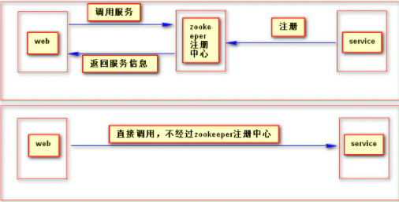

# dubbo直连

概念：什么叫dubbo直连
顾名思义，就是直接链接，即即消费方不通过zookeeper注册中心去调用注册的服务，而是直接绕过zookeeper环节直接调用服务

# 架构模型



# 如何配置（思路）

（1）提供者核心配置
既然不走注册中心了，比如，在Spring Boot项目中，需要把注册中心改成

```
dubbo.registry.address=N/A
```

（2）消费端核心配置
直接把dubbo连接

```
`  @Reference(url = "dubbo://localhost:20880")`
```

