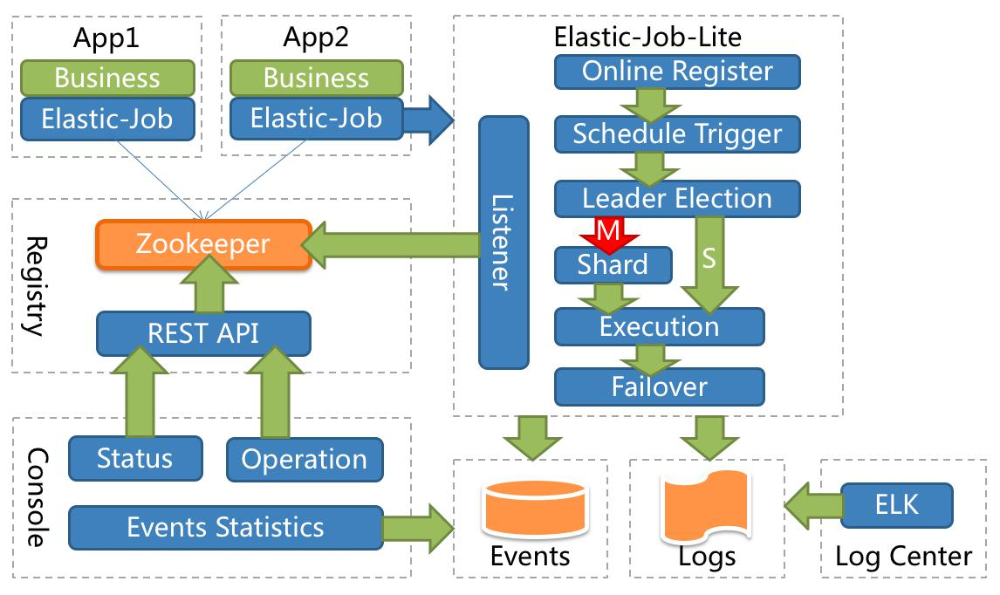
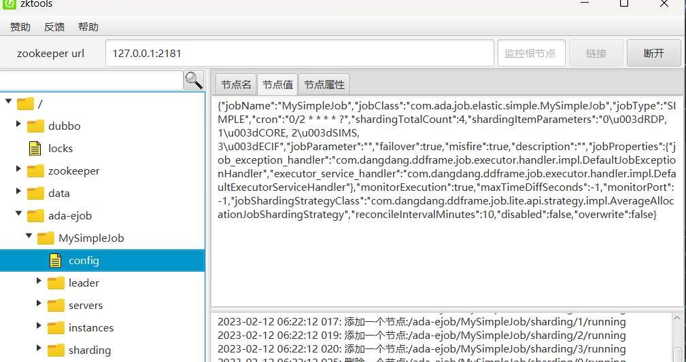
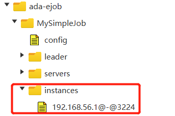
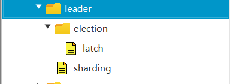
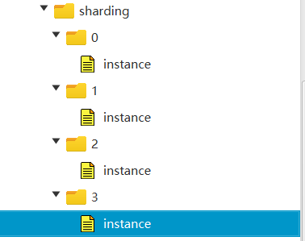
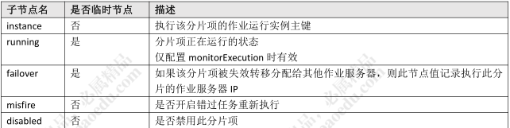
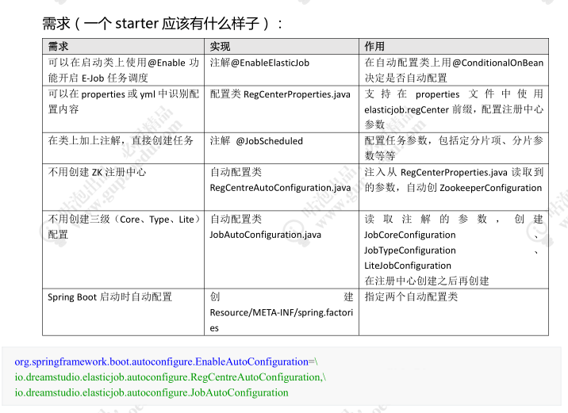

# Quartz-Misfire

线程池只有 5 个线程，当有 5 个任务都在执行的时候，第六个任务即将触发，这个时候任务就不能得到执行。在 quartz.properties 有一个属性 misfireThreshold，用来定义触发器超时的"临界值"，也就是超过了这个时间，就算错过触发了。
例如，如果 misfireThreshold 是 60000（60 秒），9 点整应该执行的任务，9 点零1 分还没有可用线程执行它，就会超时（misfires）。

下面这些原因可能造成 misfired job:

1、 没有可用线程
2、 Trigger 被暂停
3、 系统重启
4、 禁止并发执行的任务在到达触发时间时，上次执行还没有结束。

错过触发怎么办？Misfire 策略设置

每一种 Trigger 都定义了自己的 Misfire 策略，不同的策略通过不同的方法来设置

大体上来说有 3 种：
1、 忽略
2、 立即跑一次
3、 下次跑

怎么避免任务错过触发？
合理地设置线程池数量，以及任务触发间隔

# 认识E-Job

Quartz不足：
1.作业只能通过DB抢占随机负载，无法协调
2.任务不能分片=单个任务数据太多跑不完，消耗线程，负载不均
3.作业日志可视化监控、统计

# 发展历史

在当当网ddframe中，需要一个任务调度系统（作业系统）

实现的话有两种思路，一个是修改开源产品，一种是基于开源产品搭建（封装），当当选择了后者，最开始这个调度系统叫做 dd-job。它是一个无中心化的分布式调度框架。因为数据库缺少分布式协调功能（比如选主），替换为 Zookeeper 后，增加了弹性
扩容和数据分片的功能。

Elastic-Job 是 ddframe 中的 dd-job 作业模块分离出来的作业框架，基于 Quartz和 Curator 开发，在 2015 年开源

**轻量级、去中心化解决方案**

为什么说是去中心化呢？因为没有统一的调度中心。集群的每个节点都是对等的，节点之间通过注册中心进行分布式协调。

E-Job 存在主节点的概念，但是主节点没有调度的功能，而是用于处理一些集中式任务，如分片，清理运行时信息等

lastic-Job 最开始只有一个 elastic-job-core 的项目，在 2.X 版本以后主要分为
Elastic-Job-Lite 和 Elastic-Job-Cloud 两个子项目。其中，Elastic-Job-Lite 定位为轻量级 无 中 心 化 解 决 方 案 ， 使 用 jar 包 的 形 式 提 供 分 布 式 任 务 的 协 调 服 务 。 而
Elastic-Job-Cloud 使用 Mesos + Docker 的解决方案，额外提供资源治理、应用分发以及进程隔离等服务（跟 Lite 的区别只是部署方式不同，他们使用相同的 API，只要开发一次）

## 功能特性

 分布式调度协调：用 ZK 实现注册中心
 错过执行作业重触发（Misfire）
 支持并行调度（任务分片）
 作业分片一致性，保证同一分片在分布式环境中仅一个执行实例
 弹性扩容缩容：将任务拆分为 n 个任务项后，各个服务器分别执行各自分配到的
任务项。一旦有新的服务器加入集群，或现有服务器下线，elastic-job 将在保留
本次任务执行不变的情况下，下次任务开始前触发任务重分片。
 失效转移 failover：弹性扩容缩容在下次作业运行前重分片，但本次作业执行的过
程中，下线的服务器所分配的作业将不会重新被分配。失效转移功能可以在本次
作业运行中用空闲服务器抓取孤儿作业分片执行。同样失效转移功能也会牺牲部
分性能。
 支持作业生命周期操作（Listener）
 丰富的作业类型（Simple、DataFlow、Script）
 Spring 整合以及命名空间提供
 运维平台

## 项目结构



# E-Job配置

作业配置分为 3 级，分别是 JobCoreConfiguration，JobTypeConfiguration 和LiteJobConfiguration。

LiteJobConfiguration 使 用 JobTypeConfiguration ，JobTypeConfiguration 使用 JobCoreConfiguration，层层嵌套

JobTypeConfiguration 根 据 不 同 实 现 类 型 分 为 SimpleJobConfiguration ，
DataflowJobConfiguration 和 ScriptJobConfiguration

E-Job 使用 ZK 来做分布式协调，所有的配置都会写入到 ZK 节点

## 注册中心的数据


一个任务一个二级节点
这里面有些节点是临时节点，只有任务运行的时候才能看到



注意：修改了任务重新运行任务不生效，是因为 ZK 的信息不会更新, 除非把
overwrite 修改成 true。

### config 节点

JSON格式存储：
存储任务的配置信息，包含执行类，cron 表达式，分片算法类，分片数量，分片参数等等

```
{
    **"jobName"**:**"MySimpleJob"**,
    **"jobClass"**:**"com.ada.job.elastic.simple.MySimpleJob"**,
    **"jobType"**:**"SIMPLE"**,
    **"cron"**:**"0/2 * * * * ?"**,
    **"shardingTotalCount"**:**4**,
    **"shardingItemParameters"**:**"0=RDP, 1=CORE, 2=SIMS, 3=ECIF"**,
    **"jobParameter"**:**""**,
    **"failover"**:**true**,
    **"misfire"**:**true**,
    **"description"**:**""**,
    **"jobProperties"**:{
        **"job_exception_handler"**:**"com.dangdang.ddframe.job.executor.handler.impl.DefaultJobExceptionHandler"**,
        **"executor_service_handler"**:**"com.dangdang.ddframe.job.executor.handler.impl.DefaultExecutorServiceHandler"**
    },
    **"monitorExecution"**:**true**,
    **"maxTimeDiffSeconds"**:**-1**,
    **"monitorPort"**:**-1**,
    **"jobShardingStrategyClass"**:**"com.dangdang.ddframe.job.lite.api.strategy.impl.AverageAllocationJobShardingStrategy"**,
    **"reconcileIntervalMinutes"**:**10**,
    **"disabled"**:**false**,
    **"overwrite"**:**false**
}
```

config节点的数据是通过ConfigService持久化到zookeeper中去的。默认状态下，
如果你修改了 Job 的配置比如 cron 表达式、分片数量等是不会更新到 zookeeper 上去的，除非你在 Lite 级别的配置把参数 overwrite 修改成 true

```
LiteJobConfiguration simpleJobRootConfig =
LiteJobConfiguration.newBuilder(simpleJobConfig).overwrite(true).build();
```

### instances  节点

同一个 Job 下的 elastic-job 的部署实例。一台机器上可以启动多个 Job 实例，也就是 Jar 包。
instances 的命名是 IP+@-@+PID。只有在运行的时候能看到

如:启动MySimpleJob，如下面


### leader节点


任务实例的主节点信息，通过 zookeeper 的主节点选举，选出来的主节点信息。

在elastic job中，任务的执行可以分布在不同的实例中，但任务分片等核心控制，需要由主节点完成，因此，任务执行之前，需要选举出主节点

下面有三个子节点：
election：主节点选举
sharding：分片
failover：失效转移

election 下面的 instance 节点显示了当前主节点的实例 ID：jobInstanceId。

election 下面的 latch 节点也是一个永久节点用于选举时候的实现分布式锁。

sharding 节点下面有一个临时节点，necessary，是否需要重新分片的标记。如果分片总数变化，或任务实例节点上下线或启用/禁用，以及主节点选举，都会触发设置重分片标记，主节点会进行分片计算

### servers节点


任务实例的信息，主要是 IP 地址，任务实例的 IP 地址。跟 instances 不同，如果多个任务实例在同一台机器上运行则只会出现一个 IP 子节点。可在 IP 地址节点写入DISABLED 表示该任务实例禁用

### sharding 节点


任务的分片信息，子节点是分片项序号，从 0 开始。分片个数是在任务配置中设置的。分片项序号的子节点存储详细信息。每个分片项下的子节点用于控制和记录分片运行状态。最主要的子节点就是 instance


# 运维平台

## 下载解压运行

git 下载源码 https://github.com/elasticjob/elastic-job-lite

启动成功之后访问： http://localhost:8899/即可访问控制台

8899 为默认端口号，可通过启动脚本输入-p 自定义端口号

默认管理员用户名和密码是 root/root。右上角可以切换语言

## 添加ZK注册中心

第一步，添加注册中心，输入 ZK 地址和命名空间，并连接

运维平台和 elastic-job-lite 并无直接关系，是通过读取作业注册中心数据展现作业状态，或更新注册中心数据修改全局配置。

控制台只能控制作业本身是否运行，但不能控制作业进程的启动，因为控制台和作业本身服务器是完全分离的，控制台并不能控制作业服务器

# 分片方案

获取到分片项 shardingItem 之后，怎么对数据进行分片嗯？

1、对业务主键进行取模，获取余数等于分片项的数据
举例：获取到的 sharding item 是 0,1
在 SQL 中加入过滤条件：where mod(id, 4) in (1, 2)。
这种方式的缺点：会导致索引失效，查询数据时会全表扫描。
解决方案：在查询条件中在增加一个索引条件进行过滤

2、在表中增加一个字段，根据分片数生成一个 mod 值。取模的基数要大于机器数。
否则在增加机器后，会导致机器空闲。例如取模基数是 2，而服务器有 5 台，那么有三台服务器永远空闲。而取模基数是 10，生成 10 个 shardingItem，可以分配到 5 台服务器。当然，取模基数也可以调整

3、如果从业务层面，可以用 ShardingParamter 进行分片。
例如 0=RDP, 1=CORE, 2=SIMS, 3=ECIF
List<users> = SELECT * FROM user WHERE status = 0 AND SYSTEM_ID =
'RDP' limit 0, 100

在 Spring Boot 中要 Elastic-Job 要配置的内容太多了，有没有更简单的添加任务的
方法呢？比如在类上添加一个注解？这个时候我们就要用到 starter 了

# e-job starter




