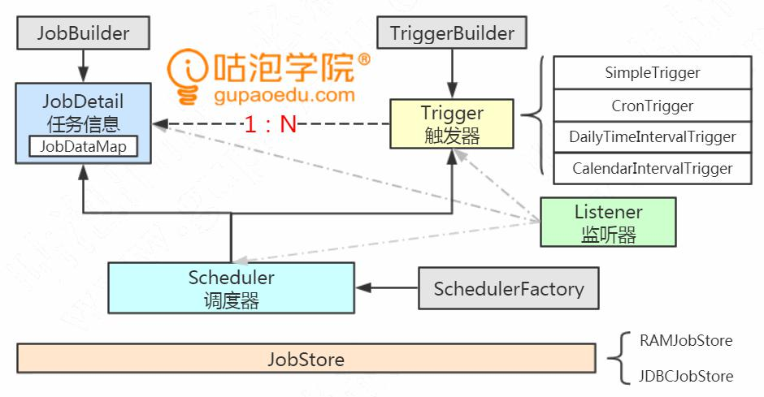
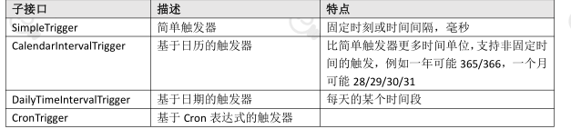
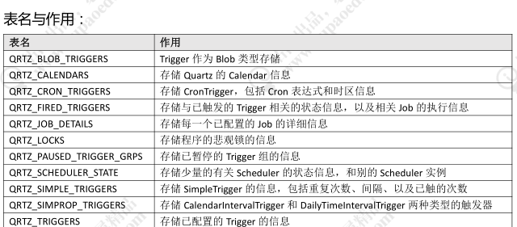

# 任务调度

## 什么时候需要任务调度(背景)

1、账单日或者还款日上午 10 点，给每个信用卡客户发送账单通知，还款通知。
2、银行业务系统，夜间要完成跑批的一系列流程，清理数据，下载文件，解析文件，对账清算、切换结算日期等等。
3、金融机构跟人民银行二代支付系统对接，人民银行要求低于 5W 的金额（小额支付）半个小时打一次包发送，以缓解并发压力。所以，银行的跨行转账分成了多个流程：录入、复核、发送。如何把半个小时以内的所有数据一次性发送？
类似于这种
1、基于准确的时刻或者固定的时间间隔触发的任务，或者
2、有批量数据需要处理，或者
3、要实现两个动作解耦的场景，我们都可以用任务调度来实现

## 要求

基本需求
1）可以定义触发的规则，比如基于时刻、时间间隔、表达式。
2）可以定义需要执行的任务。比如执行一个脚本或者一段代码。任务和规则是
分开的。
3）集中管理配置，持久配置。不用把规则写在代码里面，可以看到所有的任务
配置，方便维护。重启之后任务可以再次调度——配置文件或者配置中心。
4）支持任务的串行执行，例如执行 A 任务后再执行 B 任务再执行 C 任务。
5）支持多个任务并发执行，互不干扰（例如 ScheduledThreadPoolExecutor）。
6）有自己的调度器，可以启动、中断、停止任务。
7）容易集成到 Spring

# Quartz

Quartz 的目的就是让任务调度更加简单，开发人员只需要关注业务即可。他是
用 Java 语言编写的（也有.NET 的版本）。Java 代码能做的任何事情，Quartz 都可以调度

## 特点

精确到毫秒级别的调度
可以独立运行，也可以集成到容器中
支持事务（JobStoreCMT ）
支持集群
支持持久化

## 体系

### JobDetail

我们创建一个实现 Job 接口的类，使用 JobBuilder 包装成 JobDetail，它可以携带KV 的数据

### Trigger

定义任务的触发规律，Trigger，使用 TriggerBuilder 来构建。
JobDetail 跟 Trigger 是 1:N 的关系

SimpleTrigger
SimpleTrigger 可以定义固定时刻或者固定时间间隔的调度规则（精确到毫秒）。
例如：每天 9 点钟运行；每隔 30 分钟运行一次。

CalendarIntervalTrigger
CalendarIntervalTrigger 可以定义更多时间单位的调度需求，精确到秒。
好处是不需要去计算时间间隔，比如 1 个小时等于多少毫秒。
例如每年、每个月、每周、每天、每小时、每分钟、每秒。
每年的月数和每个月的天数不是固定的，这种情况也适用。

DailyTimeIntervalTrigger
每天的某个时间段内，以一定的时间间隔执行任务。
例如：每天早上 9 点到晚上 9 点，每隔半个小时执行一次，并且只在周一到周六执
行。

CronTrigger
CronTirgger 可以定义基于 Cron 表达式的调度规则，是最常用的触发器类型

基于 Calendar  的 排除规则

如果要在触发器的基础上，排除一些时间区间不执行任务，就要用到 Quartz 的Calendar 类（注意不是 JDK 的 Calendar）。可以按年、月、周、日、特定日期、Cron表达式排除

调用 Trigger 的 modifiedByCalendar()添加到触发器中，并且调用调度器的
addCalendar()方法注册排除规则

## Scheduler

调度器，是Quartz的指挥官，由StdSchedulerFactory产生，它是单例

并且是 Quartz 中最重要的 API，默认是实现类是 StdScheduler，里面包含了一个
QuartzScheduler，QuartzScheduler 里面又包含了一个 QuartzSchedulerThread

Scheduler 中的方法主要分为三大类：
1）操作调度器本身，例如调度器的启动 start()、调度器的关闭 shutdown()。
2）操作 Trigger，例如 pauseTriggers()、resumeTrigger()。
3）操作 Job，例如 scheduleJob()、unscheduleJob()、rescheduleJob()
这些方法非常重要，可以实现任务的动态调度

## Listener

观察者模式：定义对象间一种一对多的依赖关系，使得每当一个对象改变状态，则所有依赖它的对象都会得到通知并自动更新。

Quartz 中提供了三种 Listener，监听 Scheduler 的，监听 Trigger 的，监听 Job 的

只需要创建类实现相应的接口，并在 Scheduler 上注册 Listener，便可实现对核心对象的监听

## JobStore

问题：最多可以运行多少个任务（磁盘、内存、线程数）

Jobstore 用来存储任务和触发器相关的信息，例如所有任务的名称、数量、状态等等。Quartz 中有两种存储任务的方式，一种在在内存，一种是在数据库

### RAMJobstore

Quartz 默认的 JobStore 是 RAMJobstore，也就是把任务和触发器信息运行的信息存储在内存中，用到了 HashMap、TreeSet、HashSet 等等数据结构。

如果程序崩溃或重启，所有存储在内存中的数据都会丢失。所以我们需要把这些数据持久化到磁盘

### JDBCJobStore

JDBCJobStore 可以通过 JDBC 接口，将任务运行数据保存在数据库中

JDBC 的实现方式有两种，JobStoreSupport 类的两个子类：

JobStoreTX：在独立的程序中使用，自己管理事务，不参与外部事务。
JobStoreCMT：(Container Managed Transactions (CMT)，如果需要容器管理事务时，使用它

在官网的 Downloads 链接中，提供了 11 张表的建表语句：
quartz-2.2.3-distribution\quartz-2.2.3\docs\dbTables
2.3 的版本在这个路径下：src\org\quartz\impl\jdbcjobstore

