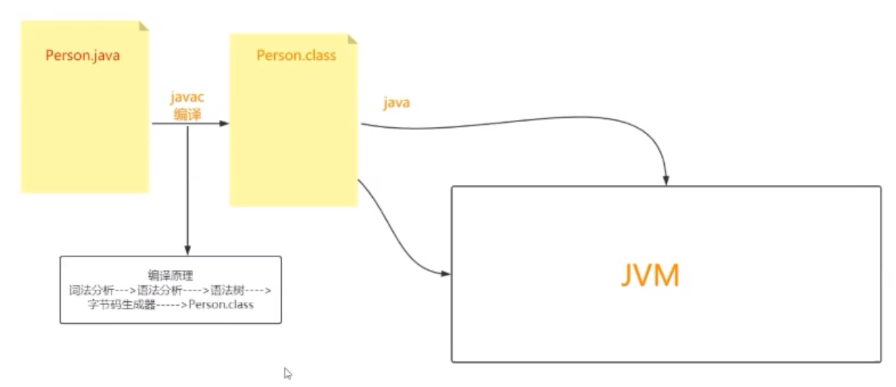
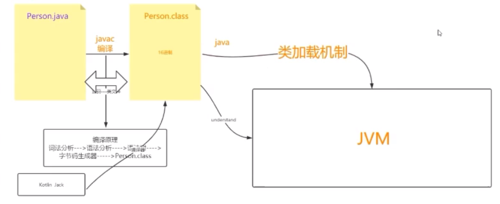
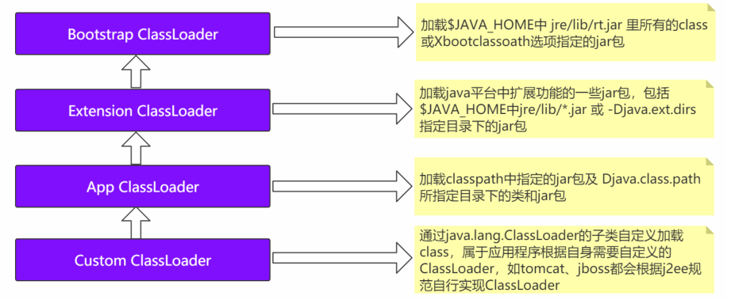
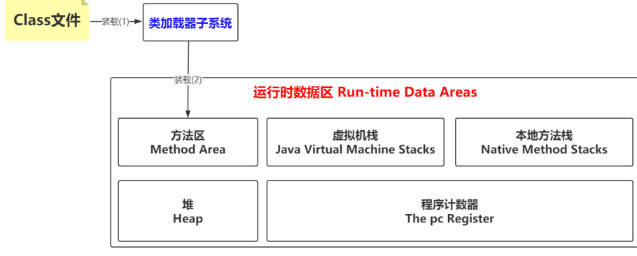

# JVM的来源



## 编译的过程

Person.java -> 词法分析器 -> tokens流 -> 语法分析器 -> 语法树/抽象语法树 -> 语义分析器
-> 注解抽象语法树 -> 字节码生成器 -> Person.class文件

## 类文件(Class文件)

官网The class File Format :https://docs.oracle.com/javase/specs/jvms/se8/html/jvms-4.html

```
cafe babe 0000 0034 0027 0a00 0600 1809
0019 001a 0800 1b0a 001c 001d 0700 1e07
001f 0100 046e 616d 6501 0012 4c6a 6176
612f 6c61 6e67 2f53 7472 696e 673b 0100
0361 6765 0100 0149 0100 0761 6464 7265
、、、、、
```

（1）magic(魔数):
The  magic  item supplies the magic number identifying the  class  file format; it has the
value  0xCAFEBABE .

`cafe babe`

（2）

# 类加载机制



## 类加载机制

Person.class ----类加载机制  ---- JVM（过程）

(1)装载

a.先找到类的文件所在的位置(类装载器，也就是ClassLoader)
b.把类的信息交给JVM  -- Method Area
c.类文件所对应的对象Class交给JVM -- 堆

(2)链接
a.验证 -- 保证类加载的正确性
b.准备 -- 要为类的静态变量分配内存空间，并将其的值初始化为默认值（如，static int a = 10 ,此时a会被初始化为0 ）
c.解析 -- 将类中符号引用转为直接引用
比如：String str =地址是什么

(3) 初始化
为静态变量，真正的值 （比如，上一步的 a= 10）

## 加载原则



检查某个类是否已经加载：
顺序是自底向上，从Custom ClassLoader到BootStrap ClassLoader逐层检查，只要某个Classloader已加载，就视为已加载此类，保证此类只所有ClassLoader加载一次。

加载的顺序：
加载的顺序是自顶向下，也就是由上层来逐层尝试加载此类。
1）Bootstrap ClassLoader 负责加载$JAVA_HOME中 jre/lib/rt.jar 里所有的class或Xbootclassoath选项指定的jar包。由C++实现，不是ClassLoader子类。
2）Extension ClassLoader 负责加载java平台中扩展功能的一些jar包，包括$JAVA_HOME中jre/lib/*.jar 或 -Djava.ext.dirs指定目录下的jar包。
3）App ClassLoader 负责加载classpath中指定的jar包及 Djava.class.path 所指定目录下的类和jar包。
4）Custom ClassLoader 通过java.lang.ClassLoader的子类自定义加载class，属于应用程序根据自身需要自定义的ClassLoader，如tomcat、jboss都会根据j2ee规范自行实现ClassLoader

### 双亲委派机制

定义：
如果一个类加载器在接到加载类的请求时，它首先不会自己尝试去加载这个类，而是把
这个请求任务委托给父类加载器去完成，依次递归，如果父类加载器可以完成类加载任务，就
成功返回；只有父类加载器无法完成此加载任务时，才自己去加载。

优势：
Java类随着加载它的类加载器一起具备了一种带有优先级的层次关系。比如，Java中的Object类，它存放在rt.jar之中,无论哪一个类加载器要加载这个类，最终都是委派给处于模型最顶端的启动类加载器进行加载，因此Object在各种类加载环境中都是同一个类。如果不采用双亲委派模型，那么由各个类加载器自己取加载的话，那么系统中会存在多种不同的Object类。

破坏：
可以继承ClassLoader类，然后重写其中的loadClass方法，其他方式大家可以自己了解拓展一下

# JVM的划分

为什么会有划分，思考，JVM的设计者，会把所有类的信息乱放？肯定不会，所以就会按照一定的规则进行分门别类的放置class的各种信息，因此就有很多各种区

# 运行时数据区



## 方法区

JDK1.7 ：PermSpace --- 永久代

JDK1.8 ：MetaSpace --- 元空间

类信息、常量、静态变量
可能发生OOM

## 堆

也是可能发生OOM

## JAVA虚拟机栈

一个线程的创建就是一个栈，一个方法的调用就是一个栈帧


