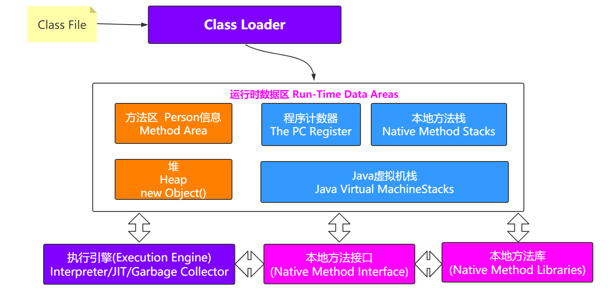
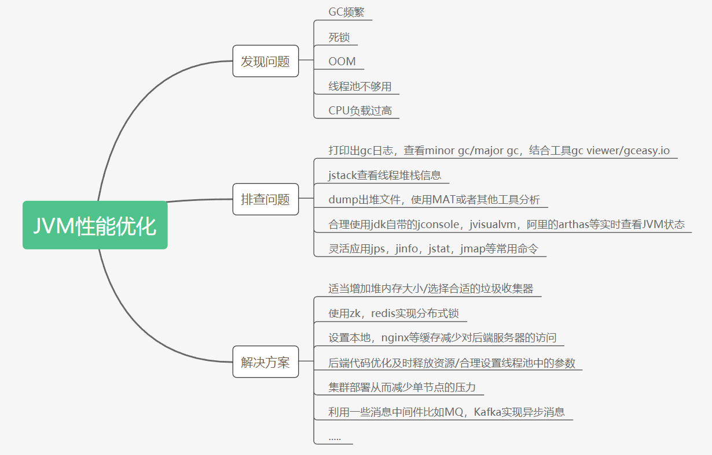

# 重新认识JVM



## GC回收的机制

- 一般以下几种情况会发生垃圾回收
  （1）当Eden区或者S区不够用了
  （2）老年代空间不够用了
  （3）方法区空间不够用了
  （4）System.gc()
  
  # GC日志文件


要想分析日志的信息，得先拿到GC日志文件才行，所以得先配置一下，之前也看过这些参数

-XX:+PrintGCDetails -XX:+PrintGCTimeStamps -XX:+PrintGCDateStamps
-Xloggc:gc.log

## Parallel GC日志

【吞吐量优先】

```
[GC (Allocation Failure) [PSYoungGen: 65536K[Young区回收前]->10748K[Young区回收后]
(76288K[Young区总大小])] 65536K[整个堆回收前]->15039K[整个堆回收后](251392K[整个堆总大小]),
0.0113277 secs] [Times: user=0.00 sys=0.00, real=0.01 secs]
```

## CMS日志

【停顿时间优先】
参数设置：-XX:+UseConcMarkSweepGC -Xloggc:cms-gc.log

## G1日志

【停顿时间优先】
参数设置：-XX:+UseG1GC -Xloggc:g1-gc.log

# GC日志文件分析工具

## gceasy

## GCViewer

# G1调优与最佳指南

## 是否选用G1垃圾收集器的判断依据

（1）50%以上的堆被存活对象占用
（2）对象分配和晋升的速度变化非常大
（3）垃圾回收时间比较长

(1)使用G1GC垃圾收集器: -XX:+UseG1GC
修改配置参数，获取到gc日志，使用GCViewer分析吞吐量和响应时间

（2)调整内存大小再获取gc日志分析
-XX:MetaspaceSize=100M
-Xms300M
-Xmx300M

（3）调整最大停顿空间

-XX:MaxGCPauseMillis=20  设置最大GC停顿时间指标
比如设置最大停顿时间，获取到gc日志，使用GCViewer分析吞吐量和响应时间

(4)启动并发GC时堆内存占用百分比
-XX:InitiatingHeapOccupancyPercent=45 G1用它来触发并发GC周期,基于整个堆的使用率,而不只是某一代内存的
使用比例。值为 0 则表示“一直执行GC循环)'. 默认值为 45 (例如, 全部的 45% 或者使用了45%).

比如设置该百分比参数，获取到gc日志，使用GCViewer分析吞吐量和响应时间

# 最佳指南

(1)不要手动设置新生代和老年代的大小，只要设置整个堆的大小

```
G1收集器在运行过程中，会自己调整新生代和老年代的大小
其实是通过adapt代的大小来调整对象晋升的速度和年龄，从而达到为收集器设置的暂停时间目标
如果手动设置了大小就意味着放弃了G1的自动调
```

（2）不断调优暂停时间目标

一般情况下这个值设置到100ms或者200ms都是可以的(不同情况下会不一样)，但如果设置成50ms就不太合理。暂停时间设置的太短，就会导致出现G1跟不上垃圾产生的速度。最终退化成Full GC。所以对这个参数的调优是一个持续的过程，逐步调整到最佳状态。暂停时间只是一个目标，并不能总是得到满足

(3)使用-XX:ConcGCThreads=n来增加标记线程的数量

IHOP如果阀值设置过高，可能会遇到转移失败的风险，比如对象进行转移时空间不足。如果阀值设置过低，就会使标
记周期运行过于频繁，并且有可能混合收集期回收不到空间。
IHOP值如果设置合理，但是在并发周期时间过长时，可以尝试增加并发线程数，调高ConcGCThreads

(4)MixedGC调优
-XX:InitiatingHeapOccupancyPercent
-XX:G1MixedGCLiveThresholdPercent
-XX:G1MixedGCCountTarger
-XX:G1OldCSetRegionThresholdPercent

(5)适当增加堆内存大小



# 常见问题

（1）内存泄漏与内存溢出的区别
内存泄漏：对象无法得到及时的回收，持续占用内存空间，从而造成内存空间的浪费。
内存溢出：内存泄漏到一定的程度就会导致内存溢出，但是内存溢出也有可能是大对象导致的

（2）young gc会有stw吗？
不管什么 GC，都会有 stop-the-world，只是发生时间的长短。

（3）major gc和full gc的区别
major gc指的是老年代的gc，而full gc等于young+old+metaspace的gc

（4）G1与CMS的区别是什么
CMS 用于老年代的回收，而 G1 用于新生代和老年代的回收。
G1 使用了 Region 方式对堆内存进行了划分，且基于标记整理算法实现，整体减少了垃圾碎片的产生

（6）不可达的对象一定要被回收吗

即使在可达性分析法中不可达的对象，也并非是“非死不可”的，这时候它们暂时处于“缓刑阶段”，要真正宣告一个对象死亡，至少要经历**两次**标记过程；

可达性分析法中不可达的对象被第一次标记并且进行一次筛选，筛选的条件是此对象是否有必要执行 finalize 方法。当对象没有覆盖 finalize 方法，或 finalize 方法已经被虚拟机调用过时，虚拟机
将这两种情况视为没有必要执行。

被判定为需要执行的对象将会被放在一个队列中进行第二次标记，除非这个对象与引用链上的任何一个对象建立关联，否则就会被真的回收

（7）方法区中的无用类回收
方法区主要回收的是无用的类，那么如何判断一个类是无用的类的呢？

方法区主要回收的是无用的类，那么如何判断一个类是无用的类的呢？
判定一个常量是否是“废弃常量”比较简单，而要判定一个类是否是“无用的类”的条件则相对苛刻许多。类需要同时满足下面 3 个条件才能算是 “无用的类” ：

第一：该类所有的实例都已经被回收，也就是 Java 堆中不存在该类的任何实例。
第二：加载该类的 ClassLoader 已经被回收。
第三：该类对应的 java.lang.Class 对象没有在任何地方被引用，无法在任何地方通过反射访问该类的方法。
虚拟机可以对满足上述 3 个条件的无用类进行回收，这里说的仅仅是“可以”，而并不是和对象一样不使用了就会必然
被回收

（8）不同的引用
JDK1.2以后，Java对引用进行了扩充：强引用、软引用、弱引用和虚引用


