# 垃圾回收

首先，要回收垃圾，机器跟人不一样，不知道什么是垃圾，告诉程序什么是垃圾

## 引用计数法

对于某个对象而言，只要应用程序中持有该对象的引用，就说明该对象不是垃圾，如果一个对象没有任
何指针对其引用，它就是垃圾

弊端：如果AB相互持有引用，导致永远不能被回收

## 可达性分析

通过GC ROOT的对象，开始向下寻找，看某个对象是否可达

能作为GC Root:类加载器、Thread、虚拟机栈的本地变量表（因为本地变量表存在，说明栈帧是存在的，栈帧存在说明这个方法正在被调用）、static成员、常量引用、本地方法栈的变量等

# 垃圾回收算法

## 标记-清除

- 标记
  找到内存中需要回收的对象，并且把它们标记出来
  此时堆中所有的对象都会被扫描一遍，从而才能确定需要回收的对象，比较耗时
  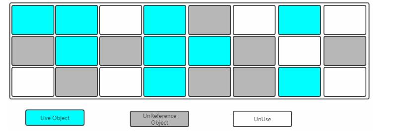
  
  - 清除
  清除掉被标记需要回收的对象，释放出对应的内存空间
    
  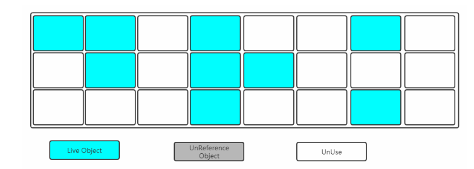
  
  缺点：
  标记清除之后会产生大量不连续的内存碎片，空间碎片太多可能会导致以后在程序运行过程中需要分配较大对象时，无法找到足够的连续内存而不得不提前触发另一次垃圾收集动作。
  (1)标记和清除两个过程都比较耗时，效率不高
  (2)会产生大量不连续的内存碎片，空间碎片太多可能会导致以后在程序运行过程中需要分配较大对象时，无法找到足够的连续内存而不得不提前触发另一次垃圾收集动作
  总结：慢，不连续
  
  ## 复制
  
  将内存划分分为两块现代的区域，每次只使用其中一块，如图
  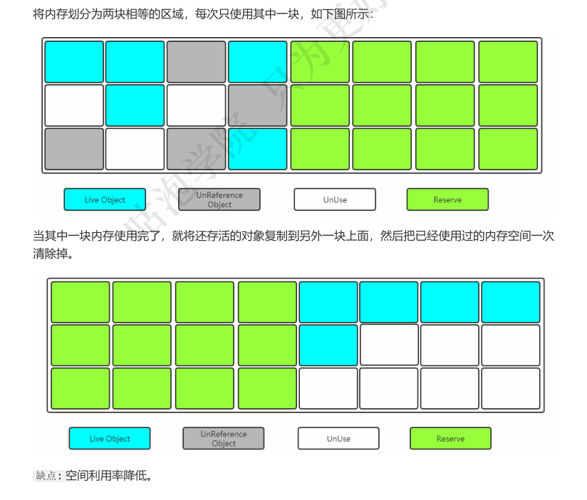
  
  ## 标记-整理

标记过程仍然与"标记-清除"算法一样，但是后续步骤不是直接对可回收对象进行清理，而是让所有存活
的对象都向一端移动，然后直接清理掉端边界以外的内存
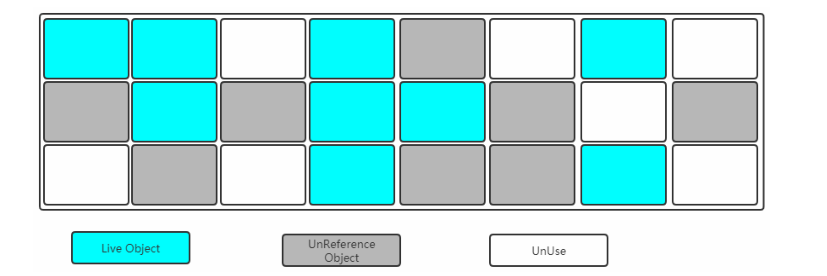
让所有存活的对象都向一端移动，清理掉边界意外的内存
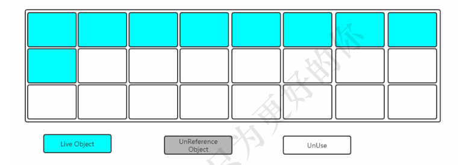

# 分代收集算法

Young区：复制算法（对象在被分配之后，可能生命周期比较短，Young区复制效率比较高）
Old区：标记清除或者标记整理（Old区对象存活时间比较长，复制来复制去没必要，不弱做个标记再清理）

或者：

- 新生代  复制算法== 适用于存活对象比较少的场景【大部分对象都是朝生夕死的】
- 老年代  标记-整理

# 垃圾收集器

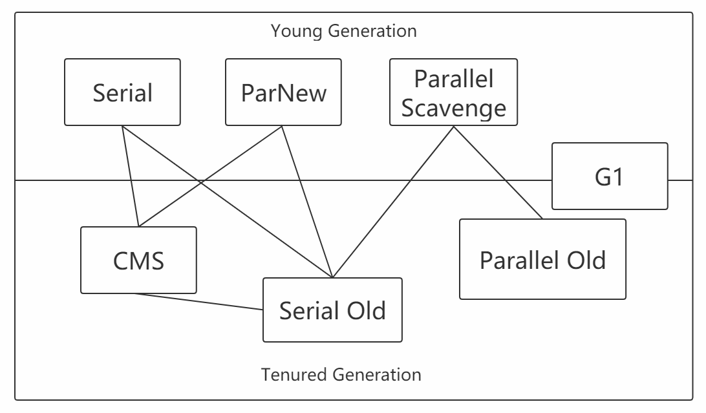


## Serial收集器

Serial收集器是最基本、发展历史最悠久的收集器，曾经（在JDK1.3.1之前）是虚拟机新生代收集的唯
一选择

它是一种单线程收集器，不仅仅意味着它只会使用一个CPU或者一条收集线程去完成垃圾收集工作，更
重要的是其在进行垃圾收集的时候需要暂停其他线程

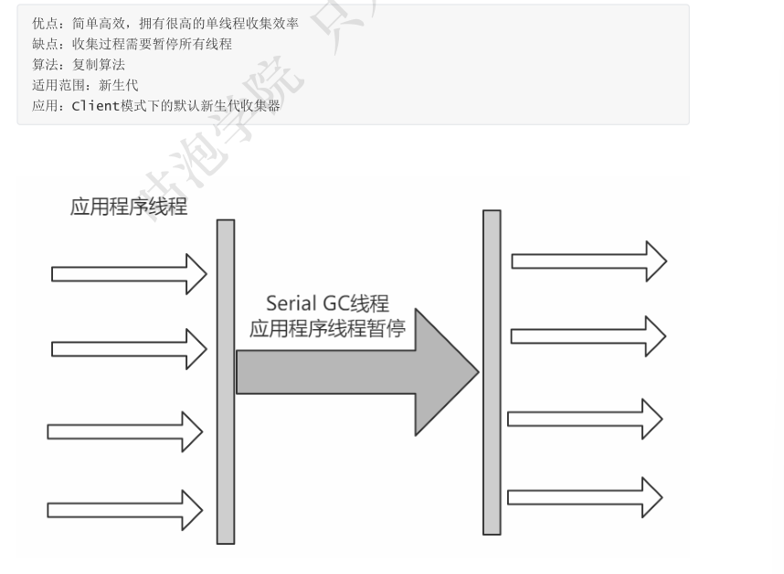

## ParNew收集器

可以把这个收集器理解为Serial收集器的多线程版本
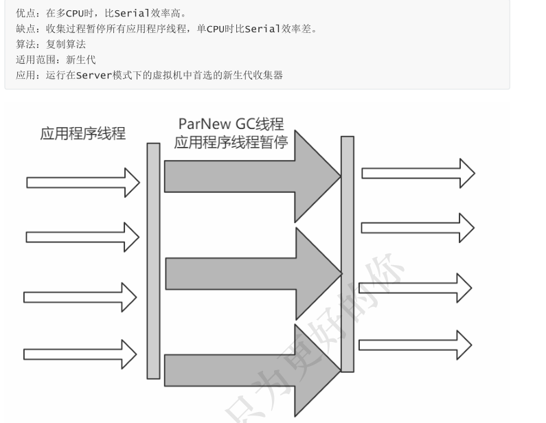

## Parallel Scavenge收集器

Parallel Scavenge收集器是一个新生代收集器，它也是使用复制算法的收集器，又是并行的多线程收集
器，看上去和ParNew一样，但是Parallel Scanvenge更关注 系统的吞吐量

吞吐量=运行用户代码的时间/(运行用户代码的时间+垃圾收集时间)
比如虚拟机总共运行了100分钟，垃圾收集时间用了1分钟，吞吐量=(100-1)/100=99%。
若吞吐量越大，意味着垃圾收集的时间越短，则用户代码可以充分利用CPU资源，尽快完成程序
的运算任务

```
-XX:MaxGCPauseMillis控制最大的垃圾收集停顿时间，
-XX:GC Time Ratio直接设置吞吐量的大小
```

## Serial Old收集器

Serial Old 收集器是Serial收集器的老年代版本，也是一个单线程收集器，不同的是采用“标记-清理算法”，云心过程和Serial收集器一样
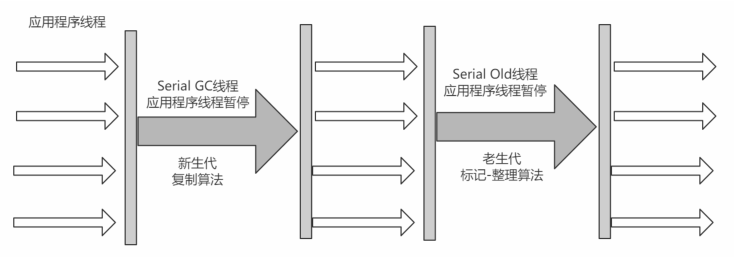

## Paraller Old收集器

Parallel Old收集器是Parallel Scavenge收集器的老年代版本，使用多线程和"标记-整理算法"进行垃圾
回收。
吞吐量优

## CMS收集器

CMS(Concurrent Mark Sweep)收集器是一种以获取 最短回收停顿时间 为目标的收集器。

采用的是"标记-清除算法",整个过程分为4步

(1)初始标记 CMS initial mark      标记GC Roots能关联到的对象 Stop The World--
->速度很快
(2)并发标记 CMS concurrent mark    进行GC Roots Tracing
(3)重新标记 CMS remark         修改并发标记因用户程序变动的内容 Stop The
World
(4)并发清除 CMS concurrent sweep

由于整个过程中，并发标记和并发清除，收集器线程可以与用户线程一起工作（也就是并发的概念），所以总体上来
说，CMS收集器的内存回收过程是与用户线程一起并发地执行的

优点：并发收集、低停顿
缺点：产生大量空间碎片、并发阶段会降低吞吐量
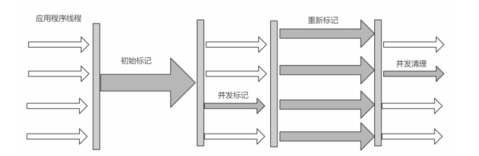

## G1收集器

G1特点

并行与并发
分代收集（仍然保留了分代的概念）
空间整合（整体上属于“标记-整理”算法，不会导致空间碎片）
可预测的停顿（比CMS更先进的地方在于能让使用者明确指定一个长度为M毫秒的时间片段内，消耗在垃圾收集上的时间不得超过N毫秒）

使用G1收集器时，Java堆的内存布局与就与其他收集器有很大差别，它将整个Java堆划分为多个
大小相等的独立区域（Region），虽然还保留有新生代和老年代的概念，但新生代和老年代不再
是物理隔离的了，它们都是一部分Region（不需要连续）的集合

工作过程可以分为如下几步

初始标记（Initial Marking）   标记一下GC Roots能够关联的对象，并且修改TAMS的值，需要暂
停用户线程
并发标记（Concurrent Marking）  从GC Roots进行可达性分析，找出存活的对象，与用户线程并发
执行
最终标记（Final Marking）    修正在并发标记阶段因为用户程序的并发执行导致变动的数据，需
暂停用户线程
筛选回收（Live Data Counting and Evacuation） 对各个Region的回收价值和成本进行排序，根据
用户所期望的GC停顿时间制定回收计划

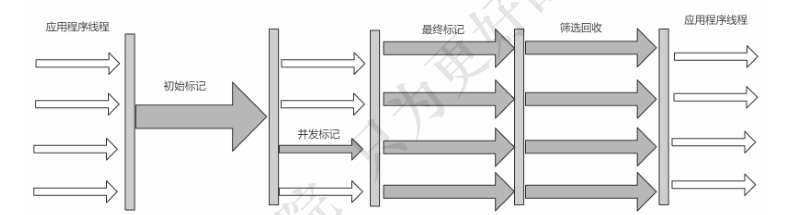

# 垃圾收集器分类

串行收集器->Serial和Serial Old
只能有一个垃圾回收线程执行，用户线程暂停。 适用于内存比较小的嵌入式设备 。

并行收集器[吞吐量优先]->Parallel Scanvenge、Parallel Old
多条垃圾收集线程并行工作，但此时用户线程仍然处于等待状态。 适用于科学计算、后台处理等若交互场
景 。

并发收集器[停顿时间优先]->CMS、G1
用户线程和垃圾收集线程同时执行(但并不一定是并行的，可能是交替执行的)，垃圾收集线程在执行的
时候不会停顿用户线程的运行。 适用于相对时间有要求的场景，比如Web

# 理解吞吐量和停顿时间

停顿时间->垃圾收集器  进行 垃圾回收终端应用执行响应的时间

吞吐量->运行用户代码时间/(运行用户代码时间+垃圾收集时间)

小结 :这两个指标也是评价垃圾回收器好处的标准，其实调优也就是在观察者两个变量

# 如何选择合适的垃圾收集器

优先调整堆的大小让服务器自己来选择
如果内存小于100M，使用串行收集器
如果是单核，并且没有停顿时间要求，使用串行或JVM自己选
如果允许停顿时间超过1秒，选择并行或JVM自己选
如果响应时间最重要，并且不能超过1秒，使用并发收集器
对于G1收集

# 再次理解G1

DK 7开始使用，JDK 8非常成熟，JDK 9默认的垃圾收集器，适用于新老生代

判断是否需要使用G1收集器？
（1）50%以上的堆被存活对象占用
（2）对象分配和晋升的速度变化非常大
（3）垃圾回收时间比较长

# 如何开启需要的垃圾收集器

（1）串行
-XX：+UseSerialGC
-XX：+UseSerialOldGC

（2）并行(吞吐量优先)：
 -XX：+UseParallelGC
 -XX：+UseParallelOldGC

（3）并发收集器(响应时间优先)
-XX：+UseConcMarkSweepGC
-XX：+UseG1GC

# JVM调优

（1）GC日志：停顿时间和吞吐量
（2）内存使用维度：

# 查看

-jps -l
-jinfo -flag 【userSerialGC】 ID


