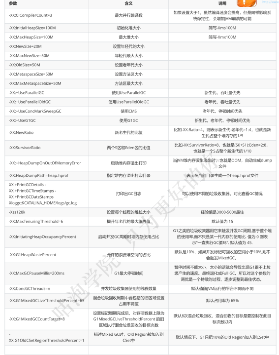

# JVM参数

## 标准参数

-version
-help
-server
-c

## -X参数

非标准参数，也就是在JDK各个版本可能会变动

-xint 解释执行
-Xcomp  第一次使用就编译成本地代码
-Xmixed  混合模式，JVM自己来决定

## -XX参数

使用最多的参数类型
非标准化参数，相对不稳定，主要用于JVM调优和Debug

a.Boolean类型
格式：-XX:[+-]<name>      +或-表示启用或者禁用name属性
比如：-XX:+UseConcMarkSweepGC  表示启用CMS类型的垃圾回收器
-XX:+UseG1GC       表示启用G1类型的垃圾回收器

b.非Boolean类型
格式：-XX<name>=<value>表示name属性的值是value
比如：-XX:MaxGCPauseMillis=500

## 其他参数

-Xms1000等价于-XX:InitialHeapSize=1000
-Xmx1000等价于-XX:MaxHeapSize=1000
-Xss100等价于-XX:ThreadStackSize=100

所以这块也相当于是-XX类型的参数

## 查看参数

```
java -XX:+PrintFlagsFinal -version > flags.txt
```

值得注意的是"="表示默认值，":="表示被用户或JVM修改后的值
要想查看某个进程具体参数的值，可以使用jinfo，这块后面聊
一般要设置参数，可以先查看一下当前参数是什么，然后进行修改

## 设置参数的方式

- 开发工具中设置比如IDEA，eclipse
- 运行jar包的时候:java -XX:+UseG1GC xxx.jar
- web容器比如tomcat，可以在脚本中的进行设置
- 通过jinfo实时调整某个java进程的参数(参数只有被标记为manageable的flags可以被实时修改

## 实践和单位换算

```
1Byte(字节)=8bit(位)
1KB=1024Byte(字节)
1MB=1024KB
1GB=1024MB
1TB=1024GB
```

```
(1)设置堆内存大小和参数打印
-Xmx100M -Xms100M -XX:+PrintFlagsFinal
(2)查询+PrintFlagsFinal的值
:=true
(3)查询堆内存大小MaxHeapSize
:= 104857600
(4)换算
104857600(Byte)/1024=102400(KB)
102400(KB)/1024=100(MB)
(5)结论
104857600是字节单位
```

## 常用参数



# 常用命令

## JPS

查看java进程

## jinfo

（1）实时查看和调整JVM配置参数
（2）查看
jinfo -flag name PID

查看某个java进程的name属性的值

jinfo -flag MaxHeapSize PID

jinfo -flag UseG1GC PID

（3）修改
参数只有被标记为manageable的flags可以被实时修改
jinfo -flag name=value PID

jinfo -flag = PID

（4）查看曾经赋过值的一些参数
jinfo -flags PID

## jstat

(1)查看虚拟机性能统计信息
（2）查看类装载信息
jstat -class PID 1000 10
查看某个java进程的类装载信息，每1000毫秒输出一次，共输出10次
（3）查看垃圾收集信息
jstat -gc PID 1000 10

## jstack

(1)查看线程堆栈信息
用法：
jstack PID

(2)排查死锁

## jmap

(1)生成堆转储快照
（2）打印出堆内存相关信息

```
-XX:+PrintFlagsFinal -Xms300M -Xmx300M
jmap -heap PID
```


（3）dump出堆内存相关信息

```
jmap -dump:format=b,file=heap.hprof PID
```

(4)要是在发生堆内存溢出的时候，能自动dump出该文件就好了
一般在开发中，JVM参数可以加上下面两句，这样内存溢出时，会自动dump出该文件

```
-XX:+HeapDumpOnOutOfMemoryError -XX:HeapDumpPath=heap.hprof
```

# 常用工具

## jconsole

命令行中输入：jconsole

## jvisualvm

(1)监控本地Java进程
可以监控本地的java进程的CPU，类，线程等

(2)比如监控远端tomcat，演示部署在阿里云服务器上的tomcat
(1)在visualvm中选中“远程”，右击“添加”
(2)主机名上写服务器的ip地址，比如31.100.39.63，然后点击“确定”
(3)右击该主机“31.100.39.63”，添加“JMX”[也就是通过JMX技术具体监控远端服务器哪个Java进程]
(4)要想让服务器上的tomcat被连接，需要改一下 bin/catalina.sh 这个文件
注意下面的8998不要和服务器上其他端口冲突

```
JAVA_OPTS="$JAVA_OPTS -Dcom.sun.management.jmxremote -
Djava.rmi.server.hostname=31.100.39.63 -Dcom.sun.management.jmxremote.port=8998
-Dcom.sun.management.jmxremote.ssl=false -
Dcom.sun.management.jmxremote.authenticate=true -
Dcom.sun.management.jmxremote.access.file=../conf/jmxremote.access -
Dcom.sun.management.jmxremote.password.file=../conf/jmxremote.password"
```

(5)在 ../conf 文件中添加两个文件jmxremote.access和jmxremote.password
jmxremote.access 文件

```
guest readonly
manager readwrite
```

jmxremote.password 文件

```
guest guest
manager manager
```

授予权限 : chmod 600 *jmxremot*
(6)将连接服务器地址改为公网ip地址

```
hostname -i  查看输出情况
172.26.225.240 172.17.0.1
vim /etc/hosts
172.26.255.240 31.100.39.63
```

(7)设置上述端口对应的阿里云安全策略和防火墙策略
(8)启动tomcat，来到bin目录
(9)查看tomcat启动日志以及端口监听

```
tail -f ../logs/catalina.out
lsof -i tcp:8080
```

(10)查看8998监听情况，可以发现多开了几个端口
lsof -i:8998  得到PID
netstat -antup | grep PID
(11)在刚才的JMX中输入8998端口，并且输入用户名和密码则登录成功
端口:8998
用户名:manager
密码:manager

## MAT

Java堆分析器，用于查找内存泄漏
Heap Dump，称为堆转储文件，是Java进程在某个时间内的快照
下载地址 ：https://www.eclipse.org/mat/downloads.php

获取dump文件
手动：
jmap -dump:format=b,file=heap.hprof 44808
自动：
-XX:+HeapDumpOnOutOfMemoryError -XX:HeapDumpPath=heap.hprof

## GC日志分析工具

要想分析日志的信息，得先拿到GC日志文件才行，所以得先配置一下
根据前面参数的学习，下面的配置很容易看懂
在线
http://gceasy.io
GCViewer

