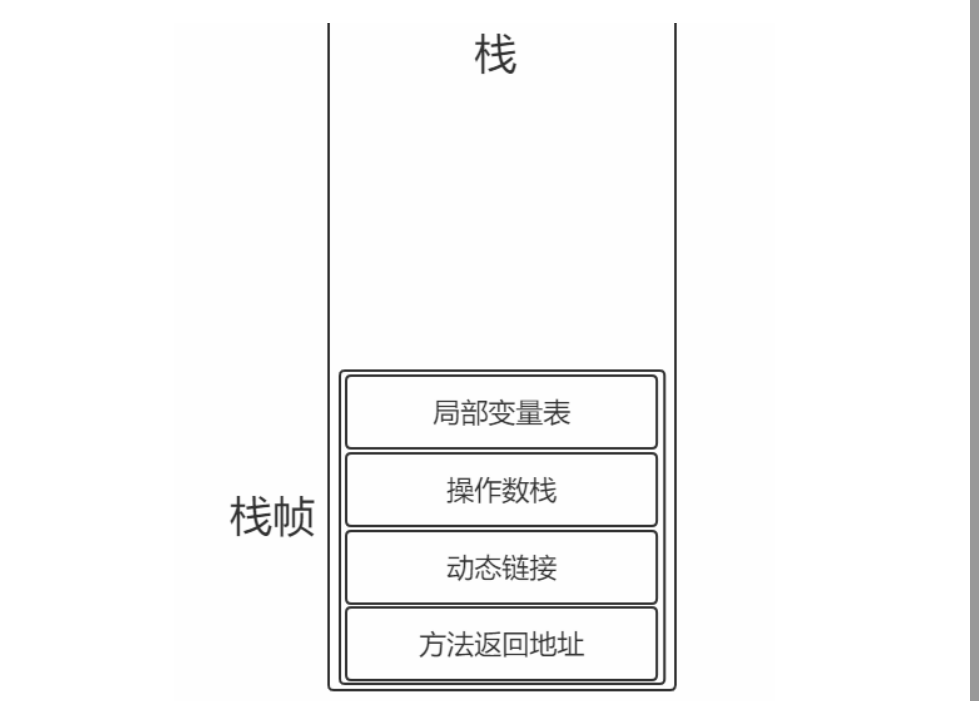
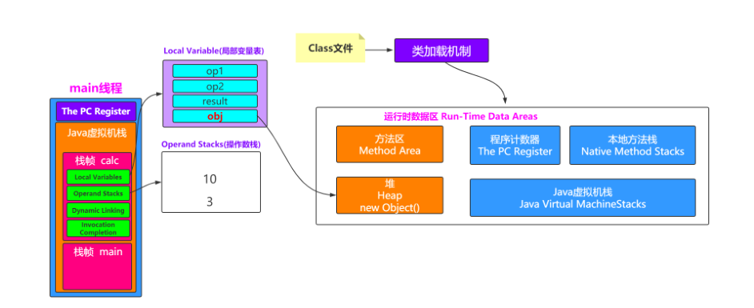
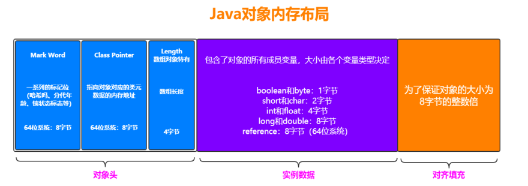
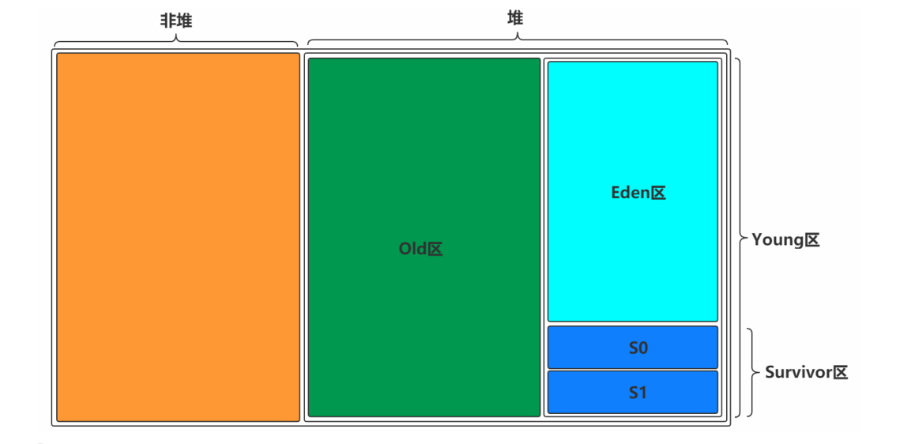
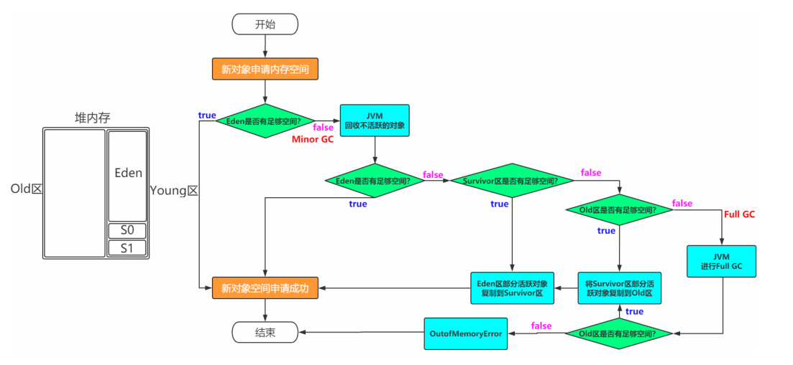

# 理解Java虚拟机栈和栈帧

图解：


栈帧：每个栈帧对应一个被调用的方法，可以理解为一个方法的运行空间。
每个栈帧中包括局部变量表(Local Variables)、操作数栈(Operand Stack)、指向运行时常量池的引用(A reference to the run-time constant pool)、方法返回地址(Return Address)和附加信息。

局部变量表:
方法中定义的局部变量以及方法的参数存放在这张表中局部变量表中的变量不可直接使用，如需要使用的话，必须通过相关指令将其加载至操作数栈中作为操作数使用。

操作数栈:
以压栈和出栈的方式存储操作数

动态链接:
每个栈帧都包含一个指向运行时常量池中该栈帧所属方法的引用，持有这个引用是为了支持方法调用过程中的动态连接(Dynamic Linking)。

方法返回地址:
当一个方法开始执行后,只有两种方式可以退出，一种是遇到方法返回的字节码指令；一种是遇见异常，并且这个异常没有在方法体内得到处理

```
javac Person.java --- 编译成JAVA的class文件

 javap -c Person.class > Person.txt -- 分解Person class文件并输出到一个Person.txt的文件

javap是 **Java class文件分解器** ，可以反编译，也可以查看java编译器生成的字节码。 用于分解class文件
```



方法区里可以指向堆，堆也可以指向方法区

# Java对象内存布局



# 内存模型





# 常见概念

Minor GC:新生代（也叫Young GC 包含Eden区和S区）
Major GC:老年代 （Major GC 通常会伴随着Minor GC ,也就是意味着触发Full GC）
Full GC:新生代+老年代

为什么需要Survivor区?只有Eden不行吗？

如果没有Survivor,Eden区每进行一次Minor GC ,并且没有年龄限制的话， 存活的对象就会被送到老年代。这样一来，老年代很快被填满,触发Major GC(因为Major GC一般伴随着Minor GC,也可以看做触发了Full GC)。老年代的内存空间远大于新生代,进行一次Full GC消耗的时间比Minor GC长得多。执行时间长有什么坏处?频发的Full GC消耗的时间很长,会影响大型程序的执行和响应速度。
可能你会说，那就对老年代的空间进行增加或者较少咯。
假如增加老年代空间，更多存活对象才能填满老年代。虽然降低Full GC频率，但是随着老年代空间加大,一旦发生Full GC,执行所需要的时间更长。
假如减少老年代空间，虽然Full GC所需时间减少，但是老年代很快被存活对象填满,Full GC频率增加。
所以Survivor的存在意义,就是减少被送到老年代的对象,进而减少Full GC的发生,Survivor的预筛选保证,只有经历16次Minor GC还能在新生代中存活的对象,才会被送到老年代。

为什么需要两个Survivor区？
最大的好处就是解决了碎片化。也就是说为什么一个Survivor区不行?第一部分中,我们知道了必须设置Survivor区。假设现在只有一个Survivor区,我们来模拟一下流程:
刚刚新建的对象在Eden中,一旦Eden满了,触发一次Minor GC,Eden中的存活对象就会被移动到Survivor区。这样继续循环下去,下一次Eden满了的时候,问题来了,此时进行Minor GC,Eden和Survivor各有一些存活对象,如果此时把Eden区的存活对象硬放到Survivor区,很明显这两部分对象所占有的内存是不连续的,也就导致了内存碎片化。永远有一个Survivor space是空的,另一个非空的Survivor space无碎片

新生代中Eden:S1:S2为什么是8:1:1？
新生代中的可用内存：复制算法用来担保的内存为9：1
可用内存中Eden：S1区为8：1
即新生代中Eden:S1:S2 = 8：1：1

# 备注：

如何启动Java VisualVM
1 cd D:\JDK1.8\jdk1.8\bin
2  jvisualvm.exe


