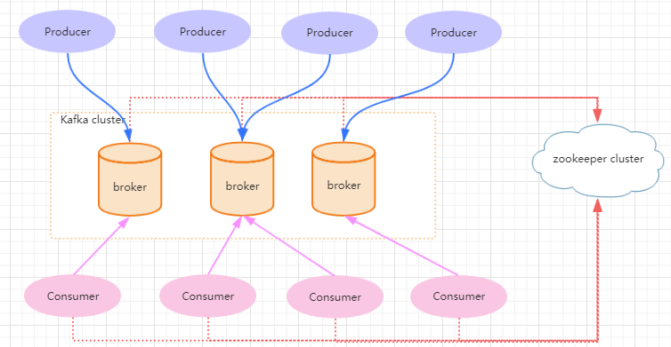

# Kafka的介绍

Kafka是一款分布式消息发布和订阅系统，它的特点是高性能、高吞吐量。

最早设计的目的是作为LinkedIn的活动流和运营数据的处理管道。这些数据主要是用来对用户做用户画像分析以及服务器性能数据的一些监控，所以kafka一开始设计的目标就是作为一个分布式、高吞吐量的消息系统，所以适合运用在大数据传输场景。所以kafka在我们大数据的课程里面也有讲解，但是在Java的课程中，我们仍然主要是讲解kafka
作为分布式消息中间件来讲解。不会去讲解到数据流的处理这块

# Kafka的应用场景

行为跟踪
日志收集

# 架构



## 名词解释

Broker

Kafka集群包含一个或多个服务器，这种服务器被称为broker。broker端不维护数据的消费状态，提升了性能。直接使用磁盘进行存储，线性读写，速度快：避免了数据在JVM内存和系统内存之间的复制，减少耗性能的创建对象和垃圾回收

Producer
负责发布消息到Kafka broke

Consumer
消息消费者，向Kafka broker读取消息的客户端，consumer从broker拉取(pull)数据并进行处理

Topic
每条发布到Kafka集群的消息都有一个类别，这个类别被称为Topic。（物理上不同Topic的消息分开存
储，逻辑上一个Topic的消息虽然保存于一个或多个broker上但用户只需指定消息的Topic即可生产或消
费数据而不必关心数据存于何处）

Partition
Parition是物理上的概念，每个Topic包含一个或多个Partition

Consumer Group

每个Consumer属于一个特定的Consumer Group（可为每个Consumer指定group name，若不指定group name则属于默认的group

Topic & Partition
Topic在逻辑上可以被认为是一个queue，每条消费都必须指定它的Topic，可以简单理解为必须指明把
这条消息放进哪个queue里。为了使得Kafka的吞吐率可以线性提高，物理上把Topic分成一个或多个
Partition，每个Partition在物理上对应一个文件夹，该文件夹下存储这个Partition的所有消息和索引文
件。若创建topic1和topic2两个topic，且分别有13个和19个分区，则整个集群上会相应会生成共32个
文件夹（本文所用集群共8个节点，此处topic1和topic2 replication-factor均为1）

# kafka的基本操作

创建topic

```
sh kafka-topics.sh --create --zookeeper localhost:2181 --replication-factor 1 --
partitions 1 --topic test
```

查看topic

```
sh kafka-topics.sh --list --zookeeper localhost:2181
```

查看topic属性

```
sh kafka-topics.sh --describe --zookeeper localhost:2181 --topic first_topic
```

消费消息

```
sh kafka-console-consumer.sh --bootstrap-server 192.168.13.106:9092 --topic test
--from-beginning
```

发送消息

```
sh kafka-console-producer.sh --broker-list 192.168.244.128:9092 --topic
first_topic
```


