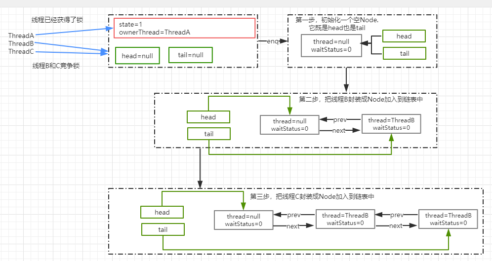
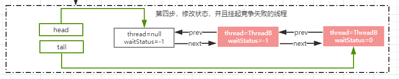

# JUC是什么

并发工具包

# AQS

同步工具（既然锁在抢占的时候，只允许一个线程获得，那其他的线程是什么状态，这个就需要一个aqs的同步工具，也就是规则来给这些排队，构造一个队列，然后再考虑如何来获取锁）

- 独占-互斥
- 共享

# AQS基本实现

# 锁的基本要素

- 状态：一个共享的状态来记录锁的状态（无锁、有锁）
  State :锁的状态 （0：无锁，>0 ：有锁）
