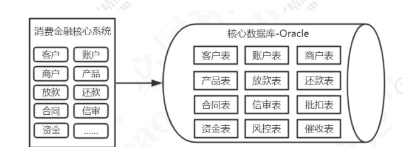
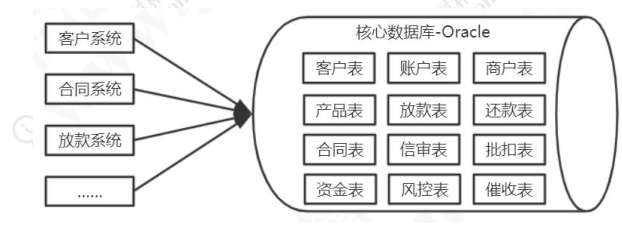
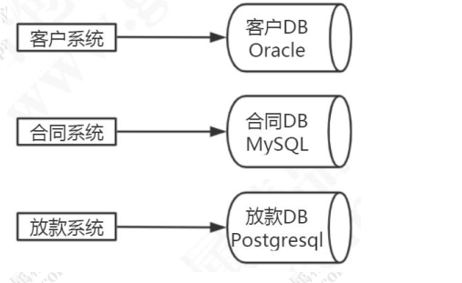
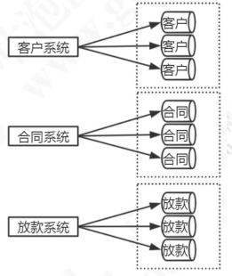
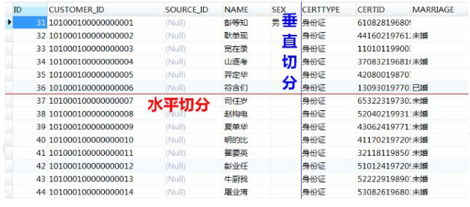
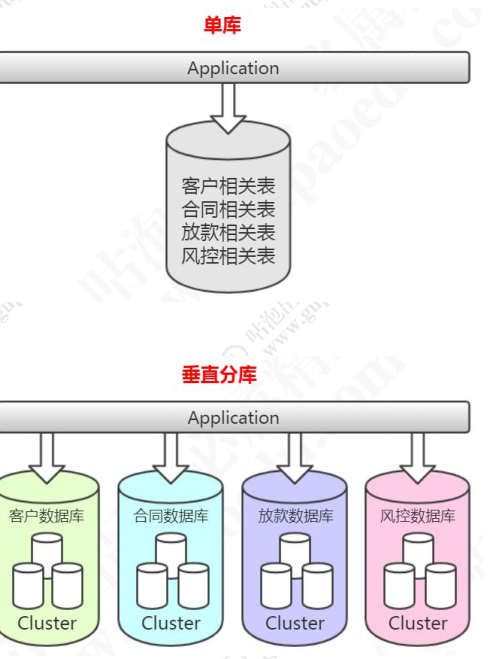
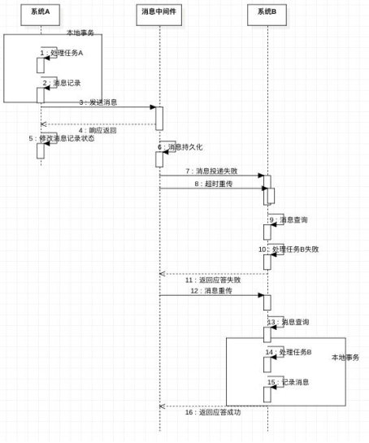
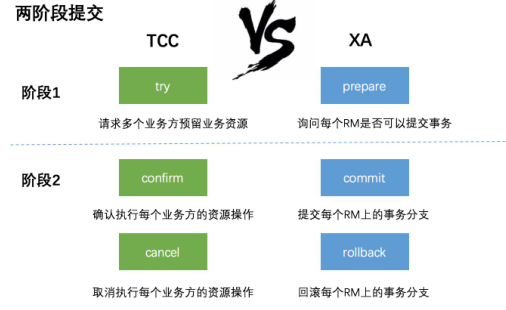
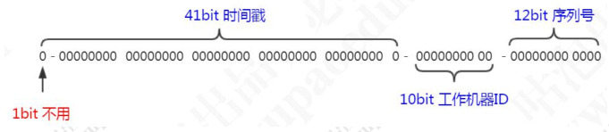
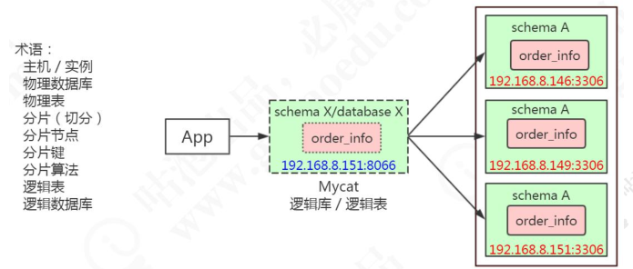

# 1 **为什么要分库分表**

## 1.1 **数据库性能瓶颈的出现**

对于应用来说，如果数据库性能出现问题，要么是无法获取连接，是因为在高并发的情况下连接数不够了。要么是操作数据变慢，数据库处理数据的效率除了问题。要么是存储出现问题，比如单机存储的数据量太大了，存储的问题也可能会导致性能的问题。

归根结底都是受到了硬件的限制，比如CPU，内存，磁盘，网络等等。但是我们优化肯定不可能直接从扩展硬件入手，因为带来的收益和成本投入比例太比。

所以我们先来分析一下，当我们处理数据出现无法连接，或者变慢的问题的时候，

我们可以从哪些层面入手。

## 1.2 **数据库优化方案对比**

数据库优化有很多层面。

### 1.2.1 **SQL**** 与索引**

因为SQL 语句是在我们的应用端编写的，所以第一步，我们可以在程序中对 SQL 语句进行优化，最终的目标是用到索引。这个是容易的也是最常用的优化手段。

### 1.2.2 **表与存储引擎**

第二步，数据是存放在表里面的，表又是以不同的格式存放在存储引擎中的，所以我们可以选用特定的存储引擎，或者对表进行分区，对表结构进行拆分或者冗余处理，或者对表结构比如字段的定义进行优化。

### 1.2.3 **架构**

第三步，对于数据库的服务，我们可以对它的架构进行优化。

如果只有一台数据库的服务器，我们可以运行多个实例，做集群的方案，做负载均衡。

或者基于主从复制实现读写分离，让写的服务都访问master 服务器，读的请求都访问从服务器，slave 服务器自动master 主服务器同步数据。

或者在数据库前面加一层缓存，达到减少数据库的压力，提升访问速度的目的。

为了分散数据库服务的存储压力和访问压力，我们也可以把不同的数据分布到不同的服务节点，这个就是分库分表（scale out）。

注意主从（replicate）和分片（shard）的区别： 主从通过数据冗余实现高可用，和实现读写分离。分片通过拆分数据分散存储和访问压力。

### 1.2.4 **配置**

第四步，是数据库配置的优化，比如连接数，缓冲区大小等等，优化配置的目的都是为了更高效地利用硬件。

### 1.2.5 **操作系统与硬件**

最后一步操作系统和硬件的优化。

从上往下，成本收益比慢慢地在增加。所以肯定不是查询一慢就堆硬件，堆硬件叫做向上的扩展（scale up）。

什么时候才需要分库分表呢？我们的评判标准是什么？

如果是数据量的话，一张表存储了多少数据的时候，才需要考虑分库分表？如果是数据增长速度的话，每天产生多少数据，才需要考虑做分库分表？

如果是应用的访问情况的话，查询超过了多少时间，有多少请求无法获取连接，才需要分库分表？这是一个值得思考的问题。

## 1.3 **架构演进与分库分表**

### 1.3.1 **单应用单数据库**

2013 年的时候，我们公司采购了一个消费金融核心系统，这个是一个典型的单体架构的应用。同学们应该也很熟悉，单体架构应用的特点就是所有的代码都在一个工程里面，打成一个war 包部署到tomcat，最后运行在一个进程中。

这套消费金融的核心系统，用的是Oracle 的数据库，初始化以后有几百张表，比如客户信息表、账户表、商户表、产品表、放款表、还款表等等。


为了适应业务的发展，我们这一套系统不停地在修改，代码量越来越大，系统变得越来越臃肿。为了优化系统，我们搭集群，负载均衡，加缓存，优化数据库，优化业务代码系统，但是都应对不了系统的访问压力。

所以这个时候系统拆分就势在必行了。我们把以前这一套采购的核心系统拆分出来很多的子系统，比如提单系统、商户管理系统、信审系统、合同系统、代扣系统、催收系统，所有的系统都依旧共用一套Oracle 数据库。

### 1.3.2 **多应用单数据库**

对代码进行了解耦，职责进行了拆分，生产环境出现问题的时候，可以快速地排查和解决。

4



这种多个子系统共用一个DB 的架构，会出现一些问题。

第一个就是所有的业务系统都共用一个DB，无论是从性能还是存储的角度来说，都是满足不了需求的。随着我们的业务继续膨胀，我们又会增加更多的系统来访问核心数据库，但是一个物理数据库能够支撑的并发量是有限的，所有的业务系统之间还会产生竞争，最终会导致应用的性能下降，甚至拖垮业务系统。

### 1.3.3 **多应用独立数据库**



所以这个时候，我们必须要对各个子系统的数据库也做一个拆分。这个时候每个业务系统都有了自己的数据库，不同的业务系统就可以用不同的存储方案。

所以，分库其实是我们在解决系统性能问题的过程中，对系统进行拆分的时候带来的一个必然的结果。现在的微服务架构也是一样的，只拆应用不拆分数据库，不能解决根本的问题。

### 1.3.4 **什么时候分表？**

当我们对原来一个数据库的表做了分库以后，其中一些表的数据还在以一个非常快
的速度在增长，这个时候查询也已经出现了非常明显的效率下降。

所以，在分库之后，还需要进一步进行分表。当然，我们最开始想到的可能是在一个数据库里面拆分数据，分区或者分表，到后面才是切分到多个数据库中。

分表主要是为了减少单张表的大小，解决单表数据量带来的性能问题。



我们需要清楚的是，分库分表会提升系统的复杂度，如果在近期或者未来一段时间内必须要解决存储和性能的问题，就不要去做超前设计和过度设计。就像我们搭建项目，从快速实现的角度来说，肯定是从单体项目起步的，在业务丰富完善之前，也用不到微服务架构。

如果我们创建的表结构合理，字段不是太多，并且索引创建正确的情况下，单张表存储几千万的数据是完全没有问题的，这个还是以应用的实际情况为准。当然我们也会对未来一段时间的业务发展做一个预判。

# 2 **分库分表的类型和特点**

从维度来说分成两种，一种是垂直，一种是水平。

垂直切分：基于表或字段划分，表结构不同。我们有单库的分表，也有多库的分库。水平切分：基于数据划分，表结构相同，数据不同，也有同库的水平切分和多库的切分。



## 2.1 **垂直切分**

垂直分表有两种，一种是单库的，一种是多库的。

### 2.1.1 **单库垂直分表**

单库分表，比如：商户信息表，拆分成基本信息表，联系方式表，结算信息表，附件表等等。

### 2.1.2 **多库垂直分表**

多库垂直分表就是把原来存储在一个库的不同的表，拆分到不同的数据库。

比如：消费金融核心系统数据库，有很多客户相关的表，这些客户相关的表，全部单独存放到客户的数据库里面。合同，放款，风控相关的业务表也是一样的。



当我们对原来的一张表做了分库的处理，如果某些业务系统的数据还是有一个非常快的增长速度，比如说还款数据库的还款历史表，数据量达到了几个亿，这个时候硬件

限制导致的性能问题还是会出现，所以从这个角度来说垂直切分并没有从根本上解决单库单表数据量过大的问题。在这个时候，我们还需要对我们的数据做一个水平的切分。

## 2.2 **水平切分**

当我们的客户表数量已经到达数千万甚至上亿的时候，单表的存储容量和查询效率都会出现问题，我们需要进一步对单张表的数据进行水平切分。水平切分的每个数据库的表结构都是一样的，只是存储的数据不一样，比如每个库存储 1000 万的数据。

水平切分也可以分成两种，一种是单库的，一种是多库的。

### 2.2.1 **单库水平分表**

银行的交易流水表，所有进出的交易都需要登记这张表，因为绝大部分时候客户都是查询当天的交易和一个月以内的交易数据，所以我们根据使用频率把这张表拆分成三张表：

当天表：只存储当天的数据。

当月表：在夜间运行一个定时任务，前一天的数据，全部迁移到当月表。用的是insert into select，然后delete。

历史表：同样是通过定时任务，把登记时间超过 30 天的数据，迁移到history 历史表（历史表的数据非常大，我们按照月度，每个月建立分区）。

费用表：

消费金融公司跟线下商户合作，给客户办理了贷款以后，消费金融公司要给商户返费用，或者叫提成，每天都会产生很多的费用的数据。为了方便管理，我们每个月建立一张费用表，例如fee_detail_201901……fee_detail_201912。

但是注意，跟分区一样，这种方式虽然可以一定程度解决单表查询性能的问题，但是并不能解决单机存储瓶颈的问题。

### 2.2.2 **多库水平分表**

另一种是多库的水平分表。比如客户表，我们拆分到多个库存储，表结构是完全一样的。

一般我们说的分库分表都是跨库的分表。

既然分库分表能够帮助我们解决性能的问题，那我们是不是马上动手去做，甚至在项目设计的时候就先给它分几个库呢？先冷静一下，我们来看一下分库分表会带来哪些问题，也就是我们前面说的分库分表之后带来的复杂性。

## 2.3 **多案分库分表带来的问题**

### 2.3.1 **跨库关联查询**

比如查询在合同信息的时候要关联客户数据，由于是合同数据和客户数据是在不同的数据库，那么我们肯定不能直接使用join 的这种方式去做关联查询。

我们有几种主要的解决方案：

1、字段冗余

比如我们查询合同库的合同表的时候需要关联客户库的客户表，我们可以直接把一些经常关联查询的客户字段放到合同表，通过这种方式避免跨库关联查询的问题。

2、数据同步：比如商户系统要查询产品系统的产品表，我们干脆在商户系统创建一张产品表，通过ETL 或者其他方式定时同步产品数据。

3、全局表（广播表） 比如行名行号信息被很多业务系统用到，如果我们放在核心系统，每个系统都要去关联查询，这个时候我们可以在所有的数据库都存储相同的基础数据。

4、ER 表（绑定表）

我们有些表的数据是存在逻辑的主外键关系的，比如订单表order_info，存的是汇总的商品数，商品金额；订单明细表order_detail，是每个商品的价格，个数等等。或者叫做从属关系，父表和子表的关系。他们之间会经常有关联查询的操作，如果父表的数据和子表的数据分别存储在不同的数据库，跨库关联查询也比较麻烦。所以我们能不能把父表和数据和从属于父表的数据落到一个节点上呢？

比如 order_id=1001 的数据在 node1 ， 它所有的明细数据也放到 node1 ；

order_id=1002 的数据在node2，它所有的明细数据都放到 node2，这样在关联查询的时候依然是在一个数据库。

上面的思路都是通过合理的数据分布避免跨库关联查询，实际上在我们的业务中，也是尽量不要用跨库关联查询，如果出现了这种情况，就要分析一下业务或者数据拆分是不是合理。如果还是出现了需要跨库关联的情况，那我们就只能用最后一种办法。

5、系统层组装

在不同的数据库节点把符合条件数据的数据查询出来，然后重新组装，返回给客户端。

### 2.3.2 **分布式事务**

比如在一个贷款的流程里面，合同系统登记了数据，放款系统也必须生成放款记录，如果两个动作不是同时成功或者同时失败，就会出现数据一致性的问题。如果在一个数据库里面，我们可以用本地事务来控制，但是在不同的数据库里面就不行了。所以分布式环境里面的事务，我们也需要通过一些方案来解决。

复习一下。分布式系统的基础是CAP 理论。

1.C (一致性) Consistency：对某个指定的客户端来说，读操作能返回最新的写操作。对于数据分布在不同节点上的数据来说，如果在某个节点更新了数据，那么在其他节点如果都能读取到这个最新的数据，那么就称为强一致，如果有某个节点没有读取到，那就是分布式不一致。

2.A (可用性) Availability：非故障的节点在合理的时间内返回合理的响应(不是错误和超时的响应)。可用性的两个关键一个是合理的时间，一个是合理的响应。

合理的时间指的是请求不能无限被阻塞，应该在合理的时间给出返回。合理的响应指的是系统应该明确返回结果并且结果是正确的

3.P (分区容错性) Partition tolerance：当出现网络分区后，系统能够继续工作。打个比方，这里集群有多台机器，有台机器网络出现了问题，但是这个集群仍然可以正工作。

CAP 三者是不能共有的，只能同时满足其中两点。基于AP，我们又有了BASE 理论。基本可用(Basically Available)：分布式系统在出现故障时，允许损失部分可用功能，保证核心功能可用。

软状态(Soft state)：允许系统中存在中间状态，这个状态不影响系统可用性， 这里指的是 CAP 中的不一致。

最终一致(Eventually consistent)：最终一致是指经过一段时间后，所有节点数据都将会达到一致。

分布式事务有几种常见的解决方案：

1、全局事务（比如 XA 两阶段提交；应用、事务管理器(TM)、资源管理器(DB)），例如Atomikos

2、基于可靠消息服务的分布式事务

13



3、柔性事务TCC（Try-Confirm-Cancel）tcc-transaction



4、最大努力通知，通过消息中间件向其他系统发送消息（重复投递+定期校对）

### 2.3.3 **排序、翻页、函数计算问题**

跨节点多库进行查询时，会出现limit 分页，order by 排序的问题。比如有两个节点，节点1 存的是奇数id=1,3,5,7,9……；节点 2 存的是偶数id=2,4,6,8,10……

执行select * from user_info order by id limit 0,10

需要在两个节点上各取出 10 条，然后合并数据，重新排序。

max、min、sum、count 之类的函数在进行计算的时候，也需要先在每个分片上执行相应的函数，然后将各个分片的结果集进行汇总和再次计算，最终将结果返回。

### 2.3.4 **全局主键避重问题**

MySQL 的数据库里面字段有一个自增的属性，Oracle 也有 Sequence 序列。如果

是一个数据库，那么可以保证ID 是不重复的，但是水平分表以后，每个表都按照自己的规律自增，肯定会出现ID 重复的问题，这个时候我们就不能用本地自增的方式了。

我们有几种常见的解决方案：

1） UUID（Universally Unique Identifier 通用唯一识别码）UUID 标准形式包含32 个16 进制数字，分为5 段，形式为8-4-4-4-12 的36 个字符，例如：c4e7956c-03e7-472c-8909-d733803e79a9。

xxxxxxxx-xxxx-Mxxx-Nxxx-xxxxxxxxxxxx

M 表示 UUID 版本，目前只有五个版本，即只会出现 1，2，3，4，5，数字 N 的一至三个最高有效位表示 UUID 变体，目前只会出现 8，9，a，b 四种情况。

1、基于时间和MAC 地址的UUID

2、基于第一版却更安全的DCE UUID

3、基于MD5 散列算法的UUID

4、基于随机数的UUID——用的最多，JDK 里面是 4

5、基于SHA1 散列算法的 UUID

UUID 是主键是最简单的方案，本地生成，性能高，没有网络耗时。但缺点也很明显，由于UUID 非常长，会占用大量的存储空间；另外，作为主键建立索引和基于索引进行查询时都会存在性能问题，在InnoDB 中，UUID 的无序性会引起数据位置频繁变动，导致分页。

2） 数据库

把序号维护在数据库的一张表中。这张表记录了全局主键的类型、位数、起始值，

当前值。当其他应用需要获得全局ID 时，先 for update 锁行，取到值+1 后并且更新后返回。并发性比较差。

3） Redis

基于Redis 的 INT 自增的特性，使用批量的方式降低数据库的写压力，每次获取一段区间的ID 号段，用完之后再去数据库获取，可以大大减轻数据库的压力。

4） 雪花算法Snowflake（64bit）



核心思想：

a） 使用41bit 作为毫秒数，可以使用 69 年

b） 0bit 作为机器的ID（5bit 是数据中心，5bit 的机器ID），支持1024 个节点

c） 2bit 作为毫秒内的流水号（每个节点在每毫秒可以产生4096 个ID）

d） 最后还有一个符号位，永远是0。代码：snowflake.SnowFlakeTest

优点：毫秒数在高位，生成的ID 整体上按时间趋势递增；不依赖第三方系统，稳定性和效率较高，理论上 QPS 约为 409.6w/s(1000*2^12)，并且整个分布式系统内不会产生ID 碰撞；可根据自身业务灵活分配bit 位。

不足就在于：强依赖机器时钟，如果时钟回拨，则可能导致生成ID 重复。

当我们对数据做了切分，分布在不同的节点上存储的时候，是不是意味着会产生多个数据源？既然有了多个数据源，那么在我们的项目里面就要配置多个数据源。

现在问题就来了，我们在执行一条SQL 语句的时候，比如插入，它应该是在哪个数据节点上面执行呢？又比如查询，如果只在其中的一个节点上面，我怎么知道在哪个节点，是不是要在所有的数据库节点里面都查询一遍，才能拿到结果？

那么，从客户端到服务端，我们可以在哪些层面解决这些问题呢？

## 2.4 **多数据源/读写数据源的解决方案**

我们先要分析一下SQL 执行经过的流程。

DAO——Mapper（ORM）——JDBC——代理——数据库服务

### 2.4.1 **客户端****DAO**** 层**

第一个就是在我们的客户端的代码，比如DAO 层，在我们连接到某一个数据源之前，我们先根据配置的分片规则，判断需要连接到哪些节点，再建立连接。

Spring 中提供了一个抽象类AbstractRoutingDataSource，可以实现数据源的动态切换。

SSM 工程：spring-boot-dynamic-data-source-master 步骤：

1） aplication.properties 定义多个数据源

2） 创建@TargetDataSource 注解

3） 创建DynamicDataSource 继承AbstractRoutingDataSource

4） 多数据源配置类DynamicDataSourceConfig

5） 创建切面类DataSourceAspect，对添加了@TargetDataSource 注解的类进行拦截设置数据源。

6） 在	启动类上	自动装配	数据源配置@Import({DynamicDataSourceConfig.class})

7） 在  实  现  类  上  加  上  注  解  ， 如 @TargetDataSource(name	=DataSourceNames.SECOND)，调用在DAO 层实现的优势：不需要依赖ORM 框架，即使替换了ORM 框架也不受影响。实现简单（不需要解析SQL 和路由规则），可以灵活地定制。

缺点：不能复用，不能跨语言。

### 2.4.2 **ORM**** 框架层**

第二个是在框架层，比如我们用MyBatis 连接数据库，也可以指定数据源。我们可以基于MyBatis 插件的拦截机制（拦截query 和update 方法），实现数据源的选择。

例如：

### 2.4.3 **驱动层**

不管是MyBatis 还是Hibernate，还是Spring 的JdbcTemplate，本质上都是对JDBC的封装，所以第三层就是驱动层。比如Sharding-JDBC，就是对JDBC 的对象进行了封装。JDBC 的核心对象：

DataSource：数据源

Connection：数据库连接

Statement：语句对象

ResultSet：结果集

那我们只要对这几个对象进行封装或者拦截或者代理，就可以实现分片的操作。

### 2.4.4 **代理层**

前面三种都是在客户端实现的，也就是说不同的项目都要做同样的改动，不同的编程语言也有不同的实现，所以我们能不能把这种选择数据源和实现路由的逻辑提取出来，做成一个公共的服务给所有的客户端使用呢？

这个就是第四层，代理层。比如Mycat 和Sharding-Proxy，都是属于这一层。

### 2.4.5 **数据库服务**

最后一层就是在数据库服务上实现，也就是服务层，某些特定的数据库或者数据库的特定版本可以实现这个功能。

# 3 **Mycat**** 概念与配置**

官网[http://www.mycat.io/](http://www.mycat.io/)

Mycat 概要介绍 [https://github.com/MyCATApache/Mycat-Server](https://github.com/MyCATApache/Mycat-Server)

入门指南[https://github.com/MyCATApache/Mycat-doc/tree/master/%E5%85%A5%E9%97%A8%E6%8C%87%E5%8D%97](https://github.com/MyCATApache/Mycat-doc/tree/master/%E5%85%A5%E9%97%A8%E6%8C%87%E5%8D%97)

## 3.1 **Mycat**** 介绍与核心概念**

### 3.1.1 **基本介绍**

历史：从阿里cobar 升级而来，由开源组织维护，2.0 正在开发中。

定位：运行在应用和数据库之间，可以当做一个MySQL 服务器使用，实现对MySQL 数据库的分库分表，也可以通过JDBC 支持其他的数据库。

Mycat 的关键特性（官网首页）

1、可以当做一个MySQL 数据库来使用

2、支持MySQL 之外的数据库，通过JDBC 实现

3、解决了我们提到的所有问题，多表 join、分布式事务、全局序列号、翻页排

序

4、支持ZK 配置，带监控 mycat-web

5、2.0 正在开发中

### 3.1.2 **核心概念**



| **概念** | **含义**                                          |
| ----------- | ---------------------------------------------------- |
| 主机      | 物理主机，一台服务器，一个数据库服务，一个3306端口 |

| 物理数据库 | 真实的数据库，例如146、150、151的gpcat数据库                            |
| ------------ | ------------------------------------------------------------------------- |
| 物理表     | 真实的表，例如146、150、151的gpcat数据库的order_info表                  |
| 分片       | 将原来单个数据库的数据切分后分散存储在不同的数据库节点                  |
| 分片节点   | 分片以后数据存储的节点                                                  |
| 分片键     | 分片依据的字段，例如order_info表以id为依据分片,id就是分片键，通常是主键 |
| 分片算法   | 分片的规则，例如随机、取模、范围、哈希、枚举以及各种组合算法            |
| 逻辑表     | 相对于物理表，是分片表聚合后的结果，对于客户端来说跟真实的表没有区别    |
| 逻辑数据库 | 相对于物理数据库，是数据节点聚合后的结果，例如catmall                   |

下载、解压Mycat（有Windows 版本，可以在本地数据库测试）

[http://dl.mycat.io/](http://dl.mycat.io/)

Mycat 解压以后有 5 个目录：

| **目录** | **作用** |
| ----------- | ----------- |
| bin       | 启动目录  |
| catlet    | 空目录    |
| conf      | 配置目录  |
| lib       | jar包依赖 |
| logs      | 日志目录  |

## 3.2 **Mycat**** 配置详解**

主要的配置文件server.xml、schema.xml、rule.xml 和具体的分片配置文件。坑非常多，配置错误会导致无法启动，这个时候要看日志！

注意备份，不知道什么时候就跑不起来了……

### 3.2.1 **server.xml**

包含系统配置信息。

system 标签：例如字符集、线程数、心跳、分布式事务开关等等。

user 标签：配置登录用户和权限。

mycat 对密码加密：

### 3.2.2 **schema.xml**

[https://dev.mysql.com/doc/refman/5.7/en/glossary.html#glos_schema](https://dev.mysql.com/doc/refman/5.7/en/glossary.html)

schema 在MySQL 里面跟数据库是等价的。

schema.xml 包括逻辑库、表、分片规则、分片节点和数据源，可以定义多个schema。这里面有三个主要的标签（table、dataNode、dataHost）：

#### **<table/>**

表名和库名最好都用小写

定义了逻辑表，以及逻辑表分布的节点和分片规则：

| **配置**   | **作用**                                                                                     |
| ------------- | ----------------------------------------------------------------------------------------------- |
|  primaryKey | 指定该逻辑表对应真实表的主键。MyCat会缓存主键（通过primaryKey属性配置）与具体dataNode的信息。 |

|               | 当分片规则（rule）使用非主键进行分片时，那么在使用主键进行查询时，MyCat就会通过缓存先确定记录在哪个dataNode上，然后再在该dataNode上执行查询。如果没有缓存/缓存并没有命中的话，还是会发送语句给所有的dataNode。 |
| --------------- | ---------------------------------------------------------------------------------------------------------------------------------------------------------------------------------------------------------------- |
| dataNode      | 数据分片的节点                                                                                                                                                                                                 |
| autoIncrement | 自增长（全局序列），true代表主键使用自增长策略                                                                                                                                                                 |
| type          | 全局表：global。其他：不配置                                                                                                                                                                                   |

#### **<dataNode/>**

数据节点与物理数据库的对应关系。

#### **<dataHost/>**

配置物理主机的信息，readhost 是从属于writehost 的。

balance：负载的配置，决定select 语句的负载

| **值** | **作用**                                                            |
| --------- | ---------------------------------------------------------------------- |
| 0       | 不开启读写分离机制，所有读操作都发送到当前可用的writeHost上。        |
| 1       | 所有读操作都随机发送到当前的writeHost对应的readHost和备用的writeHost |
| 2       | 所有的读操作都随机发送到所有的writeHost,readHost上                   |
| 3       | 所有的读操作都只发送到writeHost的readHost上                          |

writeType：读写分离的配置，决定update、delete、insert 语句的负载

| **值** | **作用**                                                                   |
| --------- | ----------------------------------------------------------------------------- |
| 0       | 所有写操作都发送到可用的writeHost上（默认第一个，第一个挂了以后发到第二个） |
| 1       | 所有写操作都随机的发送到writeHost                                           |

switchType：主从切换配置

| **值** | **作用**                                                                                        |
| --------- | -------------------------------------------------------------------------------------------------- |
| -1      | 表示不自动切换                                                                                   |
| 1       | 默认值，表示自动切换                                                                             |
| 2       | 基于MySQL主从同步的状态决定是否切换,心跳语句为show slave status                                  |
| 3       | 基于MySQL galary cluster 的切换机制（适合集群）（1.4.1），心跳语句为 show status like 'wsrep%'。 |

### 3.2.3 **rule.xml**

定义了分片规则和算法分片规则：

分片配置：rang-long-cust.txt

### 3.2.4 **ZK**** 配置**

[https://www.cnblogs.com/leeSmall/p/9551038.html](https://www.cnblogs.com/leeSmall/p/9551038.html)

Mycat 也支持ZK 配置（ 用于管理配置和生成全局ID ） ，执行bin 目录下

init_zk_data.sh,会自动将zkconf 下的所有配置文件上传到ZK（先拷贝到这个目录）。rs\86151\AppData\Local\Temp\ksohtml6660\wps48.png) |

启用 ZK 配 置 ： mycat/conf/myid.properties

注意如果执行 init_zk_data.sh 脚本报错的话，代表未写入成功，此时不要启用 ZK 配置并重启，否则本地文件会被覆盖。

启动时如果 loadzk=true 启动时，会自动从zk 下载配置文件覆盖本地配置。

在这种情况下如果修改配置，需要先修改conf 目录的配置，copy 到zkconf，再执行上传。

### 3.2.5 **启动停止**

进入mycat/bin 目录（注意要先启动物理数据库）：

| **操作** | **命令**       |
| ----------- | ----------------- |
| 启动      | ./mycat start   |
| 停止      | ./mycat stop    |
| 重启      | ./mycat restart |
| 查看状态  | ./mycat status  |
| 前台运行  | ./mycat console |

连接：

## 3.3 **Mycat**** 分片验证**

explain 可以用来看路由结果在三个数据库中建表
|

schema.xml

数据节点配置

```
<dataNode name="dn3" dataHost="host3" database="gpcat"/>

<dataHost balance="0" maxCon="1000" minCon="10" name="host1" writeType="0" switchType="1" slaveThreshold="100" dbType="mysql" dbDriver="native">

<heartbeat>select user()</heartbeat>

<writeHost host="hostM1" url="192.168.8.146:3306" password="123456" user="root"/>

</dataHost>

<dataHost balance="0" maxCon="1000" minCon="10" name="host2" writeType="0" switchType="1" slaveThreshold="100" dbType="mysql" dbDriver="native">

<heartbeat>select user()</heartbeat>

<writeHost host="hostM1" url="192.168.8.150:3306" password="123456" user="root"/>

</dataHost>

<dataHost balance="0" maxCon="1000" minCon="10" name="host3" writeType="0" switchType="1" slaveThreshold="100" dbType="mysql" dbDriver="native">

<heartbeat>select user()</heartbeat>

<writeHost host="hostM1" url="192.168.8.151:3306" password="123456" user="root"/>

</dataHost>
```

schema——rule.xml——分片配置

### 3.3.1 **范围分片**

customer

### 3.3.2 **取模分片（ER** ** 表** **）**

order_info

order_detail

### 3.3.3 **全局表**

student

## 3.4 **Mycat**** 全局****ID**

Mycat 全局序列实现方式主要有 4 种：本地文件方式、数据库方式、本地时间戳算法、ZK。也可以自定义业务序列。

注意获取全局ID 的前缀都是：MYCATSEQ_

### 3.4.1 **文件方式**

配置文件server.xml sequnceHandlerType 值：

0 文件 1 数据库 2 本地时间戳 3 ZK

优点：本地加载，读取速度较快。

缺点：当 Mycat 重新发布后，配置文件中的 sequence 需要替换。Mycat 不能做集群部署。

### 3.4.2 **数据库方式**

### 3.4.3 **本地时间戳方式**

ID= 64 位二进制 (42(毫秒)+5(机器 ID)+5(业务编码)+12(重复累加) ，长度为

18 位

配置文件sequence_time_conf.properties

验证：select next value for MYCATSEQ_GLOBAL

### 3.4.4 **ZK**** 方式**

修改conf/myid.properties

设置loadZk=true（启动时会从ZK 加载配置，一定要注意备份配置文件，并且先用bin/init_zk_data.sh,把配置文件写入到ZK）
png) |

配置文件：sequence_distributed_conf.properties

复制配置文件

验证：select next value for MYCATSEQ_GLOBAL

### 3.4.5 **使用**

在schema.xml 的table 标签上配置autoIncrement="true"，不需要获取和指定序列的情况下，就可以使用全局ID 了。

# 4 **Mycat**** 监控与日志查看**

## 4.1 **监控**

### 4.1.1 **命令行监控**

连接到管理端口 9066，注意必须要带 IP

| **命令**       | **作用**                      |
| ----------------- | -------------------------------- |
| show @@server   | 查看服务器状态，包括占用内存等 |
| show @@database | 查看数据库                     |

| show @@datanode    | 查看数据节点                                                                                                                              |
| -------------------- | ------------------------------------------------------------------------------------------------------------------------------------------- |
| show @@datasource  | 查看数据源                                                                                                                                |
|  show @@connection | 该命令用于获取Mycat的前端连接状态，即应用与mycat的连接                                                                                    |
| show @@backend     | 查看后端连接状态                                                                                                                          |
|    show @@cache    | 查看缓存使用情况SQLRouteCache：sql路由缓存。TableID2DataNodeCache： 缓存表主键与分片对应关系。ER_SQL2PARENTID：缓存ER分片中子表与父表关系 |
|  reload @@config   | 重新加载基本配置，使用这个命令时mycat服务不可用                                                                                           |
| show @@sysparam    | 参看参数                                                                                                                                  |
| show @@sql.high    | 执行频率高的SQL                                                                                                                           |
|  show @@sql.slow   | 慢SQL设置慢SQL的命令：reload @@sqlslow=5 ;                                                                                                |

### 4.1.2 **命令行监控****mycatweb**** 监控**

[https://github.com/MyCATApache/Mycat-download/tree/master/mycat-web-1.0](https://github.com/MyCATApache/Mycat-download/tree/master/mycat-web-1.0)

Mycat-eye 是mycat 提供的一个监控工具，它依赖于ZK。本地必须要运行一个ZK，必须先启动ZK。

参考：[https://gper.club/articles/7e7e7f7ff7g59gc3g64](https://gper.club/articles/7e7e7f7ff7g59gc3g64)

停止：kill start.jar 相关的进程

访问端口 8082 http://192.168.8.151:8082/mycat/ mycat server.xml 配置

重启mycat 服务生效

## 4.2 **日志**

log4j 的level 配置要改成debug

### 4.2.1 **wrapper.log**** 日志**

wrapper 日志：mycat 启动，停止，添加为服务等都会记录到此日志文件，如果系统环境配置错误或缺少配置时，导致Mycat 无法启动，可以通过查看wrapper.log 定位具体错误原因。

### 4.2.2 **mycat.log**** 日志**

mycat.log 为mycat 主要日志文件，记录了启动时分配的相关buffer 信息，数据源连接信息，连接池，动态类加载信息等等。

在conf/log4j2.xml 文件中进行相关配置，如保留个数，大小，字符集，日志文件大小等。

以select 为例。

