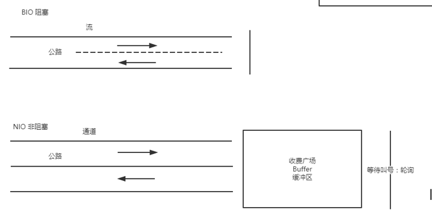

# Input和Output

参考:相对于内存而言的

# 阻塞 (Block) 和非阻塞

阻塞：往往需要等待缓冲区中的数据准备好过后才处理其他的事情，否则一直等待在那
非阻塞：当我们的进程访问我们的数据缓冲区的时候，如果数据没有准备好则直接返回，不会等待。如果数据已经准备好，也直接返回

阻塞：数据没有到内存，就一直等待，等到数据到内存之后，再拷贝到JVM中
非阻塞：数据不管有没有到内存，通过主线程轮询（selector）
阻塞和非阻塞：参照的是IO的操作

# 同步 (Synchronization) 和异步

同步和异步都是基于应用程序和操作系统处理 IO 事件所采用的方式。

- 同步：是应用程序要直接参与 IO 读写 的操作。同步方式在处理 IO 事件的时候，必须阻塞在某个方法上面等待我们的 IO 事件完成(阻塞 IO 事件或者通过轮询 IO事件的方式)，阻塞到 IO 事件，阻塞到 read 或则 write。这个时候我们就完全不能做自己的事情。让读写方法加入到线程里面，然后阻塞线程来实现，对线程的性能开销比较大
- 异步：所有的 IO 读写交给操作系统去处理，应用程序只需要等待通知。
  对于异步来说，所有的 IO 读写都交给了操作系统。这个时候，我们可以去做其他的事情，并不需要去完成真正的 IO 操作，当操作完成 IO 后，会给我们的应用程序一个通知。

同步和异步是参照时间而言的

# Netty

用来封装IO操作的框架

# BIO 和NIO的区别

