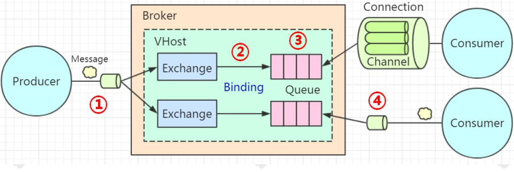
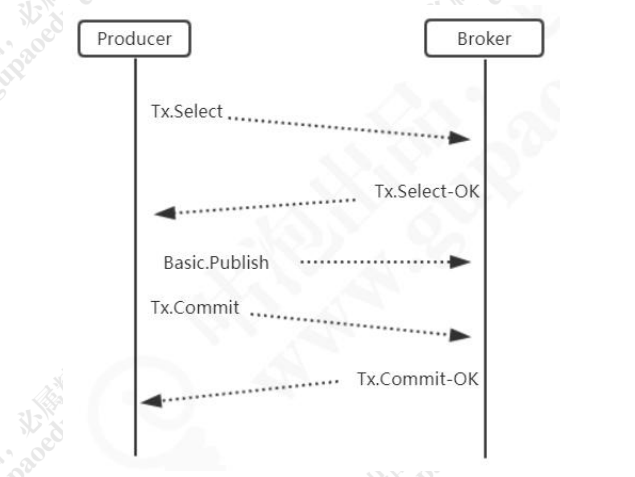
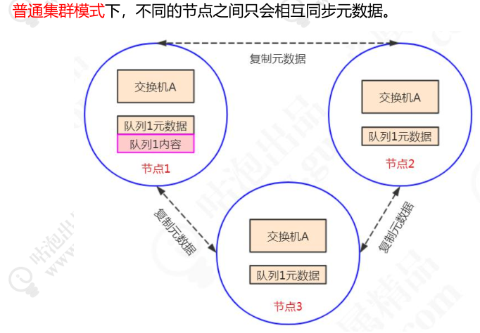
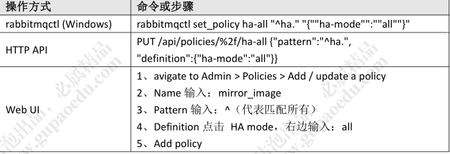
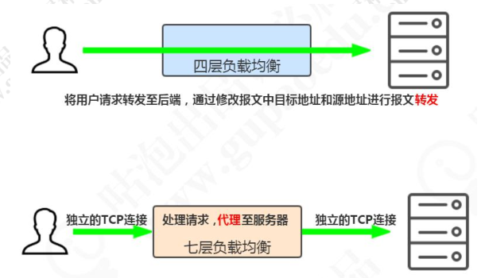
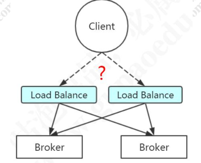
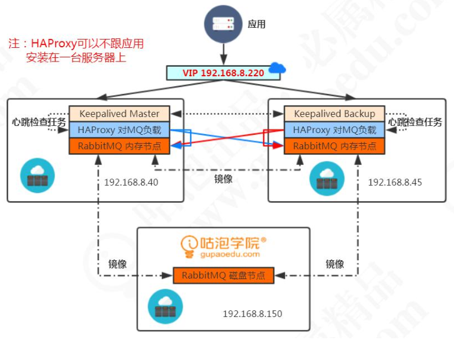

# RabbitMQ可靠性投递与高可用架构

## 可靠性投递

建议：先在数据库发消息，不会因数据回滚而导致数据发送的错误

一系列的思考，引发了一个可靠性的问题，所以RabbitMQ肯定是需要一个机制来保证消息的可靠性投递

那么，就让我们进一步来了解这种机制

首先要明确，效率和可靠性是互斥关系，不可以兼得，这个可以根据业务场景进行调整

回顾一下整个RabbitMQ的


在我们使用 RabbitMQ 收发消息的时候，有几个主要环节：
1 代表消息从生产者发送到 Broker生产者把消息发到 Broker 之后，怎么知道自己的消息有没有被 Broker 成功接收？

2 代表消息从 Exchange 路由到 Queue
Exchange 是一个绑定列表，如果消息没有办法路由到正确的队列，会发生什么事情？应该怎么处理？

3 代表消息在 Queue 中存储
队列是一个独立运行的服务，有自己的数据库（Mnesia），它是真正用来存储消
息的。如果还没有消费者来消费，那么消息要一直存储在队列里面。如果队列出了问
题，消息肯定会丢失。怎么保证消息在队列稳定地存储呢？

4 代表消费者订阅 Queue 并消费消息
队列的特性是什么？FIFO。队列里面的消息是一条一条的投递的，也就是说，只
有上一条消息被消费者接收以后，才能把这一条消息从数据库删掉，继续投递下一条
消息。那么问题来了，Broker 怎么知道消费者已经接收了消息呢？

## 消息发送到  RabbitMQ  服务器

第一个环节是生产者发送消息到Broker，存在的问题就是因为网络或者Broker的问题导致发送失败

所以，RabbitMQ推出了两种机制服务端确认机制，相当于服务器会跟生产者应答

具体有两种模式：
第一种是 Transaction（事务）模式，第二种 Confirm（确认）模式

### Transaction（事务）模式

我们通过一个 channel.txSelect()的方法把信道设置成事务模式，然后就可以发布消息给 RabbitMQ 了，如果 channel.txCommit();的方法调用成功，就说明事务提交成功，则消息一定到达了 RabbitMQ 中。

如果在事务提交执行之前由于 RabbitMQ 异常崩溃或者其他原因抛出异常，这个时候我们便可以将其捕获，进而通过执行 channel.txRollback()方法来实现事务回滚



在事务模式里面，只有收到了服务端的 Commit-OK 的指令，才能提交成功。所以
可以解决生产者和服务端确认的问题。但是事务模式有一个缺点，它是阻塞的，一条消
息没有发送完毕，不能发送下一条消息，它会榨干 RabbitMQ 服务器的性能。所以不建
议大家在生产环境使用

（2）Spring Boot中的设置

```java
rabbitTemplate.setChannelTransacted(true);
```

### Confirm（确认）模式

那么有没有其他可以保证消息被 Broker 接收，但是又不大量消耗性能的方式呢？这个就是第二种模式，叫做确认（Confirm）模式

(1)确认模式有三种，一种是普通确认模式。
在生产者这边通过调用 channel.confirmSelect()方法将信道设置为 Confirm 模式，
然后发送消息。一旦消息被投递到所有匹配的队列之后，RabbitMQ 就会发送一个确认
（Basic.Ack）给生产者，也就是调用 channel.waitForConfirms()返回 true，这样生产
者就知道消息被服务端接收了

因为一条条发很麻烦，有没有一种卡么一批量确认的方式，好事者，果然有

批 量 确 认 ， 就 是 在 开 启 Confirm 模 式 后 ， 先 发 送 一 批 消 息 。 只 要
channel.waitForConfirmsOrDie();方法没有抛出异常，就代表消息都被服务端接收了

但是批量又可能出现新的问题，什么问题？就是太多太少都不好，太多，有可能发了999条，其中一条需要回滚，太小还不如用单条哦，所以就又可以再次优化

边发送边确定，就是异步确认模式
异步确认模式需要添加一个 ConfirmListener，并且用一个 SortedSet 来维护没有被确认的消息

Confirm 模式是在 Channel 上开启的，因为 RabbitTemplate 对 Channel 进行了封装，叫做 ConfimrCallback

```java
rabbitTemplate.setConfirmCallback(new RabbitTemplate.ConfirmCallback() {
@Override
public void confirm(CorrelationData correlationData, boolean ack, String cause) {
if (!ack) {
System.out.println("发送消息失败：" + cause);
throw new RuntimeException("发送异常：" + cause);
}
}
});
```

### 消息从交换机路由到队列

第二个环节就是消息从交换机路由到队列
有什么问题?路由键错或者队列不在

具体：一种是让服务端重发给生产者、一种是让交换机路由到另一个备份的交换机

消息回发的方式：使用 mandatory 参数和 ReturnListener（在 Spring AMQP 中是
ReturnCallback）

```java
rabbitTemplate.setMandatory(true);
rabbitTemplate.setReturnCallback(new RabbitTemplate.ReturnCallback(){

public void returnedMessage(Message message,
int replyCode,
String replyText,
String exchange,
String routingKey){
System.out.println("回发的消息：");
System.out.println("replyCode: "+replyCode);
System.out.println("replyText: "+replyText);
System.out.println("exchange: "+exchange);
System.out.println("routingKey: "+routingKey);
}
})
```

消息路由到备份交换机的方式：在创建交换机的时候，从属性中指定备份交换机

```java
Map<String,Object> arguments = new HashMap<String,Object>();
arguments.put("alternate-exchange","ALTERNATE_EXCHANGE"); // 指定交换机的备份交换机
​
channel.exchangeDeclare("TEST_EXCHANGE","topic", false, false, false, arguments)
```

PS:注意区别，队列可以指定死信交换机；交换机可以指定备份交换机

### 消息在队列中存储

本身会把消息的本身和元数据（队列、交换机、绑定）都保存到磁盘

(1)队列持久化

```java
@Bean("GpQueue")
public Queue GpQueue() {
// queueName, durable, exclusive, autoDelete, Properties
return new Queue("GP_TEST_QUEUE", true, false, false, new HashMap<>());
}
```

（2）交换机持久化

```java
@Bean("GpExchange")
public DirectExchange exchange() {
// exchangeName, durable, exclusive, autoDelete, Properties
return new DirectExchange("GP_TEST_EXCHANGE", true, false, new HashMap<>());
}
```

(3)消息持久化

```java
MessageProperties messageProperties = new MessageProperties();
messageProperties.setDeliveryMode(MessageDeliveryMode.PERSISTENT);
Message message = new Message("持久化消息".getBytes(), messageProperties);
rabbitTemplate.send("GP_TEST_EXCHANGE", "gupao.test", message);
```

(4)集群

### 消息投递到消费者

提供了一个机制，即消费者消息确认机制，消费者可以自动或者手动发送ACK给服务端
如果没有收到ACK的消息，消费者断开连接后，RabbitMQ 会把这条消息发送给其他消费者。如果没有其他消费者，消费者重启后会重新消费这条消息，重复执行业务逻辑
消费者在订阅队列时，可以指定autoAck参数，当autoAck等于false时，RabbitMQ会等待消费者显式地回复确认信号后才从队列中移去消息

那手动要如何弄呢？
SimpleRabbitListenerContainer 或者 SimpleRabbitListenerContainerFactory

```java
factory.setAcknowledgeMode(AcknowledgeMode.MANUAL);
```

application.properties
spring.rabbitmq.listener.direct.acknowledge-mode=manual
spring.rabbitmq.listener.simple.acknowledge-mode=manual

注意这三个值的区别：
NONE：自动 ACK
MANUAL： 手动 ACK
AUTO：如果方法未抛出异常，则发送 ack。
当抛出 AmqpRejectAndDontRequeueException 异常的时候，则消息会被拒绝，
且不重新入队。当抛出 ImmediateAcknowledgeAmqpException 异常，则消费者会
发送 ACK。其他的异常，则消息会被拒绝，且 requeue = true 会重新入队

在 Spring Boot 中，消费者又怎么调用 ACK，或者说怎么获得 Channel 参数呢？

```java
public class SecondConsumer {
@RabbitHandler
public void process(String msgContent,Channel channel, Message message) throws IOException {
System.out.println("Second Queue received msg : " + msgContent );
channel.basicAck(message.getMessageProperties().getDeliveryTag(), false);
}
}
```

如果消息无法处理或者消费失败，也有两种拒绝的方式，Basic.Reject()拒绝单条，
Basic.Nack()批量拒绝。如果 requeue 参数设置为 true，可以把这条消息重新存入队列，
以便发给下一个消费者（当然，只有一个消费者的时候，这种方式可能会出现无限循环
重复消费的情况。可以投递到新的队列中，或者只打印异常日志）

所以，这个是生产者最终确定消费者有没有消费成功的两种方式：
1） 消费者收到消息，处理完毕后，调用生产者的 API（思考：是否破坏解耦？）
2） 消费者收到消息，处理完毕后，发送一条响应消息给生产者

### 消费者回调

1） 调用生产者 API
例如：提单系统给其他系统发送了碎屏保消息后，其他系统必须在处理完消息
后调用提单系统提供的 API，来修改提单系统中数据的状态。只要 API 没有被调用，
数据状态没有被修改，提单系统就认为下游系统没有收到这条消息。
2） 发送响应消息给生产者
例如：商业银行与人民银行二代支付通信，无论是人行收到了商业银行的消息，
还是商业银行收到了人行的消息，都必须发送一条响应消息（叫做回执报文）

### 补偿机制

如果生产者的 API 就是没有被调用，也没有收到消费者的响应消息，怎么办？
不要着急，可能是消费者处理时间太长或者网络超时。
生产者与消费者之间应该约定一个超时时间，比如 5 分钟，对于超出这个时间没有
得到响应的消息，可以设置一个定时重发的机制，但要发送间隔和控制次数，比如每隔 2
分钟发送一次，最多重发 3 次，否则会造成消息堆积。
重发可以通过消息落库+定时任务来实现。
重发，是否发送一模一样的消息？

参考：
ATM 机上运行的系统叫 C 端（ATMC），前置系统叫 P 端（ATMC），它接收 ATMC
的消息，再转发给卡系统或者核心系统。
1）如果客户存款，没有收到核心系统的应答，不知道有没有记账成功，最多发送 5次存款确认报文，因为已经吞钞了，所以要保证成功；
2）如果客户取款，ATMC 未得到应答时，最多发送 5 次存款冲正报文。因为没有吐钞，所以要保证失败。

### 消息幂等性

如果消费者每一次接收生产者的消息都成功了，只是在响应或者调用 API 的时候出
了问题，会不会出现消息的重复处理？例如：存款 100 元，ATM 重发了 5 次，核心系统
一共处理了 6 次，余额增加了 600 元。
所以，为了避免相同消息的重复处理，必须要采取一定的措施。RabbitMQ 服务端
是没有这种控制的（同一批的消息有个递增的 DeliveryTag），它不知道你是不是就要把
一条消息发送两次，只能在消费端控制。
如何避免消息的重复消费？
消息出现重复可能会有两个原因：
1、生产者的问题，环节①重复发送消息，比如在开启了 Confirm 模式但未收到
确认，消费者重复投递。
2、环节④出了问题，由于消费者未发送 ACK 或者其他原因，消息重复投递。
3、生产者代码或者网络问题。
对于重复发送的消息，可以对每一条消息生成一个唯一的业务 ID，通过日志或者消息落库来做重复控制

### 最终一致

如果确实是消费者宕机了，或者代码出现了 BUG 导致无法正常消费，在我们尝试多
次重发以后，消息最终也没有得到处理，怎么办？
例如存款的场景，客户的钱已经被吞了，但是余额没有增加，这个时候银行出现了
长款，应该怎么处理？如果客户没有主动通知银行，这个问题是怎么发现的？银行最终
怎么把这个账务做平？
在我们的金融系统中，都会有双方对账或者多方对账的操作，通常是在一天的业务
结束之后，第二天营业之前。我们会约定一个标准，比如 ATM 跟核心系统对账，肯定是
以核心系统为准。ATMC 获取到核心的对账文件，然后解析，登记成数据，然后跟自己
记录的流水比较，找出核心有 ATM 没有，或者 ATM 有核心没有，或者两边都有但是金
额不一致的数据。
对账之后，我们再手工平账。比如取款记了账但是没吐钞的，做一笔冲正。存款吞
了钞没记账的，要么把钱退给客户，要么补一笔账

### 消息的顺序性

消息的顺序性指的是消费者消费消息的顺序跟生产者生产消息的顺序是一致的。例如：商户信息同步到其他系统，有三个业务操作：1、新增门店 2、绑定产品 3、激活门店，这种情况下消息消费顺序不能颠倒（门店不存在时无法绑定产品和激活）。

又比如：1、发表微博；2、发表评论；3、删除微博。顺序不能颠倒。
在 RabbitMQ 中，一个队列有多个消费者时，由于不同的消费者消费消息的速度是不一样的，顺序无法保证。只有一个队列仅有一个消费者的情况才能保证顺序消费（不同的业务消息发送到不同的专用的队列）

# 集群与高可用

集群主要用于实现高可用与负载均衡。
高可用：如果集群中的某些 MQ 服务器不可用，客户端还可以连接到其他 MQ 服务
器。
负载均衡：在高并发的场景下，单台 MQ 服务器能处理的消息有限，可以分发给多
台 MQ 服务器。
RabbitMQ 有两种集群模式：普通集群模式和镜像队列模式

## RabbitMQ  如何支持集群

应用做集群，需要面对数据同步和通信的问题。因为 Erlang 天生具备分布式的特性，所以 RabbitMQ 天然支持集群，不需要通过引入 ZK 或者数据库来实现数据同步
RabbitMQ 通过/var/lib/rabbitmq/.erlang.cookie 来验证身份，需要在所有节点上保持一致

### RabbitMQ的节点类型

集群有两种节点类型，一种是磁盘节点（Disc Node），一种是内存节点（RAM
Node）
磁盘节点：将元数据（包括队列名字属性、交换机的类型名字属性、绑定、vhost）放在磁盘中。
内存节点：将元数据放在内存中

PS：内存节点会将磁盘节点的地址存放在磁盘（不然重启后就没有办法同步数据了）。
如果是持久化的消息，会同时存放在内存和磁盘。
集群中至少需要一个磁盘节点用来持久化元数据，否则全部内存节点崩溃时，就无从同步元数据。未指定类型的情况下，默认为磁盘节点。
我们一般把应用连接到内存节点（读写快），磁盘节点用来备份。
集群通过 25672 端口两两通信，需要开放防火墙的端口。
需要注意的是，RabbitMQ 集群无法搭建在广域网上，除非使用 federation 或者shovel 等插件（没这个必要，在同一个机房做集群

集群配置的步骤：
1、配置 hosts
2、同步 erlang.cookie
3、加入集群（join cluster）

## 普通集群



疑问：为什么不直接把队列的内容（消息）在所有节点上复制一份？
主要是出于存储和同步数据的网络开销的考虑，如果所有节点都存储相同的数据，
就无法达到线性地增加性能和存储容量的目的（堆机器）。
假如生产者连接的是节点 3，要将消息通过交换机 A 路由到队列 1，最终消息还是会
转发到节点 1 上存储，因为队列 1 的内容只在节点 1 上。
同理，如果消费者连接是节点 2，要从队列 1 上拉取消息，消息会从节点 1 转发到
节点 2。其它节点起到一个路由的作用，类似于指针。
普通集群模式不能保证队列的高可用性，因为队列内容不会复制。如果节点失效将
导致相关队列不可用，因此我们需要第二种集群模式

## 镜像集群

第二种集群模式叫做镜像队列
镜像队列模式下，消息内容会在镜像节点间同步，可用性更高。不过也有一定的副作用，系统性能会降低，节点过多的情况下同步的代价比较大。
操作 方式 命令 或步骤


## 高可用



四层负载：工作在 OSI 模型的第四层，即传输层（TCP 位于第四层），它是根据 IP
端口进行转发（LVS 支持四层负载）。RabbitMQ 是 TCP 的 5672 端口。
七层负载：工作在第七层，应用层（HTTP 位于第七层）。可以根据请求资源类型分
配到后端服务器（Nginx 支持七层负载；HAProxy 支持四层和七层负载
但是，如果这个负载的组件也挂了呢？客户端就无法连接到任意一台 MQ 的服务器
了。所以负载软件本身也需要做一个集群。新的问题又来了，如果有两台负载的软件，
客户端应该连哪个？


负载之上再负载？陷入死循环了。这个时候我们就要换个思路了。
我们应该需要这样一个组件：
1、 它本身有路由（负载）功能，可以监控集群中节点的状态（比如监控
HAProxy），如果某个节点出现异常或者发生故障，就把它剔除掉。
2、 为了提高可用性，它也可以部署多个服务，但是只有一个自动选举出
来的 MASTER 服务器（叫做主路由器），通过广播心跳消息实现。
3、 MASTER 服务器对外提供一个虚拟 IP，提供各种网络功能。也就是
谁抢占到 VIP，就由谁对外提供网络服务。应用端只需要连接到这一
个 IP 就行了

这个协议叫做 VRRP 协议（虚拟路由冗余协议 Virtual Router Redundancy
Protocol），这个组件就是 Keepalived，它具有 Load Balance 和 High Availability的功能

### 基于Docker 安装 HAproxy负载+Keepalived  高可用


规划：
内存节点 1：192.168.8.40
内存节点 2：192.168.8.45
磁盘节点：192.168.8.150
VIP：192.168.8.220
1、我们规划了两个内存节点，一个磁盘节点。所有的节点之间通过镜像队列的
方式同步数据。内存节点用来给应用访问，磁盘节点用来持久化数据。
2、为了实现对两个内存节点的负载，我们安装了两个 HAProxy，监听两个 5672和 15672 的端口
3、安 装 两 个 Keepalived ， 一 主 一 备 。 两 个 Keepalived 抢 占 一 个VIP192.168.8.220。谁抢占到这个 VIP，应用就连接到谁，来执行对 MQ 的负载。
这种情况下，我们的 Keepalived 挂了一个节点，没有影响，因为 BACKUP 会变成 MASTER，抢占 VIP。HAProxy 挂了一个节点，没有影响，我们的 VIP 会自动路由的可用的 HAProxy 服务。RabbitMQ 挂了一个节点，没有影响， 因为 HAProxy会自动负载到可用的节点

# 实践经验总结

## 配置文件与命名规范

1、元数据的命名集中放在 properties 文件中，不要用硬编码。如果有多个系统，
可以配置多个 xxx_mq.properties。
2、命名体现元数据的类型
虚拟机命名： XXX_VHOST
交换机命名：XXX_EXCHANGE
队列命名：_QUEUE

3、命名体现数据来源和去向
例如：销售系统发往产品系统的交换机：SALE_TO_PRODUCT_EXCHANGE。做到
见名知义，不用去查文档（当然注释是必不可少的

## 调用封装

在项目中可以对 Template 做进一步封装，简化消息的发送。
例如：如果交换机、路由键是固定的，封装之后就只需要一个参数：消息内容。
另外，如果想要平滑地迁移不同的 MQ（如果有这种需求的话），也可以再做一层
简单的封装。
GpSendMsg(){
JmsTemplate.send(destination,msg);
}
这时，如果要把 ActiveMQ 替换为 RabbitMQ，只需要修改：
GpSendMsg(){
RabbitTemplate.send(exchange,routingKey,msg);
}

## 信息落库+定时任务

将需要发送的消息保存在数据库中，可以实现消息的可追溯和重复控制，需要配合
定时任务来实现。
1） 将需要发送的消息登记在消息表中。
2） 定时任务一分钟或半分钟扫描一次，将未发送的消息发送到 MQ 服务器，并且
修改状态为已发送。
3） 如果需要重发消息，将指定消息的状态修改为未发送即可。
副作用：降低效率，浪费存储空间。

## 生产环境运维监控

虽然 RabbitMQ 提供了一个简单的管理界面，但是如果对于系统性能、高可用和其
他参数有一些定制化的监控需求的话，我们就需要通过其他方式来实现监控了。
主要关注：磁盘、内存、连接

## 日志追踪

RabbitMQ 可以通过 Firehose 功能来记录消息流入流出的情况，用于调试，排错。
它是通过创建一个 TOPIC 类型的交换机（amq.rabbitmq.trace），把生产者发送给Broker 的消息或者 Broker 发送给消费者的消息发到这个默认的交换机上面来实现的。另外 RabbitMQ 也提供了一个 Firehose 的 GUI 版本，就是 Tracing 插件。启用 Tracing 插件后管理界面右侧选项卡会多一个 Tracing，可以添加相应的策略。
RabbitMQ 还提供了其他的插件来增强功能

## 如何减少连接数

在发送大批量消息的情况下，创建和释放连接依然有不小的开销。我们可以跟接收方约定批量消息的格式，比如支持 JSON 数组的格式，通过合并消息内容，可以减少生产者/消费者与 Broker 的连接

比如：活动过后，要全范围下线产品，通过 Excel 导入模板，通常有几万到几十万条解绑数据，合并发送的效率更高。
建议单条消息不要超过 4M（4096KB），一次发送的消息数需要合理地控制


