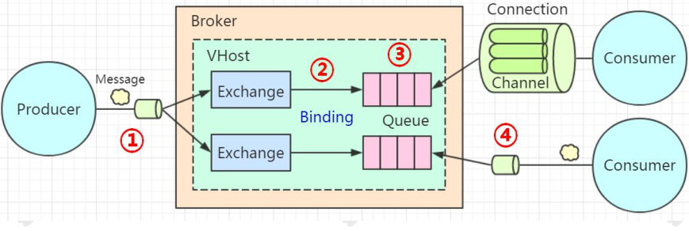
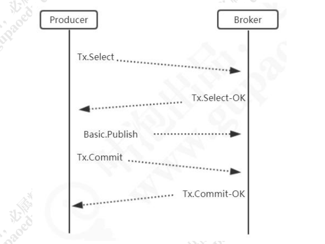

# RabbitMQ可靠性投递与高可用架构

## 可靠性投递

建议：先在数据库发消息，不会因数据回滚而导致数据发送的错误

一系列的思考，引发了一个可靠性的问题，所以RabbitMQ肯定是需要一个机制来保证消息的可靠性投递

那么，就让我们进一步来了解这种机制

首先要明确，效率和可靠性是互斥关系，不可以兼得，这个可以根据业务场景进行调整

回顾一下整个RabbitMQ的


在我们使用 RabbitMQ 收发消息的时候，有几个主要环节：
1 代表消息从生产者发送到 Broker生产者把消息发到 Broker 之后，怎么知道自己的消息有没有被 Broker 成功接收？

2 代表消息从 Exchange 路由到 Queue
Exchange 是一个绑定列表，如果消息没有办法路由到正确的队列，会发生什么事情？应该怎么处理？

3 代表消息在 Queue 中存储
队列是一个独立运行的服务，有自己的数据库（Mnesia），它是真正用来存储消
息的。如果还没有消费者来消费，那么消息要一直存储在队列里面。如果队列出了问
题，消息肯定会丢失。怎么保证消息在队列稳定地存储呢？

4 代表消费者订阅 Queue 并消费消息
队列的特性是什么？FIFO。队列里面的消息是一条一条的投递的，也就是说，只
有上一条消息被消费者接收以后，才能把这一条消息从数据库删掉，继续投递下一条
消息。那么问题来了，Broker 怎么知道消费者已经接收了消息呢？

## 消息发送到  RabbitMQ  服务器

第一个环节是生产者发送消息到Broker，存在的问题就是因为网络或者Broker的问题导致发送失败

所以，RabbitMQ推出了两种机制服务端确认机制，相当于服务器会跟生产者应答

具体有两种模式：
第一种是 Transaction（事务）模式，第二种 Confirm（确认）模式

### Transaction（事务）模式

我们通过一个 channel.txSelect()的方法把信道设置成事务模式，然后就可以发布消息给 RabbitMQ 了，如果 channel.txCommit();的方法调用成功，就说明事务提交成功，则消息一定到达了 RabbitMQ 中。

如果在事务提交执行之前由于 RabbitMQ 异常崩溃或者其他原因抛出异常，这个时候我们便可以将其捕获，进而通过执行 channel.txRollback()方法来实现事务回滚



在事务模式里面，只有收到了服务端的 Commit-OK 的指令，才能提交成功。所以
可以解决生产者和服务端确认的问题。但是事务模式有一个缺点，它是阻塞的，一条消
息没有发送完毕，不能发送下一条消息，它会榨干 RabbitMQ 服务器的性能。所以不建
议大家在生产环境使用

（2）Spring Boot中的设置

```java
rabbitTemplate.setChannelTransacted(true);
```


### Confirm（确认）模式

那么有没有其他可以保证消息被 Broker 接收，但是又不大量消耗性能的方式呢？这个就是第二种模式，叫做确认（Confirm）模式

(1)确认模式有三种，一种是普通确认模式。
在生产者这边通过调用 channel.confirmSelect()方法将信道设置为 Confirm 模式，
然后发送消息。一旦消息被投递到所有匹配的队列之后，RabbitMQ 就会发送一个确认
（Basic.Ack）给生产者，也就是调用 channel.waitForConfirms()返回 true，这样生产
者就知道消息被服务端接收了

因为一条条发很麻烦，有没有一种卡么一批量确认的方式，好事者，果然有

批 量 确 认 ， 就 是 在 开 启 Confirm 模 式 后 ， 先 发 送 一 批 消 息 。 只 要
channel.waitForConfirmsOrDie();方法没有抛出异常，就代表消息都被服务端接收了

但是批量又可能出现新的问题，什么问题？就是太多太少都不好，太多，有可能发了999条，其中一条需要回滚，太小还不如用单条哦，所以就又可以再次优化

边发送边确定，就是异步确认模式
异步确认模式需要添加一个 ConfirmListener，并且用一个 SortedSet 来维护没有被确认的消息

Confirm 模式是在 Channel 上开启的，因为 RabbitTemplate 对 Channel 进行了封装，叫做 ConfimrCallback

```java
rabbitTemplate.setConfirmCallback(new RabbitTemplate.ConfirmCallback() {
@Override
public void confirm(CorrelationData correlationData, boolean ack, String cause) {
if (!ack) {
System.out.println("发送消息失败：" + cause);
throw new RuntimeException("发送异常：" + cause);
}
}
});
```

