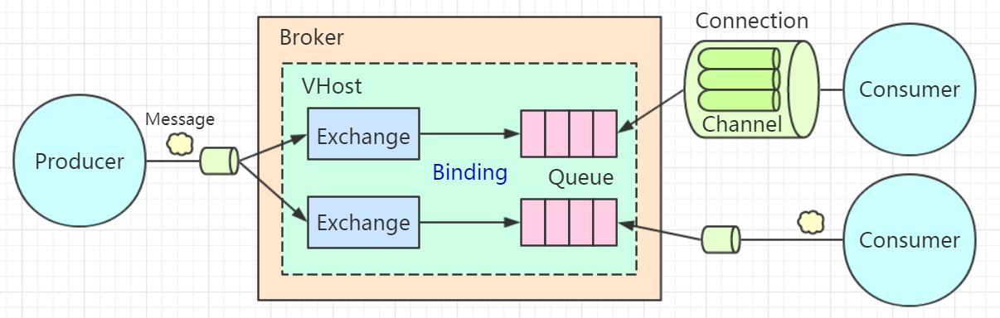
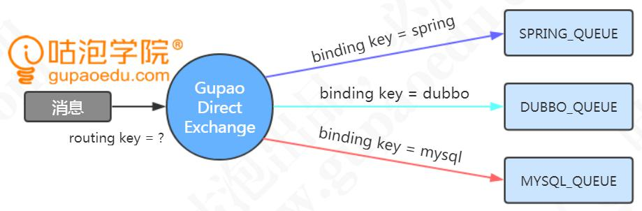
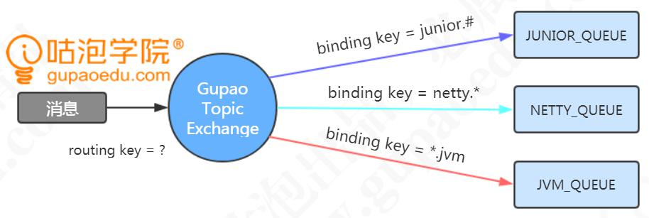
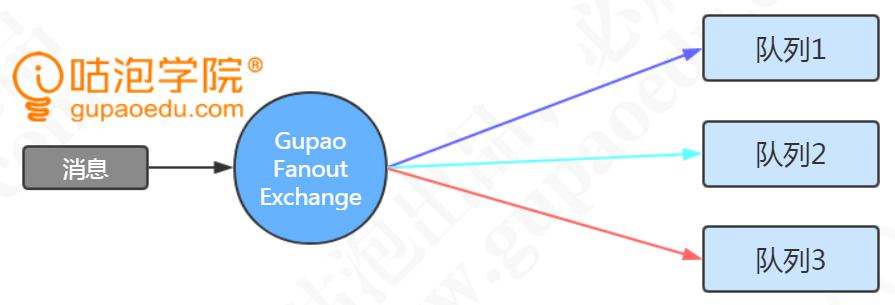

# MQ简介

MQ的本质是什么？

消息队列，又叫消息中间件，是指用高效可靠的消息传递机制进行与平台无关的
数据交流，并基于数据通信来进行分布式系统的集成。通过提供消息传递和消息队列模
型，可以在分布式环境下扩展进程的通信（维基百科）

## 特点

1、 是一个独立运行的服务。生产者发送消息，消费者接收消费，需要先跟
服务器建立连接。
2、 采用队列作为数据结构，有先进先出的特点。
3、 具有发布订阅的模型，消费者可以获取自己需要的消息

# 为什么使用MQ

1.实现异步通信
2.实现系统解耦
3.实现流量削峰（先进先出FIFO）

总结起来：
1） 对于数据量大或者处理耗时长的操作，我们可以引入 MQ 实现异步通信，减少客户端的等待，提升响应速度。
2） 对于改动影响大的系统之间，可以引入 MQ 实现解耦，减少系统之间的直接依赖。

3） 对于会出现瞬间的流量峰值的系统，我们可以引入 MQ 实现流量削峰，达到保护应用和数据库的目的。

## 缺陷（问题）

1、mq是一个独立的服务，所以系统可用性降低：原来是两个节点的通信，现在还需要独立运行一个服务，如果 MQ服务器或者通信网络出现问题，就会导致请求失败
2、系统复杂性提高： 为什么说复杂？第一个就是你必须要理解相关的模型和概念，才能正确地配置和使用 MQ。第二个，使用 MQ 发送消息必须要考虑消息丢失和消息重复消费的问题。一旦消息没有被正确地消费，就会带来数据一致性的问题

# RabbitMQ的简介

高可靠：RabbitMQ 提供了多种多样的特性让你在可靠性和性能之间做出权衡，包括持久化、发送应答、发布确认以及高可用性。

灵活的路由：通过交换机（Exchange）实现消息的灵活路由。

支持多客户端：对主流开发语言（Python、Java、Ruby、PHP、C#、JavaScript、Go、Elixir、Objective-C、Swift 等）都有客户端实现。

集群与扩展性：多个节点组成一个逻辑的服务器，支持负载。

高可用队列：通过镜像队列实现队列中数据的复制。

权限管理：通过用户与虚拟机实现权限管理。

插件系统：支持各种丰富的插件扩展，同时也支持自定义插件。

与 Spring 集成：Spring 对 AMQP 进行了封装

# AMQP协议

AMQP：高级消息队列协议，是一个工作于应用层的协议

除了 RabbitMQ 之外，AMQP 的实现还有 OpenAMQ、Apache Qpid、Redhat
Enterprise MRG、AMQP Infrastructure、ØMQ、Zyre。
除了 AMQP 之外，RabbitMQ 支持多种协议，STOMP、MQTT、HTTP and WebSockets。

可以使用 WireShark 等工具对 RabbitMQ 通信的 AMQP 协议进行抓包

# 工作模型

1. Broker
   我们要使用 RabbitMQ 来收发消息，必须要安装一个 RabbitMQ 的服务，可以安装在 Windows 上面也可以安装在 Linux 上面，默认是 5672 的端口。这台 RabbitMQ 的服务器我们把它叫做 Broker，中文翻译是代理/中介，因为 MQ 服务器帮助我们做的事情就是存储、转发消息
2. Connection
   无论是生产者发送消息，还是消费者接收消息，都必须要跟 Broker 之间建立一个连接，这个连接是一个 TCP 的长连接
   
   3. Channel
      如果所有的生产者发送消息和消费者接收消息，都直接创建和释放 TCP 长连接的话，对于 Broker 来说肯定会造成很大的性能损耗，因为 TCP 连接是非常宝贵的资源，创建和释放也要消耗时间

以在 AMQP 里面引入了 Channel 的概念，它是一个虚拟的连接。我们把它翻译成通道，或者消息信道。这样我们就可以在保持的 TCP 长连接里面去创建和释放
Channel，大大了减少了资源消耗。另外一个需要注意的是，Channel 是 RabbitMQ 原生 API 里面的最重要的编程接口，也就是说我们定义交换机、队列、绑定关系，发送消息消费消息，调用的都是 Channel 接口上的方法

4. Queue
   现在我们已经连到 Broker 了，可以收发消息了。在其他一些 MQ 里面，比如ActiveMQ 和 Kafka，我们的消息都是发送到队列上的
   
   队列是真正用来存储消息的，是一个独立运行的进程，有自己的数据库（Mnesia）。消费者获取消息有两种模式，一种是 Push 模式，只要生产者发到服务器，就马上推 送给消费者。另一种是 Pull 模式，消息存放在服务端，只有消费者主动获取才能拿到消息。消费者需要写一个 while 循环不断地从队列获取消息吗？不需要，我们可以基于事件机制，实现消费者对队列的监听

5.Exchange
在 RabbitMQ 里面永远不会出现消息直接发送到队列的情况。因为在 AMQP 里面引入了交换机（Exchange）的概念，用来实现消息的灵活路由

交换机是一个绑定列表，用来查找匹配的绑定关系。
队列使用绑定键（Binding Key）跟交换机建立绑定关系。

生产者发送的消息需要携带路由键（Routing Key），交换机收到消息时会根据它保存的绑定列表，决定将消息路由到哪些与它绑定的队列上。

注意：交换机与队列、队列与消费者都是多对多的关系

6.Vhost
我们每个需要实现基于 RabbitMQ 的异步通信的系统，都需要在服务器上创建自己要用到的交换机、队列和它们的绑定关系。如果某个业务系统不想跟别人混用一个系统，怎么办？再采购一台硬件服务器单独安装一个 RabbitMQ 服务？这种方式成本太高了。在同一个硬件服务器上安装多个 RabbitMQ 的服务呢？比如再运行一个 5673 的端口？没有必要，因为 RabbitMQ 提供了虚拟主机 VHOST

VHOST 除了可以提高硬件资源的利用率之外，还可以实现资源的隔离和权限的控制。它的作用类似于编程语言中的 namespace 和 package，不同的 VHOST 中可以有同名的 Exchange 和 Queue，它们是完全透明的

这个时候，我们可以为不同的业务系统创建不同的用户（User），然后给这些用户分配 VHOST 的权限。比如给风控系统的用户分配风控系统的 VHOST 的权限，这个用户可以访问里面的交换机和队列。给超级管理员分配所有 VHOST 的权限

# 路由方式

## 直连Direct

队列与直连类型的交换机绑定，需指定一个精确的绑定键

生产者发送消息时会携带一个路由键。只有当路由键与其中的某个绑定键完全匹配时，这条消息才会从交换机路由到满足路由关系的此队列上

## 主题Topic

队列与主题类型的交换机绑定时，可以在绑定键中使用通配符。两个通配符：

#0 个或者多个单词

*不多不少一个单词
单词（word）指的是用英文的点“.”隔开的字符。例如 abc.def 是两个单词

解读：第一个队列支持路由键以 junior 开头的消息路由，后面可以有单词，也可以
没有。
第二个队列支持路由键以 netty 开头，并且后面是一个单词的消息路由。
第三个队列支持路由键以 jvm 结尾，并且前面是一个单词的消息路由

如：
channel.basicPublish("MY_TOPIC_EXCHANGE","junior.fjd.klj","msg 2"); 只有第一个队列能收到消息。

channel.basicPublish("MY_TOPIC_EXCHANGE","junior.jvm", "msg 3"); 第一个队列和第三个队列能收到消息

## 广播Fanout

主题类型的交换机与队列绑定时，不需要指定绑定键。因此生产者发送消息到广播类型的交换机上，也不需要携带路由键。消息达到交换机时，所有与之绑定了的队列，都会收到相同的消息的副本

# RabbitMQ进阶知识

# TTL

## 消息的过期时间

有两种的设置方式
（1）通过队列属性设置消息过期时间
所有队列中的消息超过时间未被消费的时候，都会过期

（2）设置单挑消息的过期时间
在发送消息的时候指定消息属性

# 死信队列

队列在创建的时候可以指定一个死信交换机，死信交换机绑定的队列被称为死信队列 DLQ（Dead Letter Queue），DLX 实际上也是普通的交换机，DLQ 也是普通的队列（例如替补球员也是普通球员）

什么情况下队列会变成死信队列？
(1)消息被消费者拒绝并且未设置重回队列：(NACK || Reject ) && requeue == false
(2)消息过期
(3)队列达到最大长度，超过了 Max length（消息数）或者 Max length bytes
（字节数），最先入队的消息会被发送到 DLX

如何使用？
1.声明原交换机（GP_ORI_USE_EXCHANGE）、原队列（GP_ORI_USE_QUEUE），相互绑定。队列中的消息 10 秒钟过期，因为没有消费者，会变成死信。指定原队列的死信交换机（GP_DEAD_LETTER_EXCHANGE）

# 延迟队列

业务场景
有一些需要延时发送消息的场景，如：
1。热水器需要30分钟启动
2。未付款的订单，15分钟后自动关闭

RabbitMQ 本身不支持延迟队列，总的来说有三种实现方案：
1、 先存储到数据库，用定时任务扫描
2、 利用 RabbitMQ 的死信队列（Dead Letter Queue）实现
3、 利用 rabbitmq-delayed-message-exchange 插件

# Spring AMQP

Spring AMQP 是对 Spring 基于 AMQP 的消息收发解决方案，它是一个抽象层，不依赖于特定的 AMQP Broker 实现和客户端的抽象，所以可以很方便地替换。比如我们可以使用 spring-rabbit 来实现

