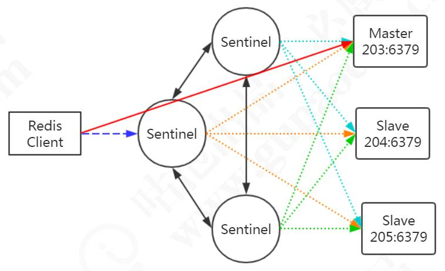
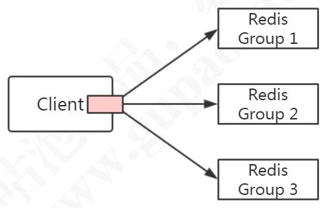
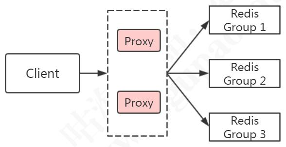
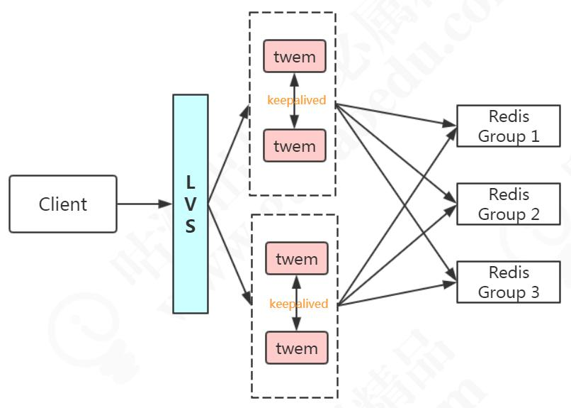
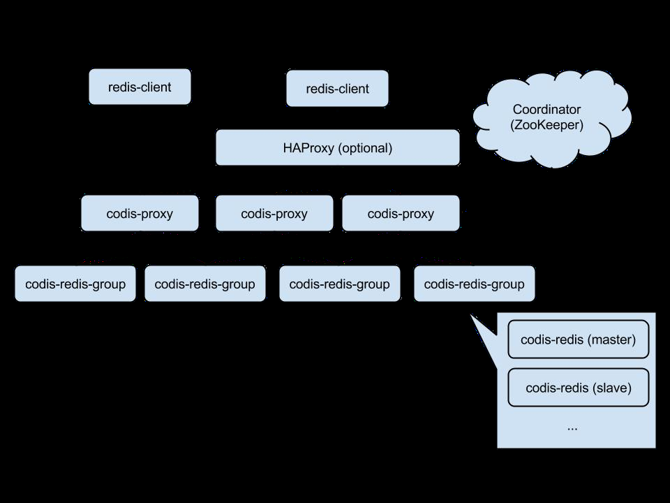
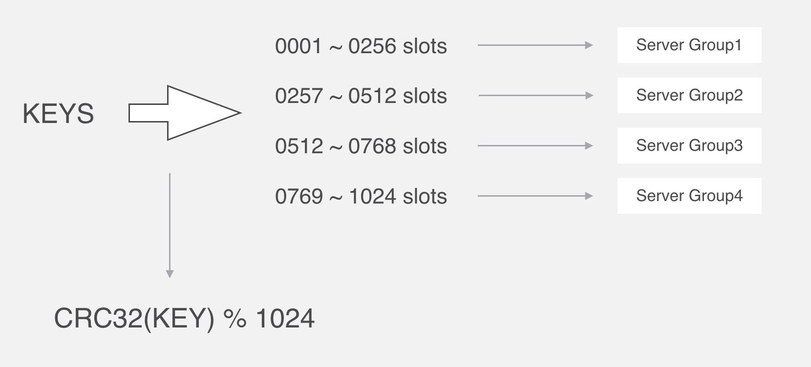

# Redis集群

## 为什么需要集群

第一点：性能

第二点：扩展
第二个是出于存储的考虑。因为 Redis 所有的数据都放在内存中，如果数据量大，容易受到硬件的限制。升级硬件收效和成本比太低，所以我们需要有一种横向扩展的方法

第三点：可用性

# Redis的主从复制

## 主从复制配置

例如：一主多从，203是主节点，在每个slave的redis.conf配置文件增加一行
slaveof 192.168.8.203 6379

在主从切换的时候，这个配置会被重写成：
replicaof 192.168.8.203 6379

或者在启动服务时通过参数指定 master 节点：
./redis-server --slaveof 192.168.8.203 6379
或在客户端直接执行 slaveof xx xx，使该 Redis 实例成为从节点

启动后，查看下集群的状态：
info replication

从节点不能写入数据（只读），只能从master节点同步数据，get成功，set失败

主节点写入后，slave会自动从master同步数据

断开复制：
slaveof no one

此时从节点会变成自己的主节点，不再复制数据

## 主从复制原理

### 连接阶段

1. slave node启动时（执行slaveof命令），会在自己本地保存master node的信息，包括master node的host 和IP
2. slave node 内部有个定时任务replicationCron(源码replication.c),每隔1秒钟就检查是否有新的master node要连接和复制，如果发现，就跟master node 建立socket 连接，如果连接成功，从节点为该socket建立一个专门处理复制工作的文件事件处理器，负责后续的复制工作，如接收RDB 文件，接收命令传播等
   当从节点变成了主节点的一个客户端之后，会给主节点发送ping 请求

### 数据同步阶段

3.master node第一次执行一个全量复制，通过bgsave命令在本地生成一份RDB快照，将RDB快照发给slave node (如果超时会重连，可以调大repl-timeout的值)，slave node首先会先清除自己的旧数据，然后用RDB文件加载数据

问题：生成 RDB 期间，master 接收到的命令怎么处理？
开始生成RDB文件时，master会把所有新的写命令缓存在内存中，在slave node保存了RDB之后，再将新的写命令复制给slave node

### 命令传播阶段

4. master node持续将写命令，异步复制给slave node
   延迟是不可避免的，只能通过优化网络

```
repl-disable-tcp-nodelay no
```

当设置为 yes 时，TCP 会对包进行合并从而减少带宽，但是发送的频率会降低，从节点数据延迟增加，一致性变差；具体发送频率与 Linux 内核的配置有关，默认配置为40ms。当设置为 no 时，TCP 会立马将主节点的数据发送给从节点，带宽增加但延迟变小。
一般来说，只有当应用对 Redis 数据不一致的容忍度较高，且主从节点之间网络状况不好时，才会设置为 yes；多数情况使用默认值 no

问题：如果从节点有一段时间断开了与主节点的连接是不是要重新全量复制一遍？

通过master_repl_offset记录的偏移量

### 不足

1、RDB文件过大的情况下，同步非常耗时
2.在一主一从或者一主多从的情况下，如果主服务器挂了，对外提供的服务就不可用了，单点问题没有得到解决，如果每次都是手动把之前的从服务器切换成主服务器，这个比较费时费力，还会造成一定时间的服务不可用

# 可用性保证之Sentinel

## Sentinel原理

如何实现主从自动切换？我们的思路：
创建一台监控服务器来监控所有 Redis 服务节点的状态，比如，master 节点超过一定时间没有给监控服务器发送心跳报文，就把 master 标记为下线，然后把某一个 slave变成 master。应用每一次都是从这个监控服务器拿到 master 的地址

问题是：如果监控服务器本身出问题了怎么办？那我们就拿不到 master 的地址了，应用也没有办法访问

那我们再创建一个监控服务器，来监控监控服务器……似乎陷入死循环了，这个问题，怎么解决？这个问题先放着

Redis 的 Sentinel 就是这种思路：通过运行监控服务器来保证服务的可用性

从 Redis2.8 版本起，提供了一个稳定版本的 Sentinel（哨兵），用来解决高可用的问题。它是一个特殊状态的 redis 实例

我们会启动一个或者多个 Sentinel 的服务（通过 src/redis-sentinel），它本质上只是一个运行在特殊模式之下的 Redis，Sentinel 通过 info 命令得到被监听 Redis 机器的master，slave 等信息


为了保证监控服务器的可用性，我们会对 Sentinel 做集群的部署。Sentinel 既监控所有的 Redis 服务，Sentinel 之间也相互监控

注意：Sentinel 本身没有主从之分，只有 Redis 服务节点有主从之分。

## 服务下线

Sentinel 默认以每秒钟 1 次的频率向 Redis 服务节点发送 PING 命令。如果在
down-after-milliseconds 内都没有收到有效回复，Sentinel 会将该服务器标记为下线
（主观下线）

```
# sentinel.conf
sentinel down-after-milliseconds <master-name> <milliseconds>
```

这个时候 Sentinel 节点会继续询问其他的 Sentinel 节点，确认这个节点是否下线，如果多数 Sentinel 节点都认为 master 下线，master 才真正确认被下线（客观下线），这个时候就需要重新选举 master

## 故障转移

如果 master 被标记为下线，就会开始故障转移流程

既然有这么多的 Sentinel 节点，由谁来做故障转移的事情呢？

故障转移流程的第一步就是在 Sentinel 集群选择一个 Leader，由 Leader 完成故障转移流程。Sentinle 通过 Raft 算法，实现 Sentinel 选举

### Raft算法

在分布式存储系统中，通常通过维护多个副本来提高系统的可用性，那么多个节点之间必须要面对数据一致性的问题。Raft 的目的就是通过复制的方式，使所有节点达成一致，但是这么多节点，以哪个节点的数据为准呢？所以必须选出一个 Leader

大体上有两个步骤：领导选举，数据复制

Raft 是一个共识算法（consensus algorithm）。比如比特币之类的加密货币，就需要共识算法。Spring Cloud 的注册中心解决方案 Consul 也用到了 Raft 协议。

Raft 的核心思想：**先到先得，少数服从多数**

总结：
Sentinle 的 Raft 算法和 Raft 论文略有不同。
1、master 客观下线触发选举，而不是过了 election timeout 时间开始选举。
2、Leader 并不会把自己成为 Leader 的消息发给其他 Sentinel。其他 Sentinel 等
待 Leader 从 slave 选出 master 后，检测到新的 master 正常工作后，就会去掉客观下线的标识，从而不需要进入故障转移流程

问题：怎么让一个原来的 slave 节点成为主节点？

1、选出 Sentinel Leader 之后，由 Sentinel Leader 向某个节点发送 slaveof no one命令，让它成为独立节点

2、然后向其他节点发送 slaveof x.x.x.x xxxx（本机服务），让它们成为这个节点的子节点，故障转移完成

问题：这么多从节点，选谁成为主节点？

关于从节点选举，一共有四个因素影响选举的结果，分别是断开连接时长、优先级排序、复制数量、进程 id

如果与哨兵连接断开的比较久，超过了某个阈值，就直接失去了选举权。如果拥有选举权，那就看谁的优先级高，这个在配置文件里可以设置（replica-priority 100），数值越小优先级越高。
如果优先级相同，就看谁从 master 中复制的数据最多（复制偏移量最大），选最多的那个，
如果复制数量也相同，就选择进程 id 最小的那个

## Sentinel的功能总结

监控：Sentinel 会不断检查主服务器和从服务器是否正常运行

通知：如果某一个被监控的实例出现问题，Sentinel 可以通过 API 发出通知

自动故障转移（failover）：如果主服务器发生故障，Sentinel 可以启动故障转移过程。把某台服务器升级为主服务器，并发出通知

配置管理：客户端连接到 Sentinel，获取当前的 Redis 主服务器的地址

# Redis分布式方案

如果要实现 Redis 数据的分片，我们有三种方案

第一种是在客户端实现相关的逻辑，例如用取模或者一致性哈希对 key 进行分片，查询和修改都先判断 key 的路由

第二种是把做分片处理的逻辑抽取出来，运行一个独立的代理服务，客户端连接到这个代理服务，代理服务做请求的转发

第三种就是基于服务端实现

## 客户端Sharding


Jedis 客户端提供了 Redis Sharding 的方案，并且支持连接池

```
public class ShardingTest {
public static void main(String[] args) {
JedisPoolConfig poolConfig = new JedisPoolConfig();
​
// Redis 服务器
JedisShardInfo shardInfo1 = new JedisShardInfo("127.0.0.1", 6379);
JedisShardInfo shardInfo2 = new JedisShardInfo("192.168.8.205", 6379);
​
// 连接池
List<JedisShardInfo> infoList = Arrays.asList(shardInfo1, shardInfo2);
ShardedJedisPool jedisPool = new ShardedJedisPool(poolConfig, infoList);
ShardedJedis jedis = null;
try{
jedis = jedisPool.getResource();
for(int i=0; i<100; i++){
jedis.set("k"+i, ""+i);
}
for(int i=0; i<100; i++){
System.out.println(jedis.get("k"+i));
}
​
}finally{
if(jedis!=null) {
jedis.close();
}
}
}
}
```

使用 ShardedJedis 之类的客户端分片代码的优势是配置简单，不依赖于其他中间件，分区的逻辑可以自定义，比较灵活。但是基于客户端的方案，不能实现动态的服务增减，每个客户端需要自行维护分片策略，存在重复代码

第二种思路就是把分片的代码抽取出来，做成一个公共服务，所有的客户端都连接到这个代理层。由代理层来实现请求和转发

## 代理Proxy



典型的代理分区方案有 Twitter 开源的 Twemproxy 和国内的豌豆荚开源的 Codis

### Twemproxy


Twemproxy 的优点：比较稳定，可用性高
不足：
1、出现故障不能自动转移，架构复杂，需要借助其他组件（LVS/HAProxy +
Keepalived）实现 HA
2、扩缩容需要修改配置，不能实现平滑地扩缩容（需要重新分布数据）

### Codis

Codis 是一个代理中间件，用 Go 语言开发的。
功能：客户端连接 Codis 跟连接 Redis 没有区别


分片原理：Codis 把所有的 key 分成了 N 个槽（例如 1024），每个槽对应一个分组，
一个分组对应于一个或者一组 Redis 实例。Codis 对 key 进行 CRC32 运算，得到一个
32 位的数字，然后模以 N（槽的个数），得到余数，这个就是 key 对应的槽，槽后面就
是 Redis 的实例。比如 4 个槽：


Codis 的槽位映射关系是保存在 Proxy 中的，如果要解决单点的问题，Codis 也要做集群部署，多个 Codis 节点怎么同步槽和实例的关系呢？需要运行一个 Zookeeper （或者 etcd/本地文件）
在新增节点的时候，可以为节点指定特定的槽位。Codis 也提供了自动均衡策略。
Codis 不支持事务，其他的一些命令也不支持

获取数据原理（mget）：在 Redis 中的各个实例里获取到符合的 key，然后再汇总
到 Codis 中。
Codis 是第三方提供的分布式解决方案，在官方的集群功能稳定之前，Codis 也得到了大量的应用


