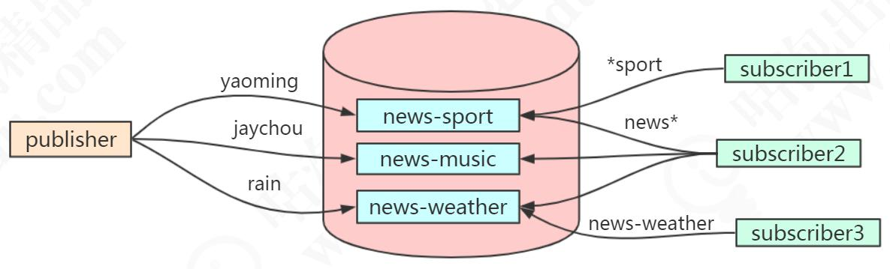

# 发布订阅模式

## 列表的局限

前面我们说通过队列的 rpush 和 lpop 可以实现消息队列（队尾进队头出），但是消费者需要不停地调用 lpop 查看 List 中是否有等待处理的消息（比如写一个 while 循环）。为了减少通信的消耗，可以sleep()一段时间再消费，但是会有两个问题

1、如果生产者生产消息的速度远大于消费者消费消息的速度，List 会占用大量的内存。

2、消息的实时性降低。
list 还提供了一个阻塞的命令：blpop，没有任何元素可以弹出的时候，连接会被阻塞

基于 list 实现的消息队列，不支持一对多的消息分发

## 发布订阅模式

除了通过 list 实现消息队列之外，Redis 还提供了一组命令实现发布/订阅模式。

```
subscribe channel-1 channel-2 channel-3
```

发布者可以向指定频道发布消息（并不支持一次向多个频道发送消息）：

```
publish channel-1 2673：
```

取消订阅（不能在订阅状态下使用）

```
unsubscribe channel-1
```

### 按规则来订阅频道

支持?和*占位符。?代表一个字符，*代表 0 个或者多个字符。

消费端 1，关注运动信息

```
psubscribe *sport
```

消费端 2，关注所有新闻：

```
psubscribe news*
```

消费端 3，关注天气新闻

```
psubscribe news-weather
```

生产者，发布 3 条信息

```
publish news-sport yaoming
publish news-music jaychou
publish news-weather rain
```



# Redis事务

## 为啥要用Redis事务，也就是Redis事务有什么作用？

我们知道 Redis 的单个命令是原子性的（比如 get set mget mset），如果涉及到多个命令的时候，需要把多个命令作为一个不可分割的处理序列，就需要用到事务

例如我们之前说的用 setnx 实现分布式锁，我们先 set，然后设置对 key 设置 expire，防止 del 发生异常的时候锁不会被释放，业务处理完了以后再 del，这三个动作我们就希
望它们作为一组命令执行。
Redis 的事务有两个特点：
1、按进入队列的顺序执行。
2、不会受到其他客户端的请求的影响

Redis 的事务涉及到四个命令：multi（开启事务），exec（执行事务），discard（取消事务），watch（监视）

## 事务的用法

案例场景：tom 和 mic 各有 1000 元，tom 需要向 mic 转账 100 元。
tom 的账户余额减少 100 元，mic 的账户余额增加 100 元

```
127.0.0.1:6379> set tom 1000
OK
127.0.0.1:6379> set mic 1000
OK
127.0.0.1:6379> multi
OK
127.0.0.1:6379> decrby tom 100
QUEUED
127.0.0.1:6379> incrby mic 100
QUEUED
127.0.0.1:6379> exec
1) (integer) 900
2) (integer) 1100
127.0.0.1:6379> get tom
"900"
127.0.0.1:6379> get mic
"1100"
```

通过 multi 的命令开启事务。事务不能嵌套，多个 multi 命令效果一样。
multi 执行后，客户端可以继续向服务器发送任意多条命令， 这些命令不会立即被
执行， 而是被放到一个队列中， 当 exec 命令被调用时， 所有队列中的命令才会被执行。

通过 exec 的命令执行事务。如果没有执行 exec，所有的命令都不会被执行。

如果中途不想执行事务了，怎么办？
可以调用 discard 可以清空事务队列，放弃执行

```
multi
set k1 1
set k2 2
set k3 3
discard
```

## watch命令

它可以为 Redis 事务提供 CAS 乐观锁行为（Check and Set / Compare and Swap），也就是多个线程更新变量的时候，会跟原值做比较，只有它没有被其他线程修改的情况下，才更新成新的值

我们可以用 watch 监视一个或者多个 key，如果开启事务之后，至少有一个被监视、key 键在 exec 执行之前被修改了， 那么整个事务都会被取消（key 提前过期除外）。可以用 unwatch 取消

## 事务可能遇到的问题

我们把事务执行遇到的问题分成两种，一种是在执行 exec 之前发生错误，一种是在执行 exec 之后发生错误

1.一种是在执行 exec 之前发生错误
比如：入队的命令存在语法错误，包括参数数量，参数名等等（编译器错误）
在这种情况下事务会被拒绝执行，也就是队列中所有的命令都不会得到执行

2.执行exec之后发生错误
比如，类型错误，比如对 String 使用了 Hash 的命令，这是一种运行时错误

最后我们发现 set k1 1 的命令是成功的，也就是在这种发生了运行时异常的情况下，只有错误的命令没有被执行，但是其他命令没有受到影响

这个显然不符合我们对原子性的定义，也就是我们没办法用 Redis 的这种事务机制来实现原子性，保证数据的一致

# Lua脚本

Lua/ˈluə/是一种轻量级脚本语言，它是用 C 语言编写的，跟数据的存储过程有点类
似。 使用 Lua 脚本来执行 Redis 命令的好处：
1、一次发送多个命令，减少网络开销。
2、Redis 会将整个脚本作为一个整体执行，不会被其他请求打断，保持原子性。
3、对于复杂的组合命令，我们可以放在文件中，可以实现程序之间的命令集复用

## 在Redis中调用Lua脚本

```
redis> eval lua-script key-num [key1 key2 key3 ....] [value1 value2 value3 ....]
```

 eval 代表执行 Lua 语言的命令。
 lua-script 代表 Lua 语言脚本内容。
 key-num 表示参数中有多少个 key，需要注意的是 Redis 中 key 是从 1 开始的，如果没有 key 的参数，那么写 0。
 [key1 key2 key3…]是 key 作为参数传递给 Lua 语言，也可以不填，但是需要和 key-num 的个数对应起来。
 [value1 value2 value3 ….]这些参数传递给 Lua 语言，它们是可填可不填的。

如：返回一个字符串，0个参数
redis> eval "return 'Hello World'" 0

## 在Lua脚本中调用Redis命令

使用 redis.call(command, key [param1, param2…])进行操作。语法格式：

```
dis> eval "redis.call('set',KEYS[1],ARGV[1])" 1 lua-key lua-value
```

 command 是命令，包括 set、get、del 等
 key 是被操作的键。
 param1,param2…代表给 key 的参数

注意跟 Java 不一样，定义只有形参，调用只有实参。
Lua 是在调用时用 key 表示形参，argv 表示参数值（实参）

### 设置键值对

如：

```
redis> eval "return redis.call('set',KEYS[1],ARGV[1])" 1 gupao 2673
redis> get gupao
```

以上命令等价于 set gupao 2673

### 在Redis中调用Lua脚本文件的命令，操作Redis

1.创建Lua脚本
cd /usr/local/soft/redis5.0.5/src
vim ada.lua

2.Lua脚本内容、先设置，再取值
redis.call('set','ada','lua666');
return redis.call('get','ada');

3.在Redis客户端中调用lua脚本
cd /usr/local/soft/redis5.0.5/src
redis-cli --eval ada.lua 0

4.得到返回值

### 案例：对IP进行限流

需求：在 X 秒内只能访问 Y 次。

设计思路：
用 key 记录 IP，用 value 记录访问次数拿到 IP 以后，对 IP+1。如果是第一次访问，对 key 设置过期时间（参数 1）。否则判断次数，超过限定的次数（参数 2），返回 0。如果没有超过次数则返回 1。超过时间，key 过期之后，可以再次访问。

KEY[1]是 IP， ARGV[1]是过期时间 X，ARGV[2]是限制访问的次数 Y

```
-- ip_limit.lua
-- IP 限流，对某个 IP 频率进行限制 ，6 秒钟访问 10 次
local num=redis.call('incr',KEYS[1])
if tonumber(num)==1 then
redis.call('expire',KEYS[1],ARGV[1])
return 1
elseif tonumber(num)>tonumber(ARGV[2]) then
return 0
else
return 1
end
```

6 秒钟内限制访问 10 次，调用测试（连续调用 10 次）
./redis-cli --eval "ip_limit.lua" app:ip:limit:192.168.8.111 , 6 10

### 缓存Lua脚本

Redis 提供了 EVALSHA 命令，允许开发者通过脚本内容的 SHA1 摘要来执行脚本
127.0.0.1:6379> script load "return 'Hello World'"
"470877a599ac74fbfda41caa908de682c5fc7d4b"
127.0.0.1:6379> evalsha "470877a599ac74fbfda41caa908de682c5fc7d4b" 0
"Hello World

### 脚本超时

Redis 的指令执行本身是单线程的，这个线程还要执行客户端的 Lua 脚本，如果 Lua脚本执行超时或者陷入了死循环，是不是没有办法为客户端提供服务了呢

eval 'while(true) do end' 0

为了防止某个脚本执行时间过长导致 Redis 无法提供服务，Redis 提供了lua-time-limit 参数限制脚本的最长运行时间，默认为 5 秒钟。
lua-time-limit 5000（redis.conf 配置文件中）

当脚本运行时间超过这一限制后，Redis 将开始接受其他命令但不会执行（以确保脚本的原子性，因为此时脚本并没有被终止），而是会返回“BUSY”错误

Redis 提供了一个 script kill 的命令来中止脚本的执行。新开一个客户端
script kill

如果当前执行的 Lua 脚本对 Redis 的数据进行了修改（SET、DEL 等），那么通过script kill 命令是不能终止脚本运行的

因为要保证脚本运行的原子性，如果脚本执行了一部分终止，那就违背了脚本原子性的要求。最终要保证脚本要么都执行，要么都不执行

遇到这种情况，只能通过 shutdown nosave 命令来强行终止 redis

shutdown nosave 和 shutdown 的区别在于 shutdown nosave 不会进行持久化操作，意味着发生在上一次快照后的数据库修改都会丢失

# Redis为啥这么快


# 内存回收

# 持久化机制

