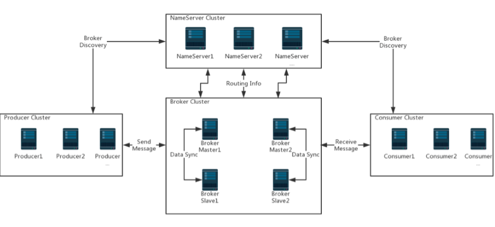
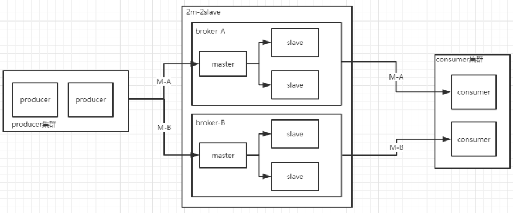
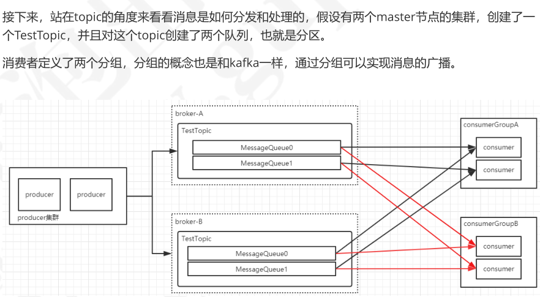

# MQ消息存储选择

从主流的几种MQ消息队列采用的存储方式来看，主要会有三种

1. 分布式KV存储，比如ActiveMQ中采用的levelDB、Redis， 这种存储方式对于消息读写能力要求不
   高的情况下可以使用
2. 文件系统存储，常见的比如kafka、RocketMQ、RabbitMQ都是采用消息刷盘到所部署的机器上的
   文件系统来做持久化，这种方案适合对于有高吞吐量要求的消息中间件，因为消息刷盘是一种高效
   率，高可靠、高性能的持久化方式，除非磁盘出现故障，否则一般是不会出现无法持久化的问题
3. 关系型数据库，比如ActiveMQ可以采用mysql作为消息存储，关系型数据库在单表数据量达到千
   万级的情况下IO性能会出现瓶颈，所以ActiveMQ并不适合于高吞吐量的消息队列场景。
   总的来说，对于存储效率，文件系统要优于分布式KV存储，分布式KV存储要优于关系型数据库

# RocketMQ的发展历史

RocketMq是一个由阿里巴巴开源的消息中间件， 2012年开源，2017年成为apache顶级项目。
它的核心设计借鉴了Kafka，所以我们在了解RocketMQ的时候，会发现很多和kafka相同的特性。同时
呢，Rocket在某些功能上和kafka又有较大的差异，接下来我们就去了解RocketMQ

1. 支持集群模型、负载均衡、水平扩展能力
2. 亿级别消息堆积能力
3. 采用零拷贝的原理，顺序写盘，随机读
4. 底层通信框架采用Netty NIO
5. NameServer代替Zookeeper，实现服务寻址和服务协调
6. 消息失败重试机制、消息可查询
7. 强调集群无单点，可扩展，任意一点高可用，水平可扩展
8. 经过多次双十一的考验

# RocketMQ的架构


集群本身没有什么特殊之处，和kafka的整体架构类似，其中zookeeper替换成了NameServer。
在rocketmq的早版本（2.x）的时候，是没有namesrv组件的，用的是zookeeper做分布式协调和服务发现，但是后期阿里数据根据实际业务需求进行改进和优化，自组研发了轻量级的namesrv,用于注册Client服务与Broker的请求路由工作，namesrv上不做任何消息的位置存储，频繁操作zookeeper的位置存储数据会影响整体集群性能

RocketMQ由四部分组成
1）Name Server 可集群部署，节点之间无任何信息同步。提供轻量级的服务发现和路由
2）Broker(消息中转角色，负责存储消息，转发消息) 部署相对复杂，Broker 分为Master 与Slave，一个Master 可以对应多个Slave，但是一个Slave 只能对应一个Master，Master 与Slave 的对应关系通过指定相同的BrokerName，不同的BrokerId来定 义，BrokerId为0 表示Master，非0 表示Slave。
Master 也可以部署多个。
3）Producer，生产者，拥有相同 Producer Group 的 Producer 组成一个集群， 与Name Server 集群中的其中一个节点（随机选择）建立长连接，定期从Name Server 取Topic 路由信息，并向提供Topic服务的Master 建立长连接，且定时向Master 发送心跳。Producer 完全无状态，可集群部署。
4）Consumer，消费者，接收消息进行消费的实例，拥有相同 Consumer Group 的 Consumer 组成一个集群，与Name Server 集群中的其中一个节点（随机选择）建立长连接，定期从Name Server 取
Topic 路由信息，并向提供Topic 服务的Master、Slave 建立长连接，且定时向Master、Slave 发送心
跳。Consumer既可以从Master 订阅消息，也可以从Slave 订阅消息，订阅规则由Broker 配置决定。
要使用rocketmq，至少需要启动两个进程，nameserver、broker，前者是各种topic注册中心，后者是真正的broker。

# RocketMQ消息支持的模式

## NormalProducer（普通）

(1)消息同步发送
普通消息的发送和接收在前面已经演示过了，在上面的案例中是基于同步消息发送模式。也就是说消息发送出去后，producer会等到broker回应后才能继续发送下一个消息
（2）消息异步发送
异步发送是指发送方发出数据后，不等接收方发回响应，接着发送下个数据包的通讯方式。 MQ 的异步发送，需要用户实现异步发送回调接口（SendCallback）。消息发送方在发送了一条消息后，不需要等待服务器响应即可返回，进行第二条消息发送。发送方通过回调接口接收服务器响应，并对响应结果进行处理
异步代码

```java
producer.send(msg, new SendCallback() {
  @Override
  public void onSuccess(SendResult sendResult) {
    System.out.printf("%s%n",sendResult);
 }
  @Override
  public void onException(Throwable throwable) {
    throwable.printStackTrace();
 }
});
```

(3)OneWay
单向（Oneway）发送特点为发送方只负责发送消息，不等待服务器回应且没有回调函数触发，即只发送请求不等待应答.效率最高

```java
producer.sendOneway(msg);
```

## OrderProducer（顺序）

前面我们学习kafka的时候有说到，消息可以通过自定义分区策略来失效消息的顺序发送，实现原理就是把同一类消息都发送到相同的分区上。
在RocketMQ中，是基于多个Message Queue来实现类似于kafka的分区效果。如果一个Topic 要发送和接收的数据量非常大， 需要能支持增加并行处理的机器来提高处理速度，这时候一个Topic 可以根据
需求设置一个或多个Message Queue。Topic 有了多个Message Queue 后，消息可以并行地向各个Message Queue 发送，消费者也可以并行地从多个Message Queue 读取消息并消费

# RocketMQ消息发送及消费的基本原理

这是一个比较宏观的部署架构图，rocketmq天然支持高可用，它可以支持多主多从的部署架构，这也是和kafka最大的区别之一
原因是RocketMQ中并没有master选举功能，所以通过配置多个master节点来保证rocketMQ的高可用。和所有的集群角色定位一样，master节点负责接受事务请求、slave节点只负责接收读请求，并且接收master同步过来的数据和slave保持一直。当master挂了以后，如果当前rocketmq是一主多从，就意味着无法接受发送端的消息，但是消费者仍然能够继续消费。
所以配置多个主节点后，可以保证当其中一个master节点挂了，另外一个master节点仍然能够对外提供消息发送服务。
当存在多个主节点时，一条消息只会发送到其中一个主节点，rocketmq对于多个master节点的消息发送，会做负载均衡，使得消息可以平衡的发送到多个master节点上。
一个消费者可以同时消费多个master节点上的消息，在下面这个架构图中，两个master节点恰好可以平均分发到两个消费者上，如果此时只有一个消费者，那么这个消费者会消费两个master节点的数据。
由于每个master可以配置多个slave，所以如果其中一个master挂了，消息仍然可以被消费者从slave节点消费到。可以完美的实现rocketmq消息的高可用



# 集群支持

RocketMQ天生对集群的支持非常友好
1）单Master
优点：除了配置简单没什么优点
缺点：不可靠，该机器重启或宕机，将导致整个服务不可用

2）多Master
优点：配置简单，性能最高
缺点：可能会有少量消息丢失（配置相关），单台机器重启或宕机期间，该机器下未被消费的消息在机器恢复前不可订阅，影响消息实时性

3）多Master多Slave，每个Master配一个Slave，有多对Master-Slave，集群采用异步复制方式，主备有短暂消息延迟，毫秒级
优点：性能同多Master几乎一样，实时性高，主备间切换对应用透明，不需人工干预
缺点：Master宕机或磁盘损坏时会有少量消息丢失

4）多Master多Slave，每个Master配一个Slave，有多对Master-Slave，集群采用同步双写方式，主备都写成功，向应用返回成功
优点：服务可用性与数据可用性非常高
缺点：性能比异步集群略低，当前版本主宕备不能自动切换为主
需要注意的是，在RocketMQ里面，1台机器只能要么是Master，要么是Slave。这个在初始的机器配置里面，就定死了。不会像kafka那样存在master动态选举的功能。其中Master的broker id = 0，Slave
的broker id > 0。有点类似于mysql的主从概念，master挂了以后，slave仍然可以提供读服务，但是由于有多主的存在，当一个master挂了以后，可以写到其他的master上

# 消息发送到topic多个MessageQueue

1. 创建一个队列，设置2个写队列以及2个读队列，如果读和写队列不一致，会存在消息无法消费到的问题
2. 构建生产者和消费者:参考上面写的生产者消费者代码
3. 消费者数量控制对于队列的消费情况
   a) 如果消费队列为2，启动一个消费者，那么这个消费者会消费者两个队列，
   b) 如果两个消费者消费这个队列，那么意味着消息会均衡分摊到这两个消费者中
   c） 如果消费者数大于readQueueNumbs，那么会有一些消费者消费不到消息，浪费资源

# 消息的顺序消费

首先，需要保证顺序的消息要发送到同一个messagequeue中次，一个messagequeue只能被一个消费者消费，这点是由消息队列的分配机制来保证的；
最后，一个消费者内部对一个mq的消费要保证
是有序的
我们要做到生产者 - messagequeue - 消费者之间是一对一对一的关系。

# 自定义消息发送规则

通过自定义发送策略来实现消息只发送到同一个队列
因为一个Topic 会有多个Message Queue ，如果使用Producer 的默认配置，这个Producer 会轮流向各个Message Queue 发送消息。Consumer 在消费消息的时候，会根据负载均衡策略，消费被分配到的Message Queue
如果不经过特定的设置，某条消息被发往哪个Message Queue ，被哪个Consumer 消费是未知的，如果业务需要我们把消息发送到指定的Message Queue 里，比如把同一类型的消息都发往相同的
Message Queue。那是不是可以实现顺序消息的功能呢？
和kafka一样，rocketMQ也提供了消息路由的功能，我们可以自定义消息分发策略，可以实现MessageQueueSelector，来实现自己的消息分发策略

# 如何保证消息消费顺序呢

通过分区规则可以实现同类消息在rocketmq上的顺序存储。但是对于消费端来说，如何保证消费的顺序？
我们前面写的消息消费代码使用的是MessageListenerConcurrently并发监听，也就是基于多个线程并行来消费消息。这个无法保证消息消费的顺序
RocketMQ中提供了MessageListenerOrderly 一个类来实现顺序消费

```java
consumer.subscribe("store_topic_test","*");
consumer.registerMessageListener((MessageListenerOrderly) (list,
consumeOrderlyContext) -> {
  list.stream().forEach(messageExt -> System.out.println(new
String(messageExt.getBody())));
  return ConsumeOrderlyStatus.SUCCESS;
});
```

可能存在的问题：

1. 遇到消息失败的消息，无法跳过，当前队列消费暂停
2. 降低了消息处理的性能

# 消费端的负载均衡

和kafka一样，消费端也会针对Message Queue做负载均衡，使得每个消费者能够合理的消费多个分区的消息。

(1)消费端会通过RebalanceService线程，10秒钟做一次基于topic下的所有队列负载
a.消费端遍历自己的所有topic，依次调rebalanceByTopic
b.根据topic获取此topic下的所有queue
c.选择一台broker获取基于group的所有消费端（有心跳向所有broker注册客户端信息）
d.选择队列分配策略实例AllocateMessageQueueStrategy执行分配算法

(2)什么时候触发负载均衡
消费者启动之后
消费者数量发生变更
每10秒会触发检查一次rebalance

(3)分配算法
（AllocateMessageQueueAveragely）平均分配算法（默认）
（AllocateMessageQueueAveragelyByCircle）环状分配消息队列
（AllocateMessageQueueByConfig）按照配置来分配队列： 根据用户指定的配置来进行负载
（AllocateMessageQueueByMachineRoom）按照指定机房来配置队列
（AllocateMachineRoomNearby）按照就近机房来配置队列：
（AllocateMessageQueueConsistentHash）一致性hash，根据消费者的cid进行

# 消息的的可靠性原则

## 消息消费端的确认机制

RocketMQ提供了ack机制，以保证消息能够被正常消费。发送者为了保证消息肯定消费成功，只有使用方明确表示消费成功，RocketMQ才会认为消息消费成功。中途断电，抛出异常等都不会认为成功

```java
consumer.registerMessageListener((MessageListenerConcurrently) (list,
consumeOrderlyContext) -> {
  list.stream().forEach(messageExt -> System.out.println(new
String(messageExt.getBody())));
  return ConsumeConcurrentlyStatus.CONSUME_SUCCESS;
});
```

所有消费者在设置监听的时候会提供一个回调，业务实现消费回调的时候，当回调方法中返回ConsumeConcurrentlyStatus.CONSUME_SUCCESS，RocketMQ才会认为这批消息（默认是1条）是消费完成的。如果这时候消息消费失败，例如数据库异常，余额不足扣款失败等一切业务认为消息需要
重试的场景，只要返回ConsumeConcurrentlyStatus.RECONSUME_LATER，RocketMQ就会认为这批消息消费失败了

# 消息的衰减重试

为了保证消息肯定至少被消费一次，RocketMQ会把这批消息重新发回到broker，在延迟的某个时间点（默认是10秒，业务可设置）后，再次投递到这个ConsumerGroup。而如果一直这样重复消费都持续失败到一定次数（默认16次），就会投递到DLQ死信队列。应用可以监控死信队列来做人工干预
可以修改broker-a.conf文件
messageDelayLevel = 1s 5s 10s 30s 1m 2m 3m 4m 5m 6m 7m 8m 9m 10m 20m 30m 1h 2h

# 重试消息的处理机制

见代码


