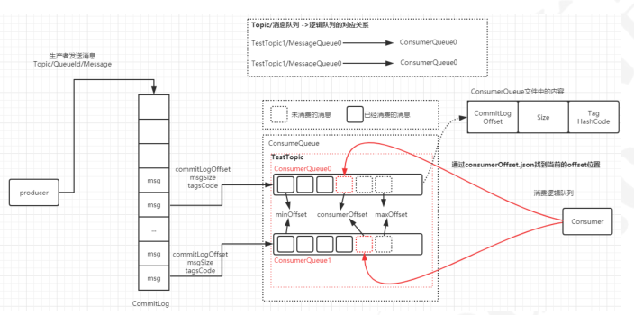

# 分布式事务

#### 在上面这种场景中，本地事务无法解决，所以才引入了分布式事务，所谓的分布式事务是指分布式架构

#### 中多个服务的节点的数据一致性。

## 经典的X/OpenDTP事务模型

X/Open DTP(X/Open Distributed Transaction Processing Reference Model) 是X/Open这个组织定义
的一套分布式事务的标准，也就是定义了规范和API接口，由各个厂商进行具体的实现。

这个标准提出了使用二阶段提交(2PC – Two-Phase-Commit)来保证分布式事务的完整性。后来J2EE也
遵循了X/OpenDTP规范，设计并实现了java里的分布式事务编程接口规范-JTA

## X/OpenDTP角色

在X/OpenDTP事务模型中，定义了三个角色

AP: application, 应用程序，也就是业务层。哪些操作属于一个事务，就是AP定义的

RM： Resource Manager，资源管理器。一般是数据库，也可以是其他资源管理器，比如消息队列，
文件系统

TM： Transaction Manager ，事务管理器、事务协调者，负责接收来自用户程序（AP）发起的XA事务
指令，并调度和协调参与事务的所有RM（数据库），确保事务正确完成

#### 在分布式系统中，每一个机器节点虽然都能够明确知道自己在进行事务操作过程中的结果是成功还是失

#### 败，但却无法直接获取到其他分布式节点的操作结果。因此当一个事务操作需要跨越多个分布式节点的

#### 时候，为了保持事务处理的ACID特性，就需要引入一个“协调者”（TM）来统一调度所有分布式节点的

#### 执行逻辑，这些被调度的分布式节点被称为AP。TM负责调度AP的行为，并最终决定这些AP是否要把事

#### 务真正进行提交到（RM）

_XA_ 是 _X/Open DTP_ 定义的资源管理器和事务管理器之间的接口规范， _TM_ 用它来通知和协调相关 _RM_ 事务
的开始、结束、提交或回滚。目前 _Oracle_ 、 _Mysql_ 、 _DB2_ 都提供了对 _XA_ 的支持； _XA_ 接口是双向的系统接
口，在事务管理器 _(TM )_ 以及多个资源管理器之间形成通信的桥梁（ _XA_ 不能自动提交）


## 2PC

#### 第一阶段


#### RM在第一阶段会做两件事：

1.记录事务日志：reduo，undo
2.返回给TM信息，ok、error
存在问题： 如果第一阶段完成后TM宕机或网络出现故障了，此时RM会一直阻塞，发生了死锁，因为没
有timeout机制，3pc就针对此问题进行了改造，加入了timeout机制

**第二阶段**


#### 根据第一个阶段的返回结果进行提交或者回滚

## CAP理论

#### CAP的含义：

```
C：Consistency 一致性 同一数据的多个副本是否实时相同。
A：Availability 可用性 可用性：一定时间内 & 系统返回一个明确的结果 则称为该系统可用。
P：Partition tolerance 分区容错性 将同一服务分布在多个系统中，从而保证某一个系统宕机，
仍然有其他系统提供相同的服务。
```

CAP理论告诉我们，在分布式系统中，C、A、P三个条件中我们最多只能选择两个。那么问题来了，究
竟选择哪两个条件较为合适呢？

对于一个业务系统来说，可用性和分区容错性是必须要满足的两个条件，并且这两者是相辅相成的。业
务系统之所以使用分布式系统，主要原因有两个：

```
提升整体性能 当业务量猛增，单个服务器已经无法满足我们的业务需求的时候，就需要使用分布
式系统，使用多个节点提供相同的功能，从而整体上提升系统的性能，这就是使用分布式系统的第
一个原因。
实现分区容错性 单一节点 或 多个节点处于相同的网络环境下，那么会存在一定的风险，万一该
机房断电、该地区发生自然灾害，那么业务系统就全面瘫痪了。为了防止这一问题，采用分布式系
统，将多个子系统分布在不同的地域、不同的机房中，从而保证系统高可用性。
```

这说明分区容错性是分布式系统的根本，如果分区容错性不能满足，那使用分布式系统将失去意义。

此外，可用性对业务系统也尤为重要。在大谈用户体验的今天，如果业务系统时常出现“系统异常”、响
应时间过长等情况，这使得用户对系统的好感度大打折扣，在互联网行业竞争激烈的今天，相同领域的
竞争者不甚枚举，系统的间歇性不可用会立马导致用户流向竞争对手。因此，我们只能通过牺牲一致性
来换取系统的 **可用性** 和 **分区容错**

## Base理论

#### CAP理论告诉我们一个悲惨但不得不接受的事实——我们只能在C、A、P中选择两个条件。而对于业务

#### 系统而言，我们往往选择牺牲一致性来换取系统的可用性和分区容错性。不过这里要指出的是，所谓

#### 的“牺牲一致性”并不是完全放弃数据一致性，而是牺牲 强一致性 换取 弱一致性

```
BA：Basic Available 基本可用
整个系统在某些不可抗力的情况下，仍然能够保证“可用性”，即一定时间内仍然能够返回一
个明确的结果。只不过“基本可用”和“高可用”的区别是：
“一定时间”可以适当延长 当举行大促时，响应时间可以适当延长
给部分用户返回一个降级页面 给部分用户直接返回一个降级页面，从而缓解服务器压
力。但要注意，返回降级页面仍然是返回明确结果。
S：Soft State：柔性状态 同一数据的不同副本的状态，可以不需要实时一致。
```

```
E：Eventual Consisstency：最终一致性 同一数据的不同副本的状态，可以不需要实时一致，但
一定要保证经过一定时间后仍然是一致的。
```

# 分布式事务常见解决方案

## 最大努力通知方案


## TCC两阶段补偿方案

TCC是Try-Confirm-Cancel， 比如在支付场景中，先冻结一笔资金，再去发起支付。如果支付成功，则
讲冻结资金进行实际扣除；如果支付失败，则取消资金冻结


**Try阶段**

完成所有业务检查（一致性），预留业务资源（准隔离性）

**Confirm阶段**

确认执行业务操作，不做任何业务检查，只使用Try阶段预留的业务资源。

**Cancel阶段**

取消Try阶段预留的业务资源。Try阶段出现异常时，取消所有业务资源预留请求

## 关于状态机

#### 在使用最终一致性的方案时，一定要提到的一个概念是状态机。

#### 什么是状态机？是一种特殊的组织代码的方式，用这种方式能够确保你的对象随时都知道自己所处的状

#### 态以及所能做的操作。它也是一种用来进行对象行为建模的工具，用于描述对象在它的生命周期内所经

#### 历的状态序列，以及如何响应来自外界的各种事件。

#### 状态机这个概念大家都不陌生，比如TCP协议的状态机。同时我们在编写相关业务逻辑的时候经常也会

需要处理各种事件和状态的切换，比如switch、if/else。所以我们其实一直在跟状态机打交道，只是可
能没有意识到而已。在处理一些业务逻辑比较复杂的需求时，可以先看看是否适合用一个有限状态机来
描述，如果可以把业务模型抽象成一个有限状态机，那么代码就会逻辑特别清晰，结构特别规整。

比如我们来简单描述一个订单

我们以支付为例，一笔订单可能会有等待支付、支付中、已支付等状态，那么我们就可以先去把可能出
现的状态以及状态的流程画出来。


#### 状态机的两个作用


#### 1. 实现幂等

#### 2. 通过状态驱动数据的变化

#### 3. 业务流程以及逻辑更加清晰，特别是应对复杂的业务场景

## 什么是幂等

#### 简单来说：重复调用多次产生的业务结果与调用一次产生的业务结果相同； 在分布式架构中，我们调用

#### 一个远程服务去完成一个操作，除了成功和失败以外，还有未知状态，那么针对这个未知状态，我们会

#### 采取一些重试的行为； 或者在消息中间件的使用场景中，消费者可能会重复收到消息。对于这两种情

#### 况，消费端或者服务端需要采取一定的手段，也就是考虑到重发的情况下保证数据的安全性。一般我们

#### 常用的手段

#### 1. 状态机实现幂等

#### 2. 数据库唯一约束实现幂等

```
3. 通过tokenid的方式去识别每次请求判断是否重复
```

## 开源的分布式事务解决方案

GTS / Seata /TX-LCN

# TransactionProducer（事务消息）

RocketMQ和其他消息中间件最大的一个区别是支持了事务消息，这也是分布式事务里面的基于消息的
最终一致性方案

## RocketMQ消息的事务架构设计

#### 1. 生产者执行本地事务，修改订单支付状态，并且提交事务

```
2. 生产者发送事务消息到broker上，消息发送到broker上在没有确认之前，消息对于consumer是不
可见状态
3. 生产者确认事务消息，使得发送到broker上的事务消息对于消费者可见
4. 消费者获取到消息进行消费，消费完之后执行ack进行确认
5. 这里可能会存在一个问题，生产者本地事务成功后，发送事务确认消息到broker上失败了怎么
办？这个时候意味着消费者无法正常消费到这个消息。所以RocketMQ提供了消息回查机制，如果
事务消息一直处于中间状态，broker会发起重试去查询broker上这个事务的处理状态。一旦发现
事务处理成功，则把当前这条消息设置为可见
```

# 事务消息的实践

通过一个下单以后扣减库存的数据一致性场景来演示RocketMQ的分布式事务特性

## TransactionProducer

```
public class TransactionProducer {
```

```
public static void main(String[] args) throws MQClientException,
UnsupportedEncodingException, InterruptedException {
TransactionMQProducer transactionProducer=new
TransactionMQProducer("tx_producer_group");
transactionProducer.setNamesrvAddr("192.168.13.102:9876");
ExecutorService executorService= Executors.newFixedThreadPool( 10 );
//自定义线程池，用于异步执行事务操作
transactionProducer.setExecutorService(executorService);
transactionProducer.setTransactionListener(new
TransactionListenerLocal());
```

## TransactionListenerLocal

## TransactionConsumer

```
transactionProducer.start();
for(int i= 0 ;i< 20 ;i++) {
String orderId= UUID.randomUUID().toString();
String body="{'operation':'doOrder','orderId':'"+orderId+"'}";
Message message = new Message("pay_tx_topic", "TagA",orderId,
body.getBytes(RemotingHelper.DEFAULT_CHARSET));
transactionProducer.sendMessageInTransaction(message,
orderId+"&"+i);
Thread.sleep( 1000 );
}
```

```
}
}
```

```
public class TransactionListenerLocal implements TransactionListener {
```

```
private static final Map<String,Boolean> results=new ConcurrentHashMap<>();
```

```
//执行本地事务
@Override
public LocalTransactionState executeLocalTransaction(Message msg, Object
arg) {
System.out.println(":执行本地事务："+arg.toString());
String orderId=arg.toString();
boolean rs=saveOrder(orderId);//模拟数据入库操作
return rs?
LocalTransactionState.COMMIT_MESSAGE:LocalTransactionState.UNKNOW;
// 这个返回状态表示告诉broker这个事务消息是否被确认，允许给到consumer进行消费
// LocalTransactionState.ROLLBACK_MESSAGE 回滚
//LocalTransactionState.UNKNOW 未知
}
//提供事务执行状态的回查方法，提供给broker回调
@Override
public LocalTransactionState checkLocalTransaction(MessageExt msg) {
String orderId=msg.getKeys();
System.out.println("执行事务执行状态的回查，orderId:"+orderId);
boolean rs=Boolean.TRUE.equals(results.get(orderId));
System.out.println("回调："+rs);
return rs?LocalTransactionState.COMMIT_MESSAGE:
LocalTransactionState.ROLLBACK_MESSAGE;
}
private boolean saveOrder(String orderId){
//如果订单取模等于 0 ，表示成功,否则表示失败
boolean success=Math.abs(Objects.hash(orderId))% 2 == 0 ;
results.put(orderId,success);
return success;
}
}
```

```
public class TransactionConsumer {
```

## RocketMQ事务消息的三种状态

#### 1. ROLLBACK_MESSAGE：回滚事务

#### 2. COMMIT_MESSAGE： 提交事务

```
3. UNKNOW： broker会定时的回查Producer消息状态，直到彻底成功或失败。
```

当executeLocalTransaction方法返回ROLLBACK_MESSAGE时，表示直接回滚事务，当返回
COMMIT_MESSAGE提交事务

当返回UNKNOW时，Broker会在一段时间之后回查checkLocalTransaction，根据
checkLocalTransaction返回状态执行事务的操作（回滚或提交），

如示例中，当返回ROLLBACK_MESSAGE时消费者不会收到消息，且不会调用回查函数，当返回
COMMIT_MESSAGE时事务提交，消费者收到消息，当返回UNKNOW时，在一段时间之后调用回查函
数，并根据status判断返回提交或回滚状态，返回提交状态的消息将会被消费者消费，所以此时消费者
可以消费部分消息

# 消息的存储和发送

由于分布式消息队列对于可靠性的要求比较高，所以需要保证生产者将消息发送到broker之后，保证消
息是不出现丢失的，因此消息队列就少不了对于可靠性存储的要求

## MQ消息存储选择

```
public static void main(String[] args) throws MQClientException, IOException
{
DefaultMQPushConsumer defaultMQPushConsumer=new
DefaultMQPushConsumer("tx_consumer_group");
defaultMQPushConsumer.setNamesrvAddr("192.168.11.162:9876");
```

```
defaultMQPushConsumer.setConsumeFromWhere(ConsumeFromWhere.CONSUME_FROM_FIRST_O
FFSET);
defaultMQPushConsumer.subscribe("pay_tx_topic","*");
```

```
defaultMQPushConsumer.registerMessageListener((MessageListenerConcurrently)
(msgs, context) -> {
msgs.stream().forEach(messageExt -> {
try {
String orderId=messageExt.getKeys();
String body=new String(messageExt.getBody(),
RemotingHelper.DEFAULT_CHARSET);
System.out.println("收到消息:"+body+"，开始扣减库
存："+orderId);
} catch (UnsupportedEncodingException e) {
e.printStackTrace();
}
});
return ConsumeConcurrentlyStatus.CONSUME_SUCCESS;
});
defaultMQPushConsumer.start();
System.in.read();
}
}
```

#### 从主流的几种MQ消息队列采用的存储方式来看，主要会有三种

```
1. 分布式KV存储，比如ActiveMQ中采用的levelDB、Redis， 这种存储方式对于消息读写能力要求不
高的情况下可以使用
2. 文件系统存储，常见的比如kafka、RocketMQ、RabbitMQ都是采用消息刷盘到所部署的机器上的
文件系统来做持久化，这种方案适合对于有高吞吐量要求的消息中间件，因为消息刷盘是一种高效
率，高可靠、高性能的持久化方式，除非磁盘出现故障，否则一般是不会出现无法持久化的问题
3. 关系型数据库，比如ActiveMQ可以采用mysql作为消息存储，关系型数据库在单表数据量达到千
万级的情况下IO性能会出现瓶颈，所以ActiveMQ并不适合于高吞吐量的消息队列场景。
```

总的来说，对于存储效率，文件系统要优于分布式KV存储，分布式KV存储要优于关系型数据库

## 消息的存储结构

RocketMQ就是采用文件系统的方式来存储消息，消息的存储是由ConsumeQueue和CommitLog配合
完成的。CommitLog是消息真正的物理存储文件。ConsumeQueue是消息的逻辑队列，有点类似于数
据库的索引文件，里面存储的是指向CommitLog文件中消息存储的地址。

每个Topic下的每个Message Queue都会对应一个ConsumeQueue文件，文件的地址是：
**${store_home}/consumequeue/${topicNmae}/${queueId}/${filename}** , 默认路径: /root/store

在rocketMQ的文件存储目录下，可以看到这样一个结构的的而文件。


我们只需要关心Commitlog、Consumequeue、Index

### CommitLog

CommitLog是用来存放消息的物理文件，每个broker上的commitLog本当前机器上的所有
consumerQueue共享，不做任何的区分。

CommitLog中的文件默认大小为1G，可以动态配置； 当一个文件写满以后，会生成一个新的
commitlog文件。所有的Topic数据是顺序写入在CommitLog文件中的。

文件名的长度为 20 位，左边补 0 ，剩余未起始偏移量，比如

00000000000000000000 表示第一个文件， 文件大小为 1024 _1024_ 1024 ，当第一个文件写满之后，生
成第二个文件

000000000001073741824 表示第二个文件，起始偏移量为 1073741824

### ConsumeQueue

consumeQueue表示消息消费的逻辑队列，这里面包含MessageQueue在commitlog中的其实物理位
置偏移量offset，消息实体内容的大小和Message Tag的hash值。对于实际物理存储来说，
consumeQueue对应每个topic和queueid下的文件，每个consumeQueue类型的文件也是有大小，每
个文件默认大小约为600W个字节，如果文件满了后会也会生成一个新的文件

### IndexFile

索引文件，如果一个消息包含Key值的话，会使用IndexFile存储消息索引。Index索引文件提供了对
CommitLog进行数据检索，提供了一种通过key或者时间区间来查找CommitLog中的消息的方法。在物
理存储中，文件名是以创建的时间戳明明，固定的单个IndexFile大小大概为400M，一个IndexFile可以
保存2000W个索引

### abort

broker在启动的时候会创建一个空的名为abort的文件，并在shutdown时将其删除，用于标识进程是否
正常退出，如果不正常退出,会在启动时做故障恢复

## 消息存储的整体结构



RocketMQ的消息存储采用的是混合型的存储结构，也就是Broker单个实例下的所有队列公用一个日志
数据文件CommitLog。这个是和Kafka又一个不同之处。

为什么不采用kafka的设计，针对不同的partition存储一个独立的物理文件呢？这是因为在kafka的设计
中，一旦kafka中Topic的Partition数量过多，队列文件会过多，那么会给磁盘的IO读写造成比较大的压
力，也就造成了性能瓶颈。所以RocketMQ进行了优化，消息主题统一存储在CommitLog中。

当然，这种设计并不是银弹，它也有它的优缺点

**优点在于** ：由于消息主题都是通过CommitLog来进行读写，ConsumerQueue中只存储很少的数据，
所以队列更加轻量化。对于磁盘的访问是串行化从而避免了磁盘的竞争

**缺点在于** ：消息写入磁盘虽然是基于顺序写，但是读的过程确是随机的。读取一条消息会先读取
ConsumeQueue，再读CommitLog，会降低消息读的效率。

## 消息发送到消息接收的整体流程

1. Producer将消息发送到Broker后，Broker会采用同步或者异步的方式把消息写入到CommitLog。
   RocketMQ所有的消息都会存放在CommitLog中，为了保证消息存储不发生混乱，对CommitLog
   写之前会加锁，同时也可以使得消息能够被顺序写入到CommitLog，只要消息被持久化到磁盘文
   件CommitLog，那么就可以保证Producer发送的消息不会丢失。
   
   
2. commitLog持久化后，会把里面的消息Dispatch到对应的Consume Queue上，Consume Queue
   相当于kafka中的partition，是一个逻辑队列，存储了这个Queue在CommiLog中的起始offset，
   log大小和MessageTag的hashCode。
   
   
3. 当消费者进行消息消费时，会先读取consumerQueue , 逻辑消费队列ConsumeQueue保存了指
   定Topic下的队列消息在CommitLog中的起始物理偏移量Offset，消息大小、和消息Tag的
   HashCode值
   
   

```
4. 直接从consumequeue中读取消息是没有数据的，真正的消息主体在commitlog中，所以还需要
从commitlog中读取消息
```


## 什么时候清理物理消息文件？

#### 那消息文件到底删不删，什么时候删？

消息存储在CommitLog之后，的确是会被清理的，但是这个清理只会在以下任一条件成立才会批量删
除消息文件（CommitLog）：

```
1. 消息文件过期（默认 72 小时），且到达清理时点（默认是凌晨 4 点），删除过期文件。
2. 消息文件过期（默认 72 小时），且磁盘空间达到了水位线（默认75%），删除过期文件。
3. 磁盘已经达到必须释放的上限（85%水位线）的时候，则开始批量清理文件（无论是否过期），直
到空间充足。
```

注：若磁盘空间达到危险水位线（默认90%），出于保护自身的目的，broker会拒绝写入服务。


