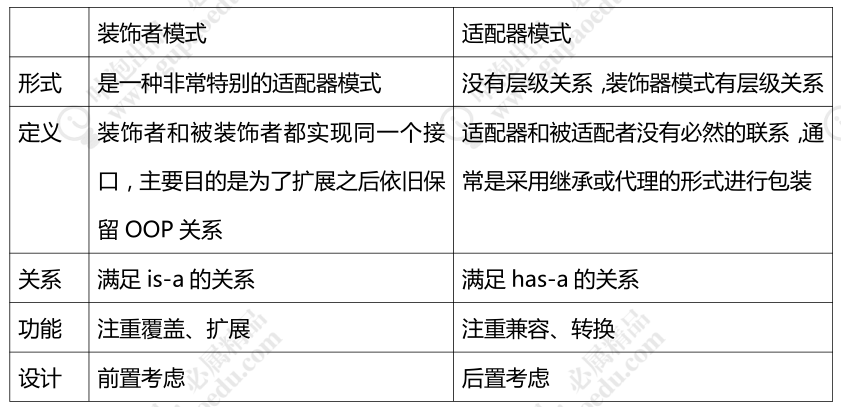

# 装饰模式

装饰者模式（Decorator Pattern）是指在不改变原有对象的基础之上，将功能附加到对象上，提供了比继承更有弹性的替代方案（扩展原有对象的功能），属于结构型模式

# 应用场景

1.用于扩展一个类的功能或给一个类添加附加职责。
2、动态的给一个对象添加功能，这些功能可以再动态的撤销

# 装饰者模式和适配器模式对比

# 装饰者模式在源码中的应用

装饰器模式在源码中也应用得非常多，在 JDK 中体现最明显的类就是 IO 相关的类，如BufferedReader、InputStream、OutputStream

装饰者模式的优缺点
优点：
1、装饰者是继承的有力补充，比继承灵活，不改变原有对象的情况下动态地给一个对象
扩展功能，即插即用。
2、通过使用不同装饰类以及这些装饰类的排列组合，可以实现不同效果。
3、装饰者完全遵守开闭原则。
缺点：
1、会出现更多的代码，更多的类，增加程序复杂性。
2、动态装饰时，多层装饰时会更复杂。
那么装饰者模式我们就讲解到这里，希望小伙伴们认真体会，加深理解

