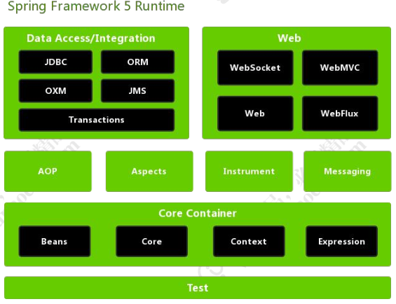

# Spring的设计初衷

**简化开发**

Spring 则立志于全方面的简化 Java 开发。对此，她主要采取了 4 个关键策略：
（1）基于 POJO 的轻量级和最小侵入性编程；
（2）通过依赖注入和面向接口松耦合；
（3）基于切面和惯性进行声明式编程；
（4）通过切面和模板减少样板式代码；
而他主要是通过：面向 Bean(BOP)、依赖注入（DI）以及面向切面（AOP）这三种方式来达成的

# BOP 编程伊始（主角Bean）

Spring 是面向 Bean 的编程（Bean Oriented Programming, BOP），Bean 在 Spring 中才是真正的主角。Bean 在 Spring 中作用就像 Object 对 OOP 的意义一样，Spring 中没有 Bean 也就没有 Spring存在的意义。Spring 提供了 IOC 容器通过配置文件或者注解的方式来管理对象之间的依赖关系。

## IOC（控制反转）

控制反转（IOC）(其中最常见的实现方式叫做依赖注入（Dependency Injection，DI），还有一种方式叫“依赖查找”（Dependency Lookup，DL）

PS：什么叫依赖注入，简单点来说，就是赋值，可以根据类型、或者名字来赋值

## AOP编程理念

面向切面编程，即 AOP，是一种编程思想，它允许程序员对横切关注点或横切典型的职责分界线的行为（例如日志和事务管理）进行模块化。AOP 的核心构造是方面（切面），它将那些影响多个类的行为封装到可重用的模块中。

AOP 和 IOC 是补充性的技术，它们都运用模块化方式解决企业应用程序开发中的复杂问题。在典型的面向对象开发方式中，可能要将日志记录语句放在所有方法和 Java 类中才能实现日志功能。在 AOP方式中，可以反过来将日志服务模块化，并以声明的方式将它们应用到需要日志的组件上。当然，优势就是 Java 类不需要知道日志服务的存在，也不需要考虑相关的代码。所以，用 Spring AOP 编写的应用程序代码是松散耦合的。

AOP 的功能完全集成到了 Spring 事务管理、日志和其他各种特性的上下文中。

AOP 编程的常用场景有：Authentication（权限认证）、Auto Caching（自动缓存处理）、Error Handling（统一错误处理）、Debugging（调试信息输出）、Logging（日志记录）、Transactions（事务处理）等

# Spring5的系统架构

## Spring的核心模块

模块名称 ：主要功能
spring-core :依赖注入IOC与DI的基本实现
spring-beans : Bean工厂和Bean的装配
spring-context : 定义基础的Spring的Context上下文即IOC容器
spring-context-support : 对Spring IOC容器的扩展支持，以及IOC子容器
spring-context-indexer : Spring的类管理组件和Classpath扫描
spring-expression : Spring表达式语言

## Spring之切面编程

模块名称 ： 主要功能
spring-aop : 面向切面编程的应用模块，整合ASM，CGLib/JDKProxy
spring-aspects : 集成AspectJ；AOP应用框架
spring-instrument : 动态Class Loading模块

## Spring之数据访问与集成

模块名称 ： 主要功能
spring-jdbc ：Spring提供的JDBC抽象框架的主要实现模块，用于简化Spring JDBC的操作
spring-tx : SpringJDBC事务控制实现模板
spring-orm : 主要集成Hibernate,JPA和Java Data Objects(JDO)
spring-oxm : 将Java对象映射成XML数据，或者将XML数据映射成java对象
spring-jms : Java Messaging Service能够发送和接受信息

## Spring之Web组件

模块名称 ： 主要功能
spring-web : 提供了最基础的Web支持，主要建立在核心容器之上，通过Servlet或者Listeners来初始化IOC容器
spring-webmvc : 实现了SpringMVC的web应用
spring-websocket : 主要是与WEB前端的全双工通讯的协议
spring-webflux : 一个新的非堵塞函数式Reactive Web框架，亦可以用来建立异步，非阻塞，事件驱动的服务

## Spring之通信报文

模块名称 ： 主要功能
spring-messaging : 从Spring4开始新加入的一个模块，主要职责是为Spring框架集成一些基础的报文传送应用

## Spring之集成测试

模块名称 ： 主要功能
spring-test : 主要为测试提供支持的

## Spring之集成兼容

模块名称 ： 主要功能
spring-framework-bom : Bill Of Materials 解决Spring的不同模块依赖版本不同问题

## Spring各模块之间的依赖关系

# Spring版本的命名规则

序号   格式要求   说明
X     非负整数    表示主版本号，当API的兼容性变化，X需要递增
Y     非负整数    表示次版本号，当功能增加时（不影响API的兼容性），Y需递增
Z     非负整数    表示修订号，当做Bug修复时（不影响API的兼容性），Z需递增

